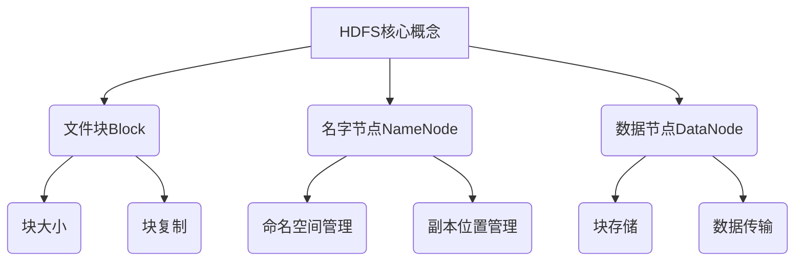

# HDFS原理与代码实例讲解

## 1. 背景介绍

### 1.1 问题的由来

随着大数据时代的到来,传统的数据存储和处理方式已经无法满足日益增长的数据量和计算需求。在这种背景下,分布式文件系统(Distributed File System,DFS)应运而生,成为解决大规模数据存储和处理的关键技术之一。Apache Hadoop分布式文件系统(Hadoop Distributed File System,HDFS)作为Apache Hadoop生态系统的核心组件,为大数据应用提供了高可靠性的数据存储服务。

### 1.2 研究现状

HDFS是一种高度容错的分布式文件系统,适用于运行在廉价硬件集群上的大规模数据存储。它具有高容错性、高吞吐量、高可伸缩性等特点,可以为大数据应用提供可靠的数据存储服务。目前,HDFS已经广泛应用于诸如Yahoo、Facebook、Amazon等大型互联网公司,以及一些传统企业和科研机构。

### 1.3 研究意义

深入理解HDFS的原理和实现机制,对于开发和优化大数据应用程序至关重要。本文将从HDFS的架构、设计原理、核心算法、实现细节等多个角度进行全面剖析,并结合代码实例进行详细讲解,旨在帮助读者掌握HDFS的核心概念和实践技能。

### 1.4 本文结构  

本文共分为9个部分:第1部分介绍HDFS的背景和研究现状;第2部分阐述HDFS的核心概念和架构;第3部分详细讲解HDFS的核心算法原理和操作步骤;第4部分重点分析HDFS中的数学模型和公式推导;第5部分通过代码实例深入解读HDFS的实现细节;第6部分探讨HDFS在实际场景中的应用;第7部分推荐相关的学习资源和开发工具;第8部分总结HDFS的发展趋势和面临的挑战;第9部分列出常见问题和解答。

## 2. 核心概念与联系

HDFS的核心概念包括文件块(Block)、名字节点(NameNode)和数据节点(DataNode)。

- **文件块(Block)**是HDFS中文件存储的基本单位,一个文件被分割为多个块存储在不同的数据节点上。每个块都有固定的大小(默认128MB),并且会有多个副本存储在不同的数据节点上,以提高可靠性和容错能力。

- **名字节点(NameNode)**是HDFS的主节点,负责管理整个文件系统的命名空间和文件块的映射信息。它记录了所有文件和目录的元数据,以及每个文件块的位置信息。名字节点是HDFS的核心,如果它出现故障,整个文件系统将无法工作。

- **数据节点(DataNode)**是HDFS的从节点,负责实际存储文件块数据。每个数据节点管理着自己的本地存储,并定期向名字节点发送心跳信号和块报告,以便名字节点能够跟踪整个集群的状态。

这三个核心概念紧密相连,共同构建了HDFS的分布式架构。名字节点管理文件系统的元数据和命名空间,而数据节点负责存储和传输实际的文件块数据。文件块的大小和副本数量则决定了HDFS的存储效率和容错能力。

## 3. 核心算法原理 & 具体操作步骤

### 3.1 算法原理概述

HDFS的核心算法主要包括文件块放置策略、副本放置策略和负载均衡策略等。

1. **文件块放置策略**决定了新创建的文件块应该存储在哪些数据节点上。HDFS采用了机架感知策略,尽量将文件块的副本分布在不同的机架上,以提高容错能力。

2. **副本放置策略**决定了文件块的副本应该如何分布在集群中。HDFS采用了机架感知副本放置策略,将副本分散在不同的机架上,以避免单点故障导致数据丢失。

3. **负载均衡策略**用于在集群中重新分布数据块,以实现数据块在集群节点之间的均衡分布,从而提高整体性能。

### 3.2 算法步骤详解

#### 3.2.1 文件块放置策略

HDFS采用以下步骤来确定新创建的文件块应该存储在哪些数据节点上:

1. 客户端向名字节点请求创建新文件。
2. 名字节点根据副本放置策略,选择距离客户端最近的数据节点作为第一个副本的存储位置。
3. 名字节点继续选择与第一个副本位置不同的机架上的数据节点,存储第二个副本。
4. 名字节点选择与前两个副本位置不同的另一个机架上的数据节点,存储第三个副本。
5. 如果无法找到第三个不同机架,则在已选择的两个机架上选择距离最远的节点存储第三个副本。
6. 客户端将文件块数据分别写入这三个副本。

该策略确保了文件块副本分布在不同的机架上,提高了容错能力。

#### 3.2.2 副本放置策略

HDFS采用以下步骤来确定文件块副本的存储位置:

1. 首先,尽量将副本分布在不同的机架上,以最大程度地提高容错能力。
2. 如果无法找到不同机架的节点,则尽量将副本分布在同一机架的不同节点上。
3. 如果同一机架上的节点数量不够,则允许在同一节点上存储多个副本。

该策略确保了即使整个机架发生故障,文件块仍然可以从其他机架上的副本进行恢复。

#### 3.2.3 负载均衡策略

HDFS采用以下步骤来实现集群中数据块的负载均衡:

1. 名字节点定期收集集群中各个数据节点的使用情况,包括磁盘空间、CPU利用率等。
2. 名字节点根据收集到的信息,计算出每个数据节点的负载值。
3. 名字节点将高负载节点上的部分数据块移动到低负载节点上,以实现整体的负载均衡。
4. 在移动数据块时,名字节点会优先选择带宽较高的节点进行数据传输,以提高效率。

该策略确保了集群中的资源得到合理利用,避免了数据热点问题,提高了整体性能。

### 3.3 算法优缺点

#### 优点

1. **高容错性**:通过机架感知副本放置策略,确保了文件块副本分布在不同的机架上,即使整个机架发生故障,也可以从其他机架上的副本进行恢复,提高了数据的可靠性。

2. **高吞吐量**:通过将文件分割成多个块并行存储,HDFS可以实现高吞吐量的数据读写操作。

3. **高可扩展性**:HDFS可以通过简单地增加新的数据节点来线性扩展存储容量,而无需停止整个系统。

4. **负载均衡**:通过负载均衡策略,HDFS可以自动将数据块在集群中进行重新分布,避免数据热点问题,提高整体性能。

#### 缺点

1. **不适合低延迟数据访问**:HDFS的设计目标是一次写入,多次读取,因此在写入数据时会有较高的延迟。对于需要低延迟数据访问的场景,HDFS可能不太适合。

2. **不支持多用户写入以及任意修改文件**:HDFS中的文件一旦写入就变为不可改变的,不支持多个客户端同时对同一个文件进行写入操作。

3. **名字节点的单点故障风险**:名字节点负责管理整个文件系统的命名空间和元数据信息,如果名字节点发生故障,整个HDFS将无法工作。虽然HDFS提供了名字节点的高可用性解决方案,但仍存在单点故障的风险。

4. **大量小文件存储效率低下**:HDFS更适合存储大文件,如果存储大量小文件,会导致元数据管理开销增加,存储效率降低。

### 3.4 算法应用领域

HDFS的核心算法主要应用于以下领域:

1. **大数据处理**:HDFS为Apache Hadoop生态系统提供了可靠的数据存储服务,广泛应用于大数据处理、数据分析等领域。

2. **云存储**:HDFS的高容错性和可扩展性使其成为云存储系统的理想选择,可以为云服务提供高可靠的数据存储支持。

3. **内容分发网络(CDN)**:HDFS可以用于构建CDN系统,通过在不同地理位置部署数据节点,实现内容的高效分发和缓存。

4. **物联网(IoT)**:在物联网领域,HDFS可以用于存储和处理来自各种传感器和设备的海量数据。

5. **科学计算**:HDFS可以为科学计算领域提供高性能的数据存储和处理能力,支持对大规模科学数据进行分析和建模。

## 4. 数学模型和公式 & 详细讲解 & 举例说明

### 4.1 数学模型构建

在HDFS中,文件块的放置策略和副本策略涉及到一些数学模型和公式。我们将构建一个简化的数学模型来描述这些策略。

假设集群中有 $N$ 个数据节点,分布在 $R$ 个机架上。我们定义以下符号:

- $n_r$: 第 $r$ 个机架上的数据节点数量
- $f$: 文件块的副本数量
- $d(i,j)$: 数据节点 $i$ 和 $j$ 之间的距离(可以是网络距离或其他距离度量)

我们的目标是找到一种文件块放置方案,使得所有副本之间的总距离最小化,同时满足副本分布在不同机架上的约束。这可以表示为以下优化问题:

$$
\begin{aligned}
\min_{x_{ijk}} & \sum_{i=1}^N \sum_{j=1}^N \sum_{k=1}^f x_{ijk} x_{jik} d(i,j) \\
\text{s.t.} & \sum_{i=1}^N x_{ijk} = 1, \quad \forall j,k \\
           & \sum_{j=1}^{n_r} x_{ijk} \leq 1, \quad \forall i,k,r \\
           & x_{ijk} \in \{0,1\}, \quad \forall i,j,k
\end{aligned}
$$

其中,决策变量 $x_{ijk}$ 表示第 $k$ 个副本是否存储在数据节点 $i$ 上,如果存储则为 1,否则为 0。

第一个约束条件确保每个副本只能存储在一个数据节点上。第二个约束条件确保每个机架上最多只能有一个副本。第三个约束条件表示决策变量是二值变量。

这是一个整数线性规划问题,可以使用各种优化算法和启发式方法来求解。HDFS采用了一种启发式策略来近似求解这个优化问题。

### 4.2 公式推导过程

接下来,我们将推导一个公式,用于计算集群中数据块的平均读取距离。这个公式可以帮助我们评估文件块放置策略的效果。

假设集群中有 $N$ 个数据节点,分布在 $R$ 个机架上。我们定义以下符号:

- $n_r$: 第 $r$ 个机架上的数据节点数量
- $f$: 文件块的副本数量
- $d(i,j)$: 数据节点 $i$ 和 $j$ 之间的距离
- $p_r$: 从第 $r$ 个机架上读取数据的概率

我们假设每个数据节点都有相同的读取概率,即 $p_r = n_r / N$。

对于一个文件块,假设它的 $f$ 个副本分别存储在数据节点 $i_1, i_2, \ldots, i_f$ 上。那么,读取这个文件块的