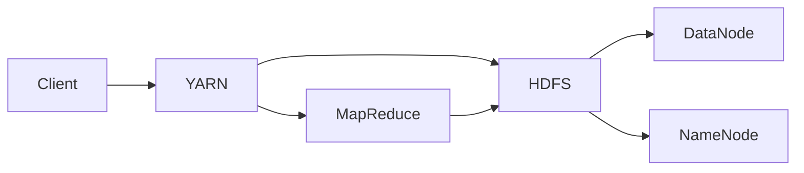
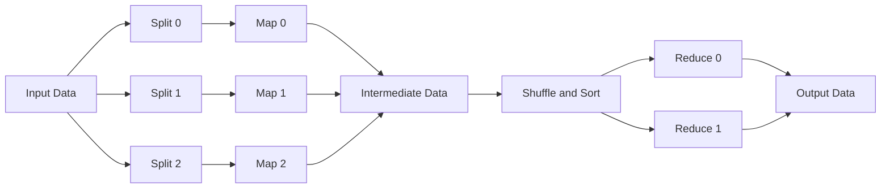

# Hadoop 原理与代码实例讲解

作者：禅与计算机程序设计艺术 / Zen and the Art of Computer Programming

关键词：Hadoop、分布式计算、大数据、MapReduce、HDFS、YARN

## 1. 背景介绍

### 1.1 问题的由来

在大数据时代，企业和组织面临着海量数据的存储和处理挑战。传统的集中式计算架构难以应对数据量的爆炸式增长，亟需一种高效、可扩展的分布式计算解决方案。Hadoop应运而生，成为大数据处理领域的事实标准。

### 1.2 研究现状

目前，Hadoop已经广泛应用于互联网、金融、电信、生物医疗等领域，成为大数据处理的核心技术之一。各大公司纷纷开发基于Hadoop的大数据平台和应用，如阿里巴巴的MaxCompute、腾讯的Angel等。学术界也对Hadoop展开了深入研究，不断优化其性能和扩展其应用场景。

### 1.3 研究意义

深入研究Hadoop的原理和实现，对于掌握大数据处理技术、优化系统性能、开发分布式应用具有重要意义。通过剖析Hadoop的架构设计和核心组件，可以帮助开发者更好地理解和应用分布式计算模型，为构建高效的大数据应用奠定基础。

### 1.4 本文结构

本文将从以下几个方面对Hadoop进行深入讲解：

1. 介绍Hadoop的核心概念和组件关系
2. 剖析MapReduce编程模型的原理和算法步骤
3. 探讨HDFS分布式文件系统的架构设计和数据存储机制
4. 分析Hadoop生态系统中的重要组件，如YARN、Hive、HBase等
5. 通过代码实例演示Hadoop编程的具体实现
6. 总结Hadoop的应用场景和未来发展趋势

## 2. 核心概念与联系

Hadoop是一个开源的分布式计算平台，主要由以下核心组件构成：

- **HDFS（Hadoop Distributed File System）**：分布式文件系统，用于海量数据的存储。
- **MapReduce**：分布式计算框架，用于大规模数据的并行处理。
- **YARN（Yet Another Resource Negotiator）**：集群资源管理系统，负责调度和管理集群中的计算资源。
- **Common**：Hadoop的基础库，提供了一些通用的工具类和函数。

下图展示了Hadoop核心组件之间的关系：



从图中可以看出，Client提交作业给YARN进行资源调度，YARN将计算任务分配给MapReduce框架执行，MapReduce从HDFS中读取数据并将中间结果和输出写回HDFS。HDFS采用主从架构，由NameNode负责管理文件系统的命名空间和数据块映射，DataNode负责存储实际的数据块。

## 3. 核心算法原理 & 具体操作步骤

### 3.1 算法原理概述

MapReduce是Hadoop的核心计算模型，用于处理大规模数据集。它将计算过程分为两个主要阶段：Map和Reduce。

- **Map阶段**：将输入数据划分为多个独立的split，并行地对每个split进行处理，将结果转换为一组中间的key-value对。
- **Reduce阶段**：对Map阶段输出的中间结果按照key进行分组，对每个分组执行聚合操作，生成最终的结果。

通过将计算任务分解为多个独立的子任务，MapReduce可以充分利用集群的并行处理能力，实现高效的分布式计算。

### 3.2 算法步骤详解

MapReduce的具体执行步骤如下：

1. **输入数据分片**：将输入数据划分为多个独立的split，每个split对应一个Map任务。
2. **Map任务执行**：对每个split并行执行Map函数，将输入的key-value对转换为一组中间结果key-value对。
3. **Shuffle阶段**：将Map任务输出的中间结果按照key进行分区和排序，并将具有相同key的数据分发给相应的Reduce任务。
4. **Reduce任务执行**：对每个分区的数据执行Reduce函数，对具有相同key的value进行聚合操作，生成最终结果。
5. **结果输出**：将Reduce任务的输出结果写入HDFS或其他存储系统。

下图展示了MapReduce的执行流程：



### 3.3 算法优缺点

MapReduce的优点包括：

- **可扩展性**：可以通过增加节点来线性扩展计算能力和存储容量。
- **容错性**：自动处理节点故障，确保计算任务的可靠执行。
- **易用性**：提供简单的编程模型，开发者只需关注业务逻辑。

MapReduce的缺点包括：

- **实时性差**：不适合实时计算和流式处理场景。
- **中间结果存储**：需要将中间结果写入磁盘，I/O开销较大。
- **编程模型限制**：只支持Map和Reduce两种操作，对某些算法表达能力有限。

### 3.4 算法应用领域

MapReduce广泛应用于以下领域：

- 日志分析
- 网页爬取和索引
- 数据挖掘和机器学习
- 海量数据的ETL处理
- 科学计算和模拟仿真

## 4. 数学模型和公式 & 详细讲解 & 举例说明

### 4.1 数学模型构建

MapReduce可以用以下数学模型来表示：

设输入数据集为$D$，Map函数为$M$，Reduce函数为$R$。

Map阶段：
$$M: (k1, v1) \rightarrow list(k2, v2)$$

Reduce阶段：
$$R: (k2, list(v2)) \rightarrow list(v3)$$

其中，$(k1, v1)$表示输入的key-value对，$(k2, v2)$表示Map输出的中间结果，$(k2, list(v2))$表示按key分组后的中间结果，$list(v3)$表示Reduce的最终输出。

### 4.2 公式推导过程

以词频统计为例，假设输入数据为一组文本文件，每个文件包含多个单词。

Map函数将每个单词映射为(word, 1)的形式：

$$M: (filename, content) \rightarrow list(word, 1)$$

Reduce函数对每个单词的计数值进行累加：

$$R: (word, list(1)) \rightarrow list(word, count)$$

最终得到每个单词的出现频次。

### 4.3 案例分析与讲解

以下是使用MapReduce进行词频统计的示例代码（基于Java）：

```java
public class WordCount {

    public static class TokenizerMapper extends Mapper<Object, Text, Text, IntWritable> {
        private final static IntWritable one = new IntWritable(1);
        private Text word = new Text();

        public void map(Object key, Text value, Context context) throws IOException, InterruptedException {
            StringTokenizer itr = new StringTokenizer(value.toString());
            while (itr.hasMoreTokens()) {
                word.set(itr.nextToken());
                context.write(word, one);
            }
        }
    }

    public static class IntSumReducer extends Reducer<Text, IntWritable, Text, IntWritable> {
        private IntWritable result = new IntWritable();

        public void reduce(Text key, Iterable<IntWritable> values, Context context) throws IOException, InterruptedException {
            int sum = 0;
            for (IntWritable val : values) {
                sum += val.get();
            }
            result.set(sum);
            context.write(key, result);
        }
    }

    public static void main(String[] args) throws Exception {
        Configuration conf = new Configuration();
        Job job = Job.getInstance(conf, "word count");
        job.setJarByClass(WordCount.class);
        job.setMapperClass(TokenizerMapper.class);
        job.setCombinerClass(IntSumReducer.class);
        job.setReducerClass(IntSumReducer.class);
        job.setOutputKeyClass(Text.class);
        job.setOutputValueClass(IntWritable.class);
        FileInputFormat.addInputPath(job, new Path(args[0]));
        FileOutputFormat.setOutputPath(job, new Path(args[1]));
        System.exit(job.waitForCompletion(true) ? 0 : 1);
    }
}
```

在上述代码中，TokenizerMapper类实现了Map函数，将每个单词转换为(word, 1)的形式。IntSumReducer类实现了Reduce函数，对每个单词的计数值进行累加。main方法中设置了作业的配置信息，指定了输入和输出路径。

### 4.4 常见问题解答

**Q**: MapReduce适合处理什么样的数据？
**A**: MapReduce适合处理大规模的批量数据，如日志文件、网页数据、科学数据等。它不适合处理实时数据流或需要低延迟响应的应用。

**Q**: MapReduce如何实现容错？
**A**: MapReduce通过数据复制和任务重试机制实现容错。每个数据块默认复制3份，存储在不同的节点上。如果某个任务失败，Hadoop会自动重新调度该任务在另一个节点上执行。

**Q**: MapReduce的性能瓶颈在哪里？
**A**: MapReduce的性能瓶颈主要在于数据的I/O和网络传输。Map和Reduce任务需要从HDFS读取数据，并将中间结果写回磁盘。同时，Shuffle阶段需要通过网络将数据从Map节点传输到Reduce节点，这也会带来一定的开销。

## 5. 项目实践：代码实例和详细解释说明

### 5.1 开发环境搭建

要运行Hadoop，需要搭建以下开发环境：

- JDK：Hadoop是基于Java开发的，需要安装JDK。
- Hadoop：下载并解压Hadoop发行版，配置环境变量。
- SSH：Hadoop节点之间需要通过SSH进行通信，需要配置SSH免密登录。
- IDE：可以使用Eclipse、IntelliJ IDEA等IDE进行Hadoop开发。

### 5.2 源代码详细实现

以下是使用MapReduce实现单词计数的完整代码：

```java
import java.io.IOException;
import java.util.StringTokenizer;

import org.apache.hadoop.conf.Configuration;
import org.apache.hadoop.fs.Path;
import org.apache.hadoop.io.IntWritable;
import org.apache.hadoop.io.Text;
import org.apache.hadoop.mapreduce.Job;
import org.apache.hadoop.mapreduce.Mapper;
import org.apache.hadoop.mapreduce.Reducer;
import org.apache.hadoop.mapreduce.lib.input.FileInputFormat;
import org.apache.hadoop.mapreduce.lib.output.FileOutputFormat;

public class WordCount {

    public static class TokenizerMapper extends Mapper<Object, Text, Text, IntWritable> {
        private final static IntWritable one = new IntWritable(1);
        private Text word = new Text();

        public void map(Object key, Text value, Context context) throws IOException, InterruptedException {
            StringTokenizer itr = new StringTokenizer(value.toString());
            while (itr.hasMoreTokens()) {
                word.set(itr.nextToken());
                context.write(word, one);
            }
        }
    }

    public static class IntSumReducer extends Reducer<Text, IntWritable, Text, IntWritable> {
        private IntWritable result = new IntWritable();

        public void reduce(Text key, Iterable<IntWritable> values, Context context) throws IOException, InterruptedException {
            int sum = 0;
            for (IntWritable val : values) {
                sum += val.get();
            }
            result.set(sum);
            context.write(key, result);
        }
    }

    public static void main(String[] args) throws Exception {
        Configuration conf = new Configuration();
        Job job = Job.getInstance(conf, "word count");
        job.setJarByClass(WordCount.class);
        job.setMapperClass(TokenizerMapper.class);
        job.setCombinerClass(IntSumReducer.class);
        job.setReducerClass(IntSumReducer.class);
        job.setOutputKeyClass(Text.class);
        job.setOutputValueClass(IntWritable.class);
        FileInputFormat.addInputPath(job, new Path(args[0]));
        FileOutputFormat.setOutputPath(job, new Path(args[1]));
        System.exit(job.waitForCompletion(true) ? 0 : 1);
    }
}
```

### 5.3 代码解读与分析

- TokenizerMapper类：实现了Map函数，将输入的文本行按照空格分割为单词，并输出(word, 1)的键值对。
- IntSumReducer类：实现了Reduce函数，对每个