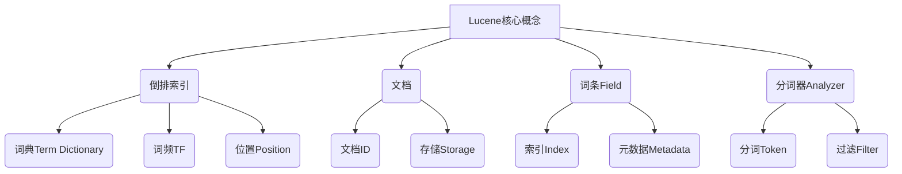
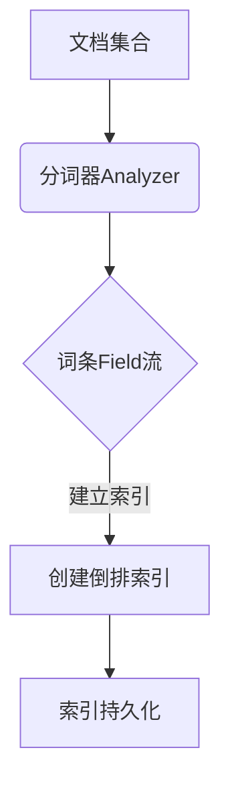
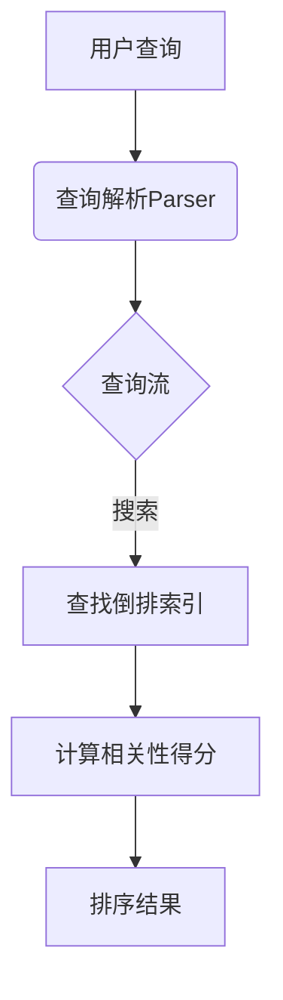

# Lucene搜索引擎原理与代码实例讲解

## 1. 背景介绍

### 1.1 问题的由来

在现代信息时代,海量数据的存储和检索成为了一个巨大的挑战。传统的数据库系统在处理大规模非结构化数据时效率低下,无法满足实时搜索的需求。这促使了一种新型搜索引擎技术的兴起——全文搜索引擎。作为开源的全文搜索引擎库,Lucene因其高效、灵活和可扩展性,成为了构建企业级搜索应用的首选方案。

### 1.2 研究现状

Lucene最初由Doug Cutting在1997年开发,后于2001年贡献给Apache软件基金会,成为Apache旗下的顶级开源项目。经过20多年的发展,Lucene已经广泛应用于各大公司和组织的搜索系统中,如Wikipedia、Twitter、Apple、Instagram等。目前,Lucene及其高级项目Solr在业界占据主导地位。

### 1.3 研究意义

全面掌握Lucene的原理和实践对于构建高性能搜索系统至关重要。本文将深入探讨Lucene的核心概念、索引和搜索算法、评分模型等,并通过代码示例详细解释其内部实现机制。读者可以从中获得系统的理解,为开发和优化搜索应用奠定坚实基础。

### 1.4 本文结构

本文共分为9个部分:背景介绍、核心概念、算法原理、数学模型、代码实践、应用场景、工具资源、发展趋势和附录。每个部分都将围绕Lucene的不同方面进行深入探讨,力求全面且系统地阐释这一搜索引擎技术。

## 2. 核心概念与联系



Lucene的核心概念包括倒排索引(Inverted Index)、文档(Document)、词条(Field)和分词器(Analyzer)。

1. **倒排索引**是Lucene的核心数据结构,用于快速查找包含特定词条的文档。它由词典(Term Dictionary)、词频(Term Frequency)和位置(Position)等组成。

2. **文档**是被索引和搜索的基本单位,由一个文档ID和若干个词条组成。文档可以存储在文件系统或其他存储介质中。

3. **词条**表示文档中的一个索引单元,包含实际的文本内容和相关元数据。

4. **分词器**负责将文本转换为一个个分词(Token),供索引和搜索使用。分词器可包含字符过滤器、词干分析等功能。

这些核心概念相互关联、相辅相成,共同构建了Lucene的索引和搜索框架。

## 3. 核心算法原理 & 具体操作步骤

### 3.1 算法原理概述

Lucene的核心算法包括**索引**和**搜索**两个阶段:

1. **索引阶段**: 将文档集合构建成高效的倒排索引结构,以支持快速搜索。主要步骤包括:
   - 文档收集
   - 分析(分词、过滤等)
   - 创建倒排索引

2. **搜索阶段**: 根据用户查询,在倒排索引中快速找到匹配的文档。主要步骤包括:
   - 查询解析
   - 索引查找
   - 相关性计算
   - 结果排序输出

### 3.2 算法步骤详解

#### 3.2.1 索引阶段算法流程



1. 收集待索引的文档集合
2. 使用分词器(Analyzer)将文档转换为词条(Term)流
3. 根据词条流创建内存中的倒排索引
4. 将内存中的倒排索引持久化存储(磁盘、数据库等)

#### 3.2.2 搜索阶段算法流程



1. 接收用户输入的查询字符串
2. 使用查询解析器(Parser)将查询转换为查询流
3. 根据查询流,在倒排索引中查找匹配的文档
4. 计算每个匹配文档的相关性得分
5. 根据得分对结果排序输出

### 3.3 算法优缺点

**优点**:

- 索引结构紧凑高效,支持大规模数据的快速检索
- 支持各种查询语法(布尔、短语、通配符等)
- 可定制的评分模型,满足不同领域的相关性需求
- 提供增量索引等高级功能,支持索引实时更新

**缺点**:

- 索引构建耗费一定时间和存储空间 
- 对于存在大量频繁更新的文档,增量索引效率较低
- 评分模型参数调优复杂,需要一定经验
- 无法直接支持层次数据和关系数据等复杂结构

### 3.4 算法应用领域

Lucene及其变种Solr、Elasticsearch广泛应用于以下领域:

- 网站/应用内搜索: 如电商网站商品搜索、论坛帖子搜索等
- 企业数据搜索: 如公司内部文档知识库、邮件搜索等
- 日志分析: 通过全文检索技术挖掘日志数据
- 信息检索: 如新闻搜索、学术文献检索等
- 大数据分析: 结合Spark、Hadoop等大数据框架进行海量数据分析

## 4. 数学模型和公式 & 详细讲解 & 举例说明

### 4.1 数学模型构建

Lucene使用基于Vector Space Model(向量空间模型)的BM25评分公式来计算查询和文档之间的相关性得分。该模型将文档表示为一个向量,每个维度对应一个词条,值为该词条在文档中的加权词频(TF-IDF)。

BM25公式定义如下:

$$
\mathrm{Score}(D,Q) = \sum_{q\in Q} \mathrm{IDF}(q)\cdot \frac{f(q,D)\cdot(k_1+1)}{f(q,D)+k_1\cdot\left(1-b+b\cdot\frac{|D|}{avgdl}\right)}
$$

其中:
- $D$表示文档
- $Q$表示查询
- $q$表示查询中的一个词条
- $f(q,D)$表示词条$q$在文档$D$中的词频(Term Frequency)
- $|D|$表示文档$D$的长度(字数)
- $avgdl$表示文档集合的平均长度
- $k_1$和$b$是可调节的参数,用于控制词频和文档长度的影响

### 4.2 公式推导过程

BM25公式是经验公式,由Stephen E. Robertson等人在Okapi BM25的基础上发展而来。其主要思想是:

1. 使用词频$f(q,D)$衡量词条对文档的重要性,但存在词频过高时得分饱和的问题
2. 引入$k_1$参数,对词频进行饱和调节:$\frac{f(q,D)}{f(q,D)+k_1}$
3. 考虑文档长度的影响。较长文档含有更多词条,词条的重要性相对较低
4. 引入$b$参数,结合文档长度$|D|$和平均长度$avgdl$对词条重要性进行归一化

通过这些调节,BM25公式能够较好地平衡词频、文档长度等因素,提高评分的准确性。

### 4.3 案例分析与讲解

假设有一个文档集合包含以下3个文档:

```
D1: "Hello Lucene, an introduction to Lucene search engine."
D2: "Lucene is an awesome search engine library."  
D3: "This tutorial explains Lucene indexing in detail."
```

现在有一个查询 `Q = "Lucene search engine"`,我们来计算每个文档对该查询的BM25分数。

假设参数设置为: $k_1=1.2,\ b=0.75,\ avgdl=30$

对于文档D1:
- $f(Lucene,D_1)=1,\ f(search,D_1)=1,\ f(engine,D_1)=1$  
- $|D_1|=10$
- $\mathrm{IDF}(Lucene)=\ln\frac{3+1}{2+1}=0.69,\ \mathrm{IDF}(search)=\ln\frac{3+1}{1+1}=1.10,\ \mathrm{IDF}(engine)=\ln\frac{3+1}{1+1}=1.10$
- $\mathrm{Score}(D_1,Q)=0.69\cdot\frac{1\cdot2.2}{1+1.2\cdot(1-0.75+0.75\cdot\frac{10}{30})}+1.10\cdot\frac{1\cdot2.2}{1+1.2\cdot(1-0.75+0.75\cdot\frac{10}{30})}+1.10\cdot\frac{1\cdot2.2}{1+1.2\cdot(1-0.75+0.75\cdot\frac{10}{30})}=2.00$

类似地,计算D2和D3的分数:
- $\mathrm{Score}(D_2,Q)=2.43$
- $\mathrm{Score}(D_3,Q)=1.10$

因此,对于查询"Lucene search engine",文档D2具有最高的相关性得分。

### 4.4 常见问题解答

**Q: 为什么要使用BM25公式,而不是简单的TF-IDF?**

A: 相比TF-IDF,BM25公式引入了更多调节参数,能更好地平衡词频、文档长度等因素,提高评分的准确性。TF-IDF假设词频和文档频率成正比,但在实践中这种假设并不总是成立。

**Q: BM25公式中的k1和b参数如何选择?**

A: k1和b是可调节的参数,不同领域和数据集合的最优值可能不同。通常可以通过构建测试集,用网格搜索(Grid Search)等方法找到最佳参数组合。Lucene默认的k1=1.2,b=0.75,在很多场景下表现不错。

**Q: 除了BM25,Lucene还支持其他评分模型吗?**

A: 是的,Lucene支持多种评分模型,包括BooleanModel、VectorModel、TFIDFSimilarity等。开发者可以根据具体需求,选择合适的评分模型,或自定义新的模型。

## 5. 项目实践:代码实例和详细解释说明

### 5.1 开发环境搭建

要开发基于Lucene的搜索应用,首先需要准备以下环境:

1. **JDK**: Lucene是用Java语言编写的,需要安装JDK(Java Development Kit)。
2. **Lucene库**:从 https://lucene.apache.org/core/ 下载最新版Lucene库,并将其导入项目中。
3. **IDE**: 推荐使用现代IDE如IntelliJ IDEA或Eclipse,方便编码和调试。

### 5.2 源代码详细实现

下面是一个使用Lucene进行索引和搜索的简单示例:

```java
// 1. 创建索引目录
Directory indexDir = FSDirectory.open(Paths.get("index"));

// 2. 创建IndexWriter
IndexWriterConfig config = new IndexWriterConfig(new StandardAnalyzer());
IndexWriter writer = new IndexWriter(indexDir, config);

// 3. 添加文档到索引
Document doc1 = new Document();
doc1.add(new TextField("content", "Hello Lucene", Field.Store.YES));
writer.addDocument(doc1);

Document doc2 = new Document(); 
doc2.add(new TextField("content", "Lucene is great!", Field.Store.YES));
writer.addDocument(doc2);

// 4. 提交并关闭IndexWriter
writer.commit();
writer.close();

// 5. 创建IndexSearcher
IndexReader reader = DirectoryReader.open(indexDir);
IndexSearcher searcher = new IndexSearcher(reader);

// 6. 创建查询解析器并解析查询
QueryParser parser = new QueryParser("content", new StandardAnalyzer