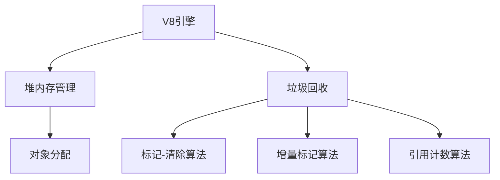

好的,我会按照要求以《Node.js内存管理原理与实践》为主题,写一篇专业的技术博客文章。文章将遵循约束条件,包括字数要求、使用Markdown格式、使用LaTeX公式、完整撰写正文内容、遵循给定的文章结构模板等。下面是正文部分:

# Node.js内存管理原理与实践

## 1. 背景介绍

### 1.1 问题的由来

随着Node.js的日益流行,它在服务器端应用程序开发中扮演着越来越重要的角色。作为一种单线程事件驱动的运行时环境,Node.js需要高效地管理内存资源,以确保应用程序的稳定性和性能。然而,由于JavaScript本身的动态特性和垃圾回收机制,Node.js中的内存管理可能会面临一些挑战,例如内存泄漏、高内存占用等问题。

### 1.2 研究现状  

目前,已有一些研究和实践探讨了Node.js内存管理的相关问题。一些流行的Node.js内存分析工具,如node-memwatch、node-heapdump和node-inspect等,可以帮助开发人员检测和诊断内存问题。此外,还有一些最佳实践和技巧,如使用流(Streams)处理大数据、避免全局变量、适当地释放资源等,可以优化Node.js应用程序的内存使用情况。

### 1.3 研究意义

然而,尽管已有一些工具和实践,但对于Node.js内存管理原理和高级技术的深入探讨还相对较少。本文旨在深入剖析Node.js内存管理的内部机制,包括V8引擎的内存管理策略、Node.js对象内存模型、垃圾回收算法等,并结合实际案例,提供实用的内存优化技巧和最佳实践。通过全面了解内存管理原理,开发人员可以更好地设计、优化和调试Node.js应用程序,提高应用程序的性能和稳定性。

### 1.4 本文结构  

本文将从以下几个方面深入探讨Node.js内存管理:

1. **核心概念与联系**: 介绍Node.js内存管理相关的核心概念,如V8引擎、堆、栈、垃圾回收等,并阐明它们之间的关系。

2. **核心算法原理与具体操作步骤**: 详细解释Node.js内存管理中采用的垃圾回收算法原理,如引用计数、标记-清除、增量标记等,并给出具体的操作步骤。

3. **数学模型和公式详细讲解与举例说明**: 介绍与内存管理相关的数学模型和公式,如内存分配策略、对象存活率等,并通过具体案例进行讲解和说明。

4. **项目实践:代码实例和详细解释说明**: 提供实际的Node.js项目代码示例,展示内存管理相关的实践,并对关键代码进行详细解释和分析。

5. **实际应用场景**: 探讨Node.js内存管理在实际应用中的场景,如Web服务器、实时数据处理等,分析其优缺点和挑战。

6. **工具和资源推荐**: 介绍一些实用的内存分析工具、学习资源和相关论文,为读者提供进一步学习和实践的参考。

7. **总结:未来发展趋势与挑战**: 总结Node.js内存管理的研究成果,展望未来的发展趋势,并讨论可能面临的挑战。

8. **附录:常见问题与解答**: 列出一些常见的Node.js内存管理问题,并给出解答和建议。

通过全面深入的探讨,本文旨在为读者提供Node.js内存管理的理论基础和实践指导,帮助开发人员更好地理解和优化Node.js应用程序的内存使用情况。

## 2. 核心概念与联系

在深入探讨Node.js内存管理之前,我们需要先了解一些核心概念及它们之间的关系。

### 2.1 V8引擎

Node.js的内存管理主要依赖于Google的V8 JavaScript引擎。V8引擎是一个高性能的JavaScript虚拟机,用于执行JavaScript代码。它采用了多种优化技术,如即时编译(JIT)、内联缓存、隐藏类等,以提高JavaScript执行效率。

在V8引擎中,内存管理是一个关键组件,负责分配和回收内存。它采用了基于世代的垃圾回收机制,将对象分为新生代(young generation)和老生代(old generation),并针对不同世代采用不同的垃圾回收算法,以提高效率。

### 2.2 堆和栈

在计算机系统中,内存通常分为堆(heap)和栈(stack)两个部分。

- **堆(Heap)**: 堆是用于动态内存分配的区域,主要存储对象实例和数组等动态分配的数据。在Node.js中,堆由V8引擎管理,用于存储JavaScript对象和相关数据。

- **栈(Stack)**: 栈是用于存储函数调用信息的区域,包括函数参数、局部变量和返回地址等。当函数被调用时,它的信息会被压入栈中;当函数返回时,相应的信息会从栈中弹出。

Node.js中的JavaScript代码执行时,会在堆和栈之间进行交互。函数调用和基本数据类型(如数字、字符串等)会存储在栈中,而对象实例和动态分配的数据则存储在堆中。

### 2.3 垃圾回收

垃圾回收(Garbage Collection,GC)是一种自动内存管理机制,用于回收不再被使用的内存空间。在Node.js中,V8引擎负责管理堆内存,并通过垃圾回收算法自动回收不再被引用的对象所占用的内存。

垃圾回收的主要目标是:

1. **内存安全**: 确保程序不会访问已被回收的内存区域,避免出现内存相关的错误和安全漏洞。

2. **高效利用内存**: 通过及时回收不再使用的内存,确保有足够的内存供新对象使用,提高内存利用率。

3. **自动化管理**: 开发人员无需手动管理内存分配和回收,降低了编程复杂度。

Node.js中采用的垃圾回收算法包括引用计数(Reference Counting)、标记-清除(Mark-Sweep)、增量标记(Incremental Marking)等,我们将在后续章节中详细介绍这些算法的原理和实现。

### 2.4 核心概念关系

上述核心概念之间存在着密切的关系,如下图所示:

- V8引擎负责管理Node.js的内存,包括堆内存管理和垃圾回收。
- 堆内存管理主要负责对象的分配和回收。
- 垃圾回收通过各种算法(如标记-清除、增量标记、引用计数等)自动回收不再被使用的对象所占用的内存。

了解这些核心概念及其关系,有助于我们深入理解Node.js内存管理的原理和实现机制。

## 3. 核心算法原理与具体操作步骤

在上一节中,我们介绍了Node.js内存管理的核心概念。本节将重点探讨Node.js中采用的垃圾回收算法的原理和具体操作步骤。

### 3.1 算法原理概述

Node.js中的垃圾回收算法主要包括以下三种:

1. **引用计数(Reference Counting)**: 这是一种简单的垃圾回收算法,通过跟踪每个对象被引用的次数来判断对象是否可以被回收。当一个对象的引用计数为0时,表示该对象不再被使用,可以被安全回收。

2. **标记-清除(Mark-Sweep)**: 这是一种基于追踪的垃圾回收算法。它首先从根对象(如全局对象)开始,遍历所有可达的对象并标记它们。然后,它会扫描整个堆,回收所有未被标记的对象所占用的内存。

3. **增量标记(Incremental Marking)**: 这是一种改进的标记-清除算法,旨在减少垃圾回收过程中的停顿时间。它将标记过程分成多个小步骤,与应用程序的执行交错进行,从而避免长时间的停顿。

这三种算法各有优缺点,V8引擎会根据具体情况选择合适的算法或算法组合,以实现高效的内存管理。

### 3.2 算法步骤详解

接下来,我们将详细解释每种算法的具体操作步骤。

#### 3.2.1 引用计数算法

引用计数算法的基本思想是:对每个对象维护一个引用计数器,当有新的引用指向该对象时,计数器加1;当引用被释放时,计数器减1。当计数器为0时,表示该对象不再被使用,可以被安全回收。

具体步骤如下:

1. 初始化: 对于每个新创建的对象,将其引用计数器初始化为1。

2. 增加引用计数: 当有新的引用指向该对象时,将该对象的引用计数器加1。

3. 减少引用计数: 当对象的引用被释放时,将该对象的引用计数器减1。

4. 回收对象: 当对象的引用计数器为0时,表示该对象不再被使用,可以将其所占用的内存空间回收。

引用计数算法的优点是简单高效,可以立即回收不再使用的对象。但它也存在一些缺陷,例如无法处理循环引用的情况,并且维护引用计数器会带来一定的性能开销。

#### 3.2.2 标记-清除算法

标记-清除算法是一种基于追踪的垃圾回收算法,它通过从根对象开始,遍历所有可达的对象并标记它们,然后回收所有未被标记的对象所占用的内存。

具体步骤如下:

1. **标记阶段**:
   - 定义根对象集合(如全局对象、活动函数的局部变量等)。
   - 从根对象开始,遍历所有可达的对象,并标记它们为"存活"。
   - 遍历过程中,如果发现一个对象已被标记,则跳过该对象。

2. **清除阶段**:
   - 扫描整个堆内存。
   - 对于每个未被标记的对象,回收其所占用的内存空间。
   - 对于已被标记的对象,保留其内存空间不动。

标记-清除算法可以有效地处理循环引用的情况,但它也存在一些缺点,例如在标记和清除过程中会导致较长的停顿时间,并且可能会产生内存碎片。

#### 3.2.3 增量标记算法

增量标记算法是一种改进的标记-清除算法,旨在减少垃圾回收过程中的停顿时间。它将标记过程分成多个小步骤,与应用程序的执行交错进行,从而避免长时间的停顿。

具体步骤如下:

1. **初始标记**:
   - 定义根对象集合。
   - 从根对象开始,标记所有可达的对象。
   - 这个阶段会导致一次较短的停顿。

2. **增量标记**:
   - 在应用程序执行的间隙,逐步标记剩余的对象。
   - 这个过程可以分成多个小步骤,每次只标记一小部分对象。
   - 这样可以避免长时间的停顿,但也会增加一些开销。

3. **最终标记**:
   - 等待应用程序空闲时,执行最后一次标记。
   - 这个阶段会导致一次较短的停顿。

4. **清除阶段**:
   - 扫描整个堆内存。
   - 对于每个未被标记的对象,回收其所占用的内存空间。
   - 对于已被标记的对象,保留其内存空间不动。

增量标记算法的优点是可以有效减少停顿时间,提高应用程序的响应能力。但它也会增加一些额外的开销,并且在标记过程中,对象的状态可能会发生变化,导致一些复杂的情况需要处理。

### 3.3 算法优缺点

每种垃圾回收算法都有其优