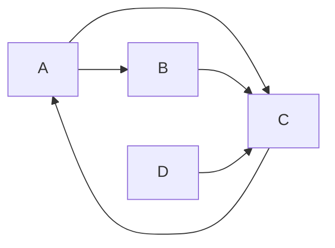

# PageRank原理与代码实例讲解

作者：禅与计算机程序设计艺术 / Zen and the Art of Computer Programming 

关键词：PageRank算法、网页排名、链接分析、马尔可夫过程、幂法迭代

## 1. 背景介绍
### 1.1  问题的由来
在互联网飞速发展的今天，搜索引擎已经成为人们获取信息的主要途径。而搜索结果的质量和相关性直接影响用户的搜索体验。早期的搜索引擎主要依靠网页内容中的关键词来判断网页的相关性，但这种方法很容易被不法分子利用，通过堆砌关键词等手段来提高网页排名。如何从海量的网页中挖掘出高质量、高相关性的网页，一直是搜索引擎领域的核心问题之一。

### 1.2  研究现状
1998年，斯坦福大学的Larry Page和Sergey Brin在他们的论文《The Anatomy of a Large-Scale Hypertextual Web Search Engine》中首次提出了PageRank算法，并在后来成立的Google公司中得到广泛应用，奠定了Google在搜索引擎领域的领先地位。PageRank算法巧妙地利用了网页之间的链接关系，通过链接结构来评估网页的重要性，取得了非常好的效果。此后，PageRank算法被广泛应用于搜索排序、社交网络、推荐系统等领域，衍生出了众多变种和改进算法。

### 1.3  研究意义
深入理解和掌握PageRank的基本原理和实现方法，对于从事搜索引擎、数据挖掘、推荐系统等领域的研究人员和工程师来说至关重要。通过对PageRank的学习，可以了解如何利用网页链接分析用户行为，挖掘网页的重要性和相关性，为进一步改进和优化算法打下基础。同时，PageRank思想的提出对图论、矩阵计算、数值优化等学科领域也产生了深远影响。

### 1.4  本文结构
本文将从以下几个方面对PageRank展开深入讨论：

1. PageRank的基本概念和数学原理
2. PageRank算法的具体计算步骤和流程
3. PageRank的矩阵表示和求解方法
4. PageRank的代码实现和案例分析
5. PageRank的应用场景和改进方向

通过本文的学习，读者可以全面掌握PageRank的理论基础和实践技巧，了解PageRank在搜索引擎和推荐系统等领域的应用，为进一步的学习和研究打下坚实基础。

## 2. 核心概念与联系

PageRank的核心思想是通过网页之间的链接关系来评估网页的重要性。如果一个网页被很多其他网页链接到，说明这个网页比较重要，其PageRank值就会较高；反之，如果一个网页没有其他网页的链接，其PageRank值就会较低。一个网页的PageRank值由所有链接到它的网页的PageRank值经过算法分配得到。这个思想可以用下面的公式表示：

$$PR(p_i) = \sum_{p_j\in M(p_i)}\frac{PR (p_j)} {L(p_j)}$$

其中，$PR(p_i)$ 表示网页$p_i$的PageRank值，$M(p_i)$ 表示所有链接到网页$p_i$的网页集合，$L(p_j)$ 表示网页$p_j$的出链数量，$PR(p_j)$ 表示网页$p_j$的PageRank值。

这个公式可以理解为，一个网页的PageRank值是由所有链接到它的网页的PageRank值按照出链数量进行均分得到的。PageRank值的计算过程可以看作是一个递归的过程，需要不断迭代直到收敛。同时，为了保证算法可以收敛，并解决"悬挂网页"（没有出链的网页）的问题，PageRank还引入了阻尼系数（damping factor）的概念，即在计算过程中，每个网页都有一定的概率随机访问到其他网页。

总的来说，PageRank涉及到以下几个关键概念：

- 网页之间的链接关系，可以用有向图表示；
- 网页的PageRank值，表示网页的重要性，是一个0到1之间的实数；
- 阻尼系数，表示随机访问网页的概率，一般取值在0.8到0.9之间；
- 幂法迭代，PageRank值的计算过程可以使用幂法等数值方法求解。

这些概念环环相扣，共同构建了PageRank的理论基础。在实际应用中，我们还需要考虑如何高效计算PageRank值，如何处理大规模网页集合等问题。

## 3. 核心算法原理 & 具体操作步骤
### 3.1  算法原理概述
PageRank本质上是一个基于网页链接结构的特征向量计算问题，其数学原理可以用马尔可夫过程来描述。我们可以将网页看作马尔可夫链的状态，将网页之间的链接关系看作状态之间的转移。PageRank值就对应于马尔可夫链的平稳分布，可以通过幂法等迭代方法求解。

具体来说，我们可以将全部N个网页看作一个N阶方阵（转移矩阵）M，矩阵的每一项$M_{ij}$表示从网页i到网页j的转移概率，即网页i链接到网页j的链接数占网页i总出链数的比例。那么，PageRank值就对应于转移矩阵M的主特征向量，满足如下等式：

$$\vec{R} = M \vec{R}$$

其中，$\vec{R}$ 是一个N维向量，表示每个网页的PageRank值。

考虑到转移矩阵M可能是一个非连通图（存在悬挂网页），无法收敛，因此我们需要在计算PageRank时加入阻尼系数，修正后的计算公式为：

$$\vec{R} = dM\vec{R} + (1-d) \vec{S}$$

其中，$d$ 为阻尼系数，$\vec{S}$ 为随机访问向量，表示用户随机访问任意网页的概率。

### 3.2  算法步骤详解

根据上述原理，PageRank的计算可以分为以下几个步骤：

1. 初始化：将所有网页的PageRank值初始化为1/N，即$\vec{R}_0 = (\frac{1}{N}, \frac{1}{N}, ..., \frac{1}{N})^T$。

2. 计算转移矩阵：根据网页之间的链接关系，计算转移矩阵M。对于每一个网页i，计算其链接到网页j的链接数$L_{ij}$，以及网页i的总出链数$L_i$，则$M_{ij} = L_{ij} / L_i$。

3. 迭代计算：
   
   a. 计算随机访问向量$\vec{S} = \frac{1-d}{N}(1,1,...,1)^T$
   
   b. 计算$\vec{R}_{k+1} = dM\vec{R}_k + \vec{S}$
   
   c. 判断是否收敛，即$|\vec{R}_{k+1} - \vec{R}_k| < \epsilon$，如果收敛则停止迭代，否则继续迭代

4. 归一化：将计算得到的PageRank值进行归一化处理，使其和为1，得到最终的PageRank值。

### 3.3  算法优缺点

PageRank算法的优点在于：
- 能够有效地反映网页的重要性，对网页进行合理排序；
- 计算简单，易于实现，可以方便地应用于大规模网页集合；
- 具有较好的鲁棒性，能够抵御一些作弊行为，如恶意链接堆砌等。

但PageRank算法也存在一些局限性，如：
- 对新网页和小网站不友好，容易陷入"马太效应"；
- 没有考虑链接的权重、网页内容的相关性等因素，排序结果的准确性有待进一步提高；
- 计算代价较高，对于超大规模网页图谱的计算效率有待优化。

### 3.4  算法应用领域
PageRank及其变种算法在搜索引擎、推荐系统、社交网络等领域得到了广泛应用，主要用于：

- 网页排序：作为搜索引擎的核心算法，对网页进行重要性排序；
- 社交影响力分析：在社交网络中，分析用户的影响力和重要性；
- 论文引用分析：对学术论文进行引用分析和重要性评估；
- 推荐系统：作为推荐算法的重要特征，对用户和物品进行重要性评分。

此外，PageRank的思想还被应用于机器学习、数据挖掘、生物信息、金融风控等诸多领域，是一种实用性很强的通用算法。

## 4. 数学模型和公式 & 详细讲解 & 举例说明
### 4.1  数学模型构建
我们可以用一个有向图$G(V,E)$来表示网页之间的链接关系，其中$V$表示网页集合，$E$表示链接关系集合。对于每个网页节点$p_i$，我们定义其PageRank值为$PR(p_i)$，出链数为$L(p_i)$。

根据PageRank的基本思想，即认为一个网页的重要性由所有链接到它的网页的重要性决定，我们可以得到如下递推关系：

$$PR(p_i) = \sum_{p_j\in M(p_i)}\frac{PR (p_j)} {L(p_j)}$$

其中，$M(p_i)$ 表示所有链接到网页$p_i$的网页集合。

考虑到实际网络中可能存在一些悬挂网页（没有出链的网页），导致部分网页的PageRank值无法通过递推关系获得，因此我们在递推公式中引入阻尼系数$d$（一般取值0.85），将模型修正为：

$$PR(p_i) = \frac{1-d}{N} + d\sum_{p_j\in M(p_i)}\frac{PR (p_j)} {L(p_j)}$$

其中，$N$为网页总数，$\frac{1-d}{N}$ 表示随机访问任意网页的概率。

### 4.2  公式推导过程
将上述递推公式写成矩阵形式，可以得到：

$$\vec{R} = [\frac{1-d}{N} + d\sum_{p_j\in M(p_1)}\frac{PR (p_j)} {L(p_j)}, \frac{1-d}{N} + d\sum_{p_j\in M(p_2)}\frac{PR (p_j)} {L(p_j)}, ..., \frac{1-d}{N} + d\sum_{p_j\in M(p_N)}\frac{PR (p_j)} {L(p_j)}]^T$$

令$M_{ij} = \begin{cases} \frac{1}{L(p_j)}, & \text{if } p_j \in M(p_i) \\ 0, & \text{otherwise} \end{cases}$，则上式可以简写为：

$$\vec{R} = \frac{1-d}{N}\vec{I} + dM^T\vec{R}$$

其中，$\vec{I}$ 为N维全1向量，$M$ 为转移矩阵。

这实际上是一个特征值问题，即求解满足$\vec{R} = M'\vec{R}$ 的特征向量$\vec{R}$，其中$M' = \frac{1-d}{N}\vec{I} + dM^T$。

根据Perron-Frobenius定理，对于一个非负不可约矩阵，其最大特征值对应的特征向量的分量均为正。而$M'$恰好满足这一性质，因此，通过幂法迭代，我们可以求得$M'$的最大特征向量，即网页的PageRank值。

### 4.3  案例分析与讲解
下面我们以一个简单的例子来说明PageRank的计算过程。假设我们有4个网页A、B、C、D，它们之间的链接关系如下图所示：

我们可以得到转移矩阵M为：

$$M=\begin{bmatrix} 0 & 0 & 1 & 0 \\ 0.5 & 0 & 0 & 0 \\ 0.5 & 1 & 0 & 1 \\ 0 & 0 & 0 & 0 \end{bmatrix}$$

假设阻尼系数$d=0.85$，则Google矩阵$M'$为：

$$M'=\begin{