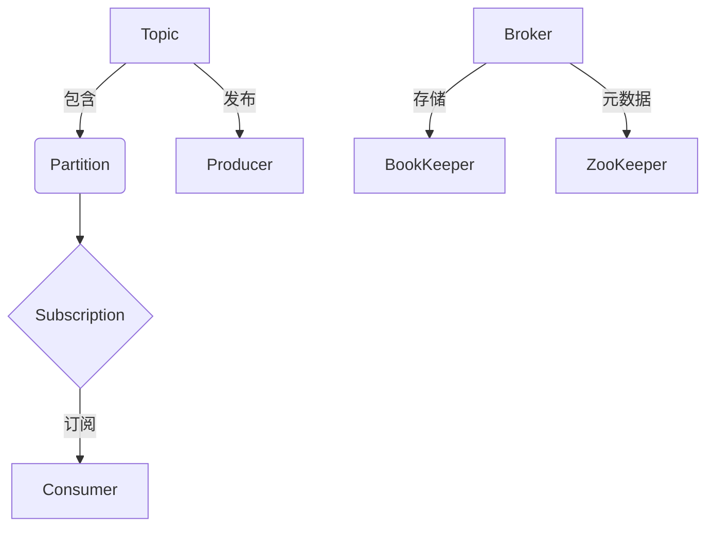
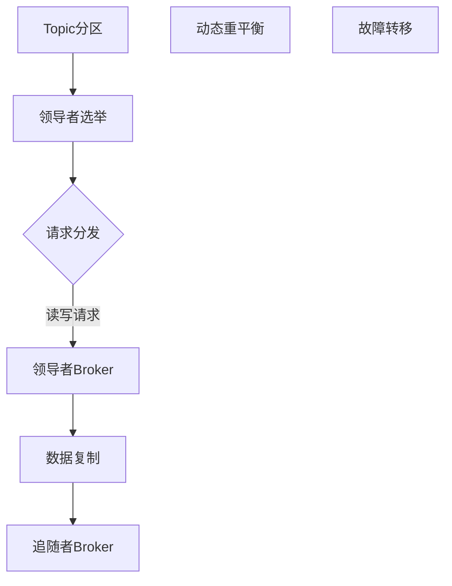
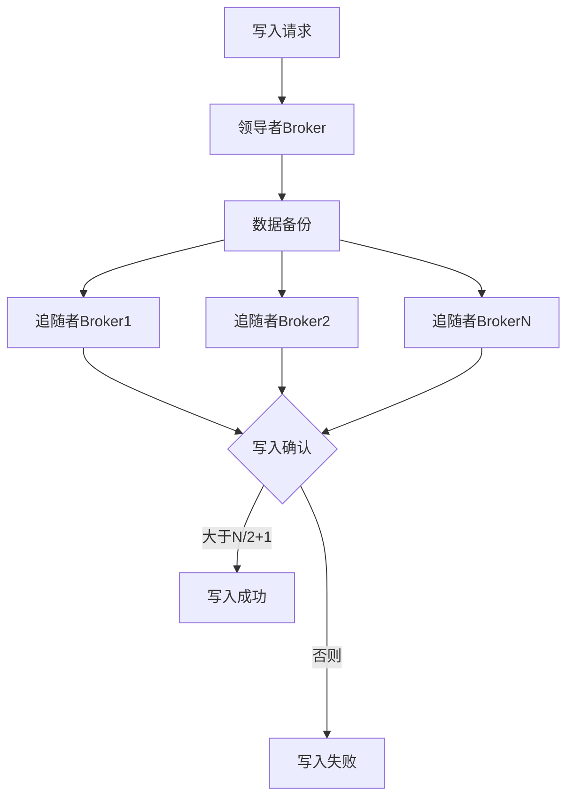
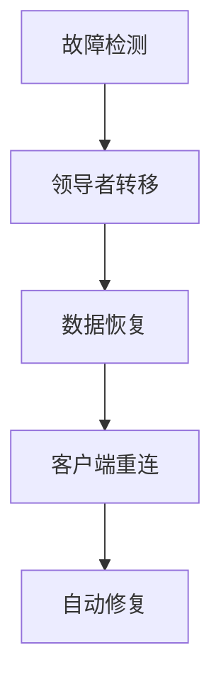

# Pulsar的核心组件

## 1. 背景介绍

### 1.1 问题的由来

在现代分布式系统中,消息队列扮演着关键角色,作为不同组件之间可靠的通信媒介。传统的消息队列系统如RabbitMQ、Apache Kafka等,在可靠性、吞吐量和扩展性方面都有一些局限性。为了解决这些问题,Apache Pulsar应运而生。

Apache Pulsar是一个云原生、分布式的消息队列系统,最初由Yahoo开发,后捐赠给Apache软件基金会。它旨在提供无缝的扩展性、异常高的性能、强大的多租户和多集群复制功能。

### 1.2 研究现状

Apache Pulsar作为新兴的消息队列系统,正在受到越来越多关注。越来越多公司和组织开始使用Pulsar,如Salesforce、Comcast、Verizon等。同时,也有越来越多的研究人员开始研究Pulsar的核心技术。

然而,由于Pulsar相对较新,现有的研究资料和文献还比较有限。大多数资料都集中在Pulsar的官方文档和一些博客文章上,缺乏对Pulsar核心组件的深入剖析和探讨。

### 1.3 研究意义  

深入研究Pulsar的核心组件,有助于我们更好地理解和运用这一先进的消息队列系统。通过剖析Pulsar的关键设计思想和实现细节,我们可以:

1. 掌握Pulsar的核心工作原理,更高效地使用和管理Pulsar集群。
2. 评估Pulsar是否适合自身的应用场景,做出明智的技术选型决策。
3. 为Pulsar的未来发展提供建议,推动其不断完善和优化。
4. 为分布式系统、消息队列等相关领域的研究提供借鉴和参考。

### 1.4 本文结构

本文将从以下几个方面深入探讨Pulsar的核心组件:

1. Pulsar的核心概念及其关联
2. Pulsar的核心算法原理及具体实现步骤  
3. Pulsar相关数学模型及公式推导
4. 基于Pulsar的实际项目实践和代码示例
5. Pulsar在不同场景下的应用
6. Pulsar相关工具和学习资源推荐
7. 总结Pulsar的发展趋势和面临的挑战

## 2. 核心概念与联系

在深入探讨Pulsar的核心组件之前,我们有必要先了解一些基本概念。Pulsar的设计理念是将传统消息队列的概念扩展到一个全新的层次,引入了诸如多租户、无缝扩展等新颖理念。下面是Pulsar中的一些核心概念:

### 2.1 Topic

Topic是Pulsar中的逻辑数据通道,类似于其他消息队列中的队列。生产者向Topic发送消息,消费者从Topic消费消息。Topic可以被分片为多个Partition,以实现更高的吞吐量和并行度。

### 2.2 Partition

Partition是Topic的子集,Topic中的消息被分片存储在不同的Partition中。消费者可以独立消费不同Partition中的消息,实现消费端的并行处理。Partition是Pulsar实现无缝扩展的基础。

### 2.3 Subscription 

Subscription代表一个或一组消费者订阅了某个Topic,用于从该Topic消费消息。Pulsar支持不同的订阅模式,如独占(Exclusive)、共享(Shared)、Key_Shared等,适应不同的消费场景。

### 2.4 Broker

Broker是Pulsar集群的基本单元,负责存储和转发消息。每个Broker节点都维护着自己的本地状态,并与其他Broker协调以实现整个集群的一致性。

### 2.5 BookKeeper

BookKeeper是一个开源的分布式存储系统,用于持久化存储Pulsar中的消息数据。它采用了类似于Raft的复制状态机设计,能够提供高吞吐、低延迟的存储服务。

### 2.6 ZooKeeper

ZooKeeper是一个分布式协调服务,在Pulsar中用于元数据管理和集群协调。它维护了Pulsar集群的元数据信息,如Topic、Subscription等,并协调Broker之间的状态一致性。

上述概念相互关联,共同构成了Pulsar的核心架构:

Pulsar的可扩展性和高性能,正是建立在这些核心概念之上的创新设计。接下来我们将深入探讨Pulsar核心组件的工作原理和实现细节。

## 3. 核心算法原理 & 具体操作步骤

### 3.1 算法原理概述

Pulsar的核心算法主要包括三个方面:负载均衡、数据复制和故障恢复。这些算法共同保证了Pulsar集群的高可用性、高扩展性和数据一致性。

#### 3.1.1 负载均衡算法

Pulsar采用基于分区的负载均衡策略,将Topic分片为多个Partition,每个Partition由独立的Broker节点托管。这种设计使得Pulsar能够无缝扩展,只需添加新的Broker节点即可提高整体吞吐量。

Pulsar的负载均衡算法基于领导者和追随者模型。对于每个Partition,都会选举一个领导者Broker负责处理读写请求,其他Broker作为追随者用于数据复制。当领导者Broker出现故障时,追随者将重新选举产生新的领导者,从而实现高可用性。

#### 3.1.2 数据复制算法  

为了确保数据的持久性和一致性,Pulsar采用了基于Quorum的复制协议,类似于Raft算法。每条消息在被持久化之前,需要被复制到指定数量的Broker节点上,只有当超过半数的副本节点确认后,消息才被视为"已提交"。

Pulsar的复制协议支持流水线化和批量操作,以提高吞吐量。同时,它还采用了读写分离的策略,将读请求分散到不同的副本节点上,进一步提升了读取性能。

#### 3.1.3 故障恢复算法

当Broker节点出现故障或网络分区时,Pulsar需要快速检测并进行故障转移,以最大程度减少服务中断。Pulsar采用了基于租约(Fencing)的故障检测机制,结合ZooKeeper的监控功能,能够及时发现故障并触发恢复操作。

故障恢复的核心是重新选举领导者Broker,并根据复制副本重建数据视图。Pulsar的选举算法保证了在任何时候最多只有一个领导者,从而避免了"脑裂"问题。同时,通过增量数据恢复,Pulsar能够快速重建一致的数据视图,将数据损失降到最低。

### 3.2 算法步骤详解

接下来,我们将详细解释Pulsar核心算法在实际操作中的具体步骤。

#### 3.2.1 负载均衡算法步骤

1. **Topic分区**:当创建一个新的Topic时,Pulsar会根据配置的分区数自动将其分片为多个Partition。每个Partition由一个独立的Broker节点托管。

2. **领导者选举**:对于每个Partition,所有托管该Partition的Broker节点将进行领导者选举。选举过程基于ZooKeeper的临时节点,确保最多只有一个领导者被选举出来。

3. **请求分发**:所有针对该Partition的读写请求都将被发送到领导者Broker节点。领导者负责处理请求,并将数据复制到追随者节点。

4. **动态重平衡**:当集群的负载发生变化时(如添加或删除Broker节点),Pulsar会自动重新分配Partition,以实现负载的再均衡。

5. **故障转移**:如果领导者Broker出现故障,追随者节点将重新进行领导者选举,产生新的领导者接管请求处理。

下面是Pulsar负载均衡算法的流程图:

#### 3.2.2 数据复制算法步骤  

1. **写入请求**:生产者向领导者Broker发送写入请求,包含待写入的消息数据。

2. **数据备份**:领导者Broker将消息数据备份到其他 `N` 个追随者Broker节点,`N` 是配置的副本数量。

3. **写入确认**:只有当超过 `N/2+1` 个节点(包括领导者)都成功备份了该消息,该消息才会被视为"已提交"。此时,领导者会向生产者返回写入确认。

4. **批量操作**:为了提高吞吐量,Pulsar会对写入请求进行批量化处理。多条消息被打包成一个批次进行复制和确认。

5. **流水线化**:在等待写入确认的同时,后续的写入请求可以被并行处理,形成一个复制操作的流水线,进一步提升吞吐量。

下面是Pulsar数据复制算法的流程图:

#### 3.2.3 故障恢复算法步骤

1. **故障检测**:Pulsar通过ZooKeeper的监控机制和租约(Fencing)方式检测Broker节点的故障。当一个节点故障时,其他节点能够及时发现。

2. **领导者转移**:对于故障节点托管的Partition,其他幸存的追随者节点将重新进行领导者选举,产生新的领导者Broker。

3. **数据恢复**:新选举出的领导者需要根据其他副本节点的数据视图,重建一致的数据状态。Pulsar采用增量恢复的方式,只需要从最近一次一致的检查点开始恢复,将数据损失降到最低。

4. **客户端重连**:生产者和消费者在发现故障后,将自动连接到新的领导者Broker节点,继续进行读写操作。

5. **自动修复**:故障节点在重新上线后,将自动从新的领导者节点进行数据同步,并重新加入集群,承担部分读写负载。

下面是Pulsar故障恢复算法的流程图:

### 3.3 算法优缺点

#### 3.3.1 优点

1. **高可扩展性**:基于分区的负载均衡策略,可实现无缝水平扩展,提高整体吞吐量。
2. **高可用性**:基于Raft的复制协议和自动故障转移机制,确保服务高度可用。
3. **高性能**:批量操作、流水线化等优化措施,大幅提升了读写性能。
4. **一致性保证**:基于Quorum的复制协议,能够保证数据的强一致性。
5. **多租户支持**:天然支持多租户和命名空间隔离,适合多租户场景。

#### 3.3.2 缺点

1. **复杂性**:涉及多个复杂的分布式算法,实现和调优较为困难。
2. **资源占用**:复制备份机制会占用更多的存储和网络资源。
3. **延迟**:强一致性要求会增加一定的写入延迟。
4. **脑裂问题**:虽然采用了Fencing机制,但在极端网络条件下仍可能发生。

### 3.4 算法应用领域

Pulsar的核心算法主要应用于以下几个领域:

1. **消息队列系统**:作为分布式消息队列的核心,确保消息的可靠传递。
2. **数据管道**:实时数据流的收集、缓存和分发,构建高性能数据