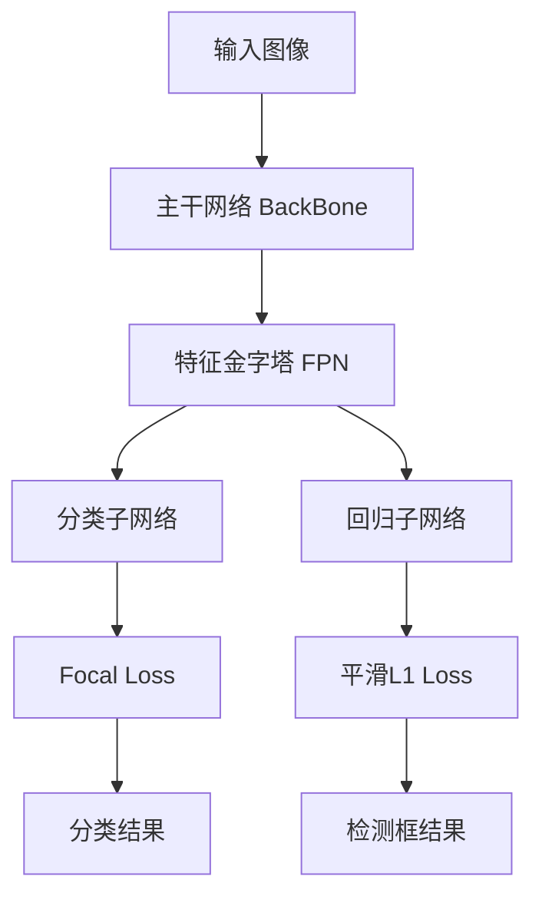

# RetinaNet代码优化技巧

作者：禅与计算机程序设计艺术

关键词：RetinaNet, 目标检测, 深度学习, 代码优化, 计算机视觉

## 1. 背景介绍

### 1.1 问题的由来

随着深度学习的迅猛发展,尤其是卷积神经网络(CNN)在计算机视觉领域取得的突破性进展,目标检测作为计算机视觉的一个核心任务,也得到了飞速发展。目标检测旨在从图像或视频中定位和识别感兴趣的目标对象,在无人驾驶、智慧城市、工业自动化等诸多领域有着广泛的应用前景。

RetinaNet是一种用于目标检测的单阶段深度学习算法,由Lin等人于2017年提出。与传统的两阶段目标检测算法如Faster R-CNN相比,RetinaNet具有更简洁的网络结构和更快的推理速度,同时在精度上也有出色表现,引起了学术界和工业界的广泛关注。

### 1.2 研究现状

RetinaNet自提出以来,国内外学者围绕其网络结构、损失函数、训练策略等方面进行了大量的研究和改进。一些典型的工作包括:

- Focal Loss:RetinaNet最大的创新点在于提出了Focal Loss来解决one-stage检测中正负样本不平衡的问题。后续研究者又提出了Gradient Harmonizing Mechanism (GHM)等改进方法。

- 特征金字塔:RetinaNet采用FPN结构来融合多尺度特征,提高对小目标的检测效果。一些工作如PANet、NAS-FPN等对特征金字塔结构进行了优化。 

- 主干网络:ResNet是RetinaNet原始论文采用的主干网络,后续研究者尝试了ResNeXt、MobileNet等其他主干网络,在精度和速度上进行权衡。

- 训练策略:研究者探索了Group Normalization、Synchronized Batch Normalization等归一化方法,以及Cosine Annealing等学习率调度策略,提升模型训练的效果和效率。

除了算法层面的改进,代码实现和优化也是RetinaNet实用化的关键。高质量、高性能的代码实现能让算法快速落地应用,产生实际价值。

### 1.3 研究意义

RetinaNet代码优化研究具有重要意义:

1. 提升推理速度:通过代码层面的优化如TensorRT加速、模型量化、剪枝等,可以大幅提升RetinaNet的推理速度,实现实时检测,这对自动驾驶等实时性要求高的场景至关重要。

2. 降低资源占用:在嵌入式等资源受限平台部署RetinaNet时,优化代码可以降低模型的内存占用和计算量,让算法在低功耗设备上流畅运行。

3. 便于部署应用:使用Python、C++等通用编程语言实现RetinaNet,并提供完善的文档和开发接口,能方便工程师将算法集成到实际项目中。

4. 促进学术交流:开源优质的RetinaNet代码,有助于研究者基于标准实现进行算法改进,加速目标检测技术的进步。

### 1.4 本文结构

本文将重点介绍RetinaNet的代码实现和优化技巧,具体内容安排如下:

第2节介绍RetinaNet中的一些核心概念。第3节讲解RetinaNet的算法原理和步骤。第4节给出RetinaNet涉及的数学模型和公式推导。第5节提供RetinaNet的代码实例和详细解读。第6节讨论RetinaNet的实际应用场景。第7节推荐RetinaNet相关的学习资源和开发工具。第8节总结全文,并展望RetinaNet的未来发展方向。第9节附录,列举RetinaNet常见问题与解答。

## 2. 核心概念与联系

在详细讲解RetinaNet的代码实现之前,有必要先了解其中涉及的一些核心概念:

- 锚框(Anchor):RetinaNet中预设的一组矩形框,用于匹配ground-truth和产生region proposals。锚框尺寸和长宽比需要根据数据集特点进行设计。

- 特征金字塔(Feature Pyramid):用于在不同尺度上提取图像特征。RetinaNet利用FPN结构,在各个层级共享卷积权重,减少参数量。

- 分类子网络(Classification Subnet):对提取的特征图进行分类,判断每个锚框是前景还是背景。采用FCN结构,通过卷积实现参数共享。

- 回归子网络(Regression Subnet):对提取的特征进行回归,修正锚框位置,使其更准确地框住目标。与分类子网络结构类似。

- Focal Loss:解决样本不均衡问题的损失函数。通过减小易分类样本的权重,使模型更关注困难样本。

这些概念环环相扣,共同组成了RetinaNet的核心原理。在代码实现中,我们将逐一实例化这些模块,并进行适当优化,提升检测性能。

## 3. 核心算法原理 & 具体操作步骤

### 3.1 算法原理概述

RetinaNet是一阶段的锚框式检测算法,通过密集预设锚框,同时进行目标分类和位置回归,端到端完成目标检测任务。其主要特点包括:

1. 主干网络采用ResNet+FPN结构,在多个尺度上提取图像特征。
2. 两个并行的FCN子网络分别进行分类和回归。
3. 使用Focal Loss解决正负样本不平衡问题,避免容易分类的样本主导训练。

### 3.2 算法步骤详解

RetinaNet的检测流程可分为以下步骤:

1. 图像预处理:将输入图像缩放到固定尺寸,减去均值,归一化到0-1。

2. 主干特征提取:图像经过ResNet主干网络,提取多层级的特征图。

3. 特征金字塔融合:使用FPN结构,自顶向下进行特征融合,得到丰富的语义信息。

4. 密集锚框生成:在每个特征图位置,按预设的尺度和长宽比生成锚框。

5. 分类和回归:锚框在两个子网络中分别进行分类和回归,判断是否包含目标以及修正位置坐标。

6. 损失函数:分类支路使用Focal Loss,回归支路使用平滑L1 Loss。

7. 后处理:对预测结果进行阈值过滤和非极大值抑制,得到最终检测结果。

训练时,以上步骤组成前向传播过程,然后通过反向传播优化网络权重。推理时,只需前向传播即可得到检测输出。

### 3.3 算法优缺点

RetinaNet的优点主要有:

1. 精度高:在COCO等数据集上达到SOTA水平,优于同期的一阶段和两阶段算法。
2. 速度快:一阶段结构简单,推理速度比Faster R-CNN等两阶段算法更快。 
3. 易于训练:端到端训练,不需要特征预训练或候选区域生成等额外步骤。

但RetinaNet也存在一些局限:

1. 小目标效果差:相比YOLOv3等算法,RetinaNet对小目标的检测效果稍逊一筹。
2. 内存占用大:特征图分辨率高,锚框数量多,导致模型参数量和计算量偏大。

总的来说,RetinaNet是一个精度和速度兼顾的通用目标检测算法,但在特定场景下可能需要进一步优化。

### 3.4 算法应用领域

RetinaNet可以应用于多种计算机视觉任务,例如:

1. 通用目标检测:如COCO、PASCAL VOC等自然图像数据集中的目标检测。
2. 人脸检测:检测图像中的人脸位置,为后续识别提供先验框。
3. 行人检测:智慧交通、安防监控等领域,检测图像/视频中的行人目标。
4. 车辆检测:无人驾驶环境感知中,检测道路上的车辆位置。
5. 医学影像分析:如肿瘤、器官等病变区域的自动检测。

不同任务需要针对性地调整RetinaNet的主干网络、锚框设置等超参数,并使用对应领域的数据进行训练。

## 4. 数学模型和公式 & 详细讲解 & 举例说明

### 4.1 数学模型构建

RetinaNet中主要涉及两个子任务:目标分类和边界框回归。我们分别建立它们的数学模型。

对于分类任务,模型的输出是每个锚框属于前景的概率。假设输入图像为$I$,锚框集合为$A=\{A_i\}$,模型输出锚框$A_i$的前景概率为$p_i$。这里采用Focal Loss作为分类的损失函数:

$$FL(p_i) = -\alpha_i (1-p_i)^\gamma \log(p_i)$$

其中$\alpha_i$是类别权重因子(前景为$\alpha$,背景为$1-\alpha$),$\gamma$是聚焦因子,用于减小易分类样本的损失贡献。

对于回归任务,模型输出是锚框坐标的修正量。假设锚框$A_i$的坐标为$\{x_i^a,y_i^a,w_i^a,h_i^a\}$,ground truth坐标为$\{x_i^g,y_i^g,w_i^g,h_i^g\}$,模型预测的修正量为$\{dx_i,dy_i,dw_i,dh_i\}$。回归损失采用平滑L1函数:

$$
L_{reg}=\sum_{i\in\{x,y,w,h\}} SmoothL1(t_i-t_i^*)
$$
$$
SmoothL1(x)=
\begin{cases}
0.5x^2& \text{if }|x|<1\\
|x|-0.5& \text{otherwise}
\end{cases}
$$

其中$t_i$是预测值,而$t_i^*$是标准值,分别定义为:

$$
\begin{aligned}
t_x&=(x-x^a)/w^a,& t_x^*&=(x^g-x^a)/w^a \\
t_y&=(y-y^a)/h^a,& t_y^*&=(y^g-y^a)/h^a \\
t_w&=\log(w/w^a),& t_w^*&=\log(w^g/w^a)\\
t_h&=\log(h/h^a),& t_h^*&=\log(h^g/h^a)
\end{aligned}
$$

最终的损失函数是分类损失和回归损失的加权和:

$$L = \frac{1}{N}\sum_i FL(p_i) + \lambda \frac{1}{N_{pos}}\sum_i L_{reg}(t_i,t_i^*) $$

其中$N$是锚框总数,$N_{pos}$是正样本锚框数,$\lambda$是平衡因子。

### 4.2 公式推导过程

以上公式的推导主要基于以下几点考虑:

1. Focal Loss中的$(1-p_i)^\gamma$项可降低易分类样本的损失权重,从而使模型更关注难分类的样本。当$\gamma=0$时,退化为普通交叉熵损失。

2. 平滑L1损失相比L2损失对离群点更鲁棒,梯度变化更平滑。$|x|<1$时,采用L2损失,使得小误差样本损失变化平缓;$|x|>1$时,采用L1损失,避免大误差样本主导训练。

3. 预测值$t$和目标值$t^*$采用归一化的对数空间编码,使得不同尺度框的损失是尺度不变的,训练更稳定。

4. 分类和回归损失采用不同的归一化方式。分类损失除以锚框总数$N$,回归损失除以正样本数$N_{pos}$。这是因为大部分锚框是负样本,不参与回归损失计算。

### 4.3 案例分析与讲解

下面我们以一个简单例子来说明RetinaNet的损失计算过程。

假设输入图像尺寸为640x