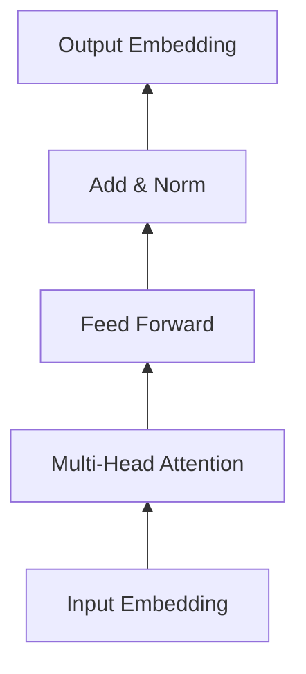

# Transformer大模型实战 数据源和预处理

关键词：Transformer, 大模型, 数据源, 数据预处理, 深度学习, NLP

## 1. 背景介绍
### 1.1 问题的由来
随着深度学习技术的飞速发展,尤其是Transformer模型的出现,自然语言处理(NLP)领域取得了突破性的进展。Transformer模型以其强大的并行计算能力和长距离依赖捕获能力,在机器翻译、文本分类、问答系统等任务上取得了state-of-the-art的表现。然而,训练一个高质量的Transformer大模型需要海量的数据支撑,数据源的选择和数据预处理的质量直接影响了模型的性能表现。

### 1.2 研究现状
目前业界主流的Transformer大模型如BERT、GPT-3、T5等,都是在超大规模语料上进行预训练得到的。这些语料主要来自于网络爬虫、开源数据集、合作机构等多个来源。在数据预处理阶段,主要采用了文本清洗、分词、构建词表等常见的NLP数据处理技术。但对于不同的下游任务,数据预处理的侧重点有所不同,需要根据任务的特点设计针对性的预处理流程。

### 1.3 研究意义
探索Transformer大模型的数据源和预处理技术,对于深入理解大模型的训练过程,提高模型训练效率和模型性能具有重要意义。通过总结和归纳现有的数据处理经验,有助于后续研究者更高效地开展相关研究工作。同时,针对不同任务的数据预处理优化,可以进一步提升Transformer大模型在实际应用中的效果。

### 1.4 本文结构
本文将从以下几个方面展开论述Transformer大模型的数据源和预处理技术:

1. 介绍Transformer大模型常见的数据源类型及优缺点分析
2. 总结几种主流的文本数据预处理流程和技术细节
3. 针对几类典型NLP任务,给出相应的数据预处理优化建议
4. 分享实践中的数据处理代码案例
5. 讨论当前研究中存在的问题,并对未来研究方向进行展望

## 2. 核心概念与联系
在讨论Transformer大模型的数据源和预处理之前,首先需要明确几个核心概念:

- **Transformer**: 一种基于self-attention机制的序列建模架构,摒弃了传统的RNN/CNN等结构,以Encoder-Decoder的形式实现了并行化计算。
- **大模型**: 模型参数量级在亿到千亿量级,通过在大规模语料上预训练得到的通用语言模型,可以进一步微调应用到下游任务。
- **数据源**: 为Transformer大模型提供海量训练语料的原始数据来源,常见的有网络爬虫语料、开源数据集、自有数据等。
- **数据预处理**: 将原始的文本数据转化为神经网络可以直接使用的数字化张量形式,期间涉及文本清洗、分词、构建词表等多个步骤。

它们之间的关系如下:


即原始数据源经过数据预处理得到大模型可用的训练数据,训练好的大模型再应用到下游的NLP任务中。

## 3. 核心算法原理 & 具体操作步骤
### 3.1 算法原理概述
Transformer大模型的训练本质上是一个无监督的语言模型预训练过程,通过优化模型在海量无标注语料上的perplexity,从而学习到语言的通用表征。其核心是基于self-attention的Transformer结构:



模型中的每一层Transformer Block都包含Multi-Head Attention和Feed Forward两个子层,通过残差连接和Layer Normalization将各层串联起来。

### 3.2 算法步骤详解
训练Transformer大模型的步骤可以概括为:

1. 语料采集:根据需求从各数据源采集原始文本数据,注意数据的质量和覆盖面。
2. 数据清洗:对原始语料进行去重、去噪、格式化等预处理,提纯数据质量。 
3. 文本分词:采用如BPE、WordPiece等分词算法,将文本转化为模型可处理的基本单元。
4. 构建词表:统计分词结果,构建定长词表(如前30K高频词),并将低频词映射为[UNK]。
5. 数据集构建:将处理好的语料组织为数据集的形式,划分训练集、验证集和测试集。
6. 模型训练:加载预训练数据,设置优化目标,采用梯度累积、混合精度等加速技巧进行大模型分布式训练。
7. 模型评估:在验证集和测试集上评估预训练模型的perplexity,确保模型质量和泛化性能。
8. 模型微调与应用:将预训练模型应用到下游任务,通过微调进一步提升任务性能。

### 3.3 算法优缺点
Transformer大模型预训练的优点在于:

- 通过self-attention机制,可以捕获长距离的语义依赖
- 采用分布式训练,充分利用大规模计算资源,加速模型训练
- 模型规模大、数据量大,学习到更加通用和鲁棒的语言表征
- 预训练模型可以灵活迁移应用到各类NLP下游任务

但同时也存在一些局限和不足:

- 对算力和数据的要求很高,训练成本大
- 模型体积庞大,推理部署有难度
- 仍然难以突破常识性和逻辑性的瓶颈
- 模型训练和应用缺乏可解释性

### 3.4 算法应用领域
得益于其强大的语义理解和建模能力,Transformer大模型已经在NLP领域得到了广泛应用,主要包括:

- 机器翻译:如GPT-3、T5等模型
- 智能问答:如ChatGPT等大模型对话系统
- 文本分类:如BERT在情感分析、新闻分类等任务的应用
- 信息抽取:如基于BERT的命名实体识别、关系抽取等
- 文本生成:如GPT系列在文本续写、写作助手等方向的应用

未来Transformer大模型有望在更多领域发挥重要作用,如知识图谱、逻辑推理、代码生成等。

## 4. 数学模型和公式 & 详细讲解 & 举例说明
### 4.1 数学模型构建
Transformer的核心是self-attention机制,即序列中每个位置的表征都由其他所有位置决定,公式如下:

$$
Attention(Q,K,V) = softmax(\frac{QK^T}{\sqrt{d_k}})V
$$

其中$Q$,$K$,$V$分别为序列的query、key、value矩阵,$d_k$为特征维度。

Multi-head Attention进一步拓展了attention层,引入多个独立的head,分别计算attention的结果再拼接:

$$
MultiHead(Q,K,V) = Concat(head_1,...,head_h)W^O \\
head_i = Attention(QW_i^Q, KW_i^K, VW_i^V)
$$

其中$W_i^Q$,$W_i^K$,$W_i^V$,$W^O$为可学习的线性变换矩阵。

除了attention子层,Transformer的另一个组成是Feed Forward子层,包含两个线性变换和一个ReLU激活:

$$
FFN(x) = max(0, xW_1 + b_1)W_2 + b_2
$$

### 4.2 公式推导过程
Transformer的训练目标是最小化语言模型的负对数似然,即:

$$
L_{LM} = -\sum_{i=1}^{n}logP(x_i|x_{<i},\theta)
$$

其中$x_i$为第$i$个token,$\theta$为模型参数。

假设模型的输出概率分布为$y$,真实标签的one-hot表示为$\hat{y}$,则有:

$$
P(x_i|x_{<i},\theta) = y_i \\
logP(x_i|x_{<i},\theta) = \hat{y}_i \cdot logy_i
$$

代入负对数似然公式可得:

$$
L_{LM} = -\sum_{i=1}^{n}\hat{y}_i \cdot logy_i
$$

这实际上等价于输出分布$y$和真实标签$\hat{y}$之间的交叉熵损失。

### 4.3 案例分析与讲解
下面以一个简单的例子来说明Transformer的训练过程:

假设我们有一个包含3个token的句子:"I love dogs",希望训练一个Transformer语言模型来预测下一个单词。

首先将输入语句转化为模型可处理的数字序列,如[1,2,3]。然后通过Embedding层将其映射为词向量表示,送入Transformer的Encoder中。

Encoder的每一层通过self-attention捕获token之间的关系,并通过前馈网络进行非线性变换,得到句子的高层语义表征。

在预测阶段,模型根据前面的token预测下一个token的概率分布。如已知"I love",预测下一个词是"dogs"的概率。

通过不断地用真实的下一个词和模型预测的概率分布计算交叉熵损失,并用反向传播算法更新模型参数,最终得到一个泛化性能良好的语言模型。

### 4.4 常见问题解答
Q: Transformer相比传统RNN/CNN有什么优势?
A: Transformer通过self-attention克服了RNN的长距离依赖问题和CNN的感受野局限,且计算高度并行,训练速度更快。

Q: Pre-training和Fine-tuning分别指什么?
A: Pre-training指在大规模语料上训练通用语言模型的过程;Fine-tuning指在下游任务的数据集上微调预训练模型的过程,使其适配特定任务。

Q: Transformer模型的缺点有哪些?
A: Transformer对计算资源要求高,推理速度慢,且难以建模长文本;同时模型缺乏可解释性,并非真正意义上的"语言理解"。

Q: 如何缓解Transformer的过拟合问题?
A: 可以采用更多数据、更大的模型、更强的正则化(如dropout)、更好的fine-tuning策略(如两阶段训练)等方式缓解过拟合。

## 5. 项目实践：代码实例和详细解释说明
下面将以PyTorch为例,演示如何用Transformer实现一个基于IMDB影评数据集的文本分类任务。

### 5.1 开发环境搭建
首先安装必要的依赖包:

```bash
pip install torch torchtext spacy
python -m spacy download en
```

### 5.2 源代码详细实现
定义Transformer模型类:

```python
import torch
import torch.nn as nn

class TransformerClassifier(nn.Module):
    def __init__(self, vocab_size, embed_dim, num_class):
        super().__init__()
        self.embedding = nn.Embedding(vocab_size, embed_dim)
        self.transformer = nn.Transformer(d_model=embed_dim, nhead=8, num_encoder_layers=6)
        self.fc = nn.Linear(embed_dim, num_class)
    
    def forward(self, text, mask):
        embedded = self.embedding(text) * mask.unsqueeze(-1)
        encoded = self.transformer(embedded, embedded, src_key_padding_mask=mask)
        pooled = encoded.mean(dim=1) 
        return self.fc(pooled)
```

加载IMDB数据集:

```python
from torchtext.datasets import IMDB
from torchtext.data.utils import get_tokenizer
from torchtext.vocab import build_vocab_from_iterator

tokenizer = get_tokenizer('spacy', language='en')

def yield_tokens(data_iter):
    for _, text in data_iter:
        yield tokenizer(text)

train_iter = IMDB(split='train')
vocab = build_vocab_from_iterator(yield_tokens(train_iter), specials=["<unk>"])
vocab.set_default_index(vocab["<unk>"])

def collate_batch(batch):
    label_list, text_list = [], []
    for (_label, _text) in batch:
        label_list.append(_label)
        text_list.append(torch.tensor(vocab(tokenizer(_text)), dtype=torch.long))
    label_list = torch.tensor(label_list, dtype=torch.long)
    text_list = nn.utils.rnn.pad_sequence(text_list, padding_value=vocab["<pad>"])
    mask = (text_list != vocab["<pad>"]).to(torch.long)
    return label_list, text_list, mask

train_iter, test_iter =