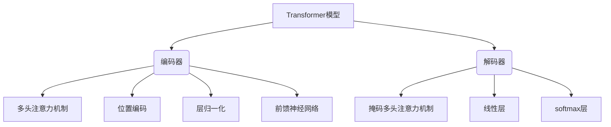

# Transformer大模型实战 线性层和softmax层

## 1. 背景介绍

### 1.1 问题的由来

在自然语言处理(NLP)和计算机视觉(CV)等领域,我们经常会遇到需要处理序列数据的任务。例如机器翻译、语音识别、图像分类等。传统的序列模型如递归神经网络(RNN)和长短期记忆网络(LSTM)在处理长序列时存在梯度消失或爆炸的问题,难以充分捕捉长距离依赖关系。为了解决这一问题,Transformer模型应运而生。

### 1.2 研究现状

Transformer是2017年由Google的Vaswani等人在论文"Attention Is All You Need"中提出的,它完全基于注意力机制,摒弃了RNN和卷积等操作,使用多头自注意力机制来捕获输入和输出之间的长程依赖关系。Transformer模型在机器翻译、语言模型、图像分类等多个领域取得了卓越的表现,成为深度学习领域的重要突破。

### 1.3 研究意义

Transformer模型凭借其强大的并行计算能力和长程依赖建模能力,在NLP和CV领域获得了广泛应用。研究Transformer的线性层和softmax层,有助于我们深入理解模型的核心机理,优化模型结构和参数,提高模型的预测精度和泛化能力。

### 1.4 本文结构

本文将首先介绍Transformer模型的核心概念和整体架构,然后重点讲解线性层和softmax层的工作原理、数学模型和代码实现,最后探讨Transformer模型的应用场景、发展趋势和面临的挑战。

## 2. 核心概念与联系



Transformer模型主要由编码器(Encoder)和解码器(Decoder)两个子模块组成:

- **编码器(Encoder)**: 用于处理输入序列,包括多头注意力机制、位置编码、层归一化和前馈神经网络等组件。
- **解码器(Decoder)**: 用于生成输出序列,在编码器的基础上增加了掩码多头注意力机制,以及本文重点介绍的线性层和softmax层。

线性层和softmax层位于解码器的输出端,共同决定了模型的最终预测结果。其中:

- **线性层(Linear Layer)**: 对解码器输出的特征向量做线性变换,将其映射到词汇表大小的维度空间。
- **softmax层(Softmax Layer)**: 将线性层的输出归一化为概率分布,用于预测下一个词的概率。

## 3. 核心算法原理及具体操作步骤

### 3.1 算法原理概述

线性层和softmax层共同构成了Transformer解码器的输出部分,其作用是将解码器的输出特征映射为词汇表大小的概率分布,用于预测下一个词。

具体来说,线性层对解码器输出的特征向量进行仿射变换(affine transformation),将其映射到词汇表大小的维度空间。然后softmax层对线性层的输出进行归一化处理,使其和为1,从而得到一个概率分布。

### 3.2 算法步骤详解

1. **线性层(Linear Layer)**

线性层的计算过程如下:

$$\boldsymbol{y} = \boldsymbol{Wx} + \boldsymbol{b}$$

其中:
- $\boldsymbol{x} \in \mathbb{R}^{d_\text{model}}$ 为解码器的输出特征向量
- $\boldsymbol{W} \in \mathbb{R}^{V \times d_\text{model}}$ 为可训练的权重矩阵
- $\boldsymbol{b} \in \mathbb{R}^V$ 为可训练的偏置向量
- $\boldsymbol{y} \in \mathbb{R}^V$ 为线性层的输出,其维度等于词汇表大小 $V$

2. **softmax层(Softmax Layer)**

softmax层对线性层的输出进行归一化,得到一个概率分布:

$$\text{softmax}(\boldsymbol{y})_i = \frac{e^{y_i}}{\sum_{j=1}^V e^{y_j}}$$

其中 $\text{softmax}(\boldsymbol{y})_i$ 表示第 $i$ 个词的预测概率。

在训练阶段,我们将预测概率与真实标签计算交叉熵损失,并通过反向传播算法更新模型参数。在预测阶段,我们选择具有最大概率的词作为预测结果。

### 3.3 算法优缺点

**优点**:

- 简单高效,易于实现和训练
- 线性层和softmax层参数较少,减小了模型大小
- softmax层输出概率分布,易于解释和分析

**缺点**:

- 词汇表大小受硬件资源限制,通常需要提前确定
- 对于大词汇量任务,softmax计算代价较高
- 无法有效处理低频词和未见词

### 3.4 算法应用领域

线性层和softmax层广泛应用于各种基于Transformer的任务中,如机器翻译、文本生成、对话系统等。对于生成性任务,它们是模型输出的最后一个环节。此外,在分类任务中也可以利用线性层做分类。

## 4. 数学模型和公式及详细讲解与举例说明

### 4.1 数学模型构建

线性层和softmax层的数学模型可以形式化为:

$$\begin{aligned}
\boldsymbol{y} &= \boldsymbol{Wx} + \boldsymbol{b} \\
P(w_i|\boldsymbol{x}) &= \text{softmax}(\boldsymbol{y})_i = \frac{e^{y_i}}{\sum_{j=1}^V e^{y_j}}
\end{aligned}$$

其中:

- $\boldsymbol{x} \in \mathbb{R}^{d_\text{model}}$ 为解码器输出的特征向量
- $\boldsymbol{W} \in \mathbb{R}^{V \times d_\text{model}}$ 和 $\boldsymbol{b} \in \mathbb{R}^V$ 分别为线性层的权重矩阵和偏置向量
- $\boldsymbol{y} \in \mathbb{R}^V$ 为线性层的输出
- $P(w_i|\boldsymbol{x})$ 表示给定特征向量 $\boldsymbol{x}$ 时,生成第 $i$ 个词 $w_i$ 的概率

在训练过程中,我们最小化模型在训练数据上的交叉熵损失:

$$\mathcal{L} = -\frac{1}{N} \sum_{n=1}^N \sum_{t=1}^{T_n} \log P(w_t^{(n)}|\boldsymbol{x}_t^{(n)})$$

其中 $N$ 为训练样本数, $T_n$ 为第 $n$ 个样本的长度。通过反向传播算法更新 $\boldsymbol{W}$ 和 $\boldsymbol{b}$ 的值。

### 4.2 公式推导过程

softmax函数的推导过程如下:

已知 $\boldsymbol{y} = (y_1, y_2, \ldots, y_V)^\top \in \mathbb{R}^V$,我们希望将其映射为一个概率分布 $\boldsymbol{p} = (p_1, p_2, \ldots, p_V)^\top$,满足:

1. $p_i \geq 0, \forall i \in \{1, 2, \ldots, V\}$
2. $\sum_{i=1}^V p_i = 1$

一种满足上述条件的函数为:

$$p_i = \frac{e^{y_i}}{\sum_{j=1}^V e^{y_j}}$$

证明如下:

1) $p_i \geq 0$,因为 $e^x > 0, \forall x \in \mathbb{R}$
2) $\sum_{i=1}^V p_i = \frac{\sum_{i=1}^V e^{y_i}}{\sum_{j=1}^V e^{y_j}} = 1$

这就是softmax函数的数学定义。

### 4.3 案例分析与讲解

假设我们有一个英语到法语的机器翻译任务,词汇表大小为 $V=10000$。解码器的输出特征向量为 $\boldsymbol{x} \in \mathbb{R}^{512}$,线性层的权重矩阵 $\boldsymbol{W} \in \mathbb{R}^{10000 \times 512}$,偏置向量 $\boldsymbol{b} \in \mathbb{R}^{10000}$。

我们首先计算线性层的输出:

$$\boldsymbol{y} = \boldsymbol{Wx} + \boldsymbol{b}$$

假设 $\boldsymbol{y}$ 的前5个元素为 $[1.2, -0.7, 0.3, 2.1, -1.5]$。

接下来,我们对线性层的输出应用softmax函数:

$$\begin{aligned}
p_1 &= \frac{e^{1.2}}{e^{1.2} + e^{-0.7} + e^{0.3} + e^{2.1} + e^{-1.5} + \ldots} \\
p_2 &= \frac{e^{-0.7}}{e^{1.2} + e^{-0.7} + e^{0.3} + e^{2.1} + e^{-1.5} + \ldots} \\
&\vdots
\end{aligned}$$

最终,我们得到一个概率分布 $(p_1, p_2, \ldots, p_{10000})$,其中每个元素 $p_i$ 表示生成第 $i$ 个法语词的概率。我们可以选择具有最大概率的词作为翻译结果。

在训练过程中,我们将预测概率与真实标签计算交叉熵损失,并通过反向传播算法更新 $\boldsymbol{W}$ 和 $\boldsymbol{b}$ 的值,从而提高模型的预测精度。

### 4.4 常见问题解答

**1. 为什么要使用softmax函数?**

softmax函数可以将任意实数向量映射为概率分布,满足非负和归一化的要求。这使得模型的输出具有很好的概率意义,易于解释和分析。

**2. 如何处理大词汇量任务?**

对于大词汇量任务,softmax的计算代价会变得很高。一种解决方案是使用近似softmax技术,如分层softmax、自适应softmax等,将计算复杂度降低到对数级别。另一种方法是使用词汇压缩技术,如BytePair编码(BPE)、WordPiece等,将词汇量控制在合理范围内。

**3. 如何处理未见词?**

对于未见词,一种常见做法是在词汇表中保留一个特殊的"未知词"标记,将所有未见词映射到这个标记上。另一种方法是使用子词或字符级别的模型,将单词拆分为更小的单元,从而降低未见词的概率。

## 5. 项目实践:代码实例和详细解释说明

### 5.1 开发环境搭建

我们使用Python和PyTorch深度学习框架来实现Transformer模型的线性层和softmax层。首先,我们需要安装PyTorch及其依赖包:

```bash
pip install torch torchvision
```

接下来,我们导入所需的Python模块:

```python
import torch
import torch.nn as nn
import torch.nn.functional as F
```

### 5.2 源代码详细实现

我们定义一个PyTorch模块来实现线性层和softmax层:

```python
class OutputLayer(nn.Module):
    def __init__(self, d_model, vocab_size):
        super(OutputLayer, self).__init__()
        self.linear = nn.Linear(d_model, vocab_size)
        self.lsm = nn.LogSoftmax(dim=-1)

    def forward(self, x):
        return self.lsm(self.linear(x))
```

在`__init__`方法中,我们初始化了一个线性层`nn.Linear(d_model, vocab_size)`和一个对数softmax层`nn.LogSoftmax(dim=-1)`。其中,`d_model`是解码器输出特征向量的维度,`vocab_size`是词汇表大小。

在`forward`方法中,我们首先将输入`x`通过线性层进行线性变换,然后应用对数softmax函数,得到最终的输出概率分布。

在训练过程中,我们可以使用交叉熵损失函数`nn.NLLLoss`来计算模型输出和真实标签之间的损失:

```python