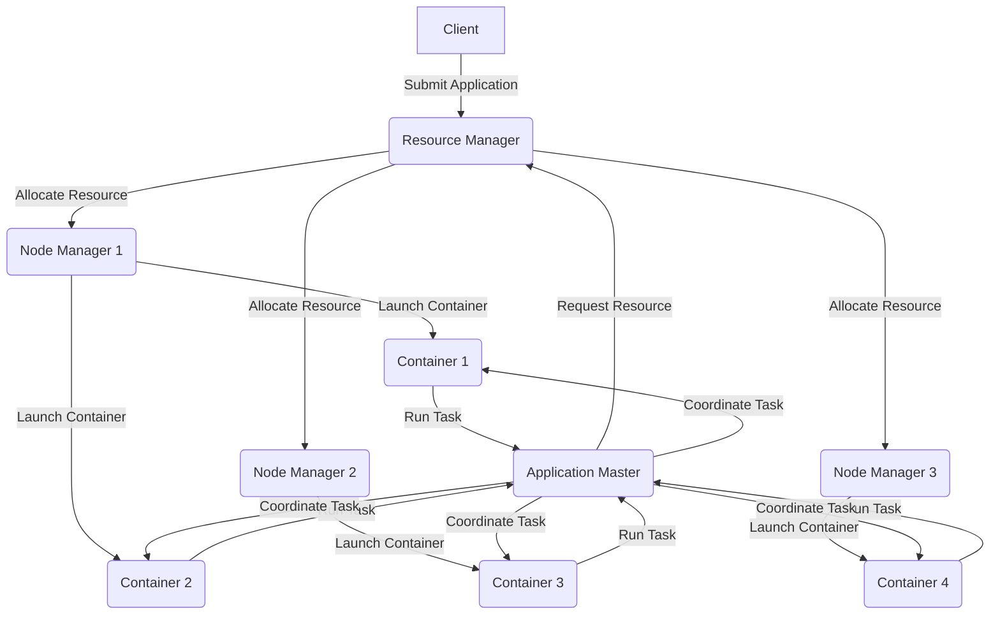

# YARN简介与架构概述

关键词：YARN、Hadoop、资源管理、分布式计算、大数据

## 1. 背景介绍
### 1.1 问题的由来
随着大数据时代的到来，数据量呈爆炸式增长，传统的计算框架已无法满足海量数据处理的需求。Hadoop作为一个开源的分布式计算平台，为大数据处理提供了高效、可靠的解决方案。然而，Hadoop 1.0中的JobTracker存在单点故障、可扩展性差等问题，限制了Hadoop的进一步发展。

### 1.2 研究现状
为了克服Hadoop 1.0的局限性，Apache软件基金会在Hadoop 2.0中引入了YARN(Yet Another Resource Negotiator)资源管理系统。YARN将资源管理和作业调度/监控分离，大大提升了Hadoop集群的可扩展性、容错性和多框架支持能力。目前，YARN已成为Hadoop生态系统的核心组件，被广泛应用于各种大数据处理场景中。

### 1.3 研究意义
深入研究YARN的架构原理和实现机制，对于理解现代分布式计算系统的设计思想、优化集群性能、开发基于YARN的大数据应用都具有重要意义。本文将系统地介绍YARN的核心概念、架构设计、工作原理，并结合实例分析其应用场景，为读者全面把握YARN提供参考。

### 1.4 本文结构
本文将按照以下结构展开：
- 第2部分：介绍YARN的核心概念及其与Hadoop的关系
- 第3部分：剖析YARN的架构设计和工作原理
- 第4部分：讨论YARN的资源调度模型和容量调度器
- 第5部分：通过实例演示如何基于YARN开发应用程序
- 第6部分：分析YARN在实际场景中的应用情况
- 第7部分：推荐YARN相关的学习资源和开发工具
- 第8部分：总结YARN的研究现状并展望其未来发展
- 第9部分：附录，解答常见问题

## 2. 核心概念与联系
在Hadoop 1.0中，MapReduce同时承担了资源管理和任务调度/监控的职责，难以支持除MapReduce之外的计算框架。YARN应运而生，作为一个通用的资源管理系统，将资源管理和任务调度/监控解耦，为各种应用程序提供统一的资源分配和调度服务。

YARN主要包含以下核心概念：
- Resource Manager(RM)：负责整个集群的资源管理和分配，是YARN的中央协调者
- Node Manager(NM)：负责单个节点的资源管理，并向RM汇报节点状态
- Application Master(AM)：负责单个应用程序的管理和调度，协调应用的资源需求
- Container：YARN中资源分配的基本单位，包含一定量的CPU、内存等资源

下图展示了YARN与Hadoop生态系统的关系：



YARN基于主从架构，RM作为主节点统筹全局，NM作为从节点管理本地资源。AM和具体计算任务运行在Container中，AM负责与RM协商资源并调度任务，计算任务负责执行具体的数据处理。

## 3. 核心算法原理 & 具体操作步骤
### 3.1 算法原理概述
YARN的核心是基于资源请求/分配算法实现的两级调度：
1. RM的资源调度器(Scheduler)根据应用的资源请求，将资源分配给AM
2. AM根据任务的资源需求，向RM请求Container资源，并协调任务在获得的Container中运行

### 3.2 算法步骤详解
1. 应用程序提交：Client将应用程序提交到RM，并指定AM的启动方式和资源需求
2. AM分配：RM为应用程序分配第一个Container，用于启动AM
3. AM注册：AM启动后向RM注册，建立应用和RM之间的通信
4. 资源请求：AM根据任务的资源需求，动态向RM请求Container资源
5. 资源分配：RM的Scheduler根据集群资源状况、应用优先级、队列容量等约束，将资源分配给AM
6. 任务调度：AM根据获得的Container资源，调度任务执行，并动态优化
7. 进度和状态更新：AM定期向RM汇报应用的运行状态和进度
8. 应用完成：应用运行完成后，AM向RM取消注册并释放资源

### 3.3 算法优缺点
优点：
- 解耦资源管理和任务调度，提高系统灵活性和可扩展性
- 支持多种调度策略，如容量调度、公平调度等，满足多样化的资源分配需求
- 基于Container的资源隔离，提升系统的安全性和稳定性

缺点：
- 两级调度机制引入了额外的资源请求和分配开销
- AM作为单点，存在一定的可用性风险
- 调度决策依赖于AM提供的进度和资源需求信息，AM实现的优劣影响整体性能

### 3.4 算法应用领域
YARN作为通用的资源管理平台，可支撑多种类型的大数据应用，包括：
- 批处理：MapReduce、Spark、Flink等
- 交互式查询：Hive、Impala等 
- 流处理：Spark Streaming、Flink等
- 机器学习：TensorFlow、MXNet等
- 图计算：Giraph等

## 4. 数学模型和公式 & 详细讲解 & 举例说明
### 4.1 数学模型构建
YARN的资源调度问题可以抽象为一个多维度背包问题。假设集群中有$n$个节点，每个节点有$r$种资源(如CPU、内存)，第$i$种资源的总量为$R_i$。系统中有$m$个应用，每个应用要求分配$x_{ij}$个第$i$种资源，且对系统效用的贡献为$p_j$。目标是在资源约束下，最大化系统的总效用。

数学模型如下：

$$
\begin{aligned}
\max \quad & \sum_{j=1}^m p_j \cdot y_j \\
\textrm{s.t.} \quad & \sum_{j=1}^m x_{ij} \cdot y_j \leq R_i, \quad i=1,2,\dots,r \\
& y_j \in \{0,1\}, \quad j=1,2,\dots,m
\end{aligned}
$$

其中，$y_j$为0-1变量，表示应用$j$是否被选中分配资源。

### 4.2 公式推导过程
上述模型是一个典型的0-1整数规划问题，可以用动态规划、回溯搜索等方法求解。以动态规划为例，定义状态$dp(i,S)$表示前$i$个应用、资源约束为$S=(S_1,\dots,S_r)$时的最大系统效用。状态转移方程为：

$$
dp(i,S) = \max\{dp(i-1,S), dp(i-1,S-x_i)+p_i\}
$$

其中，$x_i=(x_{i1},\dots,x_{ir})$为第$i$个应用的资源请求向量。时间复杂度为$O(m \cdot \prod_{i=1}^r R_i)$。

### 4.3 案例分析与讲解
考虑一个简单的例子：集群有2个节点，每个节点有2种资源(CPU和内存)，总量分别为$R_1=10, R_2=20$。系统中有3个应用，资源请求和效用如下表所示：

| 应用 | CPU需求 | 内存需求 | 效用 |
|------|--------|----------|------|
| 1    | 5      | 10        | 100  |
| 2    | 3      | 6         | 60   |
| 3    | 2      | 4         | 40   |

根据动态规划算法，可以计算出最优解为选择应用1和应用3，总效用为140。分配方案如下：

| 节点 | 应用 | CPU分配 | 内存分配 |
|------|------|---------|----------|
| 1    | 1    | 5       | 10       |
| 2    | 3    | 2       | 4        |

### 4.4 常见问题解答
Q: YARN的资源请求和分配粒度是什么？
A: YARN以Container为单位分配资源，每个Container包含一定量的CPU和内存资源。应用可以根据任务特点，灵活设置Container的资源需求。

Q: YARN支持哪些资源调度策略？
A: YARN内置了多种调度器，包括FIFO调度器、容量调度器(Capacity Scheduler)和公平调度器(Fair Scheduler)。用户可以根据需求选择合适的调度策略，也可以实现自定义调度器。

## 5. 项目实践：代码实例和详细解释说明
### 5.1 开发环境搭建
要开发YARN应用，首先需要搭建Hadoop开发环境。步骤如下：
1. 安装JDK，配置JAVA_HOME环境变量
2. 下载Hadoop发行版，解压到本地目录
3. 配置Hadoop环境变量，如HADOOP_HOME
4. 修改Hadoop配置文件，如core-site.xml, hdfs-site.xml, yarn-site.xml等
5. 启动Hadoop集群，包括HDFS、YARN等组件

### 5.2 源代码详细实现
以下是一个简单的YARN应用示例，实现了基于MapReduce的单词计数：

```java
public class WordCount {
  public static void main(String[] args) throws Exception {
    Configuration conf = new Configuration();
    String[] otherArgs = new GenericOptionsParser(conf, args).getRemainingArgs();
    if (otherArgs.length < 2) {
      System.err.println("Usage: wordcount <in> [<in>...] <out>");
      System.exit(2);
    }
    Job job = Job.getInstance(conf, "word count");
    job.setJarByClass(WordCount.class);
    job.setMapperClass(TokenizerMapper.class);
    job.setCombinerClass(IntSumReducer.class);
    job.setReducerClass(IntSumReducer.class);
    job.setOutputKeyClass(Text.class);
    job.setOutputValueClass(IntWritable.class);
    for (int i = 0; i < otherArgs.length - 1; ++i) {
      FileInputFormat.addInputPath(job, new Path(otherArgs[i]));
    }
    FileOutputFormat.setOutputPath(job,
      new Path(otherArgs[otherArgs.length - 1]));
    System.exit(job.waitForCompletion(true) ? 0 : 1);
  }
}
```

其中，TokenizerMapper和IntSumReducer分别实现了Map和Reduce逻辑：

```java
public static class TokenizerMapper extends Mapper<Object, Text, Text, IntWritable> {
  private final static IntWritable one = new IntWritable(1);
  private Text word = new Text();
  
  public void map(Object key, Text value, Context context) throws IOException, InterruptedException {
    StringTokenizer itr = new StringTokenizer(value.toString());
    while (itr.hasMoreTokens()) {
      word.set(itr.nextToken());
      context.write(word, one);
    }
  }
}

public static class IntSumReducer extends Reducer<Text,IntWritable,Text,IntWritable> {
  private IntWritable result = new IntWritable();

  public void reduce(Text key, Iterable<IntWritable> values, Context context) throws IOException, InterruptedException {
    int sum = 0;
    for (IntWritable val : values) {
      sum += val.get();
    }
    result.set(sum);
    context.write(key, result);
  }
}
```

### 5.3 代码解读与分析
- WordCount类是程序的入口，负责配置和提交MapReduce作业
- 通过Configuration加载Hadoop配置，GenericOptionsParser解析命令行参数
- 使用Job.getInstance()创建作业实例，并设置作业名称
- 通过job.setJarByClass()设置作业的主类
- 通过job.setMapperClass()和job.setReducerClass()设置Map和Reduce实现类
- 通过FileInputFormat和FileOutputFormat设置输入输出路径
- 调用job.waitForCompletion()提交作业并等待完成

TokenizerMapper实现了Map阶段的逻辑，主要工作是：
- 继承自Mapper类，重写map()方法
- 将输入的文本切分为