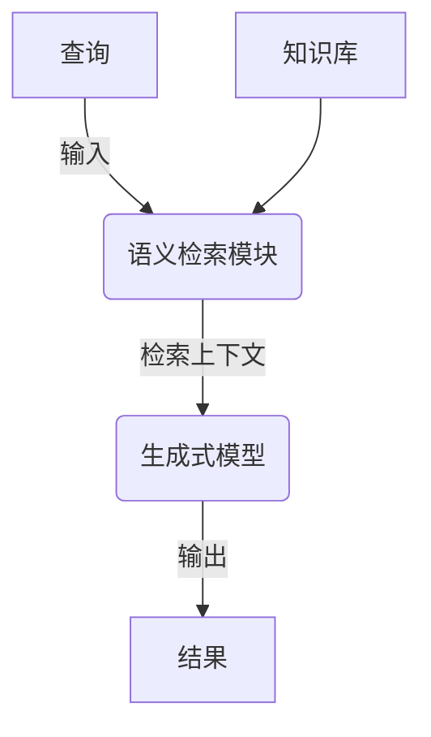

# 【LangChain编程：从入门到实践】RAG技术的关键挑战

## 1. 背景介绍

### 1.1 问题的由来

在当今信息时代,海量的非结构化数据(如文本、图像、视频等)不断涌现,如何高效地从这些数据中提取有价值的信息并生成人类可理解的知识,成为了人工智能领域亟待解决的重大挑战。传统的信息检索系统往往依赖于关键词匹配,难以深入理解查询意图和上下文语义,检索结果的相关性和准确性较低。

### 1.2 研究现状 

为了解决这一难题,近年来出现了一种新型的人工智能技术——RAG(Retrieval Augmented Generation,检索增强生成)。RAG技术将语义检索和生成式模型有机结合,旨在利用预先构建的知识库,通过检索相关信息并融入生成模型,产生高质量、信息丰富的输出结果。

RAG技术的核心思想是:首先使用语义检索模块从知识库中检索与查询相关的文本片段;然后将这些文本片段作为上下文,输入到生成式模型中;最后,生成模型基于检索到的上下文信息,生成相关、连贯、信息丰富的输出结果。

### 1.3 研究意义

RAG技术的出现为解决非结构化数据挖掘问题提供了一种全新的思路,具有重要的理论意义和应用价值。从理论层面看,RAG技术将语义检索和生成式模型有机融合,推动了自然语言处理技术的发展;从应用层面看,RAG技术可广泛应用于问答系统、智能写作辅助、知识图谱构建等多个领域,为提高人机交互体验、提高工作效率带来了新的机遇。

### 1.4 本文结构  

本文将全面介绍RAG技术的核心概念、算法原理、数学模型、实现细节和应用场景,旨在为读者提供RAG技术的系统性知识。文章首先阐述RAG技术的核心概念及其与其他技术的联系;然后深入探讨RAG算法的原理、具体操作步骤、数学模型及公式推导;接着通过实例代码和案例分析,解释RAG技术的实现细节;最后分析RAG技术的应用场景、发展趋势和面临的挑战。

## 2. 核心概念与联系

RAG技术的核心概念包括:

1. **语义检索(Semantic Retrieval)**:基于自然语言的语义理解,从知识库中检索与查询相关的文本片段。语义检索技术通常采用深度学习模型(如BERT)对查询和文本进行语义编码,然后基于语义相似度进行匹配和排序。

2. **生成式模型(Generative Model)**:一种基于机器学习的模型,能够生成新的、合理的输出序列(如文本、图像等)。常见的生成式模型包括RNN、Transformer等。

3. **知识库(Knowledge Base)**:存储大量结构化或非结构化知识的数据库,为语义检索和生成式模型提供信息来源。知识库可以是预构建的语料库、网络资源或专门为RAG技术构建的数据集。

4. **上下文融合(Context Fusion)**:将语义检索得到的相关文本片段作为上下文,融入生成式模型,指导模型生成与查询相关、信息丰富的输出结果。

RAG技术与其他技术领域存在紧密联系:

- **信息检索**:语义检索模块借鉴了信息检索领域的相关技术,如文本表示、相似度计算等。
- **自然语言处理**:生成式模型和语义理解模型均源自NLP领域的语言模型技术。
- **知识图谱**:知识库的构建可借鉴知识图谱技术,对结构化和非结构化知识进行有效组织和表示。
- **机器阅读理解**:RAG技术需要理解上下文语义,与机器阅读理解技术存在一定关联。

## 3. 核心算法原理 & 具体操作步骤

### 3.1 算法原理概述

RAG算法的核心思想是:利用语义检索模块从知识库中检索与查询相关的文本片段,作为上下文输入生成式模型;生成模型基于这些上下文信息,生成与查询相关、信息丰富的输出结果。

RAG算法的工作流程如下所示:

1. 用户输入自然语言查询。
2. 语义检索模块基于查询,从知识库中检索与查询相关的文本片段,作为上下文信息。
3. 将检索到的上下文信息输入生成式模型。
4. 生成式模型基于上下文信息,生成与查询相关、信息丰富的输出结果。

### 3.2 算法步骤详解

RAG算法可分为以下几个关键步骤:

#### 3.2.1 语义检索

1. **查询编码**:使用语义理解模型(如BERT)对查询进行编码,获得查询的语义表示向量。
2. **文本编码**:对知识库中的文本进行语义编码,获得每个文本片段的语义表示向量。
3. **相似度计算**:计算查询向量与每个文本片段向量之间的相似度(如余弦相似度)。
4. **排序检索**:根据相似度对文本片段进行排序,选取Top-K个最相关的文本片段作为上下文。

#### 3.2.2 上下文融合

1. **上下文拼接**:将Top-K个检索文本片段拼接成一个序列,作为生成模型的输入上下文。
2. **注意力机制**:生成模型通过自注意力机制,自适应地为不同上下文片段分配不同的权重,捕捉上下文中最相关的信息。
3. **条件生成**:生成模型条件生成输出序列,确保输出与查询相关,且包含了上下文中的关键信息。

#### 3.2.3 模型微调

为了提高RAG系统的性能,需要在特定数据集上对语义检索模型和生成模型进行微调(Fine-tuning),使其更好地适应特定任务和领域。

### 3.3 算法优缺点

**优点**:

1. **信息丰富**:能够从知识库中检索相关信息,生成的输出结果信息更加丰富、准确。
2. **语义理解**:基于语义检索和生成,能够更好地理解查询意图和上下文语义。
3. **泛化能力强**:由于融合了外部知识,RAG模型具有更强的泛化能力,可应对开放领域的查询。

**缺点**:

1. **知识库依赖**:RAG模型的性能很大程度上依赖于知识库的覆盖面和质量。
2. **效率较低**:需要同时运行语义检索模块和生成模型,计算开销较大,响应速度较慢。
3. **一致性差**:生成的结果可能与检索上下文不完全一致,存在矛盾和噪声。

### 3.4 算法应用领域

RAG技术可广泛应用于以下领域:

1. **问答系统**:利用知识库,回答开放域的问题,生成高质量、信息丰富的答复。
2. **智能写作辅助**:根据写作主题,从知识库检索相关信息,辅助生成内容丰富的文章。
3. **知识图谱构建**:从非结构化文本中提取实体、关系等知识元素,构建知识图谱。
4. **机器翻译**:将检索到的相关文本作为辅助信息,提高机器翻译的准确性和流畅度。
5. **对话系统**:生成与上下文相关、信息丰富的对话响应。

## 4. 数学模型和公式 & 详细讲解 & 举例说明

### 4.1 数学模型构建

RAG技术的核心是语义检索模块和生成式模型,我们将分别介绍两个模块的数学模型。

#### 4.1.1 语义检索模型

语义检索模型的目标是计算查询$q$与文本片段$d$之间的相关性分数$s(q,d)$,并根据分数对文本片段进行排序。常用的语义检索模型包括双向编码器模型(Bi-Encoder)和交互式模型(Cross-Encoder)。

**双向编码器模型**:

该模型首先使用编码器(如BERT)分别对查询$q$和文本$d$进行编码,得到向量表示$\vec{q}$和$\vec{d}$,然后计算两个向量之间的相似度作为相关性分数:

$$s(q,d) = \vec{q}^\top \vec{d}$$

其中$\top$表示向量点积操作。该模型的优点是计算效率高,但表示能力有限。

**交互式模型**:

该模型将查询$q$和文本$d$拼接为单个序列$[q;d]$,输入到编码器(如BERT)中获得联合编码表示$\vec{e}$,然后通过额外的分类头计算相关性分数:

$$s(q,d) = \sigma(W^\top \vec{e} + b)$$

其中$W$和$b$是可学习参数,$\sigma$是sigmoid激活函数。该模型的表示能力更强,但计算开销较大。

#### 4.1.2 生成式模型

生成式模型的目标是根据查询$q$和检索上下文$C=\{d_1,d_2,...,d_k\}$,生成相关的输出序列$y$。常用的生成式模型包括序列到序列模型(Seq2Seq)和前馈模型(Prefix-LM)。

**序列到序列模型**:

该模型将查询$q$和上下文$C$拼接为单个序列$[q;C]$作为输入,使用Transformer等序列模型对输出序列$y$进行建模:

$$P(y|q,C) = \prod_{t=1}^{|y|} P(y_t|y_{<t}, q, C; \theta)$$

其中$\theta$是模型参数,通过最大似然估计进行学习。

**前馈模型**:

该模型将查询$q$和上下文$C$拼接作为提示(Prompt),输入到预训练语言模型(如GPT)中,利用模型的前馈生成能力直接生成输出序列$y$:

$$y = \text{LM}([q;C])$$

前馈模型计算效率更高,但控制能力较差。

### 4.2 公式推导过程

我们以双向编码器语义检索模型为例,推导其训练目标函数。

假设训练数据集为$\mathcal{D} = \{(q_i, d_i^+, d_i^-)\}_{i=1}^N$,其中$q_i$为查询,$d_i^+$为相关文本,$d_i^-$为不相关文本。我们的目标是最大化相关文本的分数,最小化不相关文本的分数,即:

$$\max_\theta \sum_{i=1}^N \log \frac{e^{s(q_i, d_i^+)}}{e^{s(q_i, d_i^+)} + e^{s(q_i, d_i^-)}}$$

其中$\theta$是模型参数。通过化简,上式等价于:

$$\min_\theta -\sum_{i=1}^N \log \sigma(s(q_i, d_i^+) - s(q_i, d_i^-))$$

其中$\sigma$是sigmoid函数。这就是双向编码器模型的二元交叉熵损失函数,可通过梯度下降等优化算法进行参数学习。

### 4.3 案例分析与讲解

我们以"什么是量子计算机?"为例,分析RAG系统的工作过程。

1. **语义检索**:
   - 查询"什么是量子计算机?"被编码为向量$\vec{q}$。
   - 知识库中的文本片段(如"量子计算机是利用量子力学原理进行计算的新型计算机...")也被编码为向量$\vec{d}_i$。
   - 计算$\vec{q}$与每个$\vec{d}_i$的相似度,得到相关性分数。
   - 选取分数最高的Top-K个文本片段,如$d_1,d_2,d_3$。

2. **上下文融合**:
   - 将$d_1,d_2,d_3$拼接为单个序列$[d_1;d_2;d_3]$,作为生成模型的输入上下文$C$。
   -