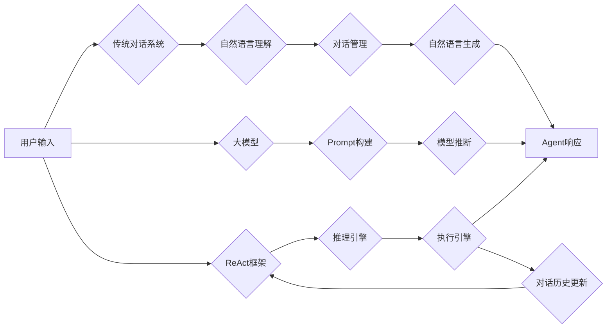

# 【大模型应用开发 动手做AI Agent】Agent的推理引擎：ReAct框架

关键词：大模型、AI Agent、ReAct框架、推理引擎、LLM

## 1. 背景介绍

### 1.1  问题的由来

随着大规模语言模型（Large Language Models, LLMs）的快速发展，如何利用LLM构建智能对话Agent成为了自然语言处理和人工智能领域的研究热点。传统的对话系统通常基于预定义的对话流程和知识库，难以灵活应对开放域对话中的多样化需求。而大模型虽然具有强大的语言理解和生成能力，但缺乏结构化的推理和执行能力，无法直接应用于构建交互式AI Agent。

### 1.2  研究现状

为了解决上述问题，微软、Anthropic等科技公司和研究机构提出了一系列基于大模型的AI Agent框架，如微软的Promptagator、Anthropic的Constitutional AI等。这些框架在大模型的基础上引入了额外的推理和执行模块，增强了Agent的语义理解、任务规划和环境交互能力。其中，由Anthropic提出的ReAct（Reason+Act）框架因其简洁高效的设计和优异的性能表现而备受关注。

### 1.3  研究意义

探索基于大模型的AI Agent构建方法对于推动对话式AI的发展具有重要意义：

1. 拓展大模型的应用场景，实现从语言模型到交互式Agent的跨越；
2. 提高对话系统的开放域适应能力，使其能够灵活应对多样化的用户需求；
3. 探索语言、推理、执行一体化的AI系统构建范式，为AGI（Artificial General Intelligence）的实现提供思路。

### 1.4  本文结构

本文将重点介绍ReAct框架的核心概念、原理和实现方法。全文结构如下：

- 第2部分介绍ReAct框架的核心概念及其与传统对话系统、大模型的联系和区别；
- 第3部分详细阐述ReAct的推理引擎原理，包括任务分解、动作空间定义、对话历史管理等关键技术；
- 第4部分给出ReAct的数学建模过程，推导其中的关键公式，并结合案例进行讲解说明；  
- 第5部分提供ReAct的代码实例，对其架构设计和核心模块进行解读分析；
- 第6部分讨论ReAct在智能客服、个人助理等领域的应用场景和实践案例；
- 第7部分推荐ReAct相关的学习资源、开发工具和文献资料；
- 第8部分总结ReAct的研究现状，展望其未来的发展方向和挑战；
- 第9部分列举ReAct开发和应用中的常见问题，给出参考解答。

## 2. 核心概念与联系

ReAct框架的核心理念是将对话Agent的响应过程划分为"推理"（Reasoning）和"执行"（Acting）两个阶段：

- 推理阶段：根据当前对话历史（包括用户输入和Agent已有的观察、执行结果等），对用户意图进行理解和任务规划，输出一系列需要执行的原子操作/API调用；
- 执行阶段：依次执行推理阶段输出的操作序列，与外部环境（如知识库、网络服务等）进行交互，获取所需信息，并将执行结果添加到对话历史中，进入下一轮迭代。

相比传统的管道式对话系统，ReAct具有以下特点：

1. 端到端可微调：ReAct以自回归的方式对整个对话过程进行建模，推理和执行模块可以端到端地微调，减少人工设计工作量；
2. 动作空间可扩展：ReAct以原子操作/API调用序列的形式组织动作空间，可以灵活地引入新的外部接口，增强Agent的环境交互能力；
3. 历史感知：ReAct在每一轮对话中会记录完整的对话历史，使得Agent能够基于上下文信息进行长期推理和规划。

与大模型相比，ReAct在保留了大模型强大语言理解和生成能力的同时，引入了结构化的推理和执行机制，使其更适合构建面向任务的交互式Agent。下图展示了ReAct框架与传统对话系统、大模型之间的联系和区别：

## 3. 核心算法原理 & 具体操作步骤

### 3.1 算法原理概述

ReAct的核心是其推理引擎，负责将用户输入和当前对话历史映射为一系列原子操作。具体来说，ReAct将整个对话过程建模为一个自回归序列预测任务：

$$
P(\text{actions}|\text{context}) = \prod_{i=1}^{n} P(a_i|a_{1:i-1}, \text{context})
$$

其中，$\text{context}$ 表示当前的对话历史，$\text{actions}=a_{1:n}$ 表示推理引擎生成的一系列原子操作。ReAct使用预训练的自回归语言模型（如GPT系列）来参数化上述概率分布，并通过微调的方式使其适应特定的任务和动作空间。

### 3.2 算法步骤详解

ReAct的推理引擎主要包括以下几个步骤：

1. 对话历史编码：将当前的对话历史 $\text{context}$ 编码为语言模型的输入表示 $\mathbf{h}_{\text{context}}$；
2. 动作空间定义：根据任务需求定义一组原子操作 $\mathcal{A}=\{a_1, a_2, ...\}$，每个操作对应一段自然语言描述；
3. 操作解码：使用语言模型基于 $\mathbf{h}_{\text{context}}$ 和 $\mathcal{A}$ 解码出一系列操作 $a_{1:n}$：
   
$$
\begin{aligned}
\mathbf{h}_1 &= \text{LM}(\mathbf{h}_{\text{context}}) \\
a_1 &= \arg\max_{a\in\mathcal{A}} P(a|\mathbf{h}_1) \\
\mathbf{h}_2 &= \text{LM}(\mathbf{h}_1, a_1) \\
a_2 &= \arg\max_{a\in\mathcal{A}} P(a|\mathbf{h}_2) \\
&... \\
\mathbf{h}_n &= \text{LM}(\mathbf{h}_{n-1}, a_{n-1}) \\ 
a_n &= \arg\max_{a\in\mathcal{A}} P(a|\mathbf{h}_n)
\end{aligned}
$$

4. 操作执行：依次执行解码出的操作序列 $a_{1:n}$，与外部环境交互，获取所需信息；
5. 历史更新：将执行结果添加到对话历史 $\text{context}$ 中，进入下一轮迭代。

### 3.3 算法优缺点

ReAct算法的主要优点包括：

- 端到端可微调，减少人工设计工作量；
- 动作空间可扩展，增强Agent的环境交互能力；
- 历史感知，支持跨轮次的上下文理解和任务规划。

同时，ReAct也存在一些局限性：

- 对训练数据质量和规模要求较高，需要大量高质量的人工标注数据；
- 推理和执行过程的可解释性较差，难以对Agent的行为进行细粒度控制和纠错；
- 在开放域对话中容易产生幻觉，生成不一致或虚假的信息。

### 3.4 算法应用领域

ReAct在以下领域具有广泛的应用前景：

- 智能客服：通过引入知识库查询、业务流程控制等操作，构建高效灵活的客服对话Agent；
- 个人助理：通过连接日程管理、信息检索等外部服务，打造个性化的智能助理；  
- 教育助手：通过接入教育资源库和学习跟踪系统，提供智能化的教学辅导服务；
- 医疗问诊：通过对接医疗知识图谱和诊疗规范，辅助医生开展在线问诊和健康咨询。

## 4. 数学模型和公式 & 详细讲解 & 举例说明

### 4.1 数学模型构建

ReAct的核心是将对话Agent的决策过程建模为一个马尔可夫决策过程（Markov Decision Process, MDP）：

- 状态空间 $\mathcal{S}$：对话历史 $\text{context}$ 构成了状态空间，每个状态 $s\in\mathcal{S}$ 对应一条历史记录； 
- 动作空间 $\mathcal{A}$：由一组预定义的原子操作/API调用构成，每个动作 $a\in\mathcal{A}$ 对应一段操作描述；
- 转移概率 $P(s'|s,a)$：执行动作 $a$ 后，从状态 $s$ 转移到状态 $s'$ 的概率；
- 奖励函数 $R(s,a)$：在状态 $s$ 下执行动作 $a$ 获得的即时奖励。

Agent的目标是学习一个策略 $\pi:\mathcal{S}\rightarrow\mathcal{A}$，使得在给定状态 $s$ 时，选择动作 $a=\pi(s)$ 能够最大化累积期望奖励：

$$
\pi^* = \arg\max_{\pi} \mathbb{E}\left[\sum_{t=0}^{\infty} \gamma^t R(s_t,\pi(s_t))\right]
$$

其中，$\gamma\in[0,1]$ 为折扣因子，用于平衡即时奖励和长期奖励。

### 4.2 公式推导过程

ReAct采用自回归的方式对MDP中的策略 $\pi$ 进行参数化：

$$
\pi_{\theta}(a|s) = P_{\theta}(a|\text{context}) = \frac{\exp(f_{\theta}(a,\text{context}))}{\sum_{a'\in\mathcal{A}}\exp(f_{\theta}(a',\text{context}))}
$$

其中，$f_{\theta}(a,\text{context})$ 表示在给定对话历史 $\text{context}$ 时，动作 $a$ 的评分函数，通常由预训练语言模型的输出表示计算得到。

假设训练数据集为 $\mathcal{D}=\{(\text{context}_i, a_i)\}_{i=1}^{N}$，ReAct的训练目标是最小化负对数似然损失：

$$
\mathcal{L}(\theta) = -\frac{1}{N}\sum_{i=1}^{N} \log P_{\theta}(a_i|\text{context}_i)
$$

通过梯度下降法优化上述损失函数，可以得到ReAct的最优参数 $\theta^*$：

$$
\theta^* = \arg\min_{\theta} \mathcal{L}(\theta)
$$

### 4.3 案例分析与讲解

下面我们以一个简单的任务型对话为例，说明ReAct的推理执行过程。

假设用户输入为："明天上海的天气怎么样？"，当前对话历史为空，定义的动作空间包括：

- `search_weather(city, date)`：查询指定城市和日期的天气情况；
- `reply(text)`：生成回复文本。

ReAct的推理引擎首先将用户输入编码为 $\mathbf{h}_{\text{context}}$，然后基于动作空间进行解码：

$$
\begin{aligned}
\mathbf{h}_1 &= \text{LM}(\mathbf{h}_{\text{context}}) \\
a_1 &= \arg\max_{a\in\mathcal{A}} P(a|\mathbf{h}_1) \\
&= \text{search_weather(上海, 明天)} \\
\mathbf{h}_2 &= \text{LM}(\mathbf{h}_1, a_1) \\ 
a_2 &= \arg\max_{a\in\mathcal{A}} P(a|\mathbf{h}_2) \\
&= \text{reply(明天上海的天气是...)}
\end{aligned}
$$

接下来，执行引擎依次执行 `search_weather` 和 `reply` 操作：

1. 调用天气查询API，获取明天上海的天气信息；
2. 将天气