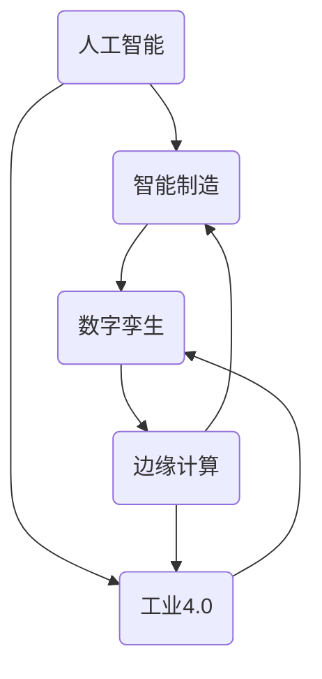

# 一切皆是映射：AI助力下的智能制造和工业4.0

## 1. 背景介绍

### 1.1 问题的由来

在当今快速发展的工业时代，制造业正面临着前所未有的挑战。随着市场需求的多样化和个性化程度不断提高，传统的大规模生产模式已经无法满足现代制造业的需求。同时，能源消耗、环境保护和可持续发展也成为制造业必须重视的问题。在这种背景下，智能制造和工业4.0应运而生。

智能制造是指利用先进的信息技术、自动化技术和智能技术,实现制造过程的智能化、网络化和自动化,从而提高制造效率、降低成本、缩短产品上市时间、提高产品质量和灵活性。工业4.0则是智能制造的延伸和发展,它融合了物联网、大数据、云计算、人工智能等新一代信息技术,旨在实现制造业的智能化、网络化和服务化。

### 1.2 研究现状

近年来,人工智能(AI)技术在智能制造和工业4.0领域得到了广泛应用。AI技术可以帮助制造企业优化生产流程、提高产品质量、降低能源消耗、实现预测性维护等。例如,机器学习算法可以用于预测设备故障,从而实现预防性维护;计算机视觉技术可以用于产品质量检测,提高产品合格率;自然语言处理技术可以用于智能客户服务,提高客户满意度。

然而,AI技术在智能制造和工业4.0领域的应用还存在一些挑战。例如,数据质量和可获得性是AI算法性能的关键因素,但在制造环境中,获取高质量的数据并不容易;另外,AI系统的可解释性和可信度也是一个重要问题,制造企业需要确保AI系统的决策是可解释和可信的。

### 1.3 研究意义

本文旨在探讨AI技术在智能制造和工业4.0领域的应用,阐述AI技术如何助力制造业的智能化转型。通过介绍AI在制造业中的应用场景、核心算法原理、数学模型和实际案例,读者可以全面了解AI技术在智能制造和工业4.0领域的作用和潜力。同时,本文也将讨论AI技术在该领域面临的挑战和未来发展趋势,为制造企业提供AI技术应用的指导和建议。

### 1.4 本文结构

本文共分为九个部分:

1. 背景介绍
2. 核心概念与联系
3. 核心算法原理与具体操作步骤
4. 数学模型和公式详细讲解与举例说明
5. 项目实践:代码实例和详细解释说明
6. 实际应用场景
7. 工具和资源推荐
8. 总结:未来发展趋势与挑战
9. 附录:常见问题与解答

## 2. 核心概念与联系

在探讨AI助力下的智能制造和工业4.0之前,我们需要了解一些核心概念及其相互关系。

### 2.1 人工智能(AI)

人工智能(Artificial Intelligence,AI)是一门研究如何使机器模拟人类智能行为的学科。AI技术包括机器学习、深度学习、计算机视觉、自然语言处理等,可以用于解决各种复杂的问题。

### 2.2 智能制造

智能制造是指利用先进的信息技术、自动化技术和智能技术,实现制造过程的智能化、网络化和自动化。智能制造系统可以自主感知、学习、决策和执行,从而提高制造效率、降低成本、缩短产品上市时间、提高产品质量和灵活性。

### 2.3 工业4.0

工业4.0是第四次工业革命的核心理念,它融合了物联网、大数据、云计算、人工智能等新一代信息技术,旨在实现制造业的智能化、网络化和服务化。工业4.0强调智能制造、个性化定制、数字化集成和价值链优化。

### 2.4 数字孪生

数字孪生(Digital Twin)是一种虚拟模型,它可以精确映射物理实体的全生命周期,包括设计、制造、运营和维护等各个阶段。数字孪生技术是实现智能制造和工业4.0的关键技术之一,可以用于产品设计优化、生产过程模拟、预测性维护等。

### 2.5 边缘计算

边缘计算(Edge Computing)是一种将计算资源部署在靠近数据源的网络边缘节点上的计算模式。在智能制造和工业4.0中,边缘计算可以实现实时数据处理和本地决策,从而提高系统响应速度和可靠性。

### 2.6 核心概念关系

上述核心概念之间存在着密切的关系,如下图所示:

人工智能技术是实现智能制造和工业4.0的关键驱动力,而数字孪生和边缘计算则是支撑智能制造和工业4.0的重要技术。这些概念相互关联、相互促进,共同推动了制造业的智能化转型。

## 3. 核心算法原理与具体操作步骤

在智能制造和工业4.0中,AI技术发挥着重要作用。本节将介绍几种常用的AI算法原理及其具体操作步骤。

### 3.1 算法原理概述

#### 3.1.1 机器学习算法

机器学习是AI的一个重要分支,它通过利用数据构建模型,从而实现自动化的预测和决策。在智能制造中,机器学习算法可以用于设备故障预测、产品质量控制、能源优化等场景。常用的机器学习算法包括:

- 监督学习算法:如线性回归、逻辑回归、决策树、支持向量机等。
- 无监督学习算法:如聚类算法(K-Means、层次聚类)、关联规则挖掘等。
- 强化学习算法:如Q-Learning、深度决策网络等。

#### 3.1.2 深度学习算法

深度学习是机器学习的一个子领域,它通过构建深层神经网络模型来模拟人脑的工作原理,从而实现高级别的任务,如图像识别、语音识别、自然语言处理等。在智能制造中,深度学习算法可以用于视觉检测、缺陷识别、预测性维护等场景。常用的深度学习算法包括:

- 卷积神经网络(CNN):适用于图像识别、视觉检测等任务。
- 循环神经网络(RNN):适用于序列数据处理,如自然语言处理、时间序列预测等。
- 生成对抗网络(GAN):可用于图像生成、数据增强等任务。

#### 3.1.3 优化算法

在智能制造中,经常需要解决各种优化问题,如生产计划优化、路径规划优化、能源优化等。常用的优化算法包括:

- 线性规划:用于求解线性目标函数和线性约束条件下的最优解。
- 整数规划:用于求解包含整数变量的线性或非线性优化问题。
- 启发式算法:如遗传算法、蚁群算法、模拟退火算法等,用于求解NP难问题。

### 3.2 算法步骤详解

以下将详细介绍机器学习算法的具体操作步骤,以监督学习算法为例。

#### 3.2.1 数据预处理

数据预处理是机器学习算法的重要前置步骤,包括以下几个方面:

1. 数据清洗:处理缺失值、异常值等问题。
2. 数据转换:对数据进行归一化、标准化等转换,使数据符合算法要求。
3. 数据集划分:将数据集划分为训练集、验证集和测试集。

#### 3.2.2 模型构建

根据具体任务,选择合适的机器学习算法,如线性回归、逻辑回归、决策树等,构建模型。

#### 3.2.3 模型训练

使用训练集对模型进行训练,通过优化算法(如梯度下降)调整模型参数,使模型在训练集上达到最优性能。

#### 3.2.4 模型评估

使用验证集对模型进行评估,计算评估指标(如准确率、精确率、召回率等),判断模型是否过拟合或欠拟合。

#### 3.2.5 模型调优

根据评估结果,通过调整超参数、特征工程、集成学习等方法,对模型进行优化和改进。

#### 3.2.6 模型部署

当模型性能满足要求后,使用测试集对模型进行最终评估,并将模型部署到实际应用中。

### 3.3 算法优缺点

#### 3.3.1 机器学习算法

优点:

- 可以自动从数据中学习模式和规律,无需人工编写复杂的规则。
- 具有较强的泛化能力,可以处理未见过的新数据。
- 适用于各种复杂的任务,如预测、分类、聚类等。

缺点:

- 需要大量的高质量数据进行训练,否则模型性能会受到影响。
- 模型的可解释性较差,难以理解模型内部的决策过程。
- 对于异常数据和噪声数据较为敏感,可能导致模型性能下降。

#### 3.3.2 深度学习算法

优点:

- 具有强大的特征提取和模式识别能力,在图像、语音等领域表现出色。
- 可以自动学习多层次的抽象特征表示,无需人工设计特征。
- 通过增加网络深度和宽度,可以提高模型的表达能力。

缺点:

- 需要大量的训练数据和计算资源,训练过程耗时且昂贵。
- 模型的可解释性较差,被视为"黑箱"模型。
- 容易过拟合,需要采取正则化等技术来防止过拟合。

#### 3.3.3 优化算法

优点:

- 可以求解各种复杂的优化问题,如线性规划、整数规划等。
- 启发式算法可以用于求解NP难问题,获得近似最优解。
- 算法原理清晰,易于理解和实现。

缺点:

- 对于高维、非线性、非凸等复杂优化问题,传统优化算法可能无法获得最优解。
- 启发式算法可能陷入局部最优解,无法获得全局最优解。
- 算法的性能和效率受约束条件、初始值等因素影响较大。

### 3.4 算法应用领域

在智能制造和工业4.0中,AI算法可以应用于多个领域,包括但不限于:

- 预测性维护:利用机器学习算法预测设备故障,实现预防性维护。
- 产品质量控制:使用计算机视觉和深度学习算法进行产品缺陷检测和质量控制。
- 生产计划优化:采用优化算法对生产计划进行优化,提高生产效率。
- 能源优化:利用机器学习算法对能源消耗进行预测和优化。
- 供应链优化:使用优化算法对供应链进行优化,降低运营成本。
- 预测性维护:利用机器学习算法预测设备故障,实现预防性维护。
- 产品质量控制:使用计算机视觉和深度学习算法进行产品缺陷检测和质量控制。
- 生产计划优化:采用优化算法对生产计划进行优化,提高生产效率。
- 能源优化:利用机器学习算法对能源消耗进行预测和优化。
- 供应链优化:使用优化算法对供应链进行优化,降低运营成本。

## 4. 数学模型和公式详细讲解与举例说明

在智能制造和工业4.0中,AI算法通常需要构建数学模型,并使用相应的公式进行计算和优化。本节将详细介绍一些常用的数学模型和公式,并给出具体的案例分析和讲解。

### 4.1 数学模型构建

#### 4.1.1 线性回归模型

线性回归是一种常用的监督学习算法,用于建立自变量和因变量之间的线