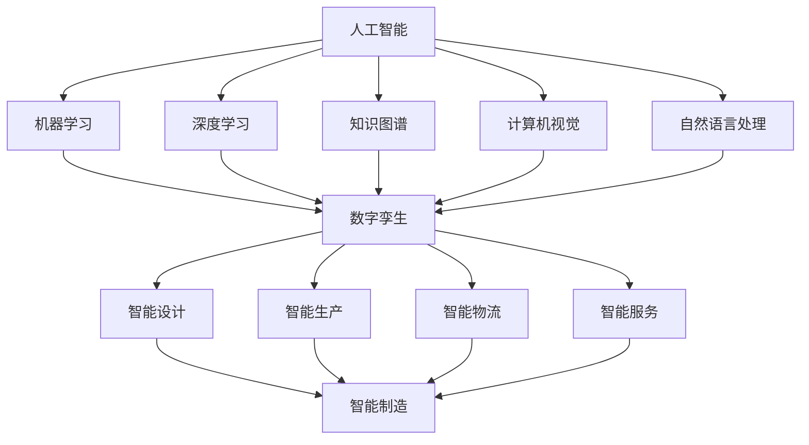
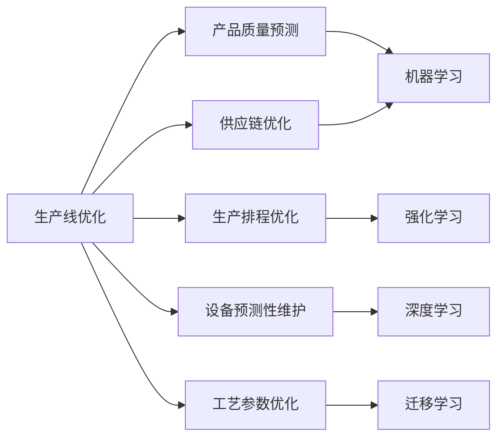

# 人工智能与制造业:智能制造与生产线优化

关键词：人工智能、智能制造、生产线优化、机器学习、深度学习、计算机视觉、自然语言处理、智能决策、数字孪生、工业4.0

## 1. 背景介绍
### 1.1  问题的由来
随着全球制造业竞争日益激烈,传统的制造模式已经难以满足市场需求。企业迫切需要通过智能化、数字化、网络化的手段来提高生产效率,优化资源配置,缩短产品研发周期。人工智能技术的快速发展为制造业转型升级提供了新的思路和方向。将人工智能与制造业深度融合,实现智能制造,已成为制造业发展的必然趋势。

### 1.2  研究现状
目前,人工智能在制造业的应用主要集中在产品设计、生产过程优化、设备预测性维护、质量检测等方面。一些先进的制造企业已经开始探索利用人工智能技术来优化生产线,提高生产效率和产品质量。例如,通用电气公司利用机器学习算法优化风力涡轮机叶片的设计,提高了风力发电效率。特斯拉公司利用计算机视觉技术实现了汽车生产线的自动化质检,大大提高了质检效率和准确率。

### 1.3  研究意义 
将人工智能技术应用于制造业,特别是生产线优化,具有重要的理论意义和实践价值:

1. 提高生产效率:通过智能算法优化生产排程、物料配送等,可以最大限度地提高设备利用率,缩短生产周期。

2. 改善产品质量:利用机器视觉、深度学习等技术,可以实时监测产品质量,及时发现和解决质量问题,从而提高产品合格率。

3. 降低运营成本:通过预测性维护、能耗优化等手段,可以降低设备故障率,减少停工时间,节约能源,从而降低企业运营成本。

4. 推动制造业转型升级:将人工智能融入制造业,有利于推动制造业向智能化、服务化转型,提升产业链整体竞争力。

### 1.4  本文结构
本文将围绕人工智能在制造业智能制造和生产线优化中的应用展开论述。第二部分介绍智能制造的核心概念及其与人工智能的关系;第三部分重点阐述人工智能在生产线优化中的核心算法原理和具体应用;第四部分给出相关数学模型和案例分析;第五部分通过代码实例演示如何利用人工智能优化生产线;第六部分总结人工智能在制造业的实际应用场景;第七部分推荐相关工具和学习资源;最后总结全文,展望人工智能在制造业的发展趋势与挑战。

## 2. 核心概念与联系
智能制造是以新一代信息技术与先进制造技术深度融合,贯穿产品全生命周期,实现泛在感知、智能决策、精准执行的新型制造模式。它包括智能设计、智能生产、智能物流、智能服务等环节,是人工智能、大数据、云计算、物联网、CPS等新一代信息技术在制造业的集成应用。

人工智能是智能制造的核心驱动力。机器学习、深度学习、知识图谱、计算机视觉、自然语言处理等人工智能技术在智能制造各个环节发挥着关键作用。例如,在产品设计阶段,通过深度学习算法分析海量设计数据,可以快速生成创新性设计方案;在生产阶段,利用强化学习优化生产排程,利用计算机视觉进行质量检测,利用知识图谱辅助设备故障诊断;在物流阶段,通过机器学习预测需求,优化库存和配送;在服务阶段,利用自然语言处理技术分析用户评价,改进产品性能。

智能制造系统的核心是数字孪生(Digital Twin),即在虚拟空间构建物理系统的数字化镜像。通过传感器实时采集物理系统的状态数据,再利用物理模型、数据驱动模型等构建虚拟模型,可以实现对物理系统全生命周期的仿真、监控、预测、优化。数字孪生是人工智能、大数据、物联网等技术在制造业的集成应用,是实现智能制造的重要手段。

下图展示了人工智能、数字孪生与智能制造三者之间的关系:

## 3. 核心算法原理 & 具体操作步骤
### 3.1  算法原理概述
人工智能在生产线优化中的核心算法包括机器学习、深度学习、强化学习、迁移学习等。这些算法通过对历史数据的学习,挖掘生产过程中的内在规律和影响因素,进而指导生产决策和参数优化。

其中,机器学习主要包括监督学习、无监督学习、半监督学习。监督学习通过标注数据训练预测模型,如支持向量机、随机森林等,可用于质量预测、设备故障诊断等;无监督学习通过聚类、降维等方法发现数据内在结构,如层次聚类、主成分分析等,可用于生产异常检测、产品族划分等;半监督学习同时利用少量标注数据和大量无标注数据,如协同训练、图半监督学习等,可用于缺陷检测、工艺参数优化等。

深度学习模仿人脑神经网络,通过多层神经网络自动提取高层特征。卷积神经网络(CNN)善于处理网格拓扑结构的数据,如图像、视频等,可用于表面缺陷检测、装配质量检测等;循环神经网络(RNN)善于处理序列数据,如时间序列、自然语言等,可用于设备剩余寿命预测、生产工艺优化等;生成对抗网络(GAN)由生成器和判别器博弈训练,可用于缺陷样本生成、数据增强等。

强化学习通过智能体与环境的交互,以奖励为驱动,学习最优决策。Q学习、策略梯度、蒙特卡洛树搜索等算法可用于生产排程优化、AGV调度、供应链管理等。

迁移学习利用已有知识加速学习新任务,克服数据不足、标注成本高等问题。如利用ImageNet预训练模型进行缺陷检测,利用自然语言处理模型指导工艺文本分析等。

### 3.2  算法步骤详解
以卷积神经网络在产品表面缺陷检测中的应用为例,详细说明算法步骤:

1. 数据准备:收集产品表面图像,按缺陷类型标注,划分训练集和测试集。

2. 数据预处理:统一图像尺寸,进行数据增强如平移、旋转、缩放、噪声等,提高模型泛化性。

3. 网络构建:设计CNN网络结构,如ResNet、DenseNet等,根据任务难度和数据量选择网络深度和宽度。

4. 模型训练:利用训练集数据训练CNN模型,通过前向传播计算损失,反向传播更新参数,迭代优化至收敛。

5. 模型评估:利用测试集数据评估模型性能,计算准确率、召回率、F1分数等指标,进行误检、漏检分析。

6. 模型优化:进行参数调优,如学习率、正则化系数等,或者模型集成,提高检测精度。

7. 模型部署:将训练好的模型集成到生产线,实时检测产品缺陷,并将检测结果反馈给MES、ERP等系统,实现质量闭环控制。

### 3.3  算法优缺点
以上算法各有优缺点。机器学习模型可解释性强,训练效率高,但特征工程依赖先验知识;深度学习模型特征提取能力强,端到端学习,但需要大量标注数据,训练时间长;强化学习模型适合序贯决策问题,但探索效率低,难以收敛;迁移学习模型可节省时间成本,但需要找到合适的源领域。

因此,实际应用时需要根据具体任务难度、数据条件、计算资源等因素权衡,选择合适的算法模型。通常采用多模型融合、人机协同的方式,取长补短,优势互补。

### 3.4  算法应用领域
上述算法在生产线优化的各个环节都有广泛应用,如:

- 产品质量预测:利用机器学习算法预测产品质量,提前预防质量问题。
- 生产排程优化:利用强化学习算法优化生产计划和调度,缩短生产周期,提高交付率。
- 设备预测性维护:利用深度学习算法预测设备剩余寿命,制定维修策略,减少非计划停机时间。
- 工艺参数优化:利用迁移学习算法优化工艺参数,改善产品性能和质量稳定性。
- 供应链优化:利用机器学习算法预测供应链风险,优化库存和物流,降低成本。

下图展示了生产线优化中的主要应用领域和所用算法:

## 4. 数学模型和公式 & 详细讲解 & 举例说明
### 4.1  数学模型构建
以支持向量机(SVM)在产品质量预测中的应用为例,说明如何构建数学模型。

假设有 $n$ 个样本 $\{(x_1,y_1),\ldots,(x_n,y_n)\}$,其中 $x_i \in \mathbb{R}^d$ 为产品的 $d$ 维特征向量, $y_i \in \{-1,+1\}$ 为对应的质量标签。SVM的目标是找到一个超平面 $w^Tx+b=0$ 将不同类别的样本分开,并且使得两类样本到超平面的最小距离(即分类间隔)最大化。

数学上,这可以表示为以下优化问题:

$$
\begin{aligned}
\min_{w,b} \quad & \frac{1}{2} \|w\|^2 \\
\text{s.t.} \quad & y_i(w^Tx_i+b) \geq 1, \quad i=1,\ldots,n
\end{aligned}
$$

其中, $\|w\|^2$ 表示 $w$ 的 $L_2$ 范数,最小化它等价于最大化分类间隔。约束条件表示所有样本都必须被超平面正确分类,即正类样本在超平面上方,负类样本在超平面下方,且离超平面的函数间隔至少为1。

引入拉格朗日乘子 $\alpha_i \geq 0$,得到拉格朗日函数:

$$
L(w,b,\alpha) = \frac{1}{2} \|w\|^2 - \sum_{i=1}^n \alpha_i [y_i(w^Tx_i+b)-1]
$$

根据拉格朗日对偶性,原问题可转化为等价的对偶问题:

$$
\begin{aligned}
\max_{\alpha} \quad & \sum_{i=1}^n \alpha_i - \frac{1}{2} \sum_{i,j=1}^n \alpha_i \alpha_j y_i y_j x_i^T x_j \\
\text{s.t.} \quad & \alpha_i \geq 0, \quad i=1,\ldots,n \\
& \sum_{i=1}^n \alpha_i y_i = 0
\end{aligned}
$$

求解得到最优解 $\alpha^*$,可得分类决策函数:

$$
f(x) = \text{sign} \left(\sum_{i=1}^n \alpha_i^* y