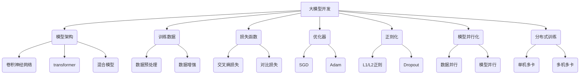

# 从零开始大模型开发与微调：PyTorch 2.0小练习：Hello PyTorch

## 1. 背景介绍

### 1.1 问题的由来

在当今的人工智能时代，深度学习已经成为各个领域的核心技术之一。无论是计算机视觉、自然语言处理还是推荐系统等,深度学习都发挥着关键作用。随着模型规模和数据量的不断增长,训练大型深度学习模型成为了一个巨大的挑战。传统的机器学习框架难以满足大模型训练的需求,因此需要一个高效、灵活且易于扩展的深度学习框架。

PyTorch作为一个流行的开源深度学习框架,凭借其动态计算图、内存高效利用和良好的可扩展性,成为了大模型训练的首选工具之一。PyTorch 2.0版本进一步优化了性能,增强了对大规模分布式训练的支持,为大模型开发提供了更加强大的基础设施。

### 1.2 研究现状

目前,大型语言模型(如GPT-3、PanGu-Alpha等)和大型视觉模型(如DALL-E、Stable Diffusion等)已经在各个领域展现出了惊人的能力。但是,这些模型的训练过程非常耗时且昂贵,需要大量的计算资源和海量的数据。因此,如何高效地训练和微调大型模型成为了一个热门的研究课题。

一方面,研究人员致力于优化模型结构和训练算法,以提高训练效率和模型性能。另一方面,也有很多工作集中在利用迁移学习和少样本学习等技术,以减少对大量标注数据的依赖。此外,分布式训练和模型并行化等技术也被广泛应用,以充分利用现有的硬件资源。

### 1.3 研究意义

大模型的发展不仅推动了人工智能技术的进步,也为各个领域带来了新的机遇和挑战。能够高效地训练和微调大模型,对于提高模型性能、降低训练成本以及扩大应用范围都具有重要意义。

本文旨在为读者提供一个全面的指南,介绍如何使用PyTorch 2.0框架从零开始开发和微调大型深度学习模型。通过实践案例和代码示例,读者可以掌握大模型开发的核心概念、算法原理和实现细节,为未来的研究和应用奠定坚实的基础。

### 1.4 本文结构

本文共分为九个部分:

1. 背景介绍
2. 核心概念与联系
3. 核心算法原理与具体操作步骤
4. 数学模型和公式详细讲解与举例说明
5. 项目实践:代码实例和详细解释说明
6. 实际应用场景
7. 工具和资源推荐
8. 总结:未来发展趋势与挑战
9. 附录:常见问题与解答

## 2. 核心概念与联系

在深入探讨大模型开发的细节之前,我们需要先了解一些核心概念及其相互关系。这些概念将贯穿整个大模型开发过程,对于理解和实现算法原理至关重要。

- **模型架构**:大模型通常采用卷积神经网络(CNN)、Transformer或两者的混合结构。选择合适的架构对于模型性能至关重要。
- **训练数据**:高质量的训练数据是大模型成功的关键。数据预处理和数据增强技术可以提高数据利用率。
- **损失函数**:损失函数定义了模型的优化目标,如交叉熵损失和对比损失等。
- **优化器**:优化器负责根据损失函数调整模型参数,如SGD、Adam等。
- **正则化**:正则化技术如L1/L2正则和Dropout等可以防止过拟合。
- **模型并行化**:通过数据并行和模型并行等技术,可以在多个设备上并行训练大模型。
- **分布式训练**:在单机多卡或多机多卡环境下进行分布式训练,可以充分利用计算资源。

这些概念相互关联、环环相扣,共同构建了大模型开发的整体框架。掌握它们对于高效开发大模型至关重要。

## 3. 核心算法原理与具体操作步骤

### 3.1 算法原理概述

大模型开发过程中涉及多种算法和技术,包括模型架构设计、训练数据处理、损失函数优化、正则化、模型并行化和分布式训练等。这些算法和技术共同确定了模型的性能和训练效率。

1. **模型架构**:卷积神经网络(CNN)和Transformer是大模型中常用的两种架构。CNN擅长捕捉局部特征,而Transformer则擅长捕捉长程依赖关系。混合模型结合了两者的优势,可以同时捕捉局部和全局特征。

2. **训练数据处理**:高质量的训练数据是模型性能的基础。数据预处理和数据增强技术可以提高数据利用率,从而提升模型性能。常见的数据预处理技术包括归一化、标准化和词嵌入等,而数据增强技术包括随机裁剪、翻转、噪声注入等。

3. **损失函数优化**:损失函数定义了模型的优化目标。交叉熵损失常用于分类任务,而对比损失则常用于无监督或自监督学习。优化器根据损失函数调整模型参数,常见的优化器包括SGD、Adam等。

4. **正则化**:正则化技术可以防止过拟合,提高模型的泛化能力。L1/L2正则化通过惩罚模型参数的大小来实现正则化,而Dropout则通过随机丢弃神经元来增加模型的鲁棒性。

5. **模型并行化**:由于大模型参数量巨大,单个设备的内存和计算能力往往不足以训练整个模型。模型并行化技术可以将模型分割到多个设备上进行并行训练,包括数据并行和模型并行两种方式。

6. **分布式训练**:分布式训练可以充分利用多个设备的计算资源,加速大模型的训练过程。单机多卡和多机多卡是两种常见的分布式训练方式,需要解决通信开销和梯度同步等问题。

这些算法和技术相互配合,共同确定了大模型的性能和训练效率。掌握它们的原理和实现细节,对于成功开发大模型至关重要。

### 3.2 算法步骤详解

在实际开发过程中,大模型训练通常遵循以下步骤:

1. **数据准备**:收集和预处理训练数据,包括数据清洗、标注、分割等。对于大规模数据集,可以考虑使用分布式文件系统(如HDFS)进行存储和管理。

2. **模型设计**:根据任务需求选择合适的模型架构,如CNN、Transformer或混合模型。设计模型结构时需要考虑计算复杂度、内存占用和并行化能力等因素。

3. **损失函数选择**:选择合适的损失函数,如交叉熵损失用于分类任务,对比损失用于无监督或自监督学习任务。损失函数定义了模型的优化目标。

4. **优化器选择**:选择合适的优化器,如SGD或Adam等,用于根据损失函数调整模型参数。优化器的选择会影响模型收敛速度和最终性能。

5. **正则化设置**:设置合适的正则化技术,如L1/L2正则或Dropout,以防止过拟合并提高模型泛化能力。

6. **模型初始化**:根据模型架构初始化模型参数,常用的初始化方法包括Xavier初始化和Kaiming初始化等。

7. **模型训练**:进行模型训练,包括数据加载、前向传播、反向传播和参数更新等步骤。根据训练设备的数量,可以选择单机训练或分布式训练。

8. **模型评估**:在验证集上评估模型性能,根据评估指标(如准确率、F1分数等)判断是否需要调整超参数或模型架构。

9. **模型微调**:对预训练模型进行微调,通过在特定任务上继续训练,可以提高模型在该任务上的性能。

10. **模型部署**:将训练好的模型部署到生产环境中,供下游应用调用。可以考虑使用模型压缩技术减小模型大小,提高推理效率。

这些步骤环环相扣,共同构建了大模型开发的完整流程。掌握每个步骤的细节和注意事项,对于成功开发大模型至关重要。

### 3.3 算法优缺点

大模型开发涉及多种算法和技术,每种算法都有其优缺点,需要根据具体场景进行权衡选择。

1. **模型架构**:
   - CNN优点:捕捉局部特征能力强,适用于图像和视频等结构化数据。
   - CNN缺点:难以捕捉长程依赖关系,对序列数据(如文本)处理能力较差。
   - Transformer优点:能够有效捕捉长程依赖关系,在序列数据处理任务上表现出色。
   - Transformer缺点:计算复杂度高,对内存和计算资源要求较高。
   - 混合模型优点:结合CNN和Transformer的优势,能够同时捕捉局部和全局特征。
   - 混合模型缺点:模型结构复杂,训练难度较大。

2. **损失函数**:
   - 交叉熵损失优点:适用于分类任务,计算简单,收敛性能良好。
   - 交叉熵损失缺点:需要大量标注数据,对于无监督或半监督学习任务不适用。
   - 对比损失优点:可用于无监督或自监督学习,减少对标注数据的依赖。
   - 对比损失缺点:训练过程复杂,收敛速度较慢。

3. **优化器**:
   - SGD优点:简单高效,适用于大规模数据集和大模型训练。
   - SGD缺点:收敛速度较慢,需要精心调参。
   - Adam优点:收敛速度快,对超参数设置不太敏感。
   - Adam缺点:后期收敛性能较差,可能会陷入局部最优。

4. **正则化**:
   - L1/L2正则优点:可以有效防止过拟合,提高模型泛化能力。
   - L1/L2正则缺点:过度正则化会导致欠拟合,需要合理设置正则化强度。
   - Dropout优点:增加模型鲁棒性,防止过拟合。
   - Dropout缺点:会引入噪声,影响模型收敛速度。

5. **模型并行化**:
   - 数据并行优点:实现简单,可以充分利用多个设备的计算资源。
   - 数据并行缺点:通信开销较大,对带宽要求较高。
   - 模型并行优点:可以训练超大型模型,突破单设备内存限制。
   - 模型并行缺点:实现复杂,需要精心设计模型分割和梯度同步策略。

6. **分布式训练**:
   - 单机多卡优点:设备通信开销较小,实现相对简单。
   - 单机多卡缺点:受限于单机计算资源,扩展能力有限。
   - 多机多卡优点:可以充分利用集群资源,实现大规模分布式训练。
   - 多机多卡缺点:通信开销较大,需要解决梯度同步和负载均衡等问题。

总的来说,每种算法和技术都有其适用场景和局限性。在实际开