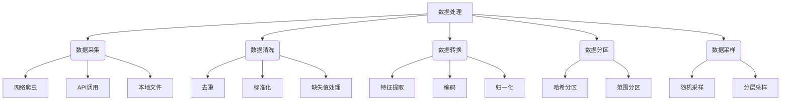

# 大规模语言模型从理论到实践：数据处理

## 1. 背景介绍

### 1.1 问题的由来

随着人工智能技术的不断进步,大规模语言模型在自然语言处理领域取得了令人瞩目的成就。然而,训练这些庞大的模型需要处理海量的文本数据,这对数据处理能力提出了极高的要求。传统的数据处理方法已经无法满足大规模语言模型训练的需求,因此迫切需要新的数据处理理论和实践方法。

### 1.2 研究现状

目前,大多数大规模语言模型采用了分布式数据处理框架(如Apache Spark、Dask等)来并行处理海量文本数据。这些框架提供了高效的数据加载、清洗、预处理和转换功能,大大提高了数据处理的效率。同时,一些研究人员也在探索使用深度学习技术(如Word2Vec、BERT等)来自动提取文本数据的语义特征,从而减少人工特征工程的工作量。

### 1.3 研究意义

高效的数据处理是训练大规模语言模型的关键环节。通过研究先进的数据处理理论和实践方法,我们可以极大地提高模型训练的效率,缩短模型迭代周期,从而加速自然语言处理技术的发展。同时,数据处理技术的进步也将惠及其他领域的大数据应用,产生广泛的影响。

### 1.4 本文结构

本文将从理论和实践两个层面全面探讨大规模语言模型的数据处理问题。理论部分将介绍数据处理的核心概念、算法原理和数学模型;实践部分将详细讲解开发环境搭建、代码实现、性能优化等具体操作步骤,并分享实际应用场景和工具资源推荐。最后,本文将总结研究成果,展望未来发展趋势和面临的挑战。

## 2. 核心概念与联系



大规模语言模型的数据处理主要包括以下几个核心概念:

1. **数据采集**:从各种来源(如网络、API、本地文件等)收集所需的原始文本数据。
2. **数据清洗**:对原始数据进行去重、标准化、缺失值处理等操作,以提高数据质量。
3. **数据转换**:将清洗后的数据转换为模型可以识别的格式,包括特征提取、编码、归一化等步骤。
4. **数据分区**:将大规模数据按照一定策略(如哈希分区、范围分区等)划分为多个分区,以便进行并行处理。
5. **数据采样**:从大规模数据中抽取一个具有代表性的子集,以减少计算开销和存储压力。

这些概念相互关联、环环相扣,共同构成了完整的数据处理流程。高效的数据处理需要在这些环节中采用合理的策略和算法,并根据具体应用场景进行优化和调整。

## 3. 核心算法原理与具体操作步骤

### 3.1 算法原理概述

大规模语言模型的数据处理算法主要包括以下几个方面:

1. **分布式计算框架**:利用多台计算机并行处理海量数据,常用的框架有Apache Spark、Dask、Ray等。
2. **数据流水线**:将数据处理过程拆分为多个阶段,并将中间结果传递给下一阶段,形成流水线式的处理模式。
3. **在线学习算法**:能够持续地从流式数据中学习,不断更新模型参数,适用于大规模动态数据场景。
4. **特征工程算法**:自动从原始数据中提取有用的特征,减少人工工作量,如Word2Vec、BERT等。
5. **数据压缩算法**:通过高效的压缩算法减小数据存储空间,加快数据传输速度,如谷歌的Tensor压缩算法。

这些算法原理为大规模语言模型的数据处理提供了理论基础和技术支撑,并在实践中不断得到优化和完善。

### 3.2 算法步骤详解

以Apache Spark为例,大规模语言模型的数据处理算法步骤如下:

1. **创建SparkContext**:初始化Spark集群,设置运行环境和资源配置。

```python
from pyspark import SparkContext
sc = SparkContext("local", "Word Count")
```

2. **加载数据**:从HDFS、S3等分布式存储系统加载原始文本数据。

```python
text_file = sc.textFile("hdfs://...")
```

3. **数据清洗**:使用Spark的转换操作(如map、filter等)对数据进行去重、标准化等处理。

```python
cleaned_data = text_file.map(clean_text).filter(lambda x: x != '')
```

4. **特征提取**:利用Spark ML库提取文本数据的TF-IDF、Word2Vec等特征。

```python
from pyspark.ml.feature import Word2Vec
word2vec = Word2Vec(inputCol="text", outputCol="features")
model = word2vec.fit(cleaned_data)
features = model.transform(cleaned_data)
```

5. **数据分区**:使用Spark的repartition或repartitionAndSortWithinPartitions操作将数据分区。

```python
partitioned_data = features.repartition(numPartitions)
```

6. **模型训练**:将分区后的数据传入深度学习框架(如PyTorch、TensorFlow等)训练语言模型。

```python
import torch
train_loader = torch.utils.data.DataLoader(partitioned_data, batch_size=32)
model = LanguageModel()
for epoch in range(num_epochs):
    for batch in train_loader:
        ...
```

7. **模型评估**:在测试集上评估模型的性能指标,如准确率、困惑度等。

8. **模型优化**:根据评估结果调整模型超参数、特征工程策略等,重复训练过程。

这些步骤清晰地阐述了大规模语言模型数据处理的具体流程,为实际开发提供了指导和参考。

### 3.3 算法优缺点

大规模语言模型的数据处理算法具有以下优点:

1. **高效并行**:利用分布式计算框架实现数据的并行处理,大幅提高了处理效率。
2. **在线学习**:能够持续地从流式数据中学习,适应动态变化的数据环境。
3. **自动特征工程**:减少了人工特征工程的工作量,提高了特征质量。
4. **高效压缩**:通过压缩算法减小了数据存储和传输开销。

但同时也存在一些缺点和挑战:

1. **资源消耗大**:训练大规模模型需要消耗大量的计算和存储资源。
2. **数据质量影响**:原始数据质量的好坏直接影响最终模型的性能。
3. **超参数调优困难**:模型和算法存在多个超参数,调优过程复杂且耗时。
4. **隐私和安全风险**:处理大量文本数据可能涉及隐私和安全问题。

因此,在实际应用中需要根据具体场景权衡算法的优缺点,并采取相应的优化策略。

### 3.4 算法应用领域

大规模语言模型的数据处理算法在自然语言处理领域有着广泛的应用,包括但不限于:

1. **机器翻译**:通过训练大规模语言模型实现高质量的多语种机器翻译。
2. **对话系统**:构建对话机器人、智能助手等自然语言交互系统。
3. **文本生成**:自动生成新闻、小说、广告文案等各类文本内容。
4. **文本分类**:对海量文本数据进行主题分类、情感分析等。
5. **信息检索**:改进搜索引擎的查询理解和相关性排序能力。
6. **知识图谱**:从大规模文本中自动构建结构化的知识库。

除了自然语言处理领域,大规模数据处理算法在其他领域也有广泛应用,如基因组学、天文学、气象学等,为科学研究提供了有力的计算支持。

## 4. 数学模型和公式详细讲解与举例说明

### 4.1 数学模型构建

在大规模语言模型中,通常采用神经网络作为数学模型的基础架构。其中,Transformer模型是当前最流行和有效的模型之一,它的核心思想是使用自注意力(Self-Attention)机制来捕捉输入序列中元素之间的长程依赖关系。

Transformer模型的数学表示如下:

$$
\begin{aligned}
\operatorname{Attention}(Q, K, V) &=\operatorname{softmax}\left(\frac{Q K^{T}}{\sqrt{d_{k}}}\right) V \\
\operatorname{MultiHead}(Q, K, V) &=\operatorname{Concat}\left(\operatorname{head}_{1}, \ldots, \operatorname{head}_{h}\right) W^{O} \\
\operatorname{head}_{i} &=\operatorname{Attention}\left(Q W_{i}^{Q}, K W_{i}^{K}, V W_{i}^{V}\right)
\end{aligned}
$$

其中:

- $Q$、$K$、$V$分别表示Query、Key和Value矩阵
- $d_k$是缩放因子,用于防止点积的过大导致梯度消失
- $W_i^Q$、$W_i^K$、$W_i^V$、$W^O$是可学习的线性投影参数

通过多头自注意力机制,Transformer能够同时关注输入序列中的不同位置,捕捉全局依赖关系,从而提高了模型的表现力。

### 4.2 公式推导过程

我们以Self-Attention的计算过程为例,推导其数学公式:

1) 首先计算Query和Key之间的相似性得分矩阵:

$$
S=Q K^{T}
$$

其中$S_{ij}$表示Query的第i个元素与Key的第j个元素之间的相似性得分。

2) 对相似性得分矩阵进行缩放处理,防止过大的值导致梯度消失:

$$
S^{\prime}=\frac{S}{\sqrt{d_{k}}}
$$

3) 对缩放后的得分矩阵进行Softmax操作,得到注意力权重矩阵:

$$
A=\operatorname{softmax}\left(S^{\prime}\right)
$$

其中$A_{ij}$表示Query的第i个元素对Key的第j个元素的注意力权重。

4) 将注意力权重矩阵与Value矩阵相乘,得到加权和的结果向量:

$$
\operatorname{Attention}(Q, K, V)=A V
$$

这个结果向量就是Self-Attention的输出,它捕捉了输入序列中元素之间的依赖关系。

通过上述推导,我们可以清晰地看到Self-Attention机制背后的数学原理,为进一步优化和改进该机制提供了理论基础。

### 4.3 案例分析与讲解

现在,我们以一个具体的案例来说明Self-Attention机制的工作原理。假设输入序列为"The cat sat on the mat",我们计算"cat"这个词对"mat"这个词的注意力权重。

1) 首先将输入序列映射为Query、Key和Value矩阵:

$$
\begin{aligned}
Q &=\left[\begin{array}{ccccc}
q_{\text {The }} & q_{\text {cat }} & q_{\text {sat }} & q_{\text {on }} & q_{\text {the }} \\
q_{\text {mat }}
\end{array}\right] \\
K &=\left[\begin{array}{ccccc}
k_{\text {The }} & k_{\text {cat }} & k_{\text {sat }} & k_{\text {on }} & k_{\text {the }} \\
k_{\text {mat }}
\end{array}\right] \\
V &=\left[\begin{array}{ccccc}
v_{\text {The }} & v_{\text {cat }} & v_{\text {sat }} & v_{\text {on }} & v_{\text {the }} \\
v_{\text {mat }}
\end{array}\right]
\end{aligned}
$$

2) 计算Query和Key之间的相似性得分矩