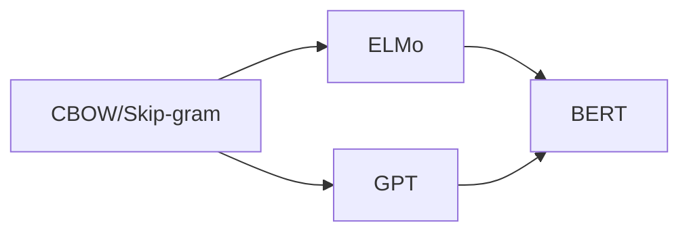

# 大语言模型原理与工程实践：Encoder 的代表：BERT

关键词：BERT, Transformer, 预训练, 迁移学习, 自然语言处理, 语言模型, 编码器, 双向编码, 上下文表示, 掩码语言模型

## 1. 背景介绍

### 1.1 问题的由来
自然语言处理(NLP)是人工智能领域的一个重要分支,旨在让计算机理解、生成和处理人类语言。传统的NLP方法主要依赖于人工特征工程和浅层神经网络,难以捕捉语言中的深层语义信息。近年来,随着深度学习的发展,预训练语言模型逐渐成为NLP领域的研究热点。

### 1.2 研究现状
2018年,Google推出了BERT(Bidirectional Encoder Representations from Transformers)模型,通过在大规模无标注语料上进行预训练,再在下游任务上进行微调,在多个NLP任务上取得了显著的性能提升。BERT的成功引发了学术界和工业界对预训练语言模型的广泛关注和研究。

### 1.3 研究意义 
BERT的出现标志着NLP进入预训练时代。通过在海量语料上学习通用语言表示,BERT能够更好地理解语言的语义,减少对任务特定的标注数据的依赖,大大提高了NLP系统的性能。深入研究BERT的原理和实践,对于推动NLP技术的发展具有重要意义。

### 1.4 本文结构
本文将从以下几个方面对BERT进行详细介绍和分析:
- 第2节介绍BERT的核心概念和与其他模型的联系
- 第3节详细阐述BERT的核心算法原理和具体操作步骤
- 第4节建立BERT的数学模型,并给出公式推导和案例分析
- 第5节提供BERT的代码实例和详细解释说明
- 第6节探讨BERT在实际场景中的应用
- 第7节推荐BERT相关的学习资源和开发工具
- 第8节总结BERT的研究现状,展望未来发展趋势和挑战
- 第9节列出BERT常见问题与解答

## 2. 核心概念与联系

BERT的全称是Bidirectional Encoder Representations from Transformers,即基于Transformer的双向编码器表示。其核心思想是通过在大规模无标注文本语料上预训练一个双向的Transformer编码器,学习到语言的通用表示,然后在特定任务上进行微调。

BERT的特点可以概括为:

1. 基于Transformer架构:BERT采用了Transformer的编码器结构,利用自注意力机制建模词之间的依赖关系。

2. 双向编码:不同于传统的单向语言模型,BERT在训练时同时考虑一个词的左右上下文,从而获得更全面的语义表示。  

3. 预训练+微调:BERT先在大规模无监督语料上进行预训练,学习通用语言知识,再在下游任务的有标注数据上进行微调,实现知识迁移。

4. 掩码语言模型:BERT引入了掩码语言模型(Masked Language Model,MLM)预训练任务,随机掩盖一些词,并让模型根据上下文预测被掩盖的词。

5. 次句预测:BERT同时使用了次句预测(Next Sentence Prediction,NSP)任务,预测两个句子是否前后相邻,学习句间关系。

BERT与之前的一些语言模型如word2vec、ELMo、GPT等有一些共通之处,它们都是基于分布式假设(distributional hypothesis),通过学习词的上下文表示来建模语义。但BERT在以下几个方面有显著的创新:

- 双向建模:ELMo虽然也采用双向LSTM,但正反向是独立编码的,而BERT采用Transformer,双向交互更充分。
- 更深的网络:BERT使用了24层的Transformer编码器,网络结构更深。
- 更大的数据和计算量:BERT在更大规模的语料上训练,参数量也远超之前的模型。
- 统一的框架:BERT提供了一个统一的预训练-微调框架,不同任务共享同一个预训练模型,适应能力更强。

下图展示了BERT与其他几种语言模型的主要区别:

## 3. 核心算法原理 & 具体操作步骤

### 3.1 算法原理概述
BERT的核心是基于Transformer的双向编码器。Transformer本是一种用于机器翻译的Seq2Seq模型,包含编码器和解码器两部分。BERT只使用了编码器部分,并在此基础上进行了改进,引入了掩码语言模型和次句预测两个预训练任务。

### 3.2 算法步骤详解

BERT的训练分为两个阶段:预训练和微调。

#### 3.2.1 预训练阶段

预训练阶段的目标是让模型学习到语言的通用表示。具体步骤如下:

1. 语料准备:收集大量无标注的文本语料,进行预处理(分词、转ID等)。BERT采用了BooksCorpus(800M词)和英文维基百科(2500M词)。

2. 输入表示:将每个输入序列(句子对)表示为token embeddings、segment embeddings和position embeddings的和。其中token embeddings是WordPiece嵌入,segment embeddings用于区分两个句子,position embeddings编码位置信息。

3. 掩码语言模型(MLM):随机掩盖(mask)一定比例(如15%)的词,用 [MASK] 标记替换,让模型根据双向上下文预测这些被掩盖的词。损失函数为被掩盖词的预测交叉熵。

4. 次句预测(NSP):为训练数据生成句子对,50%的句子对是前后相邻的,50%是随机采样的。引入 [CLS] 和 [SEP] 标记作为句子的开始和分隔。让模型预测两个句子是否相邻。损失函数为二元交叉熵。

5. Transformer编码:将输入序列传入多层Transformer编码器,通过自注意力机制建模词之间的关系,得到每个词的上下文表示。

6. 训练目标:联合优化MLM和NSP两个任务的损失函数,通过反向传播更新模型参数。

#### 3.2.2 微调阶段

预训练得到的模型可以应用于下游的各种NLP任务,只需要在任务数据上进行简单的微调。步骤如下:

1. 任务数据准备:根据具体任务收集带标注的数据集,划分为训练集、验证集和测试集。

2. 模型结构调整:根据任务的输入输出格式,在预训练BERT的基础上添加任务特定的输出层。对于句子分类任务,在 [CLS] 位置添加分类器;对于序列标注任务,在每个词的位置添加标注层;对于阅读理解任务,基于词的表示计算答案范围。

3. 微调训练:用任务的训练数据对模型进行微调,通常只需较小的学习率和少量的训练步数。损失函数为任务的目标函数,如分类交叉熵、序列标注损失等。

4. 评估和预测:在验证集上评估微调后模型的性能,选择最优模型在测试集上进行预测。

### 3.3 算法优缺点

BERT的主要优点有:
- 通过预训练获得强大的语言表示能力,可以迁移到各种下游任务
- 双向编码能够综合利用左右上下文信息,获得更准确的语义表示
- Transformer结构能够并行计算,训练效率高
- 引入MLM和NSP任务,有效地进行无监督学习

BERT的主要缺点包括:
- 模型参数量巨大(Base版1.1亿,Large版3.4亿),训练和推理成本高
- inference阶段无法并行,生成速度慢
- 对长文本建模能力有限,受限于Transformer的位置编码和自注意力计算量
- 只学习到浅层的语法语义知识,缺乏常识推理能力

### 3.4 算法应用领域

BERT在NLP的各个任务领域都取得了显著的效果提升,主要应用包括:
- 文本分类:如情感分析、新闻分类等
- 命名实体识别:识别文本中的人名、地名、机构名等
- 关系抽取:从文本中抽取实体之间的关系
- 阅读理解:回答给定问题,定位文章中的答案片段
- 自然语言推理:判断两个句子之间的蕴含关系
- 语义相似度:计算两个文本之间的相似程度
- 机器翻译:将一种语言翻译成另一种语言
- 文本摘要:从长文本中提取关键信息,生成摘要
- 对话系统:基于上下文理解用户意图,生成恰当的回复

## 4. 数学模型和公式 & 详细讲解 & 举例说明

### 4.1 数学模型构建

BERT的数学模型主要包括输入表示、Transformer编码器、MLM和NSP任务等部分。

#### 4.1.1 输入表示

设输入序列为一个句子对 $(S_1, S_2)$,其中 $S_1 = (w_1^1, w_2^1, ..., w_{n_1}^1)$, $S_2 = (w_1^2, w_2^2, ..., w_{n_2}^2)$,将其组合成一个长度为 $n=n_1+n_2+3$ 的序列:

$$\mathbf{X} = (\text{[CLS]}, w_1^1, w_2^1, ..., w_{n_1}^1, \text{[SEP]}, w_1^2, w_2^2, ..., w_{n_2}^2, \text{[SEP]})$$

其中 [CLS] 和 [SEP] 是特殊标记。

对于每个词 $w_i$,其输入表示 $\mathbf{x}_i$ 由三部分组成:

$$\mathbf{x}_i = \mathbf{e}_i^w + \mathbf{e}_i^s + \mathbf{e}_i^p$$

其中 $\mathbf{e}_i^w$ 是 $w_i$ 的WordPiece嵌入, $\mathbf{e}_i^s$ 是句子分隔嵌入(对于第一个句子为0向量,第二个句子为1向量), $\mathbf{e}_i^p$ 是位置嵌入。

#### 4.1.2 Transformer编码器

Transformer编码器由多个相同的层堆叠而成,每一层包含两个子层:多头自注意力(Multi-Head Attention)和前馈神经网络(Feed-Forward Network)。

多头自注意力将输入序列 $\mathbf{X} \in \mathbb{R}^{n \times d}$ 的每个位置 $i$ 的表示 $\mathbf{x}_i$ 映射为一个查询向量 $\mathbf{q}_i$、一个键向量 $\mathbf{k}_i$ 和一个值向量 $\mathbf{v}_i$:

$$\mathbf{q}_i = \mathbf{x}_i \mathbf{W}^Q, \quad
\mathbf{k}_i = \mathbf{x}_i \mathbf{W}^K, \quad
\mathbf{v}_i = \mathbf{x}_i \mathbf{W}^V$$

其中 $\mathbf{W}^Q, \mathbf{W}^K, \mathbf{W}^V \in \mathbb{R}^{d \times d_k}$ 是可学习的参数矩阵。

然后计算位置 $i$ 和 $j$ 之间的注意力权重:

$$\alpha_{ij} = \frac{\exp(\mathbf{q}_i \mathbf{k}_j^\top / \sqrt{d_k})}{\sum_{l=1}^n \exp(\mathbf{q}_i \mathbf{k}_l^\top / \sqrt{d_k})}$$

最后,位置 $i$ 的输出表示为:

$$\mathbf{z}_i = \sum_{j=1}^n \alpha_{ij} \mathbf{v}_j$$

多头自注意力是将上述过程独立执行 $h$ 次,然后拼接结果并线性变换:

$$\text{MultiHead}(\mathbf{X}) = [\mathbf{z}_1^1, ..., \mathbf{z}_1^h] \mathbf{W}^O$$

其中 $\mathbf{z}_i^k$ 是第 $k$ 个头在位置 $i$ 的输出, $\mathbf{W}^O \in \mathbb{R}^{hd_k \times d}$ 是可学习