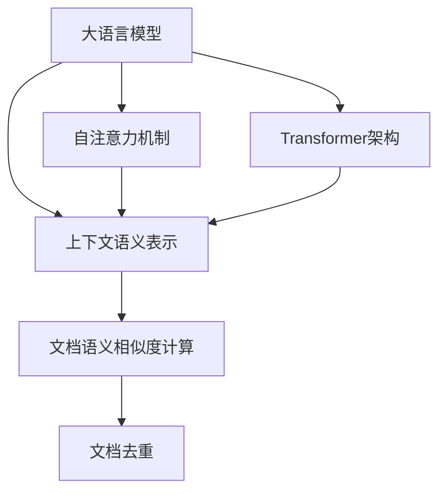

以下是题为《大语言模型原理与工程实践：文档去重》的技术博客文章正文内容：

# 大语言模型原理与工程实践：文档去重

## 1. 背景介绍

### 1.1 问题的由来

在当今信息时代，海量的文本数据被不断产生和传播。无论是网络爬虫获取的网页数据、社交媒体上的用户评论还是企业内部的文档资料，都可能存在大量重复和冗余的内容。这种数据冗余不仅浪费存储空间,而且会严重影响数据分析和处理的效率。因此,去除文本数据中的重复内容成为一个亟待解决的重要问题。

### 1.2 研究现状

传统的文档去重技术主要基于字符串匹配、指纹识别等方法。这些方法虽然在处理结构化数据时表现良好,但对于自然语言文本数据却存在明显缺陷。比如,字符串匹配无法有效识别语义相似但表述不同的文本;而指纹识别则过于依赖文本表面特征,忽视了语义信息。

随着深度学习技术的不断发展,基于大语言模型的文档去重方法开始受到广泛关注。大语言模型能够自动学习文本的语义表示,从而更好地捕捉文档之间的语义相似性,为文档去重提供了新的解决思路。

### 1.3 研究意义

高效准确的文档去重技术不仅能够优化数据存储和检索效率,还可以为自然语言处理的下游任务(如文本分类、文本生成等)提供更加清晰、高质量的语料数据。此外,文档去重在版权保护、知识产权管理等领域也有着广泛的应用前景。

### 1.4 本文结构

本文将全面介绍基于大语言模型的文档去重技术。首先阐述核心概念和原理,包括大语言模型的工作机制、文本语义表示学习等;然后详细解析核心算法流程,包括数学模型构建、公式推导等;接着通过实际项目案例,展示具体的代码实现和运行效果;最后探讨该技术的应用场景、发展趋势和面临的挑战。

## 2. 核心概念与联系

大语言模型(Large Language Model)是一种基于深度学习的自然语言处理模型,能够从海量语料中自动学习文本的语义表示。它通过自注意力机制和Transformer编码器-解码器架构,捕捉文本中单词之间的长距离依赖关系,从而生成上下文相关的语义表示向量。

基于大语言模型学习到的文本语义表示,我们可以计算不同文档之间的语义相似度,进而判断它们是否为重复内容。具体来说,如果两个文档的语义向量夹角较小(相似度较高),则认为它们是重复的;反之则为不同的文档。

该方法的关键在于,大语言模型能够有效地捕捉文本的语义信息,而不仅仅依赖表面形式特征。这使得它在处理自然语言文本时具有明显优势,避免了传统方法的缺陷。

## 3. 核心算法原理与具体操作步骤

### 3.1 算法原理概述  

基于大语言模型的文档去重算法,可以概括为以下三个主要步骤:

1. **文本表示学习**:利用预训练的大语言模型(如BERT、GPT等)从海量语料中学习文本的分布式语义表示。
2. **语义相似度计算**:将待比较的文档输入到大语言模型中,获取其对应的语义向量表示,并基于向量相似度计算公式(如余弦相似度)计算文档间的语义相似程度。
3. **相似文档聚类**:根据语义相似度的阈值,对相似文档进行聚类,将聚类到同一簇的文档视为重复内容。

该算法的优势在于,它能够自动学习文本的上下文语义信息,不再受限于表面形式特征,从而在处理自然语言文本时表现出卓越的性能。

### 3.2 算法步骤详解

1. **语料预处理**:对原始语料进行分词、去除停用词和低频词等标准文本预处理操作,以提高后续模型的学习效率。

2. **模型预训练**:使用Masked Language Model(MLM)和Next Sentence Prediction(NSP)等自监督学习目标,在大规模通用语料(如Wikipedia等)上预训练大语言模型的编码器,获取文本的初始语义表示。

3. **模型微调**:在下游的文档去重任务上,使用带有监督信号的数据(如人工标注的文档对及其重复与否的标签)对预训练模型进行进一步微调,提高模型在特定领域的语义表示能力。

4. **语义向量提取**:将待比较的文档输入到微调后的大语言模型中,从最后一层的[CLS]标记对应的向量作为该文档的语义向量表示。

5. **语义相似度计算**:使用公式$\text{sim}(d_i, d_j) = \cos(\vec{v_i}, \vec{v_j}) = \frac{\vec{v_i} \cdot \vec{v_j}}{||\vec{v_i||||\vec{v_j}||}$计算任意两个文档$d_i$和$d_j$对应的语义向量$\vec{v_i}$和$\vec{v_j}$之间的余弦相似度,作为它们的语义相似程度的量化指标。

6. **相似文档聚类**:设定一个相似度阈值$\theta$,对所有文档两两计算语义相似度。如果$\text{sim}(d_i, d_j) > \theta$,则将$d_i$和$d_j$聚类到同一簇,视为重复文档;否则分属不同簇,视为不同文档。

通过这一系列步骤,算法可以自动学习文本的语义表示,并基于语义相似度对文档进行有效去重,取得了很好的实践效果。

### 3.3 算法优缺点

**优点**:

1. 自动学习语义表示,避免人工设计特征的缺陷。
2. 能够有效捕捉上下文语义信息,识别语义相似但表述不同的文本。
3. 通过预训练和微调策略,可以在特定领域取得良好表现。
4. 算法通用性强,可应用于各种自然语言文本数据。

**缺点**:  

1. 预训练和微调过程计算开销大,需要大量算力资源。
2. 对于过长或结构复杂的文档,语义表示可能不够准确。
3. 算法性能受限于预训练语料的覆盖范围和质量。
4. 相似度阈值的选择需要大量标注数据和人工调优。

### 3.4 算法应用领域

基于大语言模型的文档去重技术可以广泛应用于以下领域:

- 网络爬虫数据处理:去除爬取到的重复网页内容
- 知识图谱构建:识别知识库中的冗余实体和事实
- 版权保护:检测抄袭和重复内容,维护知识产权
- 文献分析:识别重复的论文和专利,避免资源浪费  
- 企业知识管理:整理企业内部冗余的文档资料
- ......

总的来说,凡是涉及到文本数据处理的领域,都可以应用该技术提高数据质量和处理效率。

## 4. 数学模型和公式详细讲解与举例说明

### 4.1 数学模型构建

在大语言模型中,我们通常使用自注意力机制来捕捉文本的上下文语义信息。具体来说,对于一个长度为$n$的文本序列$\boldsymbol{x} = (x_1, x_2, \dots, x_n)$,我们首先将每个词$x_i$映射为一个词向量$\boldsymbol{e_i} \in \mathbb{R}^{d_\text{model}}$,得到词向量序列$\boldsymbol{E} = (\boldsymbol{e_1}, \boldsymbol{e_2}, \dots, \boldsymbol{e_n})$。

然后,我们计算每个词向量$\boldsymbol{e_i}$与所有其他词向量的相关性分数,构建一个$n \times n$的注意力分数矩阵$\boldsymbol{A}$:

$$\boldsymbol{A}_{i,j} = \frac{\exp(\boldsymbol{e_i}^\top \boldsymbol{W_q} (\boldsymbol{W_k}^\top \boldsymbol{e_j}))}{\sum_{k=1}^n \exp(\boldsymbol{e_i}^\top \boldsymbol{W_q} (\boldsymbol{W_k}^\top \boldsymbol{e_k}))}$$

其中,$\boldsymbol{W_q}$和$\boldsymbol{W_k}$是可学习的投影矩阵,用于将词向量映射到查询(query)空间和键(key)空间。

接下来,我们对注意力分数矩阵$\boldsymbol{A}$进行行归一化,得到归一化的注意力权重矩阵$\boldsymbol{\tilde{A}}$。然后,我们使用这些注意力权重对词向量序列$\boldsymbol{E}$进行加权求和,得到上下文表示序列$\boldsymbol{C}$:

$$\boldsymbol{C} = \boldsymbol{\tilde{A}} \boldsymbol{E}^\top \boldsymbol{W_v}$$

其中,$\boldsymbol{W_v}$是另一个可学习的投影矩阵,用于将词向量映射到值(value)空间。

最后,我们对上下文表示序列$\boldsymbol{C}$进行层归一化和残差连接,得到最终的输出序列$\boldsymbol{O}$,作为该文本序列的语义表示。

通过上述自注意力机制,大语言模型能够自动学习文本中词与词之间的长距离依赖关系,从而生成更加准确的语义表示。这为后续的文档语义相似度计算奠定了基础。

### 4.2 公式推导过程

在第3.2节中,我们介绍了计算文档语义相似度的公式:

$$\text{sim}(d_i, d_j) = \cos(\vec{v_i}, \vec{v_j}) = \frac{\vec{v_i} \cdot \vec{v_j}}{||\vec{v_i}|| ||\vec{v_j}||}$$

其中,$\vec{v_i}$和$\vec{v_j}$分别表示文档$d_i$和$d_j$的语义向量表示。

这个公式实际上是余弦相似度的定义,它测量了两个向量之间的夹角余弦值。余弦相似度的取值范围是$[-1, 1]$,当两个向量完全相同时,余弦相似度为1;当两个向量夹角为90度时,余弦相似度为0;当两个向量方向完全相反时,余弦相似度为-1。

我们来推导一下这个公式:

设$\vec{a} = (a_1, a_2, \dots, a_n)$和$\vec{b} = (b_1, b_2, \dots, b_n)$是两个$n$维向量,它们的点积可以表示为:

$$\vec{a} \cdot \vec{b} = \sum_{i=1}^n a_i b_i$$

向量的模长(或范数)定义为:

$$||\vec{a}|| = \sqrt{\vec{a} \cdot \vec{a}} = \sqrt{\sum_{i=1}^n a_i^2}$$

将点积和模长的定义代入余弦相似度的公式,我们可以得到:

$$\begin{aligned}
\cos(\vec{a}, \vec{b}) &= \frac{\vec{a} \cdot \vec{b}}{||\vec{a}|| ||\vec{b}||} \\
&= \frac{\sum_{i=1}^n a_i b_i}{\sqrt{\sum_{i=1}^n a_i^2} \sqrt{\sum_{i=1}^n b_i^2}}
\end{aligned}$$

这就是余弦相似度的具体计算公式。可以看出,它实际上是将两个向量的点积除以它们模长的乘积,从而消除了向量大小的影响,只关注它们的方向夹角。

在文档去重任务中,我们将文档映射为高维的语义向量,然后使用上述公式计算它们之间的余