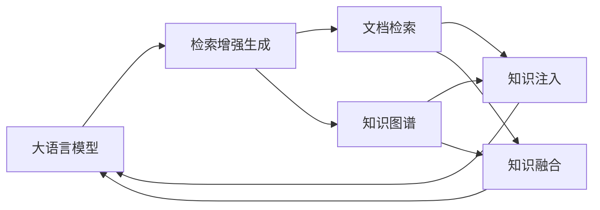

# 大语言模型原理与工程实践：检索增强生成技术

关键词：大语言模型、检索增强、生成技术、Transformer、BERT、GPT、知识蒸馏、预训练微调、提示学习

## 1. 背景介绍
### 1.1 问题的由来
近年来，随着深度学习技术的飞速发展，自然语言处理(NLP)领域取得了突破性的进展。其中，大语言模型(Large Language Model, LLM)的出现，更是将NLP推向了一个新的高度。LLM通过在海量文本数据上进行预训练，学习到丰富的语言知识和常识，可以完成多种NLP任务，展现出惊人的语言理解和生成能力。

然而，LLM虽然强大，但仍存在一些局限性。首先，LLM生成的文本虽然流畅，但有时会出现逻辑不一致、事实性错误等问题，泛化能力有待提升。其次，LLM需要庞大的参数量和计算资源，给实际应用带来挑战。此外，如何有效引入外部知识来增强LLM的表现，也是一个值得探索的问题。

### 1.2 研究现状
为了进一步提升LLM的性能，学术界和工业界提出了一系列改进方法。其中，检索增强生成(Retrieval-Enhanced Generation, REG)技术受到广泛关注。REG的核心思想是在生成过程中引入外部知识，通过检索相关信息来辅助和优化LLM的输出。

目前REG主要有两类实现方式：基于文档检索和基于知识图谱。前者通过检索与输入相关的文档片段，将其编码后作为LLM的附加输入，帮助生成更加准确和信息丰富的文本。代表工作有RAG、REALM等。后者则利用知识图谱作为外部知识库，通过知识注入或知识融合的方式，将结构化知识引入LLM，提升语义理解和逻辑推理能力。代表工作有ERNIE、KG-BART等。

### 1.3 研究意义
研究检索增强的大语言模型生成技术，具有重要的理论和实践意义：

1. 突破LLM的局限性，提升语言生成的准确性、逻辑性和信息丰富度，拓展LLM的应用场景。
2. 探索知识与语言的融合机制，推动知识驱动的NLP技术发展。
3. 降低LLM的参数量和计算开销，促进其实用化和工程化。
4. 为构建更加智能、可解释、可控的NLP系统提供新的思路和方法。

### 1.4 本文结构
本文将全面探讨大语言模型中的检索增强生成技术。第2部分介绍相关的核心概念；第3部分阐述REG的核心算法原理和具体步骤；第4部分给出REG的数学模型和公式推导；第5部分展示REG的代码实现和案例分析；第6部分讨论REG的实际应用场景；第7部分推荐REG相关的学习资源；第8部分总结全文并展望未来。

## 2. 核心概念与联系

在探讨检索增强生成技术之前，我们首先需要了解几个核心概念：

- 大语言模型(LLM)：以Transformer为基础，在大规模文本数据上预训练得到的语言模型，具有强大的语言理解和生成能力，代表模型有BERT、GPT系列等。
- 检索增强生成(REG)：一种融合检索和生成的范式，通过引入外部知识来增强LLM的生成效果，可分为基于文档检索和基于知识图谱两类。  
- 文档检索：从大规模文档库中检索与输入相关的文档片段，将其编码为向量后传入LLM，指导生成过程。
- 知识图谱：以实体和关系为基本元素的结构化知识库，通过知识表示学习将其嵌入到连续向量空间，与LLM结合产生知识增强的效果。
- 知识注入：在LLM的输入中直接拼接外部知识，让模型学习输入文本和知识的对齐关系，代表工作如ERNIE。
- 知识融合：通过额外的注意力机制将外部知识融入LLM的编码表示中，动态调节知识的影响，代表工作如KG-BART。

这些概念之间紧密相关，构成了检索增强生成技术的基础。LLM是REG的核心组件，负责语言理解和生成；检索则是REG的关键步骤，为LLM提供外部信息；文档和知识图谱是REG的两类知识来源；知识注入和融合则是REG的两种主要实现机制。下图展示了这些概念之间的联系：

## 3. 核心算法原理 & 具体操作步骤
### 3.1 算法原理概述
检索增强生成的核心思想是将外部知识引入LLM的生成过程，从而提升语言理解和生成的效果。具体来说，REG通常包含三个主要步骤：

1. 知识检索：根据输入文本，从外部知识库(如文档库、知识图谱)中检索相关的知识片段。
2. 知识表示：将检索到的知识编码为连续向量表示，常用方法有TF-IDF、Transformer等。
3. 知识融合：将知识表示与输入文本表示融合，传入LLM进行生成，常见机制有拼接、注意力等。

通过上述步骤，REG可以为LLM提供丰富的背景知识，扩展其"知识视野"，产生更加准确、信息丰富的生成结果。同时，外部知识的引入也有助于缓解LLM的"幻觉"问题，提升生成内容的可靠性。

### 3.2 算法步骤详解

以下是REG的具体算法步骤：

输入：原始文本 $x$，外部知识库 $\mathcal{K}$，检索模块 $R$，知识表示模块 $E$，语言模型 $M$，知识融合机制 $F$。

1. 对原始文本 $x$ 进行预处理(如分词、小写化等)，得到处理后的文本 $\hat{x}$。
2. 利用检索模块 $R$ 从知识库 $\mathcal{K}$ 中检索与 $\hat{x}$ 相关的Top-K个知识片段 $\{k_1,\cdots,k_K\}$：

$$\{k_1,\cdots,k_K\}=R(\hat{x},\mathcal{K})$$

3. 利用知识表示模块 $E$ 对知识片段进行编码，得到知识向量表示 $\{\mathbf{k}_1,\cdots,\mathbf{k}_K\}$：

$$\mathbf{k}_i=E(k_i), i=1,\cdots,K$$

4. 利用知识融合机制 $F$ 将知识向量表示 $\{\mathbf{k}_1,\cdots,\mathbf{k}_K\}$ 与文本 $\hat{x}$ 的表示 $\mathbf{x}$ 进行融合，得到知识增强的文本表示 $\mathbf{h}$：

$$\mathbf{h}=F(\mathbf{x},\{\mathbf{k}_1,\cdots,\mathbf{k}_K\})$$

其中，$F$ 可以是拼接、注意力等机制。

5. 将知识增强的文本表示 $\mathbf{h}$ 传入语言模型 $M$，生成最终的输出文本 $y$：

$$y=M(\mathbf{h})$$

输出：知识增强的生成文本 $y$。

### 3.3 算法优缺点

REG算法的主要优点包括：

1. 引入外部知识，提升LLM的语言理解和生成质量，扩展其应用范围。
2. 缓解LLM的"幻觉"问题，提高生成内容的事实准确性和逻辑一致性。
3. 通过可解释的知识融合机制，增强LLM的可解释性和可控性。
4. 降低LLM的参数量和计算开销，使其更易于实际部署和应用。

同时，REG也存在一些局限性：

1. 依赖高质量的外部知识库，知识覆盖不足或噪声会影响生成效果。
2. 知识检索和融合的计算开销较大，实时性有待提高。
3. 知识表示学习是一个难点，需要精心设计编码器和目标函数。
4. 不同知识融合机制的效果差异较大，泛化能力有待进一步验证。

### 3.4 算法应用领域

REG算法可应用于多个NLP任务，包括但不限于：

1. 开放域对话：利用百科知识等提升对话系统的信息量和准确性。
2. 问答系统：通过知识库问答增强LLM在特定领域的问答能力。
3. 文本生成：结合领域知识生成更专业、可靠的文本内容。
4. 机器翻译：引入双语平行语料等知识，提高翻译的忠实度和流畅度。
5. 文本摘要：利用背景知识优化摘要的信息量和连贯性。

总的来说，REG是一种通用的语言理解和生成增强范式，可用于大多数NLP任务，有望成为未来NLP技术的重要发展方向之一。

## 4. 数学模型和公式 & 详细讲解 & 举例说明
### 4.1 数学模型构建
为了形式化地描述检索增强生成过程，我们可以建立如下数学模型。

记输入文本为 $x$，外部知识库为 $\mathcal{K}$，检索得到的知识片段为 $\{k_1,\cdots,k_K\}$。REG的目标是学习一个生成模型 $p(y|x,\mathcal{K})$，最大化如下条件概率：

$$p(y|x,\mathcal{K})=\prod_{t=1}^T p(y_t|y_{<t},x,\{k_1,\cdots,k_K\})$$

其中，$y=\{y_1,\cdots,y_T\}$ 为生成的目标文本，$y_{<t}$ 表示 $y$ 的前 $t-1$ 个token。$p(y_t|y_{<t},x,\{k_1,\cdots,k_K\})$ 表示在给定输入文本 $x$、知识 $\{k_1,\cdots,k_K\}$ 和已生成序列 $y_{<t}$ 的条件下，生成下一个token $y_t$ 的概率。

通常，我们用神经网络来参数化这个条件概率分布。设计知识表示函数 $f_{\theta}$ 和语言模型 $g_{\phi}$，分别对知识和文本进行编码，则有：

$$p(y_t|y_{<t},x,\{k_1,\cdots,k_K\})=g_{\phi}(y_{<t},f_{\theta}(x),f_{\theta}(k_1),\cdots,f_{\theta}(k_K))$$

其中，$\theta$ 和 $\phi$ 分别为知识表示器和语言模型的参数，可通过极大似然估计等方法从数据中学习得到。

### 4.2 公式推导过程

以下我们推导REG的学习目标函数。

记训练数据集为 $\mathcal{D}=\{(x^{(i)},y^{(i)},\mathcal{K}^{(i)})\}_{i=1}^N$，其中 $x^{(i)}$ 为第 $i$ 个样本的输入文本，$y^{(i)}$ 为对应的目标文本，$\mathcal{K}^{(i)}$ 为检索得到的外部知识。REG的目标是最小化如下负对数似然损失：

$$\mathcal{L}(\theta,\phi)=-\sum_{i=1}^N \log p(y^{(i)}|x^{(i)},\mathcal{K}^{(i)})$$

将条件概率分布展开，可得：

$$\begin{aligned}
\mathcal{L}(\theta,\phi)&=-\sum_{i=1}^N \log \prod_{t=1}^{T^{(i)}} p(y_t^{(i)}|y_{<t}^{(i)},x^{(i)},\{k_1^{(i)},\cdots,k_K^{(i)}\}) \\
&=-\sum_{i=1}^N \sum_{t=1}^{T^{(i)}} \log