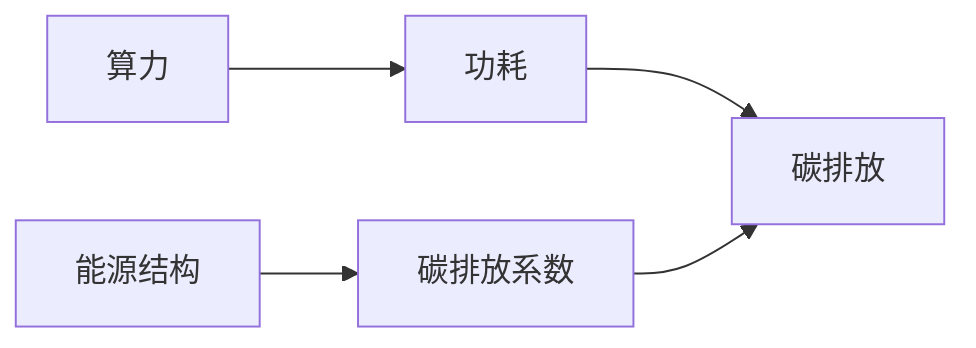

# 大语言模型原理基础与前沿 估算训练模型的排放量

作者：禅与计算机程序设计艺术 / Zen and the Art of Computer Programming

关键词：大语言模型、碳排放、机器学习、可持续发展、深度学习

## 1. 背景介绍

### 1.1 问题的由来

随着人工智能技术的飞速发展,大语言模型(Large Language Models, LLMs)已成为自然语言处理(Natural Language Processing, NLP)领域的研究热点。LLMs 通过在海量文本数据上进行预训练,可以学习到丰富的语言知识,在机器翻译、问答系统、文本生成等任务上取得了显著的性能提升。然而,训练这些大型模型需要消耗大量的计算资源和电力,由此产生的碳排放问题日益引起人们的关注。

### 1.2 研究现状

目前,业界已经开始重视大语言模型训练过程中的能耗和碳排放问题。一些研究者提出了各种方法来估算模型训练的碳足迹,如 Strubell 等人[1]提出了一种基于硬件功耗和训练时间的碳排放估算方法。Lacoste 等人[2]开发了一个名为 ML CO2 Impact 的工具,用于评估机器学习项目的碳排放量。这些研究为量化和优化模型训练的碳排放提供了重要参考。

### 1.3 研究意义

估算大语言模型训练过程的碳排放量具有重要意义:

1. 提高对 AI 系统环境影响的认识,推动 AI 技术的可持续发展。 
2. 为优化模型训练过程、减少能耗提供依据,促进绿色计算的实践。
3. 加强 AI 从业者的社会责任感,在追求性能的同时兼顾生态效益。

### 1.4 本文结构

本文将重点介绍估算大语言模型训练碳排放的相关概念、核心算法、数学模型以及代码实践。内容安排如下:

- 第2部分:介绍碳排放估算涉及的核心概念及其联系。 
- 第3部分:详细阐述碳排放估算的算法原理和具体步骤。
- 第4部分:建立碳排放估算的数学模型,并给出公式推导过程。
- 第5部分:提供碳排放估算的代码实例,并进行解释说明。
- 第6部分:讨论碳排放估算在实际场景中的应用。
- 第7部分:推荐相关的学习资源和开发工具。
- 第8部分:总结全文,展望未来发展趋势和挑战。
- 第9部分:附录,解答常见问题。

## 2. 核心概念与联系

在估算大语言模型训练碳排放时,需要了解以下几个核心概念:

- 碳排放(Carbon Emissions):是指在特定时间内向大气中释放的二氧化碳当量(CO2e)总量。二氧化碳当量是描述温室气体排放量的通用单位,可以反映不同温室气体的全球变暖潜能。

- 功耗(Power Consumption):是指设备或系统在单位时间内消耗的电能。功耗是计算碳排放的重要参数之一。

- 算力(Computing Power):是指计算设备每秒可以执行的浮点运算次数(FLOPS)。算力越高,完成计算任务所需的时间越短,功耗也可能越高。

- 能源结构(Energy Mix):是指一个地区或国家的发电能源组成。不同能源(如煤炭、天然气、核能、水电、风电等)的碳排放强度不同,因此能源结构会影响碳排放系数。

- 碳排放系数(Carbon Emission Factor):是指单位能耗所产生的二氧化碳当量。它与能源结构密切相关,可以通过查阅权威机构发布的数据获取。

这些概念之间的联系可以用下面的 Mermaid 流程图表示:



从图中可以看出,算力影响功耗,功耗和碳排放系数共同决定了碳排放量。能源结构则通过影响碳排放系数,间接影响碳排放量。理解这些概念之间的联系,有助于更好地估算和优化大语言模型训练的碳足迹。

## 3. 核心算法原理 & 具体操作步骤

### 3.1 算法原理概述

估算大语言模型训练碳排放的核心算法,是基于硬件功耗和训练时间的碳排放估算方法[1]。该方法的基本思路是:首先测量模型训练过程中硬件设备的功耗,然后结合训练时间和碳排放系数,计算出碳排放总量。这种方法简单直观,易于实现,且能够提供较为准确的估算结果。

### 3.2 算法步骤详解

具体来说,碳排放估算算法可以分为以下几个步骤:

1. 硬件功耗测量:使用功率计或其他工具,测量模型训练过程中硬件设备(如 GPU、CPU、内存等)的实时功耗。

2. 训练时间记录:记录模型训练的起始时间和结束时间,计算总训练时长。

3. 碳排放系数获取:根据训练地点的能源结构,从权威机构发布的数据中获取相应的碳排放系数。

4. 碳排放计算:将硬件功耗、训练时间和碳排放系数代入公式,计算碳排放总量。

5. 结果分析:对计算结果进行分析,识别碳排放的主要来源,提出优化建议。

### 3.3 算法优缺点

该算法的优点包括:

- 简单易懂,计算过程透明。
- 所需数据易于获取,硬件功耗可以直接测量,训练时间可以记录,碳排放系数可以查询。
- 估算结果较为准确,能够反映不同硬件和训练时长下的碳排放差异。

算法的缺点包括:

- 未考虑硬件生产和处理过程中的碳排放。
- 碳排放系数可能无法完全反映实际能源结构的动态变化。
- 对于分布式训练,需要对多个节点的碳排放进行汇总,增加了计算复杂度。

### 3.4 算法应用领域

碳排放估算算法不仅可以用于评估大语言模型训练的环境影响,还可以应用于以下领域:

- 其他类型的机器学习模型,如计算机视觉、语音识别等。
- 数据中心的能耗管理和优化。
- 企业和组织的碳足迹核算和报告。
- 可持续发展目标的设定和追踪。

## 4. 数学模型和公式 & 详细讲解 & 举例说明

### 4.1 数学模型构建

为了量化估算大语言模型训练的碳排放,我们可以建立如下数学模型:

设硬件设备的功耗为 $P(t)$ (单位:瓦特),训练时间为 $T$ (单位:秒),碳排放系数为 $\alpha$ (单位:千克 CO2e/千瓦时),则碳排放总量 $E$ (单位:千克 CO2e)可以表示为:

$$
E = \frac{\alpha}{3600} \int_0^T P(t) dt
$$

其中,3600 是将瓦特秒转换为千瓦时的系数。

### 4.2 公式推导过程

上述公式可以通过以下步骤推导得出:

1. 功耗 $P(t)$ 表示单位时间内消耗的电能,其数学定义为:

   $P(t) = \frac{dW(t)}{dt}$

   其中,$W(t)$ 表示在时间 $t$ 内消耗的总电能(单位:焦耳)。

2. 根据定义,总电能消耗 $W$ 可以通过对功耗进行时间积分得到:

   $W = \int_0^T P(t) dt$

3. 将总电能消耗转换为千瓦时:

   $W(kWh) = \frac{1}{3600} \int_0^T P(t) dt$

4. 根据碳排放系数的定义,碳排放总量等于总电能消耗与碳排放系数的乘积:

   $E = \alpha \cdot W(kWh) = \frac{\alpha}{3600} \int_0^T P(t) dt$

至此,我们得到了估算碳排放总量的完整公式。

### 4.3 案例分析与讲解

下面我们通过一个具体的案例来说明如何使用上述公式估算碳排放。

假设我们使用一台功率为 300W 的 GPU 训练大语言模型,训练时间为 10 天(即 864000 秒)。训练地点的碳排放系数为 0.5 kg CO2e/kWh。

代入公式,我们可以计算出:

$E = \frac{0.5}{3600} \int_0^{864000} 300 dt = 0.5 \times 300 \times 864000 / 3600 = 36000 kg CO2e$

也就是说,在这个案例中,训练大语言模型产生的碳排放总量为 36000 kg CO2e,相当于一辆汽车行驶 14.4 万公里的碳排放量[3]。

### 4.4 常见问题解答

Q1:如果硬件功耗不是恒定值,而是随时间变化的,如何处理?

A1:可以将训练过程划分为多个时间段,在每个时间段内测量平均功耗,然后对各时间段的碳排放量进行累加。这相当于对功耗函数进行分段积分。

Q2:对于多个硬件设备协同工作的情况,如何估算碳排放?

A2:可以分别估算各个硬件设备的碳排放量,然后将它们相加得到总碳排放量。需要注意的是,如果多个设备共享电源,要避免重复计算。

Q3:不同地区的碳排放系数有差异,如何选择合适的系数?

A3:应该根据模型训练实际进行的地点,选择当地最新的官方碳排放系数数据。如果无法获得精确的本地数据,也可以使用全国平均值作为近似。

## 5. 项目实践：代码实例和详细解释说明

### 5.1 开发环境搭建

首先,我们需要搭建一个简单的 Python 开发环境,并安装所需的库。这里我们使用 Anaconda 作为 Python 发行版,并创建一个名为 `carbon_emi` 的虚拟环境:

```bash
conda create -n carbon_emi python=3.9
conda activate carbon_emi
pip install numpy pandas
```

### 5.2 源代码详细实现

下面是一个使用 Python 实现碳排放估算的简单示例代码:

```python
import numpy as np
import pandas as pd

def estimate_carbon_emissions(power_data, train_time, carbon_factor):
    """
    估算碳排放总量
    
    参数:
    power_data (list): 硬件功耗数据,单位为瓦特(W)
    train_time (float): 训练时间,单位为秒(s)
    carbon_factor (float): 碳排放系数,单位为千克二氧化碳当量每千瓦时(kg CO2e/kWh)
    
    返回:
    float: 碳排放总量,单位为千克二氧化碳当量(kg CO2e)
    """
    power_data = np.array(power_data)
    energy_consumption = power_data.mean() * train_time / 3600  # 计算总电能消耗,单位为千瓦时
    carbon_emissions = energy_consumption * carbon_factor  # 计算碳排放总量
    return carbon_emissions

# 示例用法
power_data = [300, 320, 280, 310, 290]  # GPU 功耗数据,单位为瓦特
train_time = 864000  # 训练时间,单位为秒
carbon_factor = 0.5  # 碳排放系数,单位为千克二氧化碳当量每千瓦时

carbon_emissions = estimate_carbon_emissions(power_data, train_time, carbon_factor)
print(f"Carbon Emissions: {carbon_emissions:.2f} kg CO2e")
```

### 5.3 代码解读与分析

1. 首先,我们定义了一个名为 `estimate_carbon_emissions` 的函数,用于估算碳排放总量。该函数接受三个参数:硬件功耗数据 `power_data`、训练时间 `train_time` 和碳排放系数 `carbon_factor`。

2. 在函数