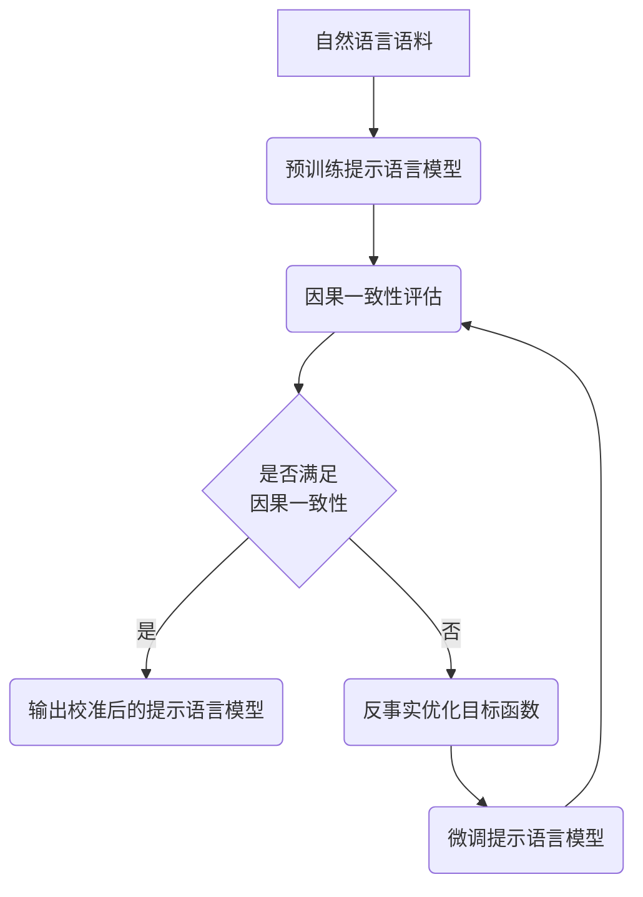

以下是根据您的要求撰写的技术博客文章:

# 大语言模型原理基础与前沿 提示语言模型的校准

作者：禅与计算机程序设计艺术 / Zen and the Art of Computer Programming

## 1. 背景介绍

### 1.1 问题的由来

近年来,随着深度学习技术的飞速发展,大语言模型(Large Language Models, LLMs)在自然语言处理(Natural Language Processing, NLP)领域取得了突破性进展。LLMs 通过在海量文本语料上进行无监督预训练,可以学习到丰富的语言知识和常识,在机器翻译、问答系统、文本生成等任务上表现出色。

然而,LLMs 在实际应用中仍然存在一些问题和挑战。其中一个关键问题是,LLMs 生成的文本虽然流畅自然,但有时会出现事实错误、逻辑矛盾、偏离主题等问题,影响了模型的可靠性和实用性。因此,如何提高 LLMs 生成文本的质量和一致性,成为了亟待解决的重要课题。

### 1.2 研究现状

针对上述问题,学术界提出了一系列改进 LLMs 的方法。其中,提示学习(Prompt Learning)是一种简单有效的范式,通过设计合适的提示模板(prompts),引导模型生成符合期望的输出。然而,设计高质量的提示需要领域专家的参与,且不同任务需要定制不同的提示,泛化能力有限。

最近,一些研究工作开始探索提示语言模型(Prompt Language Models)的思路,即通过语言建模的方式来自动学习和优化提示。代表性工作包括:

- AutoPrompt[^1]: 利用梯度下降自动搜索离散提示的方法。 
- Prefix-Tuning[^2]: 通过可学习的连续向量作为提示前缀,在下游任务上进行微调。
- P-Tuning[^3]: 将自然语言提示嵌入到连续向量空间中进行优化。

这些方法在一定程度上实现了提示的自动化学习,但生成的提示可解释性较差,且缺乏对模型输出的直接约束。本文将在此基础上,提出一种新的提示语言模型校准方法,同时兼顾提示的可解释性和输出的可控性。

### 1.3 研究意义

提示语言模型的校准对于提高 LLMs 的可靠性和实用性具有重要意义:

1. 从应用角度看,校准后的提示语言模型可以更好地引导 LLMs 生成高质量、无偏差的文本,提升下游任务的效果,拓展 LLMs 的应用场景。

2. 从理论角度看,探索提示语言模型的校准有助于加深我们对 LLMs 工作机制的理解,为后续研究指明方向。同时,将提示学习与因果推理相结合,有望突破当前 NLP 模型的局限性。

### 1.4 本文结构

本文将围绕提示语言模型的校准展开讨论,主要内容安排如下:

- 第 2 节介绍相关的核心概念与联系
- 第 3 节阐述提示语言模型校准的核心算法原理与具体操作步骤
- 第 4 节给出算法涉及的数学模型与公式,并通过案例进行详细讲解
- 第 5 节展示项目实践,包括代码实例与详细解释说明  
- 第 6 节分析算法的实际应用场景,并对未来应用前景进行展望
- 第 7 节推荐相关的学习资源、开发工具与文献资料
- 第 8 节总结全文,讨论未来发展趋势与面临的挑战
- 第 9 节附录,解答一些常见问题

## 2. 核心概念与联系

在探讨提示语言模型校准算法之前,我们首先需要厘清几个核心概念:

- 大语言模型(Large Language Models, LLMs): 在海量无标注文本语料上预训练得到的语言模型,通过自监督学习掌握了丰富的语言知识,具有强大的零样本和少样本学习能力,代表模型包括 GPT-3、PaLM 等。

- 提示学习(Prompt Learning): 一种利用自然语言指令引导语言模型执行特定任务的范式。通过设计恰当的提示模板,可以使预训练语言模型适应不同的下游任务,而无需修改模型参数。

- 提示语言模型(Prompt Language Models): 利用语言建模的方式来自动优化提示的一类方法。通过端到端学习提示的语言模型,可以生成适配不同任务的提示,避免了手工设计的繁琐。

- 因果推理(Causal Reasoning): 研究变量之间的因果关系,即某个变量的变化如何影响另一个变量。在本文语境下,我们考虑提示文本作为处理(treatment),语言模型输出作为结果(outcome),通过因果推理来分析和约束两者之间的关系。

下图展示了上述核心概念之间的联系:

提示学习是利用大语言模型的一种范式,而提示语言模型进一步优化了提示的生成过程。通过引入因果推理,我们可以从因果的角度分析提示和输出之间的关系,并对语言模型的生成过程进行约束和校准。

## 3. 核心算法原理 & 具体操作步骤

### 3.1 算法原理概述

本文提出的提示语言模型校准算法,核心思想是通过因果推理建立提示文本和模型输出之间的因果关系,并利用反事实思维(counterfactual reasoning)对语言模型的生成过程进行约束。

具体而言,我们将提示文本视为处理(treatment),语言模型输出视为结果(outcome)。理想情况下,模型输出应该与提示文本具有一致的因果关系,即不同的提示应该导致不同的输出。然而,由于语言模型的生成过程容易受到训练数据偏差等因素的影响,导致输出与提示的因果关系不一致。

为了缓解这一问题,我们引入反事实思维,考虑"如果提示发生变化,模型输出会有什么变化"。通过优化提示语言模型,我们希望学习到一个因果一致的提示生成器,使得改变提示的某些关键词,就可以得到符合预期的输出变化。同时,为了提高提示的可解释性,我们将提示表示为离散的自然语言片段,并对每个片段赋予明确的语义角色。

### 3.2 算法步骤详解

算法的整体流程如下图所示:

下面我们对每个步骤进行详细说明:

1. 预训练提示语言模型:
   
   在大规模自然语言语料上,我们预训练一个提示语言模型,用于生成适配不同任务的提示。提示文本被表示为离散的自然语言片段序列 $\mathbf{p}=(p_1,\ldots,p_K)$,每个片段 $p_i$ 对应一个语义角色(如任务描述、输入示例、输出格式等)。给定任务 $\mathcal{T}$,提示语言模型的目标是生成一个与任务相关的提示 $\mathbf{p}$:

   $$P(\mathbf{p}|\mathcal{T})=\prod_{i=1}^K P(p_i|\mathcal{T},p_{<i})$$

   其中 $p_{<i}$ 表示 $p_i$ 之前的所有片段。预训练阶段我们采用标准的语言建模损失函数,即最大化提示序列的对数似然:

   $$\mathcal{L}_{\text{prompt}}=-\sum_{\mathcal{T}}\log P(\mathbf{p}|\mathcal{T})$$

2. 因果一致性评估:

   为了评估提示语言模型生成的提示是否与输出具有一致的因果关系,我们设计了一个因果一致性评估模块。具体而言,对于每个任务 $\mathcal{T}$,我们生成一组提示 $\{\mathbf{p}^{(1)},\ldots,\mathbf{p}^{(M)}\}$,然后将每个提示输入到预训练的语言模型中,得到对应的输出 $\{\mathbf{y}^{(1)},\ldots,\mathbf{y}^{(M)}\}$。
   
   接下来,我们考虑反事实:如果我们改变提示中的某个关键片段 $p_i$,输出会发生什么变化?直觉上,修改任务相关的关键片段(如任务描述),输出应该会发生明显变化;而修改无关片段(如输出格式),输出应该保持不变。

   形式化地,我们定义因果一致性得分为:

   $$\text{CausalConsistency}=\frac{1}{M}\sum_{m=1}^M\frac{1}{K}\sum_{i=1}^K\mathbb{1}[\text{CosineSimilarity}(\mathbf{y}^{(m)},\tilde{\mathbf{y}}_i^{(m)})<\tau]$$

   其中 $\tilde{\mathbf{y}}_i^{(m)}$ 表示将第 $m$ 个提示的第 $i$ 个片段替换为随机噪声后,重新生成的输出。$\tau$ 是一个预设的阈值,用于判断输出是否发生显著变化。直觉上,因果一致性得分衡量了提示的关键片段与输出的相关性。

3. 反事实优化:

   如果提示语言模型生成的提示未能通过因果一致性评估,我们则对其进行反事实优化。优化的目标是最小化以下损失函数:

   $$\mathcal{L}_{\text{counterfactual}}=\sum_{\mathcal{T}}\sum_{i=1}^K\max(0,\text{CosineSimilarity}(\mathbf{y},\tilde{\mathbf{y}}_i)-\tau)$$

   其中 $\mathbf{y}$ 是原始提示生成的输出,$\tilde{\mathbf{y}}_i$ 是修改第 $i$ 个片段后的输出。该损失函数鼓励修改关键片段后,输出会发生显著变化。

   在优化过程中,我们固定预训练的语言模型参数,只微调提示语言模型的参数。梯度下降过程为:

   $$\theta\leftarrow\theta-\eta\nabla_{\theta}\mathcal{L}_{\text{counterfactual}}$$

   其中 $\theta$ 是提示语言模型的参数,$\eta$ 是学习率。

4. 输出校准后的模型:

   重复步骤 2-3,直到提示语言模型生成的提示能够通过因果一致性评估。最终,我们得到了一个校准后的提示语言模型,可以生成因果一致的提示,引导语言模型输出符合预期的结果。

### 3.3 算法优缺点

优点:
- 引入因果推理,从因果的角度分析和约束提示与输出的关系,有助于提高语言模型输出的可控性和可解释性。
- 采用离散的自然语言片段作为提示的表示,赋予每个片段明确的语义角色,提示的可解释性更强。
- 通过反事实优化提示语言模型,使其生成因果一致的提示,避免了手工设计提示的繁琐。

缺点:  
- 因果一致性评估需要多次调用语言模型生成输出,计算开销较大。
- 随机替换提示片段可能引入无意义的噪声,影响评估的准确性。未来可探索更细粒度的片段操作,如插入、删除、替换等。
- 目前只考虑了提示和输出的因果关系,而未显式建模输出与真实标签的关系。后续可将因果推理与监督微调相结合,进一步提升模型效果。

### 3.4 算法应用领域

提示语言模型的校准算法可应用于多个自然语言处理任务,包括但不限于:

- 开放域对话:通过因果一致的提示引导语言模型生成逻辑自