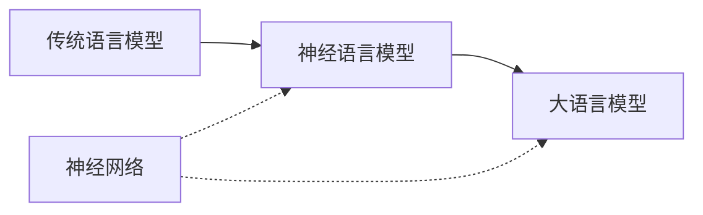
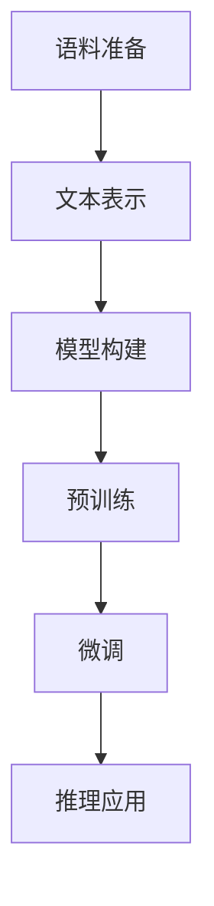

# 大语言模型应用指南：神经网络的发展历史

作者：禅与计算机程序设计艺术 / Zen and the Art of Computer Programming 

关键词：大语言模型、神经网络、人工智能、自然语言处理、深度学习

## 1. 背景介绍
### 1.1  问题的由来
人工智能(Artificial Intelligence, AI)是计算机科学领域最具挑战性和前景的研究方向之一。自1956年达特茅斯会议首次提出"人工智能"这一概念以来，AI经历了从早期的符号主义到20世纪80年代的专家系统，再到21世纪初兴起的以深度学习和大数据驱动的连接主义。

近年来，随着深度学习技术的突破和计算能力的飞速发展，大语言模型(Large Language Model, LLM)作为AI领域最耀眼的新星，引发了学术界和工业界的广泛关注。LLM通过在海量文本数据上进行无监督预训练，能够学习到丰富的语言知识和常识，从而在自然语言处理(Natural Language Processing, NLP)的诸多任务上取得了惊人的性能，甚至在某些任务上已经达到或超越了人类的水平。

### 1.2  研究现状
目前，业界已经涌现出一系列引领潮流的大语言模型，如OpenAI的GPT系列[1]、Google的BERT[2]、微软的Megatron-Turing NLG[3]等。这些模型动辄包含上百亿甚至上千亿参数，在机器翻译、问答系统、文本生成、对话交互等方面展现出了令人瞩目的能力。

然而，大语言模型的训练和应用仍面临诸多挑战：海量参数带来的计算开销和资源消耗、模型泛化能力和鲁棒性有待提升、缺乏可解释性和可控性、难以避免有害偏见等伦理风险。这些问题的解决有赖于学术界和产业界的共同努力。

### 1.3  研究意义 
大语言模型代表了人工智能发展的新高度，对自然语言处理乃至人工智能的发展具有重大意义：

1. 推动NLP技术的跨越式发展。LLM使NLP在语言理解、知识表示、推理决策等方面取得了质的飞跃，大大拓展了NLP的应用边界。

2. 促进人机交互体验的革新。基于LLM的智能对话、知识问答、写作辅助等应用，将极大提升人机交互的自然性和高效性，为人类认知和创造赋能。

3. 为通用人工智能探索新路径。LLM初步展现了类似人类语言智能的能力，是迈向通用人工智能的重要一步，为探索机器常识、因果推理、抽象思维等高层智能提供了新的思路。

4. 引发对人工智能伦理问题的反思。LLM可能放大数据中的偏见，产生错误或有害的言论，引发隐私安全等问题，需要在技术和伦理层面审慎对待。

### 1.4  本文结构
本文将系统梳理大语言模型的发展脉络，重点介绍其核心原理、关键技术、应用实践以及面临的挑战，力求为读者提供一份全面、深入、前瞻的LLM技术指南。全文组织结构如下：

第2部分介绍LLM的核心概念、发展历程及其与传统神经网络的联系。
第3部分重点阐述LLM的核心原理和关键技术，包括Transformer结构、预训练范式、few-shot学习等。
第4部分从数学建模的角度对LLM的原理进行抽象和推导，并给出详细的算例分析。
第5部分通过代码实例，演示如何实现一个基于Transformer的语言模型，并解析其关键实现。
第6部分展望LLM技术在各领域的应用前景，以及面临的机遇和挑战。
第7部分为LLM学习者提供学习资源、开发工具和文献索引。
第8部分对全文进行总结，并对LLM的未来发展趋势和挑战进行展望。
第9部分列举LLM研究和应用中的常见问题，并给出参考解答。

## 2. 核心概念与联系
大语言模型是以深度神经网络为主体、通过海量语料预训练得到的语言模型。它继承了传统神经语言模型的思想，但在模型构架、训练范式、应用方式等方面进行了系统的创新，代表了语言模型发展的新范式。

传统的语言模型如n-gram[4]、隐马尔可夫模型[5]等，主要通过统计共现频率来刻画词之间的依赖关系，其表征能力和泛化性能有限。近年兴起的神经语言模型，如RNN[6]、LSTM[7]等，通过分布式表示学习语义信息，在词的表征和建模能力上取得了长足进步。

大语言模型可以看作是神经语言模型的进一步发展。一方面，LLM采用更深更宽的网络构架如Transformer[8]，具有更强大的特征提取和语义建模能力；另一方面，LLM通过在大规模无标注语料上进行自监督预训练，学习到语言的通用表征，再通过少量有标注数据微调，即可适应下游任务，克服了监督学习需要大量人工标注数据的瓶颈。

图1给出了大语言模型与传统语言模型、神经网络的关系示意图。LLM吸收了前人的思想精华，是语言模型发展的必然趋势。同时LLM也继承了神经网络的优良特性，如端到端学习、分布式表示、强泛化等，代表了连接主义的发展新高度。

图1 大语言模型与其他模型的关系

## 3. 核心算法原理 & 具体操作步骤
### 3.1  算法原理概述
大语言模型的核心是基于Transformer的深度自回归语言模型。Transformer[8]是一种完全基于注意力机制的序列到序列模型，通过自注意力和多头注意力机制，建模任意长度文本序列内部和序列之间的依赖关系，其并行性和长程依赖捕捉能力大大优于RNN系列模型。

在此基础上，LLM通过自监督预训练和任务微调两个阶段来构建。预训练阶段，模型在大规模无标注语料上以自回归方式学习通用语言表征；微调阶段，在下游任务的小规模标注数据上对模型进行微调，使其适应具体任务。一些最新的LLM进一步发展出零样本学习(zero-shot learning)、少样本学习(few-shot learning)等范式[9]，即不经微调或仅给出少量样例，即可令模型泛化到新任务，接近通用语言智能。

### 3.2  算法步骤详解
1. 语料准备：构建大规模高质量的无标注语料库，进行必要的清洗和预处理。语料规模从几十GB到上百TB不等，涵盖通用网页、图书、百科等多个领域。

2. 文本表示：对语料进行tokenization，转换为模型可以处理的离散token序列。token粒度可以是字、词、subword等。一般基于BPE[10]、WordPiece[11]等算法构建subword词表，在保留高频词的同时控制词表大小。

3. 模型构建：构建Transformer模型，根据任务需求和算力预算设计模型规模(如层数、隐藏层维度、注意力头数等)。当前最大的LLM可达上千亿参数量级。

4. 预训练：通过自回归语言建模、去噪自编码、对比学习等方式在无标注语料上预训练模型。目标是最大化序列出现概率，掌握语言的统计规律和常识知识。采用梯度优化算法如AdamW[12]进行训练，动辄需要数周甚至数月的训练时间。

5. 微调：在下游任务数据上微调模型。保留预训练模型参数，在输出层增加任务特定的预测头，以较小的学习率微调所有参数。一般只需几个epoch即可收敛。

6. 推理应用：利用微调后的模型对新样本进行推理预测，完成特定任务。对于生成任务，一般采用Beam Search[13]、Nucleus Sampling[14]等解码策略生成连贯自然的文本。

图2展示了上述流程的总体框架。LLM的训练和应用需要大规模语料、强大算力、完善的工程实现，以及对下游任务的深入理解，是一项复杂的系统工程。

图2 大语言模型训练和应用流程

### 3.3  算法优缺点
大语言模型具有以下优点：

1. 强大的语言理解和生成能力。LLM能够从海量语料中学习语言的统计规律和背景知识，在多种语言任务上接近甚至超越人类水平。

2. 优异的迁移和泛化能力。LLM学习到的语言表征具有很强的通用性，经过简单微调即可适应新任务，大大减少了人工标注和训练的成本。

3. 灵活的应用范式。除传统的微调范式，LLM还支持零样本、少样本、提示学习等新范式，使其更接近通用语言智能的特性。

4. 有利于知识的积累和复用。LLM是一种基础语言模型，可以不断在更大规模语料上继续预训练，持续积累和更新知识，进而赋能众多垂直领域。

但LLM也存在一些局限和问题：

1. 训练和推理成本高昂。动辄亿级的参数规模需要大量的算力和存储，给模型训练和部署带来挑战。

2. 泛化能力和鲁棒性有待提升。LLM在面对样本外的生僻知识、对抗性样本时表现欠佳，容易产生幻觉或错误。

3. 可解释性和可控性不足。LLM是个黑盒模型，其推理过程缺乏透明性，难以对其输出进行解释和控制，存在安全隐患。

4. 难以避免数据中的偏见。LLM从海量网络语料中学习，可能继承其中的性别、种族等偏见，产生不公或有害的言论。

### 3.4  算法应用领域
得益于其强大的语言理解和生成能力，大语言模型在NLP的各个领域得到了广泛应用，主要包括：

1. 机器翻译：将输入语言转换为目标语言，实现不同语言之间的互译。基于LLM的神经机器翻译[15]大大提升了翻译的流畅度和准确性。

2. 智能问答：根据用户的问题从大规模知识库中检索并生成答案。LLM可以作为问答系统的核心模块，提供更加智能、个性化的问答服务[16]。

3. 文本生成：自动生成指定主题、风格的文本。LLM可用于新闻写作[17]、诗歌创作[18]、对联生成[19]等场景，辅助人类的写作创作。

4. 信息抽取：从非结构化文本中抽取结构化知识，如实体、关系、事件等。LLM可以作为信息抽取的特征提取器[20]，显著提升抽取的准确率和覆盖率。

5. 语义理解：对文本的语义进行分析和理解，如情感分析、文本蕴涵、语义匹配等。LLM可以作为语义理解任务的骨干网络，学习文本的深层语义表征[21]。

6. 对话系统：模拟人机对话交互，提供问答、任务指导、情感陪伴等服务。基于LLM的开放域对话系统[22]能够进行更加流畅、连贯、有趣的多轮交互。

除上述经典任务外，LLM在代码生成[23]、数学推理[24]、视觉问答[25]等交叉领域也初显锋芒，成为人工智能发展的新引擎。

## 4. 数学模型和公式 