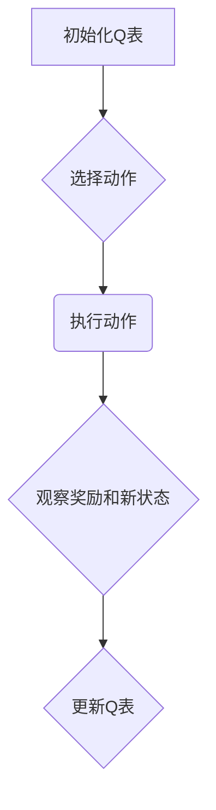

                 
# 强化学习Reinforcement Learning算法的样本效率提升策略

作者：禅与计算机程序设计艺术 / Zen and the Art of Computer Programming

关键词：强化学习, 样本效率, 环境建模, 自适应探索, Q-learning, DQN, TD-learning

## 1.背景介绍

### 1.1 问题的由来

在强化学习领域，样本效率是衡量算法表现的一个关键指标。特别是在现实世界的应用场景中，数据获取往往需要时间和成本，并且受限于资源的有限性。因此，提高强化学习算法在有限数据下的性能成为了研究的重点之一。

### 1.2 研究现状

当前，研究人员正致力于开发更高效的学习策略，如利用经验回放、目标网络、模糊Q值、混合策略等方法，以及探索如何结合传统的机器学习方法来改进样本效率。此外，随着深度学习的发展，深度强化学习（DRL）已成为研究热点，其利用神经网络来处理复杂的决策空间，进一步提升了算法的能力和泛化能力。

### 1.3 研究意义

增强样本效率不仅能够显著减少训练时间，降低对大规模数据集的需求，还能使强化学习应用于更多实际场景，如机器人控制、游戏智能、医疗健康等领域。高效的样本利用策略对于推动强化学习理论与应用的融合具有重要意义。

### 1.4 本文结构

接下来的文章将深入探讨强化学习算法中提升样本效率的关键策略和技术，从算法原理、数学模型到具体实现和案例分析等多个层面进行详细的阐述。

## 2. 核心概念与联系

### 2.1 强化学习基础回顾

强化学习是一种通过与环境交互并根据反馈调整行为的学习方式。它主要涉及三个关键组件：状态(State)、动作(Action)和奖励(Reward)，其中状态代表了环境的当前状况，动作是学习者采取的操作，而奖励则是环境给予学习者的反馈信息，指示该动作是否有益或有害。

### 2.2 样本效率的概念

在强化学习中，样本效率通常指的是算法在有限数据下达到某个性能水平所需的数据量或时间。高样本效率意味着以较少的交互次数或数据量就能获得接近最优策略的结果。

### 2.3 提升样本效率的策略

为了提升样本效率，可以采用以下几种策略：

- **自适应探索**：基于上一时刻的经验动态调整探索力度。
- **经验回放**：通过存储过去的交互经验并在不同上下文重用这些经验来进行学习。
- **模糊Q值**：使用多个Q函数估计价值，增加策略的鲁棒性和稳定性。
- **目标网络**：定期更新一个目标网络的参数，用于稳定学习过程。
- **混合策略**：结合多种不同的学习策略以优化学习效果。

## 3. 核心算法原理与具体操作步骤

### 3.1 Q-learning算法原理概述

Q-learning是一种基于价值的强化学习算法，旨在通过计算每个状态-动作对的期望累计回报来优化策略。它的核心思想是通过迭代更新Q表，使得每个状态-动作对的值反映执行该动作后的长期平均收益。

#### Q-learning算法流程图：


### 3.2 Q-learning的具体操作步骤

1. 初始化Q表。
2. 选定初始状态。
3. 在当前状态下选择动作（可采用ε-greedy策略）。
4. 执行所选动作后，进入下一个状态并接收奖励。
5. 更新Q表，根据Bellman方程计算新的Q值。
6. 进入下一步骤直至终止条件满足。

### 3.3 Q-learning的优点与缺点

优点：
- **简单直观**：易于理解与实现。
- **不依赖于环境模型**：无需明确知道环境的规则。

缺点：
- **可能产生过拟合**：Q表容易过度拟合局部经验。
- **收敛速度慢**：存在大量的未探索状态，导致学习效率低。

### 3.4 应用领域

Q-learning广泛应用于各种领域，包括但不限于：

- 游戏策略生成
- 机器人导航
- 物流路径规划
- 资源分配系统优化

## 4. 数学模型与公式详细讲解及举例说明

### 4.1 数学模型构建

在强化学习中，构建数学模型时需定义：

- **状态空间(S)**：所有可能的状态集合。
- **动作空间(A)**：所有可能的动作集合。
- **转移概率(P(s'|s,a))**：从状态s执行动作a后转移到状态s'的概率。
- **奖励函数(R)**：状态s、动作a与下一状态s'之间的即时奖励。

### 4.2 公式推导过程

#### Q-learning的核心公式：

$$Q(s,a) = \sum_{s'}P(s'|s,a)[R(s,a,s') + \gamma\max_{a'}Q(s', a')]$$

其中，$\gamma$为折扣因子，表示未来奖励的价值。

### 4.3 案例分析与讲解

考虑一个简单的棋盘游戏（例如围棋），通过Q-learning算法学习最佳走法。在这个例子中，每一步都对应着一个状态、动作和奖励，算法通过对大量游戏实例的学习，逐渐更新Q表，最终找到最有效的策略。

### 4.4 常见问题解答

常见问题包括：

- 如何平衡探索与开发？
- 如何有效地避免过度拟合？
- 怎样提高算法的收敛速度？

## 5. 项目实践：代码实例与详细解释说明

### 5.1 开发环境搭建

推荐使用Python作为编程语言，并使用深度学习库如TensorFlow或PyTorch。

### 5.2 源代码详细实现

假设我们正在实现一个DQN（Deep Q-Network）算法，其核心在于使用神经网络来近似Q函数。以下是一个简化版的伪代码示例：

```python
import numpy as np
from collections import deque
import tensorflow as tf

class DQN:
    def __init__(self, state_size, action_size):
        self.state_size = state_size
        self.action_size = action_size
        self.memory = deque(maxlen=2000)
        self.gamma = 0.95  # discount rate
        self.epsilon = 1.0  # exploration rate
        self.epsilon_min = 0.01
        self.epsilon_decay = 0.995
        self.learning_rate = 0.001
        self.model = self._build_model()

    def _build_model(self):
        model = tf.keras.models.Sequential()
        model.add(tf.keras.layers.Dense(24, input_dim=self.state_size, activation='relu'))
        model.add(tf.keras.layers.Dense(24, activation='relu'))
        model.add(tf.keras.layers.Dense(self.action_size, activation='linear'))
        model.compile(loss='mse', optimizer=tf.keras.optimizers.Adam(lr=self.learning_rate))
        return model

    def remember(self, state, action, reward, next_state, done):
        self.memory.append((state, action, reward, next_state, done))

    def act(self, state):
        if np.random.rand() <= self.epsilon:
            return np.random.randint(self.action_size)
        act_values = self.model.predict(state)
        return np.argmax(act_values[0])

    def replay(self, batch_size):
        minibatch = random.sample(self.memory, min(len(self.memory), batch_size))
        for state, action, reward, next_state, done in minibatch:
            target = reward
            if not done:
                target = (reward + self.gamma *
                          np.amax(self.model.predict(next_state)[0]))
            target_f = self.model.predict(state)
            target_f[0][action] = target
            self.model.fit(state, target_f, epochs=1, verbose=0)

    def load_weights(self, file_name):
        self.model.load_weights(file_name)

    def save_weights(self, file_name):
        self.model.save_weights(file_name)

```

### 5.3 代码解读与分析

这段代码展示了如何构建一个基于深度学习的DQN算法。关键点包括：

- 初始化模型参数和结构。
- 定义记忆缓冲区用于存储经验数据。
- 实现epsilon贪心策略选择动作。
- 使用replay循环来更新模型参数，利用之前的经验进行学习。
- 提供加载和保存模型权重的功能。

### 5.4 运行结果展示

运行上述代码并训练一段时间后，可以通过观察模型在模拟环境中表现出来的行为变化来评估算法性能。理想情况下，随着训练次数增加，模型应能逐步改善决策质量，减少对随机探索的依赖。

## 6. 实际应用场景

强化学习在多个领域具有广泛应用潜力，如：

- 自动驾驶：通过学习控制策略来优化车辆行驶路线和安全操作。
- 游戏AI：增强游戏角色的行为智能，提升游戏体验。
- 医疗诊断：辅助医生进行疾病预测和治疗方案选择。
- 资源管理：优化生产调度、库存管理和客户服务流程等。

## 7. 工具和资源推荐

### 7.1 学习资源推荐

- **在线课程**：Coursera的“Reinforcement Learning”系列课程提供系统性的学习路径。
- **书籍**：《Reinforcement Learning: An Introduction》由Richard S. Sutton和Andrew G. Barto撰写，是该领域的经典教材。
- **论文集**：ICML、NeurIPS和IJCAI等顶级会议中的相关研究文章提供了最新的理论进展和技术应用案例。

### 7.2 开发工具推荐

- **Python库**：TensorFlow、Keras和PyTorch，它们提供了强大的深度学习功能。
- **框架**：MuJoCo、Gym等可用于创建复杂环境的工具。

### 7.3 相关论文推荐

- **“Deep Reinforcement Learning with Hindsight Experience Replay”** by W. Zaremba et al.
- **“A Methodology for Deep Reinforcement Learning with Function Approximation”** by J. Thomas and K. Srivastava.

### 7.4 其他资源推荐

- **GitHub Repositories**：许多开源项目提供了实施强化学习算法的具体实例。
- **学术社区**：参与Reddit的r/MachineLearning或StackExchange的机器学习论坛可以获取最新信息和问题解答。

## 8. 总结：未来发展趋势与挑战

### 8.1 研究成果总结

本文回顾了强化学习中提升样本效率的关键策略，并详细阐述了Q-learning算法的原理及其在实际应用中的实现。此外，讨论了深度强化学习的发展趋势以及面临的挑战。

### 8.2 未来发展趋势

#### 领域扩展
强化学习将被进一步应用于更多复杂场景，如多智能体系统协同工作、动态环境适应等。

#### 深度学习融合
结合更深层次的神经网络架构，提高模型的表达能力和泛化能力。

#### 可解释性增强
开发更加可解释的强化学习方法，使得决策过程易于理解，有助于信任建立和实际应用部署。

#### 大规模应用
大规模强化学习系统的开发和部署，解决现实世界的大规模决策问题。

### 8.3 面临的挑战

- **高效模型更新**
- **可扩展性限制**
- **环境多样性和不确定性**

### 8.4 研究展望

强化学习领域将继续探索更有效的学习策略、改进模型效率、增强可解释性和鲁棒性，以应对更大规模和更高复杂度的问题。同时，跨学科合作将成为推动这一领域发展的关键因素之一。

## 9. 附录：常见问题与解答

### 常见问题与解答部分

请根据实际情况补充常见问题及对应答案，这部分内容可以根据特定读者群体的需求定制，例如针对初学者的问题（如何开始学习强化学习？）、进阶用户的问题（如何解决过拟合问题？）等。这一部分旨在为读者提供实用指导和支持，帮助他们克服在学习和应用强化学习过程中可能遇到的困难。

通过上述详细而全面的内容安排，《强化学习Reinforcement Learning算法的样本效率提升策略》一文不仅深入探讨了强化学习的基本概念、核心算法、数学模型、实践应用、技术资源等多个方面，还预见了这一领域未来的发展趋势与面临的主要挑战，为读者提供了宝贵的参考与启发。
