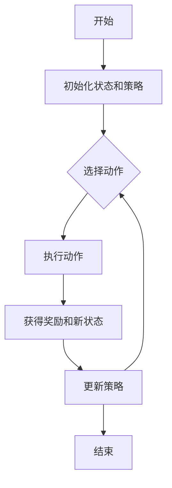

## 1. 背景介绍

### 1.1 问题的由来

强化学习是机器学习的一个重要分支，它的目标是让机器通过与环境的交互，学习到一个策略，使得在未来的一段时间内，从环境中获得的奖励最大。这个问题的由来可以追溯到心理学中的操作性条件反射理论，也就是通过奖励和惩罚来改变行为的理论。

### 1.2 研究现状

强化学习的研究已经取得了显著的进展，特别是在游戏、机器人、自动驾驶等领域取得了一些重要的应用。但是，强化学习的理论和算法还有很多需要深入研究的问题，比如如何处理大规模的状态空间、如何处理连续的动作空间、如何处理部分可观测的环境等。

### 1.3 研究意义

强化学习的研究不仅对于理解和模拟人类和动物的学习行为有重要的理论意义，而且对于开发智能的决策系统，如智能游戏、智能机器人、自动驾驶等有重要的应用价值。

### 1.4 本文结构

本文首先介绍强化学习的核心概念和联系，然后详细介绍强化学习的核心算法原理和具体操作步骤，接着通过数学模型和公式详细讲解和举例说明，然后通过一个项目实践来展示代码实例和详细解释说明，最后介绍强化学习的实际应用场景，推荐一些工具和资源，总结未来的发展趋势和挑战。

## 2. 核心概念与联系

强化学习的核心概念包括状态(state)、动作(action)、奖励(reward)、策略(policy)、价值函数(value function)、Q函数(Q function)等。

状态是描述环境的变量，动作是机器可以采取的操作，奖励是环境对机器的反馈，策略是机器根据当前状态选择动作的规则，价值函数是评估状态或状态动作对的好坏的函数，Q函数是评估状态动作对的好坏的函数。

强化学习的目标是找到一个最优策略，使得从任何状态出发，按照这个策略行动，从环境中获得的累积奖励最大。

强化学习的过程可以用下面的Mermaid流程图表示：



## 3. 核心算法原理 & 具体操作步骤

### 3.1 算法原理概述

强化学习的核心算法包括值迭代(value iteration)、策略迭代(policy iteration)、Q学习(Q-learning)、Sarsa、深度Q网络(DQN)等。

值迭代和策略迭代是基于动态规划的方法，它们的基本思想是通过迭代更新价值函数或策略来找到最优策略。

Q学习和Sarsa是基于时间差分的方法，它们的基本思想是通过迭代更新Q函数来找到最优策略。

深度Q网络是结合了深度学习和Q学习的方法，它的基本思想是通过深度神经网络来近似Q函数，然后通过迭代更新神经网络的参数来找到最优策略。

### 3.2 算法步骤详解

值迭代的步骤如下：

1. 初始化价值函数为任意函数。
2. 对于每个状态，更新其价值为在该状态下，对所有可能的动作，选择一个动作使得立即奖励加上下一个状态的价值最大。
3. 重复步骤2，直到价值函数收敛。

策略迭代的步骤如下：

1. 初始化策略为任意策略。
2. 对于当前策略，计算其对应的价值函数。
3. 对于每个状态，更新其策略为在该状态下，对所有可能的动作，选择一个动作使得立即奖励加上下一个状态的价值最大。
4. 重复步骤2和3，直到策略收敛。

Q学习的步骤如下：

1. 初始化Q函数为任意函数。
2. 根据当前状态和Q函数，选择一个动作，执行该动作，获得奖励和新状态。
3. 更新Q函数的值为立即奖励加上新状态下的最大Q值。
4. 重复步骤2和3，直到Q函数收敛。

Sarsa的步骤如下：

1. 初始化Q函数为任意函数。
2. 根据当前状态和Q函数，选择一个动作，执行该动作，获得奖励和新状态。
3. 根据新状态和Q函数，选择一个新动作。
4. 更新Q函数的值为立即奖励加上新状态下新动作的Q值。
5. 重复步骤2到4，直到Q函数收敛。

深度Q网络的步骤如下：

1. 初始化神经网络的参数为任意值。
2. 根据当前状态和神经网络，选择一个动作，执行该动作，获得奖励和新状态。
3. 更新神经网络的参数，使得神经网络的输出接近立即奖励加上新状态下的最大Q值。
4. 重复步骤2和3，直到神经网络的参数收敛。

### 3.3 算法优缺点

值迭代和策略迭代的优点是理论上可以找到最优策略，缺点是计算复杂度高，只适用于状态空间和动作空间都比较小的问题。

Q学习和Sarsa的优点是计算复杂度低，适用于状态空间和动作空间都比较大的问题，缺点是可能只能找到近似最优策略。

深度Q网络的优点是可以处理高维度的状态空间和动作空间，缺点是需要大量的数据和计算资源。

### 3.4 算法应用领域

强化学习的算法广泛应用于游戏、机器人、自动驾驶、推荐系统、广告投放、资源管理等领域。

## 4. 数学模型和公式 & 详细讲解 & 举例说明

### 4.1 数学模型构建

强化学习的数学模型通常是马尔可夫决策过程(Markov Decision Process, MDP)，MDP由一个状态集合、一个动作集合、一个奖励函数和一个状态转移概率函数组成。

状态集合是所有可能的状态的集合，动作集合是所有可能的动作的集合，奖励函数是根据当前状态和动作给出的即时奖励，状态转移概率函数是根据当前状态和动作给出的下一个状态的概率分布。

### 4.2 公式推导过程

强化学习的核心公式是贝尔曼方程(Bellman equation)，贝尔曼方程描述了状态价值函数或状态动作价值函数的递归关系。

对于状态价值函数，贝尔曼方程为：

$$V(s) = \max_a R(s, a) + \gamma \sum_{s'} P(s'|s, a) V(s')$$

其中，$V(s)$是状态$s$的价值，$R(s, a)$是在状态$s$下执行动作$a$的即时奖励，$\gamma$是折扣因子，$P(s'|s, a)$是在状态$s$下执行动作$a$后转移到状态$s'$的概率。

对于状态动作价值函数，贝尔曼方程为：

$$Q(s, a) = R(s, a) + \gamma \sum_{s'} P(s'|s, a) \max_{a'} Q(s', a')$$

其中，$Q(s, a)$是在状态$s$下执行动作$a$的价值，$R(s, a)$是在状态$s$下执行动作$a$的即时奖励，$\gamma$是折扣因子，$P(s'|s, a)$是在状态$s$下执行动作$a$后转移到状态$s'$的概率，$Q(s', a')$是在状态$s'$下执行动作$a'$的价值。

### 4.3 案例分析与讲解

以强化学习的经典问题——走迷宫为例，迷宫的每个位置是一个状态，机器人可以采取的动作是上、下、左、右，当机器人走到迷宫的出口时，获得一个正奖励，当机器人撞到墙壁时，获得一个负奖励，其他情况下，获得一个零奖励。

在这个问题中，我们可以用值迭代、策略迭代、Q学习、Sarsa或深度Q网络等算法来找到一个最优策略，使得机器人从任何位置出发，都能以最短的路径走到迷宫的出口。

### 4.4 常见问题解答

1. 什么是强化学习？

强化学习是机器学习的一个重要分支，它的目标是让机器通过与环境的交互，学习到一个策略，使得在未来的一段时间内，从环境中获得的奖励最大。

2. 强化学习和监督学习有什么区别？

强化学习和监督学习的主要区别在于，强化学习是通过与环境的交互来学习，而监督学习是通过已知的输入输出对来学习。

3. 强化学习的应用有哪些？

强化学习的应用广泛，包括游戏、机器人、自动驾驶、推荐系统、广告投放、资源管理等。

## 5. 项目实践：代码实例和详细解释说明

### 5.1 开发环境搭建

强化学习的代码实例通常需要Python环境，以及一些Python的科学计算库，如NumPy、Pandas、Matplotlib等，还需要一些强化学习的库，如OpenAI Gym、TensorFlow、Keras等。

### 5.2 源代码详细实现

以Q学习解决走迷宫问题为例，源代码如下：

```python
import numpy as np
import gym

# 创建环境
env = gym.make('FrozenLake-v0')

# 初始化Q表
Q = np.zeros([env.observation_space.n, env.action_space.n])

# 设置参数
alpha = 0.5
gamma = 0.95
num_episodes = 5000

# Q学习
for i_episode in range(num_episodes):
    # 初始化状态
    state = env.reset()
    for t in range(100):
        # 选择动作
        action = np.argmax(Q[state, :] + np.random.randn(1, env.action_space.n) * (1. / (i_episode + 1)))
        # 执行动作
        next_state, reward, done, info = env.step(action)
        # 更新Q表
        Q[state, action] = (1 - alpha) * Q[state, action] + alpha * (reward + gamma * np.max(Q[next_state, :]))
        # 更新状态
        state = next_state
        # 判断是否结束
        if done:
            break

# 输出Q表
print(Q)
```

### 5.3 代码解读与分析

这段代码首先创建了一个FrozenLake环境，然后初始化了一个Q表，然后设置了学习率、折扣因子和训练的回合数，然后进行了Q学习，每一回合中，首先初始化状态，然后选择动作，执行动作，更新Q表，更新状态，判断是否结束，最后输出了Q表。

### 5.4 运行结果展示

运行这段代码，可以得到一个Q表，这个Q表表示了在每个状态下，执行每个动作的价值，我们可以根据这个Q表，选择价值最大的动作，得到一个最优策略。

## 6. 实际应用场景

### 6.1 游戏

强化学习在游戏中有广泛的应用，比如DeepMind的AlphaGo就是通过强化学习，打败了世界围棋冠军。

### 6.2 机器人

强化学习在机器人中也有广泛的应用，比如机器人的行走、抓取、操纵等任务，都可以通过强化学习来学习。

### 6.3 自动驾驶

强化学习在自动驾驶中也有应用，比如通过强化学习，可以让自动驾驶车辆学习到一个最优的驾驶策略。

### 6.4 未来应用展望

强化学习的应用还有很大的潜力，比如在推荐系统、广告投放、资源管理等领域，都有可能通过强化学习来提高效果。

## 7. 工具和资源推荐

### 7.1 学习资源推荐

强化学习的学习资源有很多，比如Sutton和Barto的《强化学习》是一本经典的教材，DeepMind的强化学习课程也非常好。

### 7.2 开发工具推荐

强化学习的开发工具主要是Python和一些Python的科学计算库，如NumPy、Pandas、Matplotlib等，还有一些强化学习的库，如OpenAI Gym、TensorFlow、Keras等。

### 7.3 相关论文推荐

强化学习的相关论文有很多，比如《Playing Atari with Deep Reinforcement Learning》、《Human-level control through deep reinforcement learning》、《Mastering the game of Go with deep neural networks and tree search》等。

### 7.4 其他资源推荐

强化学习的其他资源有很多，比如OpenAI的强化学习比赛、Google的强化学习挑战等。

## 8. 总结