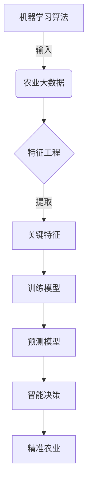
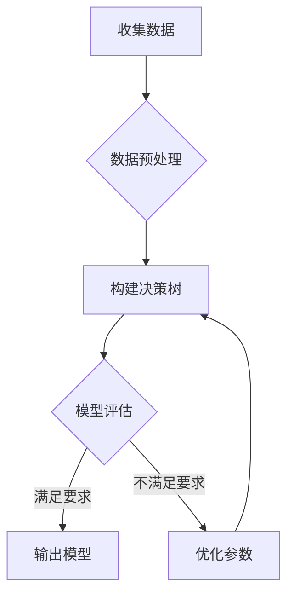
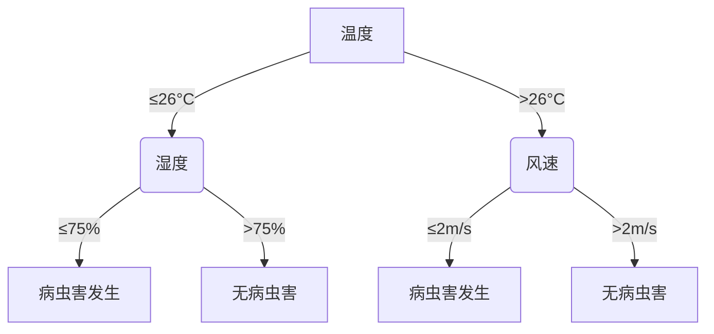

# 机器学习算法在农业领域的应用

## 1. 背景介绍

### 1.1 问题的由来

农业是人类赖以生存的根本，随着全球人口不断增长和气候变化的影响，确保粮食安全和可持续农业发展面临着前所未有的挑战。传统的农业生产方式已经难以满足日益增长的需求,亟需通过科技创新来提高农业生产效率和可持续性。

### 1.2 研究现状 

近年来,机器学习等人工智能技术在农业领域得到了广泛应用,展现出巨大的潜力。机器学习算法能够从大量农业数据中发现隐藏的模式和规律,为精准农业决策提供有力支持。例如,通过分析历史气象、土壤、作物生长等数据,可以预测病虫害发生、优化施肥策略、调控温室大棚环境等。

### 1.3 研究意义

应用机器学习算法可以极大提高农业生产的智能化和精准化水平,提高农产品产量和质量,降低生产成本,减少对环境的不利影响。同时,也为农业从业者提供了强有力的决策支持工具,有助于实现农业现代化和可持续发展。

### 1.4 本文结构

本文将全面介绍机器学习算法在农业领域的应用,包括背景知识、核心概念、算法原理、数学模型、实际案例、应用场景、工具资源等,旨在为读者提供系统的理解和实践指导。

## 2. 核心概念与联系

机器学习在农业领域的应用涉及多个核心概念,如下所示:



1. **农业大数据**: 包括气象数据、遥感数据、土壤数据、作物生长数据等,是机器学习算法的基础输入。
2. **特征工程**: 从海量原始数据中提取对农业生产有影响的关键特征,如温度、降雨量、土壤酸碱度等。
3. **机器学习算法**: 利用特征数据训练模型,包括监督学习、非监督学习、强化学习等多种算法。
4. **预测模型**: 通过训练得到的模型,对未来情况进行预测,如作物产量、病虫害发生等。
5. **智能决策**: 基于模型预测结果,制定精准的农业生产决策,如施肥、防治、环境控制等。
6. **精准农业**: 实现农业生产的智能化和精准化管理,提高效率和可持续性。

## 3. 核心算法原理与具体操作步骤

### 3.1 算法原理概述

机器学习算法在农业领域的应用主要包括以下几种类型:

1. **监督学习**: 利用标注的训练数据(如作物病害图像及类别)训练模型,用于分类和回归任务,如病虫害检测、产量预测等。
2. **非监督学习**: 对未标注的数据进行聚类分析,发现潜在模式,如土地分区、作物分类等。
3. **强化学习**: 通过与环境交互获取反馈,优化决策序列,如控制温室大棚环境、规划农机作业路线等。

下面以监督学习的决策树算法为例,介绍具体操作步骤。

### 3.2 算法步骤详解

决策树是一种常用的监督学习算法,可用于分类和回归任务。以预测作物是否发生病虫害为例,算法步骤如下:



1. **收集数据**: 收集包含作物生长环境(温度、湿度等)和病虫害发生情况的历史数据。
2. **数据预处理**: 对数据进行清洗、标准化、特征选择等预处理,确保数据质量。
3. **构建决策树**: 根据特征数据训练决策树模型,如ID3、C4.5、CART等算法。
4. **模型评估**: 使用测试数据对模型进行评估,计算准确率、精确率、召回率等指标。
5. **输出模型**: 若模型满足要求,则输出最终模型,用于病虫害预测。
6. **优化参数**: 若模型表现不佳,则调整算法参数(如最大树深度、特征选择准则等),重新训练模型。

### 3.3 算法优缺点

决策树算法具有以下优缺点:

**优点**:
- 可解释性强,决策过程清晰可见
- 可处理数值和类别特征数据
- 对缺失数据有一定鲁棒性
- 计算高效,可并行化处理

**缺点**:
- 可能过拟合训练数据
- 对数据的微小变化敏感
- 不能很好处理特征之间的组合关系

### 3.4 算法应用领域

决策树算法在农业领域有广泛应用,主要包括:

- 作物种类分类
- 病虫害检测和预测 
- 农作物产量预测
- 土地利用分区
- 农业决策支持系统

## 4. 数学模型和公式详细讲解举例说明

### 4.1 数学模型构建

决策树算法的核心是如何选择最优特征进行数据分割,以获得最高的信息增益(entropy reduction)。常用的特征选择准则有信息增益(Information Gain)和信息增益比(Information Gain Ratio)。

假设当前数据集$D$包含$m$个样本,其中有$k$个类别$\{c_1,c_2,...,c_k\}$,样本点$x$属于类别$c_i$的概率为:

$$
p(c_i) = \frac{|D_{c_i}|}{|D|}
$$

其中$|D_{c_i}|$表示属于类别$c_i$的样本个数,$|D|$为总样本数。

则数据集$D$的经验熵(entropy)为:

$$
H(D) = -\sum_{i=1}^k p(c_i)\log_2 p(c_i)
$$

熵越高,数据的混乱程度越大。

### 4.2 公式推导过程

对于特征$A$,其可能取值为$\{a_1,a_2,...,a_v\}$,据此可将数据集$D$划分为$v$个子集$\{D_1,D_2,...,D_v\}$,其中$D_j$表示$A=a_j$的子集。则在特征$A$的条件下,数据集$D$的经验条件熵为:

$$
H(D|A) = \sum_{j=1}^v \frac{|D_j|}{|D|}H(D_j)
$$

信息增益(Information Gain)定义为:

$$
\begin{aligned}
Gain(D,A) &= H(D) - H(D|A) \\
          &= H(D) - \sum_{j=1}^v \frac{|D_j|}{|D|}H(D_j)
\end{aligned}
$$

信息增益比(Information Gain Ratio)定义为:

$$
Gain\_ratio(D,A) = \frac{Gain(D,A)}{IV(A)}
$$

其中$IV(A)$为$A$的固有值(intrinsic value),用于度量$A$的分裂程度,定义为:

$$
IV(A) = -\sum_{j=1}^v \frac{|D_j|}{|D|}\log_2 \frac{|D_j|}{|D|}
$$

在构建决策树时,通常选择信息增益或信息增益比最大的特征作为当前节点进行数据分割。

### 4.3 案例分析与讲解

以下是一个利用决策树算法预测小麦病虫害发生的实例。假设有以下训练数据:

| 温度(°C) | 湿度(%) | 风速(m/s) | 日照时长(h) | 病虫害发生 |
|----------|---------|------------|-------------|------------|
| 25       | 80      | 2          | 6           | 是         |
| 22       | 70      | 3          | 8           | 否         |
| 28       | 85      | 1          | 5           | 是         |
| ...      | ...     | ...        | ...         | ...        |

首先计算温度、湿度、风速、日照时长四个特征的信息增益,假设得到最大的是温度特征,则以温度作为根节点进行数据分割。

假设温度阈值设为26°C,则训练数据可分为两个子集:

- 温度 ≤ 26°C 子集:

| 温度(°C) | 湿度(%) | 风速(m/s) | 日照时长(h) | 病虫害发生 |
|----------|---------|------------|-------------|------------|
| 25       | 80      | 2          | 6           | 是         |
| 22       | 70      | 3          | 8           | 否         |
| ...      | ...     | ...        | ...         | ...        |

- 温度 > 26°C 子集:

| 温度(°C) | 湿度(%) | 风速(m/s) | 日照时长(h) | 病虫害发生 |
|----------|---------|------------|-------------|------------|
| 28       | 85      | 1          | 5           | 是         |
| ...      | ...     | ...        | ...         | ...        |

对于第一个子集,再计算其他三个特征的信息增益,假设最大的是湿度,则以湿度作为下一层节点继续分割,如此递归构建决策树。

最终得到的决策树模型如下:



根据该决策树模型,给定新的温度、湿度、风速等环境数据,即可预测是否会发生病虫害。同时,从树的结构也可以直观看出,温度、湿度、风速是影响病虫害发生的关键因素。

### 4.4 常见问题解答

**Q: 为什么要使用信息增益比而不是直接使用信息增益?**

A: 信息增益有一个缺陷,就是对取值较多的特征有所偏好。为了避免这种偏差,引入了信息增益比,它通过除以特征的固有值来度量信息增益的"密度"。一般使用信息增益比作为特征选择准则更为合理。

**Q: 决策树模型如何处理连续值特征?**

A: 对于连续值特征,决策树算法需要先对其进行离散化处理,将连续值映射为有限个区间。常用的离散化方法有等宽分箱、等频分箱等。

**Q: 如何避免决策树过拟合训练数据?**

A: 可以通过设置合理的终止条件(如最大树深、最小样本数等)来控制决策树的生长,防止过度拟合。另外也可以进行决策树剪枝(pruning)操作,移除一些对模型泛化能力影响不大的分支节点。

## 5. 项目实践:代码实例和详细解释说明

### 5.1 开发环境搭建

本示例使用Python语言和scikit-learn机器学习库进行开发,所需的环境和库如下:

- Python 3.7+
- scikit-learn 0.24+
- pandas
- numpy
- matplotlib

可使用Anaconda等工具快速安装所需环境。

### 5.2 源代码详细实现

```python
import pandas as pd
from sklearn.tree import DecisionTreeClassifier
from sklearn.model_selection import train_test_split
from sklearn import metrics

# 加载数据
data = pd.read_csv('crop_data.csv')
X = data.drop('disease', axis=1)
y = data['disease']

# 拆分训练测试集
X_train, X_test, y_train, y_test = train_test_split(X, y, test_size=0.2, random_state=42)

# 创建决策树模型
clf = DecisionTreeClassifier(criterion='gini', max_depth=5)

# 训练模型
clf.fit(X_train, y_train)

# 预测
y_pred = clf.predict(X_test)

# 评估模型
accuracy = metrics.accuracy_score(y_test, y_pred)
print(f'Accuracy: {accuracy}')

# 可视化决策树
import graphviz
dot_data =