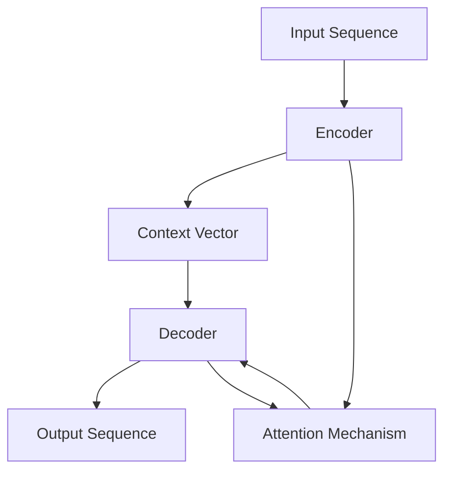

# 构建简单Seq2Seq架构

作者：禅与计算机程序设计艺术

关键词：Seq2Seq、编码器、解码器、注意力机制、神经机器翻译、深度学习

## 1. 背景介绍

### 1.1 问题的由来

随着全球化的不断深入，跨语言交流的需求日益增长。传统的机器翻译方法如基于规则的翻译和统计机器翻译，在处理长句子和复杂语义时常常捉襟见肘。近年来，随着深度学习的蓬勃发展，基于神经网络的机器翻译方法脱颖而出，其中尤以Seq2Seq模型最为经典。

### 1.2 研究现状

自2014年Sutskever等人提出Seq2Seq模型以来，该模型在机器翻译领域取得了巨大成功。谷歌、微软等科技巨头纷纷开展了基于Seq2Seq的神经机器翻译研究，并取得了优于传统方法的翻译效果。目前，Seq2Seq已成为神经机器翻译的主流框架。

### 1.3 研究意义

深入研究Seq2Seq模型，对于推动机器翻译技术的进步具有重要意义。一方面，Seq2Seq为解决长句翻译、语义理解等难题提供了新的思路；另一方面，Seq2Seq的思想也为其他自然语言处理任务如对话系统、文本摘要等提供了借鉴。因此，掌握Seq2Seq的原理和实现，对于从事人工智能研究的学者和工程师而言十分必要。

### 1.4 本文结构

本文将从以下几个方面介绍如何构建一个简单的Seq2Seq模型：

- 首先介绍Seq2Seq的核心概念和组成部分之间的联系
- 然后详细讲解Seq2Seq的编码器-解码器结构和注意力机制的算法原理
- 接着给出Seq2Seq的数学模型和公式推导过程
- 之后通过代码实例和详细的注释说明，展示如何用Python和Tensorflow实现一个Seq2Seq模型
- 最后总结Seq2Seq的实际应用场景、未来的发展趋势与面临的挑战，并提供一些学习资源

## 2. 核心概念与联系

Seq2Seq模型的核心是编码器-解码器（Encoder-Decoder）结构和注意力机制（Attention Mechanism）。

- 编码器：将输入序列转化为一个固定维度的语义向量，即对输入的信息进行编码
- 解码器：根据编码器生成的语义向量，一步步生成输出序列，即对语义向量进行解码
- 注意力机制：在解码器的每一步，根据当前的解码状态和编码器的输出计算注意力分布，然后基于注意力分布对编码器的输出进行加权求和，得到注意力语义向量。该向量作为解码器的附加输入，帮助其更好地"注意"输入序列中的相关信息。

下图展示了带有注意力机制的Seq2Seq模型的总体架构：

## 3. 核心算法原理 & 具体操作步骤

### 3.1 算法原理概述

Seq2Seq模型的编码器和解码器一般采用RNN（循环神经网络）实现，常用的RNN变体有LSTM和GRU。

编码阶段，编码器逐个读取输入序列的词向量，在每个时间步更新隐藏状态。将最后一步的隐藏状态作为语义向量传递给解码器。

解码阶段，解码器根据语义向量和之前生成的词预测下一个词。具体地，在每个时间步，将上一步的输出词向量和当前隐藏状态传入注意力机制，计算注意力分布。然后用注意力分布对编码器各时间步的输出进行加权求和，得到注意力语义向量。将其与当前隐藏状态拼接传入一个全连接层，最后通过softmax得到各个词的概率分布，选择概率最大的词作为本步的输出。

### 3.2 算法步骤详解

1. 编码阶段：
   - 将输入句子中的每个词映射为词向量
   - 初始化编码器的隐藏状态
   - 对于每个时间步：
     - 读取当前时间步的输入词向量
     - 更新隐藏状态
   - 将最后一步的隐藏状态作为语义向量

2. 解码阶段：
   - 初始化解码器的隐藏状态为编码器的语义向量
   - 初始化第一个输入词为起始标记`<start>`
   - 对于每个时间步，直到生成结束标记`<end>`：
     - 读取当前时间步的输入词向量
     - 计算注意力分布：
       - 计算当前隐藏状态与编码器各时间步输出的相似度得分
       - 对相似度得分做softmax，得到注意力分布
     - 基于注意力分布，计算注意力语义向量
     - 将注意力语义向量与当前隐藏状态拼接，传入全连接层
     - 通过softmax计算各词的概率分布
     - 选择概率最大的词作为当前时间步的输出，并作为下一步的输入

### 3.3 算法优缺点

优点：
- 能够处理不定长的输入和输出序列
- 通过注意力机制，使解码器能够动态地聚焦于输入序列中的相关部分
- 端到端的训练方式，无需人工设计复杂的特征

缺点：  
- 由于编码器将输入序列压缩为固定长度的语义向量，对于过长的句子，可能存在信息损失
- 训练时间长，需要大量的数据和计算资源
- 解码阶段是串行的，难以并行加速

### 3.4 算法应用领域

- 机器翻译：将一种语言的句子翻译成另一种语言
- 对话系统：根据上下文生成恰当的对话回复
- 文本摘要：将长文本压缩为简短的摘要
- 图像描述：根据图像生成自然语言描述

## 4. 数学模型和公式 & 详细讲解 & 举例说明

### 4.1 数学模型构建

设输入序列为$\mathbf{x}=(x_1,\ldots,x_T)$，输出序列为$\mathbf{y}=(y_1,\ldots,y_{T'})$。Seq2Seq模型的目标是最大化给定输入序列时，输出目标序列的条件概率：

$$\hat{\mathbf{y}} = \arg\max_{\mathbf{y}} P(\mathbf{y}|\mathbf{x})$$

根据链式法则，可以将联合概率分解为一系列条件概率的乘积：

$$P(\mathbf{y}|\mathbf{x}) = \prod_{t=1}^{T'} P(y_t|y_1,\ldots,y_{t-1},\mathbf{x})$$

编码器将输入序列$\mathbf{x}$编码为语义向量$\mathbf{c}$：

$$\mathbf{h}_t = f_{\text{enc}}(x_t, \mathbf{h}_{t-1})$$
$$\mathbf{c} = \mathbf{h}_T$$

其中$f_{\text{enc}}$为编码器的RNN单元。

解码器根据$\mathbf{c}$和之前生成的词$y_1,\ldots,y_{t-1}$，计算当前时刻的隐藏状态$\mathbf{s}_t$：

$$\mathbf{s}_t = f_{\text{dec}}(y_{t-1}, \mathbf{s}_{t-1}, \mathbf{c})$$

其中$f_{\text{dec}}$为解码器的RNN单元。

注意力机制根据$\mathbf{s}_t$和编码器各时刻的输出$\mathbf{h}_1,\ldots,\mathbf{h}_T$，计算注意力分布$\mathbf{a}_t$：

$$e_{ti} = \mathbf{v}_a^\top \tanh(\mathbf{W}_a[\mathbf{s}_t;\mathbf{h}_i])$$
$$\mathbf{a}_t = \text{softmax}(\mathbf{e}_t)$$

然后基于注意力分布，计算注意力语义向量$\mathbf{c}_t$：

$$\mathbf{c}_t = \sum_{i=1}^T a_{ti}\mathbf{h}_i$$

最后，将$\mathbf{s}_t$和$\mathbf{c}_t$拼接后传入全连接层和softmax，得到当前时刻输出词的概率分布：

$$P(y_t|y_1,\ldots,y_{t-1},\mathbf{x}) = \text{softmax}(\mathbf{W}_o[\mathbf{s}_t;\mathbf{c}_t] + \mathbf{b}_o)$$

### 4.2 公式推导过程

以上各公式的推导过程如下：

1. 编码器隐藏状态的更新公式：
$$\mathbf{h}_t = f_{\text{enc}}(x_t, \mathbf{h}_{t-1})$$
可以展开为：
$$\mathbf{i}_t = \sigma(\mathbf{W}_{ii}x_t + \mathbf{b}_{ii} + \mathbf{W}_{hi}\mathbf{h}_{t-1} + \mathbf{b}_{hi})$$
$$\mathbf{f}_t = \sigma(\mathbf{W}_{if}x_t + \mathbf{b}_{if} + \mathbf{W}_{hf}\mathbf{h}_{t-1} + \mathbf{b}_{hf})$$  
$$\mathbf{g}_t = \tanh(\mathbf{W}_{ig}x_t + \mathbf{b}_{ig} + \mathbf{W}_{hg}\mathbf{h}_{t-1} + \mathbf{b}_{hg})$$
$$\mathbf{o}_t = \sigma(\mathbf{W}_{io}x_t + \mathbf{b}_{io} + \mathbf{W}_{ho}\mathbf{h}_{t-1} + \mathbf{b}_{ho})$$
$$\mathbf{c}_t = \mathbf{f}_t \odot \mathbf{c}_{t-1} + \mathbf{i}_t \odot \mathbf{g}_t$$
$$\mathbf{h}_t = \mathbf{o}_t \odot \tanh(\mathbf{c}_t)$$

其中$\mathbf{i}_t,\mathbf{f}_t,\mathbf{o}_t$分别为输入门、遗忘门和输出门，$\mathbf{c}_t$为记忆细胞。

2. 注意力得分的计算公式：
$$e_{ti} = \mathbf{v}_a^\top \tanh(\mathbf{W}_a[\mathbf{s}_t;\mathbf{h}_i])$$
是将解码器隐藏状态$\mathbf{s}_t$和编码器输出$\mathbf{h}_i$拼接后，经过一个感知机网络，最后使用向量$\mathbf{v}_a$进行加权求和。

3. 注意力分布的计算公式：
$$\mathbf{a}_t = \text{softmax}(\mathbf{e}_t)$$
$$a_{ti} = \frac{\exp(e_{ti})}{\sum_{j=1}^T \exp(e_{tj})}$$
是对注意力得分进行softmax归一化，得到注意力权重在各时刻的分布。

4. 注意力语义向量的计算公式：
$$\mathbf{c}_t = \sum_{i=1}^T a_{ti}\mathbf{h}_i$$
是将编码器各时刻的输出$\mathbf{h}_i$根据注意力权重$a_{ti}$进行加权求和。

5. 解码器输出词概率的计算公式：
$$P(y_t|y_1,\ldots,y_{t-1},\mathbf{x}) = \text{softmax}(\mathbf{W}_o[\mathbf{s}_t;\mathbf{c}_t] + \mathbf{b}_o)$$
是将解码器隐藏状态$\mathbf{s}_t$和注意力语义向量$\mathbf{c}_t$拼接后，经过一个全连接层，最后使用softmax函数得到各个词的概率分布。

### 4.3 案例分析与讲解

下面以一个英译汉的例子来说明Seq2Seq模型的工作流程。

输入句子：Tom loves playing football.
输出句子：汤姆喜欢踢足球。

编码阶段：
1. 输入句子经过词嵌入，得到词向量序列：
   $\mathbf{x} = [\mathbf{x}_{\text{Tom}}, \mathbf{x}_{\text{loves}}, \mathbf{