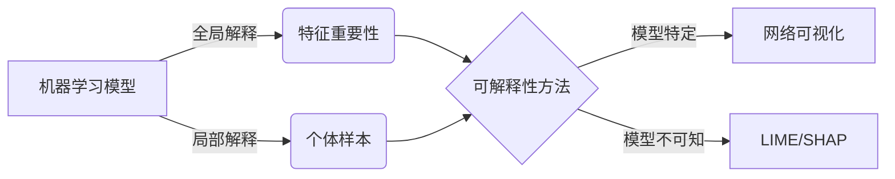

# 模型可解释性原理与代码实战案例讲解

关键词：机器学习、深度学习、模型可解释性、SHAP、LIME、代码实战

## 1. 背景介绍
### 1.1 问题的由来
随着人工智能和机器学习技术的快速发展,越来越多的黑盒模型被应用到各个领域。这些高度复杂的模型虽然在预测和决策方面表现出色,但其内部工作机制却难以被人们所理解。模型的不透明性引发了人们对其公平性、问责制、安全性等方面的担忧。因此,如何让机器学习模型变得可解释,成为了学术界和工业界共同关注的重要课题。

### 1.2 研究现状
目前,学术界针对模型可解释性已经开展了大量研究。一方面,研究者们从因果推理、知识表示等角度提出了多种理论框架,试图从根本上阐释机器学习模型的决策逻辑。另一方面,LIME、SHAP等可解释性方法被提出,它们从不同层面(如特征重要性、个体解释等)来揭示模型的内部机制。工业界对此也高度重视,许多知名科技公司纷纷推出自己的可解释性工具,以提升其AI系统的透明度。

### 1.3 研究意义
模型可解释性研究具有重要意义:
1. 提升用户信任:当用户能够理解模型的决策依据时,他们会对系统产生更多信任,这有利于AI的普及应用。
2. 促进模型优化:可解释性分析有助于发现模型存在的问题,如数据偏差、过拟合等,从而指导算法改进。  
3. 保障系统安全:当模型被应用于自动驾驶、医疗诊断等高风险场景时,可解释性是确保系统安全可靠的关键。
4. 助力知识发现:从复杂模型中提取可解释的规则,有望发现新的有价值的知识,推动科学进步。

### 1.4 本文结构
本文将重点介绍模型可解释性的核心概念、常用算法、数学原理以及代码实践。第2部分阐述可解释性的内涵和分类。第3部分详细讲解LIME、SHAP等经典算法。第4部分深入探讨相关数学模型和公式。第5部分提供Python代码实战案例。第6部分讨论可解释性在实际场景中的应用。第7部分推荐相关学习资源。第8部分对全文进行总结展望。

## 2. 核心概念与联系
模型可解释性是指让人能够理解机器学习模型输出结果背后的推理过程,即决策依据是什么,为什么做出这样的判断。它是智能系统透明度、可信性的基础。

根据对象和粒度,可解释性可分为:
- 全局可解释性:揭示模型整体上的决策逻辑,关注不同特征对预测结果的相对重要性。
- 局部可解释性:解释模型对于个体样本的预测,强调单个特征值与输出的因果关联。
- 模型特定的可解释性:针对某个具体模型(如神经网络)设计的解释方法。
- 模型不可知的可解释性:适用于多种模型的通用解释方法(如LIME)。

从方法论角度看,可解释性与特征选择、知识蒸馏等概念联系紧密。特征选择揭示了不同特征的预测力;知识蒸馏将复杂模型的知识提炼为简单、可解释的形式。后文将重点介绍几种代表性的模型不可知的可解释性方法。



## 3. 核心算法原理 & 具体操作步骤
### 3.1 算法原理概述
本节重点介绍两种经典的模型不可知的局部可解释性方法:LIME和SHAP。它们的基本思想是在待解释样本附近的局部区域内,用一个可解释的简单模型(如线性模型)来近似原始的复杂模型,然后将简单模型的系数作为特征重要性。二者的主要区别在于对局部区域的定义和简单模型求解方式的不同。

### 3.2 算法步骤详解
#### 3.2.1 LIME
LIME (Local Interpretable Model-agnostic Explanations)的步骤如下:
1. 对待解释样本 $x$ 进行扰动,在其附近采样得到一个扰动数据集 $\{z_i\}$。
2. 对每个扰动样本 $z_i$,用原模型 $f$ 预测其输出 $f(z_i)$。
3. 基于 $\{z_i, f(z_i)\}$ 训练一个可解释的简单模型 $g$ (如Lasso),使其在 $x$ 的邻域内尽可能逼近 $f$。
4. 将 $g$ 的系数作为 $x$ 的各特征的重要性得分。

LIME 的核心是局部可解释模型 $g$ 的求解,目标函数为:

$$
\arg\min_{g \in G} L(f, g, \pi_x) + \Omega(g)
$$

其中 $L$ 衡量 $g$ 与 $f$ 在 $x$ 邻域内的近似程度,$\Omega$ 表示 $g$ 的复杂度。$\pi_x$ 为 $x$ 的局部权重分布,常用高斯核函数。

#### 3.2.2 SHAP
SHAP (SHapley Additive exPlanations)基于博弈论中的Shapley值,将特征看作参与"预测游戏"的玩家,并赋予其贡献度。步骤为:
1. 列举所有可能的特征子集 $S \subseteq F$。
2. 对每个子集 $S$,训练一个在 $S$ 上的条件期望模型 $f_S$,即固定 $S$ 中的特征,其余特征取边缘分布的期望。
3. 计算每个特征 $i$ 的Shapley值:
$$
\phi_i=\sum_{S\subseteq F \backslash\{i\}} \frac{|S|!(|F|-|S|-1)!}{|F|!} [f_{S\cup\{i\}}(x_{S\cup\{i\}})-f_S(x_S)]
$$
4. $\phi_i$ 即为特征 $i$ 的重要性得分,所有特征的Shapley值加和即为模型输出。

直接列举所有 $S$ 计算量过大,因此SHAP提出了多种近似算法,如KernelSHAP、TreeSHAP等。

### 3.3 算法优缺点
- LIME的优点是计算效率高,可解释性强,适用于各种模型。缺点是对扰动的定义有随意性,鲁棒性不够。  
- SHAP的优点是具有公平属性,即所有特征的贡献度加和与模型输出一致。缺点是计算量大,对特征有独立性假设。

### 3.4 算法应用领域
LIME和SHAP已在多个领域得到应用,如:
- 医疗诊断:解释疾病预测模型,找出影响患者病情的关键生理指标。
- 金融风控:解释个人信用评分,分析逾期还款的主要因素。
- 故障检测:解释工业设备健康预测,定位潜在故障根源。  

这些应用有助于提升相关系统的可信度和专家对模型的认可度。未来,可解释性有望进一步推动AI在更广领域的落地。

## 4. 数学模型和公式 & 详细讲解 & 举例说明
### 4.1 数学模型构建
LIME和SHAP都涉及一个关键的数学模型——用简单可解释模型去局部逼近复杂模型。以线性模型为例,设复杂模型为 $f$,简单模型为 $g$,待解释样本为 $x$,其扰动邻域为 $\mathcal{N}_x$,则 $g$ 的目标函数可表示为:

$$
\arg\min_g \mathbb{E}_{z\sim \mathcal{N}_x}[f(z)-g(z')]^2 + \Omega(g) \\
s.t. \quad g(z') = w_0 + \sum_{i=1}^d w_iz_i'
$$

其中 $z'$ 为 $z$ 的解释性表示(如离散化或分段常数函数), $\Omega(g)$ 为 $g$ 的复杂度正则项(如L1范数),$w_i$ 即为特征 $i$ 的重要性。

### 4.2 公式推导过程
以LIME为例,其目标函数可细化为:

$$
\arg\min_g \sum_{z\in\mathcal{N}_x} \pi_x(z) [f(z)-g(z')]^2 + \lambda ||w||_1 \\
\pi_x(z) = \exp(-D(x,z)^2/\sigma^2)
$$

$\pi_x(z)$ 为 $z$ 与 $x$ 的相似度权重,常采用高斯核函数, $D(x,z)$ 为 $x$ 与 $z$ 的距离度量。求解上式即得到各特征的LIME重要性。

对于SHAP,其特征重要性定义为Shapley值:

$$
\phi_i(f,x) = \sum_{S\subseteq F\backslash \{i\}} \frac{|S|!(|F|-|S|-1)!}{|F|!} [f_S(x_S)-f_{S\backslash\{i\}}(x_{S\backslash\{i\}})]
$$

其中 $f_S(x_S)=\mathbb{E}[f(x)|x_S]$ 为条件期望。Shapley值可视为特征 $i$ 对所有可能子集的边际贡献之平均。

### 4.3 案例分析与讲解
下面以一个简单的二分类任务为例,直观展示LIME的解释结果。设有4个特征:年龄、收入、学历、信用记录,目标是预测客户是否会购买某产品。

```python
import lime
import sklearn.ensemble
import numpy as np

# 训练一个随机森林模型
rf = sklearn.ensemble.RandomForestClassifier(n_estimators=500)
rf.fit(X_train, y_train)

# 待解释样本
customer = np.array([40, 80000, 'Bachelor', 'Good'])

# LIME解释
explainer = lime.lime_tabular.LimeTabularExplainer(X_train, feature_names=feature_names, class_names=['Not Buy', 'Buy'], discretize_continuous=True)
exp = explainer.explain_instance(customer, rf.predict_proba, num_features=4)
exp.show_in_notebook(show_table=True, show_all=False)
```


解释结果表明,收入是影响该客户购买决定的最重要特征,其次是信用记录。这为营销策略提供了有价值的参考。

### 4.4 常见问题解答
- 问:LIME 和 SHAP 的解释是否具有一致性?
- 答:两者得到的特征重要性排序可能不同,因为衡量标准不一样。但它们都能揭示主导模型预测的关键特征。实践中可以结合多种方法,以提升解释的鲁棒性。

- 问:这些可解释性方法是否适用于任何模型和数据?
- 答:理论上适用于所有模型,但对于高度非线性、特征交互强的模型(如深度神经网络),线性假设的局部可解释性可能不够准确,需要更复杂的探索。此外,对于非结构化数据如图像,还需要引入可解释的特征表示。

## 5. 项目实践：代码实例和详细解释说明
### 5.1 开发环境搭建
首先安装必要的Python库:
```bash
pip install lime shap sklearn matplotlib
```

### 5.2 源代码详细实现
以下代码展示了如何用SHAP解释一个房价预测模型:

```python
from sklearn.ensemble import RandomForestRegressor
from sklearn.datasets import fetch_california_housing
import shap

# 加载数据集
X, y = fetch_california_housing(return_X_y=True)
feature_names = ['MedInc', 'HouseAge', 'AveRooms', 'AveBedrms', 'Population', 'AveOccup', 'Latitude', 'Longitude']

# 训练随机森林模型
model = RandomForestRegressor(n_estimators=100, max_depth=5)
model.fit(X, y)

# 利用TreeExplainer解释模型
explainer = shap.TreeExplainer(model) 
shap_values = explainer