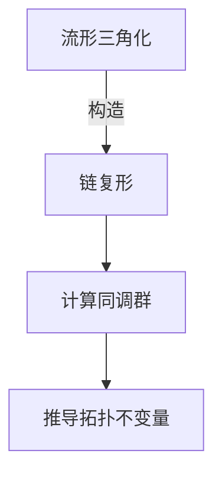

# 流形拓扑学：相关代数理论

## 1. 背景介绍

### 1.1 问题的由来

拓扑学是一门研究空间几何性质的数学分支,特别关注空间的连续性和不变性。流形是拓扑学中的一个核心概念,它是一种在局部看起来像欧几里得空间的空间。流形拓扑学是拓扑学的一个重要分支,研究流形的拓扑性质。

流形拓扑学的理论基础来自代数拓扑学,后者是将代数和拓扑学结合起来研究空间的代数不变量。代数拓扑学为流形拓扑学提供了强有力的工具,如同调群、上同调群、奇点理论等,用于描述和分类流形的拓扑性质。

### 1.2 研究现状

流形拓扑学在过去几十年中取得了长足的进展,成为数学和物理学的一个活跃研究领域。著名的庞加莱猜想、几何化猜想和里曼几何化猜想等重大数学问题的解决都与流形拓扑学密切相关。

同时,流形拓扑学也在许多应用领域发挥着重要作用,如相对论、量子场论、量子计算、计算机图形学、计算机视觉、机器人技术等。流形拓扑学为这些领域提供了描述和分析曲面、曲线等几何对象的强有力工具。

### 1.3 研究意义

深入研究流形拓扑学及其相关代数理论,对于推进数学和物理学的发展具有重要意义。从理论层面来看,它有助于解决一些长期悬而未决的数学难题,拓展人类对空间结构的认知。从应用层面来看,它为处理复杂的几何问题提供了有效的数学工具,在许多科学和工程领域都有广泛的应用前景。

### 1.4 本文结构

本文将系统地介绍流形拓扑学的相关代数理论。首先阐述流形和代数拓扑学的核心概念,探讨它们之间的内在联系。接下来详细讲解流形拓扑学的核心算法原理和数学模型,并结合具体案例进行分析。然后介绍流形拓扑学在实际应用中的场景,以及相关的工具和资源。最后总结流形拓扑学的研究成果,展望其未来发展趋势和面临的挑战。

## 2. 核心概念与联系

在深入探讨流形拓扑学的相关代数理论之前,我们需要先了解一些核心概念,以及它们之间的内在联系。

### 2.1 流形(Manifold)

流形是局部类似于欧几里得空间的拓扑空间。更精确地说,一个流形是一个拓扑空间,它在每一点都有着与欧几里得空间相同的局部性质。

形式上,一个n维流形M是一个拓扑空间,对于M中的每一点p,都存在一个开邻域U,使得U同构于R^n的一个开子集。这种同构映射被称为坐标卡(chart)。

流形的例子包括平面、球面、环面等。它们在局部看起来都像欧几里得空间,但在全局上可能存在曲率或其他特征。

### 2.2 拓扑不变量(Topological Invariant)

拓扑不变量是指在拓扑等价变换下保持不变的量。它们是研究空间拓扑性质的重要工具,因为它们能够区分不同的拓扑空间。

常见的拓扑不变量包括欧拉特征数、同调群、上同调群等。这些不变量能够描述空间的连通性、洞穿结构、奇异性等拓扑特征。

### 2.3 同调理论(Homology Theory)

同调理论是代数拓扑学的核心部分,它研究拓扑空间的代数不变量。同调群是同调理论中最重要的不变量,它能够描述空间的"洞"结构。

给定一个拓扑空间X,我们可以构造出一系列同调群H_n(X),其中n是维数。第n个同调群H_n(X)描述了X中n维"洞"的代数结构。例如,H_0描述连通分量的个数,H_1描述环路的个数,H_2描述球面的个数,等等。

同调理论为流形拓扑学提供了强有力的工具,能够精确地描述和分类流形的拓扑性质。

### 2.4 流形与代数拓扑学的联系

流形和代数拓扑学之间存在着内在的联系。一方面,流形本身就是拓扑空间的一种,因此可以应用代数拓扑学的理论和方法来研究流形的拓扑性质。另一方面,流形也为代数拓扑学提供了丰富的研究对象,推动了代数拓扑学理论的发展。

具体来说,我们可以计算流形的同调群、上同调群等代数不变量,从而获得流形的拓扑分类信息。同时,流形上的向量丛、微分形式等结构也为代数拓扑学提供了新的研究课题。

总的来说,流形拓扑学和代数拓扑学是相互促进、相辅相成的关系。它们的结合为解决复杂的几何拓扑问题提供了有力工具。

## 3. 核心算法原理与具体操作步骤

### 3.1 算法原理概述

在研究流形拓扑学时,我们经常需要计算流形的同调群、上同调群等代数不变量。这些不变量能够描述流形的拓扑性质,如连通分量、洞穿结构、奇异性等。计算这些不变量的过程就是流形拓扑学的核心算法。

算法的基本思路是:首先将流形三角化,即将其分割成简单的单元(如单体);然后构造出这些单元的链复形,并计算其同调群;最后根据同调群的信息推导出流形的拓扑不变量。

这个过程涉及到了代数拓扑学中的许多概念和理论,如单射、链复形、边界算子、同伦等。下面我们将详细介绍算法的具体步骤。

### 3.2 算法步骤详解

1. **流形三角化**

   第一步是将流形三角化,即将其分割成简单的单元。常用的单元包括单体(simplex)、立方体等。三角化的目的是将复杂的流形空间离散化,从而方便后续的计算。

   对于低维流形(如曲面),我们可以手动构造三角化。对于高维流形,则需要使用计算机辅助的三角化算法,如增量算法、约化算法等。

2. **构造链复形**

   接下来,我们需要根据三角化的结果构造出链复形(chain complex)。链复形是一系列由单元(如单体)构成的链群,以及将它们连接起来的边界算子(boundary operator)。

   设流形的三角化由n维单体组成,我们可以定义n+1个链群C_i,其中C_i由所有i维单体生成。边界算子∂_i:C_i→C_{i-1}将i维单体映射到它们的边界,即由(i-1)维单体构成的形式之和。

   链复形的形式为:
   $$
   \cdots \xrightarrow{\partial_{i+1}} C_i \xrightarrow{\partial_i} C_{i-1} \xrightarrow{\partial_{i-1}} \cdots
   $$
   其中$\partial_{i+1} \circ \partial_i = 0$,这就是著名的"边界的边界为零"定理。

3. **计算同调群**

   有了链复形,我们就可以计算它的同调群(homology group)了。第i个同调群H_i(X)定义为:
   $$
   H_i(X) = \ker(\partial_i) / \text{im}(\partial_{i+1})
   $$
   其中ker(∂_i)表示边界为零的i维链的集合,im(∂_{i+1})表示(i+1)维链的边界的集合。

   直观上,H_i(X)描述了X中i维"洞"的代数结构。例如,H_0描述连通分量的个数,H_1描述环路的个数,H_2描述球面的个数,等等。

   计算同调群的具体方法包括构造边界矩阵、计算矩阵的秩等线性代数技术。对于简单的流形,我们可以直接计算;对于复杂的流形,则需要借助计算机代数系统。

4. **推导拓扑不变量**

   最后一步是根据同调群的信息推导出流形的其他拓扑不变量,如欧拉特征数、向量丛、微分形式等。这些不变量能够全面描述流形的拓扑性质,对分类和应用研究都很有帮助。

   例如,对于紧致流形M,它的欧拉特征数χ(M)可以由同调群按如下公式计算:
   $$
   \chi(M) = \sum_{i=0}^n (-1)^i \text{rank}(H_i(M))
   $$

总的来说,流形拓扑学的核心算法就是通过三角化、构造链复形、计算同调群,最终推导出流形的各种拓扑不变量。这个过程将代数和拓扑学巧妙地结合在一起,为研究复杂的几何对象提供了强有力的工具。

### 3.3 算法优缺点

流形拓扑学的核心算法具有以下优点:

1. **理论基础坚实**:算法基于代数拓扑学的严格数学理论,具有坚实的理论基础。

2. **适用范围广泛**:该算法可以应用于各种维度和类型的流形,具有很强的通用性。

3. **计算结果精确**:算法能够精确计算出流形的同调群和其他拓扑不变量,而不是近似值。

4. **可视化直观**:通过将流形三角化,我们可以直观地可视化流形的结构,有助于理解和分析。

5. **可计算机实现**:算法的步骤可以用代码实现,从而利用计算机的计算能力处理复杂的流形。

然而,该算法也存在一些缺点和局限性:

1. **计算复杂度高**:对于高维复杂的流形,算法的计算量会快速增长,给计算带来巨大挑战。

2. **三角化质量影响**:流形的三角化质量直接影响后续计算的精度,而高质量三角化本身就是一个难题。

3. **不适用于非紧致流形**:该算法主要适用于紧致(compact)流形,对于非紧致流形可能需要修改或使用其他方法。

4. **仅获取代数信息**:同调群等代数不变量只能描述流形的代数拓扑结构,而无法获取几何信息(如曲率等)。

5. **理论发展滞后**:虽然算法理论基础坚实,但相比几何拓扑学等领域,代数拓扑学的理论发展相对滞后。

总的来说,流形拓扑学的核心算法是一种强有力的工具,但也存在一些局限性。在实际应用中,我们需要根据具体问题选择合适的方法,或者将该算法与其他技术相结合,以获得更好的效果。

### 3.4 算法应用领域

流形拓扑学的核心算法及其相关理论在许多领域都有重要应用,包括但不限于:

1. **数学**:解决一些长期悬而未决的数学难题,如庞加莱猜想、几何化猜想等,都与流形拓扑学密切相关。

2. **物理学**:相对论、量子场论、量子计算等物理学领域都需要借助流形拓扑学的理论和方法。例如,爱因斯坦的广义相对论就是建立在流形的基础之上的。

3. **计算机图形学**:流形拓扑学为处理曲面、曲线等几何对象提供了有力工具,在3D建模、动画制作等领域有广泛应用。

4. **计算机视觉**:图像分割、目标识别等计算机视觉任务都可以借助流形拓扑学的理论,将图像数据转化为拓扑不变量进行分析。

5. **机器人技术**:机器人需要对环境进行建模和路径规划,流形拓扑学可以为此提供理论支持。