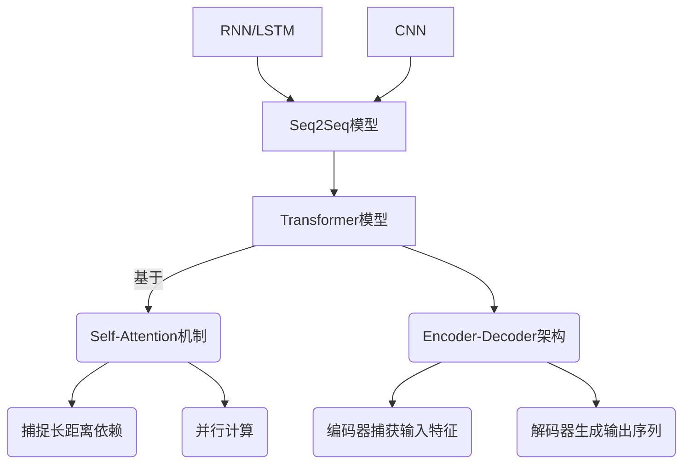

# 测试Transformer模型

## 1. 背景介绍

### 1.1 问题的由来

在自然语言处理(NLP)领域中,Transformer模型凭借其出色的性能,成为了当前主流的序列到序列(Seq2Seq)模型架构。传统的Seq2Seq模型如RNN(循环神经网络)和LSTM(长短期记忆网络)在处理长序列时存在梯度消失或梯度爆炸的问题,难以有效捕捉长距离依赖关系。而Transformer则通过全新的自注意力(Self-Attention)机制,能够直接对输入序列中任意两个位置之间的元素建模,从而更好地捕捉长距离依赖关系。

然而,在实际应用中,我们经常需要评估和测试Transformer模型的性能表现。这不仅有助于了解模型的优缺点,还可以指导模型的优化和改进。因此,如何有效地测试Transformer模型,成为了一个值得探讨的重要课题。

### 1.2 研究现状  

目前,测试Transformer模型的方法主要包括:

1. **基准测试(Benchmark Testing)**: 在标准数据集上评估模型的性能指标,如BLEU分数、困惑度等。常用的基准测试数据集包括WMT、IWSLT、SQuAD等。

2. **黑盒测试(Black-box Testing)**: 将模型视为一个黑盒,输入样例数据,观察输出结果是否符合预期。这种方法简单直观,但难以深入分析模型内部机理。

3. **可解释性分析(Interpretability Analysis)**: 通过可视化注意力权重、嵌入向量等,分析模型内部的决策过程,以更好地理解模型行为。

4. **对抗攻击(Adversarial Attack)**: 构造对抗样例,测试模型对微小扰动的鲁棒性。这有助于发现模型的弱点并加以改进。

5. **语义分析(Semantic Analysis)**: 评估模型在捕捉语义和上下文方面的能力,如同义词替换、词义消歧等任务。

虽然现有方法为测试Transformer模型提供了一些思路,但仍存在一些不足,如缺乏系统性、难以全面评估模型等。因此,需要探索更加完备和高效的测试方法。

### 1.3 研究意义

全面、系统地测试Transformer模型具有重要意义:

1. **发现模型缺陷**: 通过测试可以发现模型在某些特定情况下的性能瓶颈,为后续优化提供依据。

2. **提高模型鲁棒性**: 测试有助于增强模型对噪声、对抗样例等的鲁棒性,提升其在实际应用中的可靠性。

3. **促进模型解释性**: 可解释性分析有助于理解模型内部机理,为模型改进提供指导。

4. **指导模型选择**: 通过对比测试,可以更好地评估不同Transformer模型的优缺点,为实际应用选择合适的模型。

5. **推动模型创新**: 测试有助于发现模型的局限性,从而促进新模型和新方法的提出。

综上所述,研究Transformer模型测试方法,对于提高模型性能、可解释性和可靠性,乃至推动NLP领域的发展,都具有重要意义。

### 1.4 本文结构

本文将系统介绍如何测试Transformer模型。具体来说:

1. 阐述Transformer模型的核心概念及其与其他模型的联系。(第2部分)  
2. 详细解释Transformer模型的核心算法原理和具体操作步骤。(第3部分)
3. 介绍Transformer模型的数学建模过程,推导关键公式并举例说明。(第4部分)  
4. 通过实例项目,展示如何编写Transformer模型代码并解释实现细节。(第5部分)
5. 探讨Transformer模型在不同领域的实际应用场景。(第6部分)
6. 推荐相关工具、学习资源和研究论文,以供进一步学习。(第7部分)
7. 总结Transformer模型的发展趋势和面临的挑战。(第8部分)
8. 附录常见问题解答,以便读者更好地理解和掌握相关知识。(第9部分)

## 2. 核心概念与联系

Transformer是一种全新的基于Self-Attention机制的Seq2Seq模型架构。与传统的RNN、LSTM和CNN等模型相比,它具有以下核心概念:

1. **Self-Attention机制**:通过计算输入序列中每个元素与其他元素的相关性,直接对长距离依赖建模,避免了RNN/LSTM中的梯度消失/爆炸问题。

2. **并行计算**:Self-Attention可以并行计算,大大提高了训练效率。而RNN/LSTM由于序列化计算,速度较慢。

3. **Encoder-Decoder架构**:编码器捕获输入序列特征,解码器生成目标输出序列,类似于传统Seq2Seq模型。

4. **多头注意力(Multi-Head Attention)**:通过多个注意力子层并行捕捉不同位置的依赖关系,提高了模型表达能力。

5. **位置编码(Positional Encoding)**:因为Self-Attention没有捕捉序列顺序的能力,引入位置编码来提供位置信息。

Transformer凭借其创新的注意力机制和高效的并行计算能力,在机器翻译、文本生成、问答系统等任务中表现出色,成为NLP领域的里程碑式模型。

## 3. 核心算法原理 & 具体操作步骤

### 3.1 算法原理概述

Transformer的核心是Self-Attention机制,其原理可概括为:对于序列中的每个元素,计算其与序列中所有其他元素的相关性分数,并据此生成该元素的表示向量。这种方式能够直接捕捉任意距离元素之间的依赖关系。

具体来说,Self-Attention的计算过程包括三个投影向量:Query(查询)、Key(键)和Value(值),分别对应注意力机制中的查询、存储和值的作用。对于序列中的每个元素,通过与所有元素的Key向量计算相关性分数(注意力权重),并将其与Value向量加权求和,得到该元素的注意力表示。

此外,Transformer还采用了多头注意力机制,即对Query、Key和Value分别做多个线性投影,并行计算多个注意力表示,最后将它们拼接起来,捕捉不同子空间的依赖关系。

### 3.2 算法步骤详解

1. **输入表示**:将输入序列(如文本)转换为向量表示,通常使用词嵌入或子词嵌入。

2. **位置编码**:由于Self-Attention没有顺序信息,需要为每个位置添加位置编码,以提供位置信息。

3. **多头注意力计算**:
    - 线性投影:将输入分别投影到Query、Key和Value空间。
    - 相似度计算:计算Query与所有Key的相似度得到注意力分数。
    - 加权求和:将注意力分数与Value加权求和,得到注意力表示。
    - 多头拼接:对多个注意力子层的结果进行拼接。

4. **前馈网络**:对注意力输出进行两层全连接的非线性变换,获得最终的输出表示。

5. **Layer Norm**:对每个子层的输出进行层归一化,以防止梯度消失或爆炸。

6. **残差连接**:将每个子层的输出与输入相加,以更好地传播梯度。

7. **Mask**:在解码器端,对未来位置的输出进行掩码,以防止模型利用将来的信息。

8. **输出**:对编码器输出进行线性映射和softmax,生成目标序列概率分布。

以上步骤在编码器和解码器中会有所不同,但基本原理相似。

### 3.3 算法优缺点

**优点**:

- 并行计算,训练速度快
- 直接对长距离依赖建模
- 避免了RNN/LSTM的梯度问题
- 多头注意力增强了表达能力

**缺点**:

- 计算复杂度较高,对GPU要求较高
- 对长序列的性能下降较快
- 缺乏对序列顺序的建模能力
- 需要大量数据和计算资源进行预训练

### 3.4 算法应用领域

Transformer模型及其变体在NLP领域有着广泛的应用:

- **机器翻译**:Google、微软等公司的机器翻译系统基于Transformer。
- **文本生成**:GPT、BART等大型语言模型用于文本生成、摘要等任务。
- **问答系统**:BERT、XLNet等预训练模型在阅读理解、问答等任务上表现优异。
- **自然语言推理**:Transformer编码器用于捕捉前提和假设之间的关系。
- **对话系统**:用于生成自然的对话响应。
- **代码生成**:基于Transformer的模型可用于代码补全、代码生成等任务。

此外,Transformer的思想也被应用到了计算机视觉、语音识别等其他领域。

## 4. 数学模型和公式 & 详细讲解 & 举例说明

### 4.1 数学模型构建

Transformer的数学模型主要由以下几个部分构成:

1. **输入表示**:输入序列$X=(x_1, x_2, ..., x_n)$通过嵌入矩阵$W_e$映射为向量表示$\boldsymbol{e}=(e_1, e_2, ..., e_n)$,其中$e_i=W_e x_i$。

2. **位置编码**:为每个位置$i$添加位置编码向量$\boldsymbol{p}_i$,得到最终的输入表示$\boldsymbol{z}_i=e_i+p_i$。

3. **多头注意力**:对于第$l$层,首先将$\boldsymbol{z}^{l-1}$分别线性投影到Query、Key和Value空间:
   $$\begin{aligned}
   \boldsymbol{Q}^l &= \boldsymbol{z}^{l-1}W_Q^l \\
   \boldsymbol{K}^l &= \boldsymbol{z}^{l-1}W_K^l \\
   \boldsymbol{V}^l &= \boldsymbol{z}^{l-1}W_V^l
   \end{aligned}$$

   然后计算注意力分数:
   $$\text{Attention}(\boldsymbol{Q}^l, \boldsymbol{K}^l, \boldsymbol{V}^l) = \text{softmax}\left(\frac{\boldsymbol{Q}^l(\boldsymbol{K}^l)^\top}{\sqrt{d_k}}\right)\boldsymbol{V}^l$$

   其中$d_k$是缩放因子。对于多头注意力,将$h$个注意力头的结果拼接:
   $$\text{MultiHead}(\boldsymbol{Q}, \boldsymbol{K}, \boldsymbol{V}) = \text{Concat}(\text{head}_1, ..., \text{head}_h)W^O$$
   其中$\text{head}_i = \text{Attention}(\boldsymbol{Q}W_i^Q, \boldsymbol{K}W_i^K, \boldsymbol{V}W_i^V)$。

4. **前馈网络**:对注意力输出$\boldsymbol{z}^l$进行两层全连接的非线性变换:
   $$\text{FFN}(\boldsymbol{z}^l) = \max(0, \boldsymbol{z}^lW_1^l + \boldsymbol{b}_1^l)W_2^l + \boldsymbol{b}_2^l$$

5. **Layer Norm和残差连接**:对每个子层的输出进行层归一化和残差连接:
   $$\boldsymbol{z}^{l+1} = \text{LayerNorm}(\boldsymbol{z}^l + \text{SubLayer}(\boldsymbol{z}^l))$$

6. **输出**:对编码器最终输出$\boldsymbol{z}^L$进行线性映射和softmax,生成目标序列概率分布:
   $$P(y_i|y_{<i}, X) = \text{softmax}(W_o\boldsymbol{z}_i^L + \boldsymbol{b}_o)$$

上