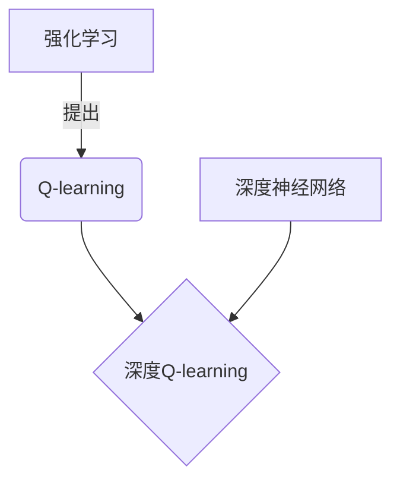

# 深度 Q-learning：在物联网系统中的应用

## 1. 背景介绍

### 1.1 问题的由来

在当今智能化时代,物联网(IoT)系统已经无处不在,从智能家居到工业自动化,再到城市管理等各个领域。这些系统通常由大量的传感器、执行器和网络设备组成,需要实时监控、控制和优化。然而,由于物联网系统的复杂性和动态性,传统的控制方法往往难以满足其需求。

传统的控制系统通常采用规则或模型驱动的方式,需要人工设计和调整控制策略。这种方法在简单场景下可行,但对于复杂的物联网系统,由于环境的不确定性和大量的状态组合,手工设计高效的控制策略将变得极其困难。

### 1.2 研究现状

为了解决这一问题,研究人员开始探索基于强化学习的自适应控制方法。强化学习是一种机器学习范式,通过与环境的交互,智能体(Agent)可以自主学习最优策略,以最大化长期累积奖励。

其中,Q-learning是强化学习中最著名和广泛使用的算法之一。传统的Q-learning算法基于查表的方式存储状态-动作值函数(Q函数),并通过不断更新Q表来逼近最优策略。然而,这种方法在处理大规模、高维状态空间时会遇到"维数灾难"的问题,导致计算效率和存储开销急剧增加。

为了解决这一瓶颈,近年来深度强化学习(Deep Reinforcement Learning)技术应运而生,它将深度神经网络与Q-learning相结合,使用神经网络来逼近Q函数,从而能够有效处理高维、连续的状态空间。深度Q网络(Deep Q-Network, DQN)是深度强化学习中最具代表性的算法之一,它展现出了在多个复杂任务中超越人类水平的能力,如Atari视频游戏和AlphaGo等。

### 1.3 研究意义

将深度Q-learning应用于物联网系统控制具有重要的理论和实践意义:

1. **自适应性强**:深度Q-learning算法可以自主学习最优控制策略,无需人工设计复杂的规则,能够适应动态变化的环境。

2. **处理能力强**:利用深度神经网络的强大函数逼近能力,可以有效处理高维、连续的状态空间,适用于复杂的物联网系统。

3. **优化性能好**:深度Q-learning旨在最大化长期累积奖励,能够从全局角度优化系统性能,提高资源利用效率。

4. **可解释性高**:与黑盒模型不同,深度Q-learning算法的决策过程是可解释的,有助于理解和分析系统行为。

5. **通用性强**:深度Q-learning是一种通用的强化学习框架,可以应用于不同类型的物联网系统,如智能家居、工业自动化等。

因此,将深度Q-learning应用于物联网系统控制是一个极具挑战和潜力的研究方向,有望推动物联网系统向更加智能化和自主化的方向发展。

### 1.4 本文结构

本文将全面介绍深度Q-learning在物联网系统中的应用。首先阐述深度Q-learning的核心概念和基本原理,包括Q-learning、深度神经网络和经验回放等关键技术。接下来详细讲解深度Q-learning算法的数学模型和公式推导过程,并通过实例说明其工作机制。

然后,我们将介绍如何将深度Q-learning应用于实际的物联网系统控制场景,包括智能家居、工业自动化等领域的案例分析。同时,还将分享相关的开发环境搭建、代码实现和运行结果。

最后,我们将总结深度Q-learning在物联网系统中的应用前景,讨论其未来发展趋势和面临的挑战,并给出相关的学习资源和工具推荐。

## 2. 核心概念与联系

在深入探讨深度Q-learning算法之前,我们需要先了解其中涉及的几个核心概念:强化学习(Reinforcement Learning)、Q-learning和深度神经网络(Deep Neural Network)。这些概念虽然来自不同的领域,但在深度Q-learning算法中有着紧密的联系和融合。

### 2.1 强化学习

强化学习是机器学习的一个重要分支,它研究如何基于环境反馈(即奖励或惩罚信号)来学习最优策略,以最大化长期累积奖励。

在强化学习中,有两个关键角色:智能体(Agent)和环境(Environment)。智能体通过与环境交互来学习,它根据当前状态选择一个动作,环境则根据这个动作转移到下一个状态,并给出对应的奖励信号。智能体的目标是学习一个策略(Policy),使长期累积奖励最大化。

强化学习的数学框架通常建模为马尔可夫决策过程(Markov Decision Process, MDP),其中状态满足马尔可夫性质,即下一状态的转移只依赖于当前状态和动作,与历史状态无关。

### 2.2 Q-learning

Q-learning是强化学习中最著名和广泛使用的算法之一,它属于无模型的时序差分(Temporal Difference, TD)学习方法。

Q-learning的核心思想是学习一个动作值函数Q(s,a),它估计在当前状态s下选择动作a,之后能获得的最大期望累积奖励。通过不断更新Q值表,Q-learning算法可以逐步逼近最优策略。

Q-learning算法的更新规则如下:

$$Q(s_t, a_t) \leftarrow Q(s_t, a_t) + \alpha \left[ r_t + \gamma \max_{a} Q(s_{t+1}, a) - Q(s_t, a_t) \right]$$

其中:
- $\alpha$ 是学习率,控制学习的速度
- $\gamma$ 是折现因子,权衡即时奖励和长期奖励
- $r_t$ 是在时刻t获得的即时奖励
- $\max_{a} Q(s_{t+1}, a)$ 是在状态$s_{t+1}$下可获得的最大Q值,代表了最优行为

通过不断更新Q值表,Q-learning算法可以最终收敛到最优策略。然而,在处理大规模、高维状态空间时,查表方式将遇到"维数灾难"的问题,计算效率和存储开销急剧增加。

### 2.3 深度神经网络

深度神经网络(Deep Neural Network, DNN)是一种强大的机器学习模型,它由多层神经元组成,能够逼近任意的连续函数。

深度神经网络的基本结构包括输入层、隐藏层和输出层。每一层由多个神经元组成,神经元通过权重参数相互连接。在前向传播过程中,输入数据经过多层非线性变换,最终得到输出结果。在反向传播过程中,通过优化算法(如梯度下降)调整网络权重,使输出结果逼近期望值。

深度神经网络具有强大的函数逼近能力,能够从数据中自动学习出特征表示,因此被广泛应用于计算机视觉、自然语言处理等领域。在深度Q-learning算法中,我们利用深度神经网络来逼近Q函数,从而解决传统Q-learning在高维状态空间下的瓶颈问题。

### 2.4 深度Q-learning

深度Q-learning(Deep Q-Network, DQN)算法将Q-learning和深度神经网络有机结合,是深度强化学习的代表性算法之一。

在深度Q-learning中,我们使用一个深度神经网络来逼近Q函数,即$Q(s,a;\theta) \approx Q^*(s,a)$,其中$\theta$是网络的权重参数。通过minimizing下式的均方误差损失函数,可以学习到最优的Q函数逼近:

$$L(\theta) = \mathbb{E}_{(s,a,r,s')\sim U(D)}\left[(r + \gamma \max_{a'} Q(s',a';\theta^-) - Q(s,a;\theta))^2\right]$$

其中:
- $U(D)$是经验回放池(Experience Replay Buffer),用于存储过去的状态转移样本$(s,a,r,s')$,从而打破相关性,提高数据利用率。
- $\theta^-$是目标网络(Target Network)的权重,用于估计$\max_{a'} Q(s',a';\theta^-)$,以提高训练稳定性。

深度Q-learning算法的训练过程包括以下几个关键步骤:

1. 初始化深度Q网络和目标网络,两个网络的权重参数相同
2. 在每一个时间步,选择一个动作(利用$\epsilon$-greedy策略平衡探索和利用)
3. 执行动作,观察到新状态和即时奖励,将转移样本存入经验回放池
4. 从经验回放池中采样一个小批量数据,计算均方误差损失函数
5. 使用优化算法(如RMSProp)更新深度Q网络的权重参数
6. 每隔一定步骤,将深度Q网络的权重复制到目标网络

通过上述过程,深度Q-learning算法可以逐步学习到最优的Q函数逼近,从而得到最优的控制策略。

## 3. 核心算法原理 & 具体操作步骤

### 3.1 算法原理概述

深度Q-learning算法的核心思想是利用深度神经网络来逼近Q函数,从而解决传统Q-learning在高维状态空间下的"维数灾难"问题。与传统Q-learning算法相比,深度Q-learning具有以下几个关键特点:

1. **函数逼近**:使用深度神经网络来逼近Q函数,而不是查表存储Q值。这使得算法能够处理高维、连续的状态空间。

2. **经验回放**:引入经验回放池(Experience Replay Buffer)存储过去的状态转移样本,打破数据的相关性,提高数据利用率。

3. **目标网络**:引入目标网络(Target Network)来估计$\max_{a'} Q(s',a';\theta^-)$,提高训练稳定性。

4. **探索与利用**:采用$\epsilon$-greedy策略平衡探索(选择随机动作)和利用(选择当前最优动作),以获得更好的策略。

深度Q-learning算法的训练过程可以概括为以下几个步骤:

1. 初始化深度Q网络和目标网络,两个网络的权重参数相同。
2. 在每一个时间步,根据$\epsilon$-greedy策略选择一个动作。
3. 执行选择的动作,观察到新状态和即时奖励,将转移样本存入经验回放池。
4. 从经验回放池中采样一个小批量数据,计算均方误差损失函数。
5. 使用优化算法(如RMSProp)更新深度Q网络的权重参数。
6. 每隔一定步骤,将深度Q网络的权重复制到目标网络。

通过上述过程,深度Q-learning算法可以逐步学习到最优的Q函数逼近,从而得到最优的控制策略。

### 3.2 算法步骤详解

现在,我们将详细解释深度Q-learning算法的具体步骤:

1. **初始化**

   - 初始化深度Q网络,它是一个多层神经网络,输入为当前状态s,输出为各个动作a对应的Q值Q(s,a)。
   - 初始化目标网络,其权重参数与深度Q网络相同,用于估计$\max_{a'} Q(s',a';\theta^-)$。
   - 初始化经验回放池D,用于存储状态转移样本(s,a,r,s')。

2. **选择动作**

   - 根据$\epsilon$-greedy策略选择动作a:
     - 以概率$\epsilon$选择随机动作(探索)
     - 以概率1-$\epsilon$选择当前Q值最大的动作(利用),即$\max_a Q(s,a;\theta)$
   - $\epsilon$是探索率,通常会随着训练步骤的增加而逐渐减小,以加强利用。

3. **执行动作并存储样本**

   - 在当前状态s下执行选择的动作a。
   - 观察到环境的反馈:新状态s'和即时奖励r。
   - 将状态转移样本(s,a,r,s')存储到经验回放池D中。

4. **采样并