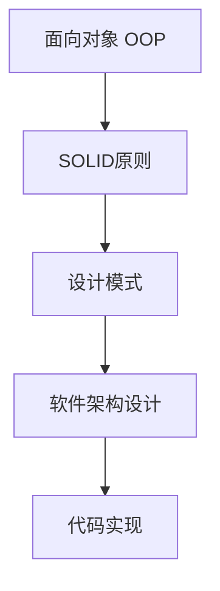
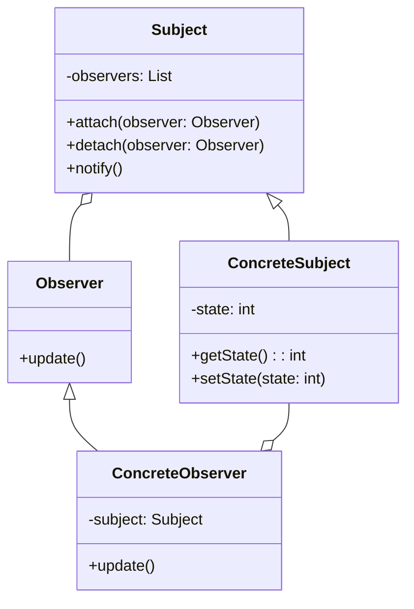

# 设计模式与软件架构原理与代码实战案例讲解

作者：禅与计算机程序设计艺术 / Zen and the Art of Computer Programming

关键词：设计模式、软件架构、面向对象、代码重构、可扩展性、可维护性

## 1. 背景介绍
### 1.1 问题的由来
在软件开发过程中，我们经常会遇到一些反复出现的设计问题，比如如何实现对象创建与使用的解耦、如何让代码更加灵活可扩展、如何降低代码的复杂度等。这些问题如果没有一个好的解决方案，会导致代码质量低下，bug频发，维护成本高昂。

### 1.2 研究现状
为了解决上述问题，软件设计领域的先驱们总结出了一些被反复使用的解决方案，并将其命名为"设计模式"。自1994年《设计模式：可复用面向对象软件的基础》一书出版以来，设计模式已经成为软件工程领域的重要知识体系。目前，设计模式在各种编程语言和应用场景中都得到了广泛应用。

### 1.3 研究意义
深入理解和掌握设计模式，对于提高代码质量、降低开发和维护成本具有重要意义。通过学习设计模式，我们可以站在前人的肩膀上，吸收他们的智慧结晶，少走弯路，写出优雅、灵活、可维护的代码。同时，对设计模式的理解也有助于我们更好地阅读和学习优秀的开源项目代码。

### 1.4 本文结构
本文将从以下几个方面来系统讲解设计模式与软件架构：

1. 设计模式与软件架构的核心概念与联系
2. 常见设计模式的原理、结构、代码实现与应用场景
3. 如何利用设计模式重构一个糟糕的设计
4. 设计模式在实际项目中的综合运用
5. 掌握设计模式应该避免的误区
6. 软件架构设计的原则与方法
7. 常见的软件架构模式解析
8. 从源码解析优秀开源项目的架构设计
9. 总结与展望

## 2. 核心概念与联系
在正式讨论设计模式之前，我们需要先明确几个核心概念：

- 设计模式：在面向对象软件设计过程中总结出来的有代表性的解决方案。设计模式并不是一种具体的代码，而是对代码设计的一种抽象描述。
- 软件架构：软件系统的顶层结构，描述了系统由哪些部分组成，以及各个部分之间的关系。好的软件架构可以满足功能需求，提高系统性能，降低开发风险，确保可扩展性和可维护性。
- 面向对象：一种程序设计范型，以类或对象作为组织代码的基本单元，以封装、继承、多态等概念来实现代码的复用和扩展。设计模式就是在面向对象设计的基础上总结出来的。
- SOLID原则：即单一职责原则、开闭原则、里氏替换原则、接口隔离原则和依赖倒置原则，是评判面向对象设计好坏的重要标准。设计模式就是SOLID原则的具体应用。

可以看出，设计模式与软件架构、面向对象、SOLID原则之间有着密切联系。掌握设计模式离不开对面向对象思想的深刻理解，而设计模式的运用最终要落实到软件架构设计和代码实现中。下图展示了它们之间的关系：



理解了这些核心概念后，我们就可以开始探讨设计模式的奥秘了。

## 3. 核心算法原理 & 具体操作步骤
### 3.1 算法原理概述
设计模式的核心算法原理可以总结为：**找出变化的地方，并将其封装起来**。具体来说，就是把软件系统中需要变化的地方抽象出来，定义成稳定的接口，然后用不同的实现来适应变化。这样，当需求变化时，我们只需要新增或修改实现，而不用修改原有的稳定接口和调用方代码。

### 3.2 算法步骤详解
以下是应用设计模式的一般步骤：

1. 理解需求，分析变化点。首先要深入理解业务需求，分析哪些地方可能会发生变化，这需要一定的经验和前瞻性思考。
2. 定义稳定的接口。找出变化点后，我们要为其定义一个稳定的接口。这个接口一般是一个抽象类或者接口，定义了一些抽象方法，具体实现留给子类。
3. 封装变化的实现。变化的地方在子类中实现，子类实现接口定义的抽象方法。因为变化被封装在子类中，调用方只和接口打交道，所以调用方代码无需修改。
4. 组合和委托。设计模式通过组合和委托的方式来实现代码复用和扩展。比如，策略模式通过组合不同的策略对象来实现算法的灵活切换；装饰器模式通过组合装饰器对象来动态地给对象添加职责。
5. 遵循SOLID原则。在应用设计模式的过程中，要时刻遵循SOLID原则，这样才能设计出松耦合、高内聚、稳定灵活的代码结构。

### 3.3 算法优缺点
设计模式的优点在于：

- 提供了经过验证的解决方案，可以少走弯路
- 提高代码复用性、灵活性和可维护性
- 有助于降低代码复杂度，提高可读性
- 促进形成统一的设计语言，便于沟通

同时设计模式也有一些需要注意的地方：

- 设计模式不是银弹，不能解决所有问题
- 过度使用设计模式会导致代码更加复杂
- 对设计模式的理解需要一定的学习和实践过程

### 3.4 算法应用领域
设计模式在各种应用领域都有广泛应用，比如：

- GUI编程中，MVC、MVP、MVVM等架构模式的实现都运用了观察者模式、组合模式、策略模式等。
- 数据持久层，DAO模式、Repository模式运用了模板方法模式。
- 业务逻辑层，策略模式、模板方法模式、职责链模式被广泛使用。
- 结构型模式如适配器、桥接、组合、装饰器，在系统集成、兼容、扩展方面发挥重要作用。
- 创建型模式如工厂、建造者、单例，在整个系统的对象创建、管理方面提供了很好的解决方案。

## 4. 数学模型和公式 & 详细讲解 & 举例说明
### 4.1 数学模型构建
设计模式虽然不像算法那样有严格的数学模型，但我们可以用UML（Unified Modeling Language）来对其进行建模。UML中的类图可以很好地描述设计模式的静态结构，包括类、接口以及它们之间的关系。而序列图可以描述对象之间的交互和消息传递，展示设计模式的动态行为。

以观察者模式为例，我们可以用下面的类图来表示其结构：



从图中可以看出，Subject（主题）维护了一个Observer（观察者）列表，当Subject状态发生变化时，会通知所有注册的Observer。ConcreteSubject是一个具体的主题，ConcreteObserver是一个具体的观察者。它们分别实现了Subject和Observer定义的接口。

### 4.2 公式推导过程
设计模式的数学公式主要体现在其代码实现中。以观察者模式为例，我们可以用下面的代码来表示Subject的attach、detach和notify操作：

```java
public abstract class Subject {
    private List<Observer> observers = new ArrayList<>();

    public void attach(Observer observer) {
        observers.add(observer);
    }

    public void detach(Observer observer) {
        observers.remove(observer);
    }

    public void notify() {
        for (Observer observer : observers) {
            observer.update();
        }
    }
}
```

这里的核心是notify方法，可以用数学公式表示为：

$$
\forall o \in observers, o.update()
$$

即对observers列表中的每一个元素o，都调用其update方法。这个公式抽象地描述了观察者模式的核心逻辑。

### 4.3 案例分析与讲解
下面我们用一个具体的例子来说明观察者模式的应用。假设我们要开发一个气象站程序，气象站可以测量温度、湿度和气压，并将数据更新给各种显示装置，如手机App、网页、LED大屏等。

我们可以将气象站设计为一个Subject，各种显示装置设计为Observer。当气象站数据更新时，就通知所有注册的显示装置。这样，当需要新增一种显示装置时，只需要新建一个Observer的子类，并注册到气象站即可，不需要修改气象站的代码。

下面是一个简化的代码实现：

```java
public class WeatherStation extends Subject {
    private float temperature;
    private float humidity;
    private float pressure;

    public void setMeasurements(float temperature, float humidity, float pressure) {
        this.temperature = temperature;
        this.humidity = humidity;
        this.pressure = pressure;
        notifyObservers();
    }

    // 省略getter方法
}

public class PhoneDisplay implements Observer {
    public void update(float temperature, float humidity, float pressure) {
        display(temperature, humidity, pressure);
    }

    private void display(float temperature, float humidity, float pressure) {
        System.out.println("Phone: " + temperature + "°C, " + humidity + "%, " + pressure + "hPa");
    }
}

public class WebDisplay implements Observer {
    public void update(float temperature, float humidity, float pressure) {
        display(temperature, humidity, pressure);
    }

    private void display(float temperature, float humidity, float pressure) {
        System.out.println("Web: " + temperature + "°C, " + humidity + "%, " + pressure + "hPa");
    }
}

public class Main {
    public static void main(String[] args) {
        WeatherStation weatherStation = new WeatherStation();
        weatherStation.attach(new PhoneDisplay());
        weatherStation.attach(new WebDisplay());

        weatherStation.setMeasurements(25.0f, 60.0f, 1020.0f);
        weatherStation.setMeasurements(26.0f, 65.0f, 1019.0f);
    }
}
```

运行结果：

```
Phone: 25.0°C, 60.0%, 1020.0hPa
Web: 25.0°C, 60.0%, 1020.0hPa
Phone: 26.0°C, 65.0%, 1019.0hPa
Web: 26.0°C, 65.0%, 1019.0hPa
```

可以看到，当气象站数据更新时，所有的显示装置都会自动更新。这就是观察者模式的威力。

### 4.4 常见问题解答
1. 观察者模式和发布-订阅模式有什么区别？
   - 观察者模式中，观察者和主题是直接耦合的，主题维护了观察者的列表；而发布-订阅模式中，发布者和订阅者是解耦的，它们通过消息队列或中间人来通信。
   - 观察者模式通常是同步的，即主题状态变化后会立即通知观察者；而发布-订阅模式可以是异步的，订阅者可以在任意时间消费消息。
2. 观察者模式的缺点是什么？
   - 如果一个主题有很多直接和间接的观察者，通知所有观察者会花费很多时间。
   - 如果观察者之间有循环依赖，可能导致系统崩溃。
   - 没有相应的机制让观察者知道所观察的主题是怎么发生变化的，仅仅只是知道主题发生了变化。
3. 观察者模式的本质是什么？
   - 观察者模式的本质是通过组合和委托实现了对象间的解耦和复用。主题只需要依赖Observer接口，而不依赖于具体的观察