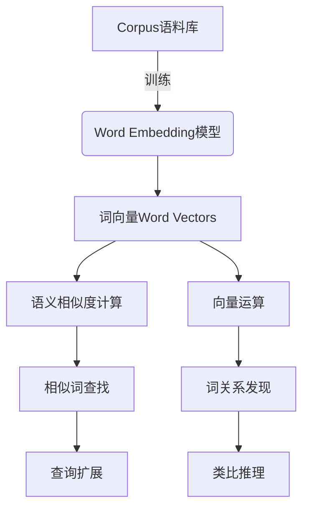
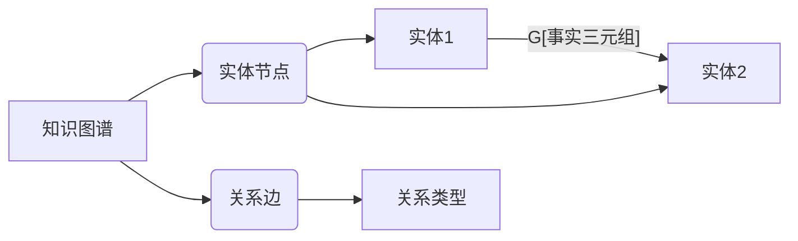
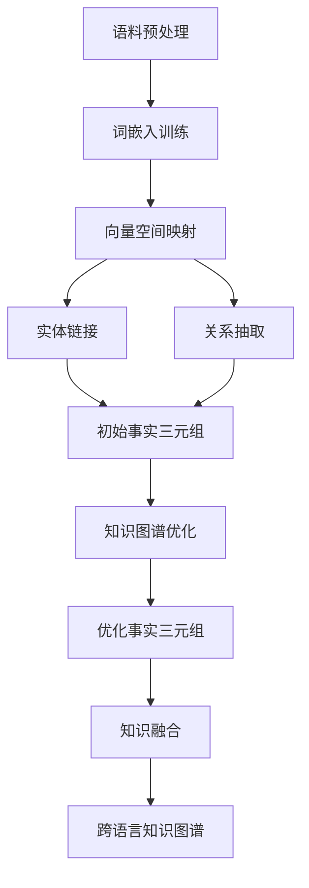

# 词嵌入在跨语言知识图谱构建中的应用

## 1. 背景介绍

### 1.1 问题的由来

在当今的数字时代,信息量呈指数级增长,数据来源也变得越来越多元化。不同语言、不同领域的数据如何有效整合,成为了一个亟待解决的问题。知识图谱作为一种结构化的知识表示形式,可以很好地组织和管理异构数据,支持智能问答、关系推理等应用。然而,构建一个高质量的知识图谱是一项极具挑战的任务,尤其是在跨语言的场景下。

传统的知识图谱构建方法主要依赖于规则和模板,需要大量的人工标注和干预。这不仅成本高昂,而且难以适应不断变化的数据。因此,如何利用自然语言处理和机器学习技术自动化知识图谱的构建过程,成为了一个重要的研究方向。

### 1.2 研究现状

近年来,词嵌入(Word Embedding)技术在自然语言处理领域取得了巨大成功,为知识图谱构建提供了新的思路。词嵌入是一种将词映射到低维连续向量空间的技术,能够有效地捕捉词与词之间的语义和句法关系。基于词嵌入的知识图谱构建方法可以自动从大规模文本数据中提取实体、关系和事实三元组,从而减轻人工标注的负担。

目前,已有多种基于词嵌入的知识图谱构建方法被提出,如TransE、ComplEx等。这些方法通过优化词嵌入向量,使得符合已知事实的向量之间的距离最小化,从而预测新的事实三元组。然而,大多数现有方法都是针对单一语言的知识图谱构建,无法很好地解决跨语言的问题。

### 1.3 研究意义

构建高质量的跨语言知识图谱对于促进不同语言和文化之间的信息交流和知识共享至关重要。它可以支持多种智能应用,如跨语言问答、机器翻译、信息检索等。同时,跨语言知识图谱也为研究不同语言之间的语义关联提供了新的视角和工具。

基于词嵌入的跨语言知识图谱构建方法具有以下优势:

1. **自动化程度高**:能够从大规模文本数据中自动提取知识,减轻人工标注的负担。
2. **语义丰富性**:词嵌入能够很好地捕捉词与词之间的语义关系,有助于构建高质量的知识图谱。
3. **跨语言适用性**:通过将不同语言的词嵌入映射到同一个向量空间,可以实现跨语言的知识融合和推理。

因此,研究基于词嵌入的跨语言知识图谱构建方法,对于推动自然语言处理和知识表示领域的发展具有重要意义。

### 1.4 本文结构  

本文将从以下几个方面深入探讨词嵌入在跨语言知识图谱构建中的应用:

1. 介绍词嵌入和知识图谱的核心概念,阐述二者之间的联系。
2. 详细讲解基于词嵌入的跨语言知识图谱构建算法的原理和具体操作步骤。
3. 建立相关的数学模型,推导公式,并通过案例分析加深理解。
4. 提供一个基于词嵌入的跨语言知识图谱构建项目的代码实例,并进行详细的解释和说明。
5. 探讨基于词嵌入的跨语言知识图谱构建方法在实际应用中的场景和前景。
6. 推荐相关的工具、资源和学习材料,为读者提供进一步学习和实践的途径。
7. 总结研究成果,分析未来发展趋势和面临的挑战,并对未来的研究方向进行展望。

## 2. 核心概念与联系

在深入探讨基于词嵌入的跨语言知识图谱构建方法之前,我们需要先了解词嵌入和知识图谱这两个核心概念,以及它们之间的联系。

### 2.1 词嵌入(Word Embedding)

词嵌入是一种将词映射到低维连续向量空间的技术,能够有效地捕捉词与词之间的语义和句法关系。在传统的自然语言处理方法中,词通常被表示为一个独热向量(One-Hot Vector),即一个只有一个元素为1,其余全为0的高维稀疏向量。这种表示方式无法捕捉词与词之间的语义关联,也不利于进行向量运算。

词嵌入技术通过神经网络模型对大规模语料库进行训练,将每个词映射到一个低维的密集向量空间中。在这个向量空间中,语义相似的词会被映射到彼此靠近的位置,而语义不相关的词则会被映射到较远的位置。这种分布式表示方式不仅能够捕捉词与词之间的语义关系,还可以通过向量运算来发现隐藏的语义联系。

常见的词嵌入模型包括Word2Vec、GloVe、FastText等。这些模型通过不同的训练方式和目标函数,可以学习出高质量的词嵌入向量,广泛应用于自然语言处理的各个领域,如文本分类、机器翻译、情感分析等。

### 2.2 知识图谱(Knowledge Graph)

知识图谱是一种结构化的知识表示形式,它将现实世界中的实体、概念及其关系以图的形式进行组织和存储。在知识图谱中,知识被表示为一个包含实体节点和关系边的有向图。每个实体节点代表一个独立的概念或对象,而关系边则描述实体之间的语义联系。

知识图谱的核心组成部分是事实三元组(Fact Triples),它由主语实体(Subject)、关系(Relation)和宾语实体(Object)三部分组成,用于描述两个实体之间的关系。例如,(张三, 就职于, 谷歌公司)这个事实三元组描述了"张三"和"谷歌公司"之间的"就职于"关系。

构建高质量的知识图谱对于支持智能问答、关系推理、信息抽取等应用至关重要。传统的知识图谱构建方法主要依赖于人工标注和规则,成本高昂且难以适应不断变化的数据。因此,如何利用自然语言处理和机器学习技术自动化知识图谱的构建过程,成为了一个重要的研究方向。

### 2.3 词嵌入与知识图谱的联系

词嵌入和知识图谱虽然来自不同的领域,但二者之间存在着密切的联系。词嵌入技术可以为知识图谱构建提供有力的支持,而知识图谱也可以反过来增强词嵌入模型的性能。

首先,词嵌入可以作为知识图谱构建的重要输入特征。通过将文本中的实体和关系映射到词嵌入向量空间,我们可以利用向量之间的相似性来发现潜在的事实三元组,从而自动构建知识图谱。同时,词嵌入还可以用于实体链接和关系抽取等任务,进一步提高知识图谱的质量。

另一方面,知识图谱也可以反过来增强词嵌入模型的性能。由于知识图谱中蕴含着大量的结构化知识,我们可以将这些知识注入到词嵌入模型的训练过程中,使得学习到的词向量不仅能够捕捉语义信息,还能够融合知识图谱中的结构信息,从而提高词嵌入的质量。

此外,将词嵌入和知识图谱相结合,还可以支持一些新的应用,如知识图谱完善、知识推理、知识库问答等。通过在词嵌入向量空间中进行运算和推理,我们可以发现新的事实三元组,完善现有的知识图谱;或者基于词嵌入向量和知识图谱进行联合推理,回答更加复杂的问题。

总的来说,词嵌入和知识图谱是相辅相成的技术。将二者有机结合,不仅可以提高知识图谱构建的自动化水平和质量,还能够为自然语言处理任务提供更加丰富的语义信息和结构化知识,从而推动整个领域的发展。

## 3. 核心算法原理与具体操作步骤

### 3.1 算法原理概述

基于词嵌入的跨语言知识图谱构建算法的核心思想是:利用词嵌入技术将不同语言的实体和关系映射到同一个低维连续向量空间中,然后在这个共享的向量空间内进行知识图谱的构建和推理。

具体来说,该算法主要包括以下几个关键步骤:

1. **语料预处理**:对原始语料进行分词、词性标注、命名实体识别等预处理,提取出实体mentions和关系mentions。

2. **词嵌入训练**:针对每种语言,分别使用Word2Vec、FastText等模型对语料进行训练,获得该语言的词嵌入向量表示。

3. **向量空间映射**:通过一些监督或无监督的方法,将不同语言的词嵌入向量映射到同一个共享的向量空间中。

4. **实体链接**:将文本中的实体mentions链接到知识库中的实体节点,获得实体的规范化表示。

5. **关系抽取**:从文本中抽取出实体之间的语义关系,构建出初始的事实三元组。

6. **知识图谱优化**:通过一些基于向量空间的知识表示学习方法(如TransE、ComplEx等),对初始的事实三元组进行优化,去除噪声和冗余,并预测新的事实。

7. **知识融合**:将来自不同语言的优化后的事实三元组融合到一个统一的跨语言知识图谱中。

上述步骤中,第3步和第6步是最为关键的环节,它们分别解决了跨语言向量空间映射和知识表示学习的问题。我们将在后续章节中对这两个步骤进行更加详细的介绍和分析。

### 3.2 算法步骤详解

#### 3.2.1 语料预处理

语料预处理是知识图谱构建的基础步骤,它的目标是从原始语料中提取出实体mentions和关系mentions。常见的预处理操作包括:

1. **分词(Tokenization)**:将文本按照一定的规则切分成词序列。

2. **词性标注(Part-of-Speech Tagging)**:为每个词赋予相应的词性标记,如名词、动词、形容词等。

3. **命名实体识别(Named Entity Recognition)**:识别出文本中的命名实体,如人名、地名、组织机构名等,并进行分类。

4. **依存句法分析(Dependency Parsing)**:分析句子中词与词之间的依存关系,有助于关系抽取。

不同的语言在预处理步骤上可能会有所差异,需要使用相应的工具和模型。例如,对于英语可以使用Stanford CoreNLP等工具,而对于中文则可以使用HanLP、jieba等分词器和工具包。

经过预处理后,我们可以从原始语料中获得一系列的实体mentions和关系mentions,为后续的实体链接和关系抽取奠定基础。

#### 3.2.2 词