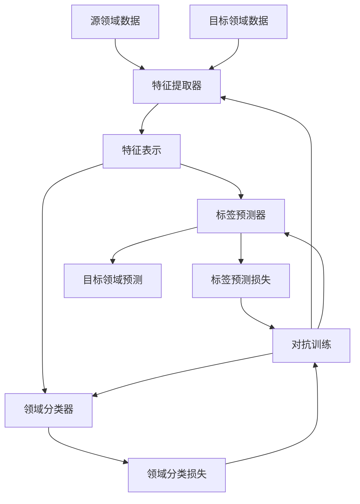

以下是标题为《迁移学习与领域自适应原理与代码实战案例讲解》的技术博客文章正文内容：

# 迁移学习与领域自适应原理与代码实战案例讲解

## 1. 背景介绍

### 1.1 问题的由来

在现实世界中,我们经常会遇到数据分布发生变化的情况。比如,在医疗诊断领域,不同医院的患者数据分布可能存在差异;在计算机视觉领域,由于拍摄角度、光线等因素的变化,同一物体在不同场景下的图像数据分布也会有所不同。这种数据分布发生变化的现象被称为"领域偏移(Domain Shift)"。

传统的机器学习算法通常假设训练数据和测试数据具有相同的数据分布,但在存在领域偏移的情况下,这种假设就不再成立。如果直接将在源领域训练好的模型应用到目标领域,其性能往往会出现明显下降,这就是所谓的"领域适应性差"问题。

### 1.2 研究现状  

为了解决领域适应性差的问题,研究人员提出了迁移学习(Transfer Learning)和领域自适应(Domain Adaptation)等技术。迁移学习旨在将源领域学习到的知识迁移到目标领域,从而加速目标领域的学习过程;而领域自适应则致力于减小源领域和目标领域之间的分布差异,使得在源领域训练的模型能够更好地适应目标领域的数据。

近年来,迁移学习和领域自适应技术在计算机视觉、自然语言处理、医疗健康等多个领域取得了广泛的应用,展现出了巨大的潜力。但与此同时,这些技术也面临着一些挑战,比如如何度量和减小领域差异、如何高效地迁移知识、如何处理异构数据等,这些问题都有待进一步研究和探索。

### 1.3 研究意义

迁移学习和领域自适应技术可以有效解决数据分布变化带来的问题,提高机器学习模型在新领域的适应能力,从而大大节省了数据标注和模型训练的时间和成本。同时,这些技术也为人工智能系统在复杂环境下的鲁棒性和泛化能力提供了有力保障。

因此,深入研究迁移学习和领域自适应的原理及其应用,不仅具有重要的理论意义,也蕴含着广阔的应用前景。本文将系统地介绍迁移学习和领域自适应的核心概念、算法原理、数学模型,并结合具体的代码实例,帮助读者更好地理解和掌握这一领域的知识。

### 1.4 本文结构  

本文共分为9个部分:

- 第1部分为背景介绍,阐述了研究问题的由来、现状和意义;
- 第2部分介绍迁移学习和领域自适应的核心概念及其联系;
- 第3部分详细解释了迁移学习和领域自适应的核心算法原理和具体操作步骤;
- 第4部分构建了相关的数学模型,并推导和讲解了关键公式;
- 第5部分提供了一个完整的代码实例,并对其进行了详细的解释和分析;
- 第6部分列举了迁移学习和领域自适应在实际应用中的场景;
- 第7部分推荐了一些有用的学习资源、开发工具和相关论文;
- 第8部分总结了研究成果,展望了未来发展趋势和面临的挑战;
- 第9部分是附录,回答了一些常见的问题。

## 2. 核心概念与联系

迁移学习(Transfer Learning)和领域自适应(Domain Adaptation)是两个密切相关但又有所区别的概念。

**迁移学习**指的是将在一个领域(源领域)学习到的知识,迁移到另一个领域(目标领域),从而加速目标领域的学习过程。迁移学习的核心思想是:利用已有的知识,减少目标领域所需的训练数据和训练时间。

**领域自适应**则关注于减小源领域和目标领域之间的分布差异,使得在源领域训练的模型能够更好地适应目标领域的数据。领域自适应技术通常分为三类:基于实例的方法、基于特征的方法和基于模型的方法。

迁移学习和领域自适应有着紧密的联系:

- 在存在领域偏移的情况下,如果直接将源领域的模型应用到目标领域,性能往往会下降。这时就需要利用领域自适应技术,减小两个领域之间的分布差异,从而提高模型在目标领域的适应能力。
- 另一方面,迁移学习技术可以帮助我们从源领域迁移有用的知识到目标领域,加速目标领域的学习过程。在进行迁移之前,我们也可以先使用领域自适应技术,使源领域和目标领域的分布更加一致,从而提高迁移的效果。

因此,迁移学习和领域自适应可以相互补充,共同解决领域偏移带来的问题。在实际应用中,我们往往需要结合使用这两种技术,以获得更好的性能。

## 3. 核心算法原理与具体操作步骤

### 3.1 算法原理概述

迁移学习和领域自适应涉及多种不同的算法,其核心原理可以概括为以下几个方面:

1. **特征映射**:将源领域和目标领域的数据映射到一个公共的潜在特征空间,使得两个领域的数据分布在该空间中更加一致。
2. **实例重加权**:通过调整源领域实例的权重,使其分布更接近目标领域的分布,从而减小领域差异。
3. **模型正则化**:在模型训练过程中,引入正则化项,使得模型不仅能很好地拟合源领域数据,同时也能很好地泛化到目标领域。
4. **对抗训练**:通过对抗性训练,使特征提取器学习到领域不变的特征表示,从而提高模型在目标领域的适应能力。

不同的算法采用了上述原理中的一种或多种,并根据具体问题做出相应的改进和扩展。

### 3.2 算法步骤详解

以下将详细介绍一种常用的基于对抗训练的领域自适应算法——RevGrad(Reverse Gradient)算法的具体步骤:

1. **数据准备**:收集源领域数据 $D_S$ 和目标领域数据 $D_T$,其中源领域数据 $D_S$ 是带标签的,目标领域数据 $D_T$ 是无标签的。
2. **特征提取**:使用深度神经网络作为特征提取器 $G_f$,将源领域数据 $x_s$ 和目标领域数据 $x_t$ 映射到特征空间,得到特征表示 $G_f(x_s)$ 和 $G_f(x_t)$。
3. **标签预测**:将源领域数据的特征表示 $G_f(x_s)$ 输入到标签预测器 $G_y$ 中,预测其标签 $\hat{y}_s$。
4. **领域分类**:将源领域和目标领域数据的特征表示 $G_f(x_s)$ 和 $G_f(x_t)$ 输入到领域分类器 $G_d$ 中,预测其领域标签 $\hat{d}_s$ 和 $\hat{d}_t$。
5. **对抗训练**:
   - 最小化标签预测损失 $\mathcal{L}_y$,使得 $G_f$ 和 $G_y$ 能够很好地拟合源领域数据;
   - 最大化领域分类损失 $\mathcal{L}_d$,使得 $G_f$ 学习到领域不变的特征表示,从而使 $G_d$ 无法准确判别数据来自哪个领域。
   
   损失函数为:
   
   $$\min_{G_f,G_y}\max_{G_d} \mathcal{L}(G_f,G_y,G_d) = \mathcal{L}_y(G_f,G_y) - \lambda\mathcal{L}_d(G_f,G_d)$$
   
   其中 $\lambda$ 是权衡两个损失的超参数。通过反向传播,交替优化 $G_f$、$G_y$ 和 $G_d$,直至收敛。
   
6. **目标领域预测**:使用训练好的特征提取器 $G_f$ 和标签预测器 $G_y$,对目标领域数据 $x_t$ 进行特征提取和标签预测,得到预测标签 $\hat{y}_t$。

上述算法的关键在于对抗训练过程,特征提取器 $G_f$ 需要"欺骗"领域分类器 $G_d$,使其无法准确判别数据来自哪个领域,从而学习到领域不变的特征表示。这种对抗性训练策略能够有效减小源领域和目标领域之间的分布差异,提高模型在目标领域的适应能力。

### 3.3 算法优缺点

RevGrad算法的优点在于:

- 思路清晰,易于理解和实现;
- 通过对抗训练,能够有效地减小源领域和目标领域之间的分布差异;
- 无需访问源领域数据的标签信息,只需要目标领域数据是无标签的。

但该算法也存在一些不足之处:

- 对抗训练过程不够稳定,容易出现模型震荡或梯度消失的问题;
- 算法性能依赖于领域分类器的能力,如果领域分类器过于简单,可能无法很好地指导特征提取器学习领域不变的特征表示;
- 只考虑了特征分布的差异,而忽略了条件分布(标签分布)的差异,因此在条件分布发生显著变化的情况下,性能可能会受到影响。

### 3.4 算法应用领域

迁移学习和领域自适应技术可以广泛应用于各个领域,尤其是在以下几个方面:

- **计算机视觉**:处理不同场景、不同光线条件下的图像数据,如目标检测、图像分类等。
- **自然语言处理**:处理不同领域、不同语种的文本数据,如机器翻译、情感分析等。
- **医疗健康**:处理来自不同医院、不同设备的医疗数据,如疾病诊断、医学图像分析等。
- **speech处理**:处理不同环境噪音、不同说话人的语音数据,如语音识别、说话人识别等。
- **其他领域**:如推荐系统、金融风险控制等,只要存在数据分布变化的情况,都可以应用迁移学习和领域自适应技术。

## 4. 数学模型和公式详细讲解与举例说明

### 4.1 数学模型构建

在介绍具体的数学模型之前,我们首先定义一些基本符号:

- $\mathcal{D}_S$和$\mathcal{D}_T$分别表示源领域和目标领域的数据分布;
- $X_S$和$X_T$分别表示源领域和目标领域的输入空间;
- $Y_S$和$Y_T$分别表示源领域和目标领域的输出空间(标签空间);
- $P(X_S)$和$P(X_T)$分别表示源领域和目标领域输入数据的边缘分布;
- $P(Y_S|X_S)$和$P(Y_T|X_T)$分别表示源领域和目标领域的条件分布(标签分布)。

在存在领域偏移的情况下,我们有$P(X_S)\neq P(X_T)$或$P(Y_S|X_S)\neq P(Y_T|X_T)$。

我们的目标是学习一个分类器(或回归器)$f:\mathcal{X}\rightarrow\mathcal{Y}$,使其不仅能很好地拟合源领域数据,同时也能很好地泛化到目标领域。为此,我们需要最小化以下目标函数:

$$\min_f \mathcal{L}_{