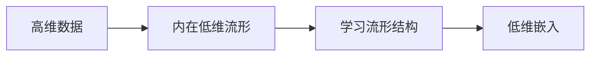

# 降维算法 原理与代码实例讲解

作者：禅与计算机程序设计艺术 / Zen and the Art of Computer Programming

关键词：降维算法、主成分分析、线性判别分析、流形学习、自编码器、T-SNE、UMAP

## 1. 背景介绍

### 1.1 问题的由来

在现实世界中,我们经常会遇到高维数据,如图像、文本、基因表达数据等。高维数据不仅给存储和计算带来困难,也给数据分析和可视化带来挑战。因此,如何有效地降低数据维度,同时保留数据的本质结构和特征,成为机器学习和数据挖掘领域的重要课题。

### 1.2 研究现状

目前,降维算法主要分为线性降维和非线性降维两大类。经典的线性降维方法有主成分分析(PCA)和线性判别分析(LDA),它们通过线性变换将高维数据投影到低维空间。非线性降维方法则考虑数据的内在流形结构,代表性算法包括核主成分分析(KPCA)、流形学习(如Isomap、LLE)、自编码器等。近年来,t-分布随机邻域嵌入(t-SNE)和均匀流形逼近与投影(UMAP)等算法展现出优异的可视化效果,受到广泛关注。

### 1.3 研究意义

降维算法在诸多领域发挥着重要作用,如:
- 数据压缩:通过降维来减少数据存储和传输的开销。
- 数据可视化:将高维数据映射到二维或三维空间,便于人们直观地理解数据。 
- 特征提取:自动学习数据的低维表示,用于后续的分类、聚类等任务。
- 噪声去除:降维过程中可以滤除数据中的噪声和冗余信息。

深入研究降维算法的原理,并给出清晰的代码实例,将有助于研究者和工程师更好地理解和应用这些算法,推动人工智能和大数据分析技术的发展。

### 1.4 本文结构

本文将全面介绍几种主要的降维算法,内容安排如下:

- 第2部分介绍降维中的一些核心概念。 
- 第3部分讲解PCA、LDA、KPCA等经典降维算法的原理和步骤。
- 第4部分给出这些算法的数学模型和公式推导过程。
- 第5部分提供算法的Python代码实现和详细解释。
- 第6部分讨论降维算法在图像、自然语言处理等领域的应用。
- 第7部分推荐一些学习降维的资源和工具。
- 第8部分总结全文,并展望降维技术的未来发展方向和挑战。
- 第9部分的附录中列出了一些常见问题与解答。

## 2. 核心概念与联系

在讨论具体算法之前,我们先来了解几个降维领域的核心概念:

- 维度灾难(curse of dimensionality):当数据维度很高时,许多机器学习算法的性能会急剧下降。高维空间中的数据点变得非常稀疏,距离和相似性度量失去了区分性。
- 内在维度(intrinsic dimension):数据虽然处于高维观测空间,但其内在结构可能位于一个低维流形(manifold)上。内在维度指的是这个流形的维数。
- 流形假设(manifold hypothesis):许多现实数据如图像、语音可以看作高维欧氏空间中的低维流形。流形学习就是要找到这些流形的低维表示同时保持其拓扑结构。
- 线性降维与非线性降维:线性降维通过线性变换将数据投影到低维子空间,如PCA。非线性降维考虑数据的内在流形结构,如Isomap、LLE、t-SNE等。

下图展示了非线性降维的基本思想:



## 3. 核心算法原理 & 具体操作步骤

### 3.1 算法原理概述

#### 3.1.1 主成分分析(PCA) 

PCA通过线性变换将数据投影到一组正交基上,使得投影后的方差最大化。这些正交基称为主成分,对应数据的主要变化方向。通过选取前k个主成分,就可以将数据降到k维。

#### 3.1.2 线性判别分析(LDA)

LDA是一种监督降维方法。与PCA不同,LDA利用样本的类别标签,试图找到一个投影方向,使得不同类别的数据在该方向上尽可能分开,而同类数据尽可能聚集。

#### 3.1.3 核主成分分析(KPCA)

KPCA先用核函数将原始数据映射到高维特征空间,再在特征空间中进行PCA。通过引入非线性核函数,KPCA可以发现数据的非线性结构。常用的核函数有高斯核(RBF)、多项式核等。

#### 3.1.4 流形学习

流形学习假设数据位于高维空间的低维流形上,旨在学习数据的内在流形结构,得到其低维表示。代表性算法有Isomap、局部线性嵌入(LLE)、Laplacian特征映射(LE)等。它们通过保持近邻样本之间的距离或拓扑关系来实现降维。

### 3.2 算法步骤详解

以PCA为例,其主要步骤如下:

1. 数据中心化:将所有样本减去均值,使数据以原点为中心。
2. 计算协方差矩阵:$C=\frac{1}{n}XX^T$,其中$X$为中心化后的数据矩阵。
3. 对协方差矩阵进行特征值分解:$C=U\Lambda U^T$。$U$的列向量为特征向量,$\Lambda$为特征值构成的对角阵。
4. 选取前k个最大特征值对应的特征向量构成投影矩阵$W$。
5. 将数据投影到低维空间:$Y=W^TX$。

LDA、KPCA等算法的具体步骤这里不再赘述,感兴趣的读者可以参考相关文献。

### 3.3 算法优缺点

- PCA的优点是计算简单,易于实现;缺点是无法发现非线性结构,对数据的尺度较敏感。
- LDA需要类别标签,样本量不能太小;优点是可以利用监督信息,更有利于分类任务。
- KPCA通过核技巧考虑了非线性结构,但计算复杂度较高,存储和调参也是一个问题。
- 流形学习能够发现内在的低维流形,但对噪声和短路径比较敏感,有时还需要较多近邻样本。

### 3.4 算法应用领域

- PCA广泛用于数据压缩、去噪、可视化等,如人脸识别中的特征脸(eigenface)方法。
- LDA常用于特征提取和降维,然后进行分类,如文本分类、人脸识别等。
- KPCA和流形学习常用于发现非线性流形结构,如手写数字识别、基因表达分析等。

## 4. 数学模型和公式 & 详细讲解 & 举例说明

### 4.1 数学模型构建

以PCA为例,假设数据集$X=\{x_1,\cdots,x_n\}$,其中$x_i \in \mathbb{R}^d$。我们要找到一个线性变换$W \in \mathbb{R}^{d \times k}(k<d)$,将数据投影到k维空间:

$$
\begin{aligned}
\max_W \quad &\mathrm{tr}(W^T C W) \\
\mathrm{s.t.} \quad &W^TW=I_k
\end{aligned}
$$

其中$C=\frac{1}{n}XX^T$为协方差矩阵,$I_k$为k维单位矩阵。目标是最大化投影后数据的方差,约束条件使投影矩阵正交。

### 4.2 公式推导过程

利用拉格朗日乘子法,上述优化问题可以转化为:

$$
\mathcal{L}(W,\Lambda)=\mathrm{tr}(W^T C W)-\mathrm{tr}(\Lambda(W^TW-I_k))
$$

其中$\Lambda=\mathrm{diag}(\lambda_1,\cdots,\lambda_k)$为拉格朗日乘子构成的对角阵。对$W$求导并令导数为0:

$$
\frac{\partial \mathcal{L}}{\partial W}=2CW-2W\Lambda=0 \Rightarrow CW=W\Lambda
$$

可见,投影矩阵$W$的列向量应为协方差矩阵$C$的特征向量,对应的特征值构成$\Lambda$。为了最大化目标函数,我们取前k个最大特征值对应的特征向量作为投影矩阵。

### 4.3 案例分析与讲解

下面以一个简单的二维数据集为例,直观展示PCA的降维效果。数据如下图所示,呈现明显的线性结构:

```python
import numpy as np
import matplotlib.pyplot as plt

# 生成示例数据
X = np.array([[1, 1], [2, 2], [3, 3], [4, 4], [5, 5]])
plt.scatter(X[:,0], X[:,1])
plt.axis('equal')
plt.show()
```

对数据进行PCA降维到一维空间:

```python
# PCA降维
mean = np.mean(X, axis=0)
X_centered = X - mean
cov = np.dot(X_centered.T, X_centered) / len(X)
eig_vals, eig_vecs = np.linalg.eig(cov)
W = eig_vecs[:, 0:1]  # 取第一个特征向量
Y = np.dot(X, W)

# 可视化
plt.scatter(Y, np.zeros_like(Y))
plt.show() 
```

可以看到,PCA准确地捕捉到了数据的主要变化方向,降维后的数据点在该方向上按序排列。当然,实际问题中的数据维度往往很高,难以直接可视化,但核心思想是一致的。

### 4.4 常见问题解答

- Q: 降维后的数据还能恢复吗?
- A: PCA等降维方法一般是不可逆的,但可以通过投影矩阵的转置对低维数据进行重构,得到原始数据的近似。重构误差取决于舍弃的维度数量。 

- Q: 如何选择降维后的维度?
- A: 可以考虑累积方差贡献率,即前k个主成分方差之和占总方差的比例。通常选择累积贡献率达到80%~90%时的k值。也可以根据实际任务如可视化需求来选择。

- Q: PCA对数据的尺度敏感吗?
- A: 是的,不同特征的尺度差异会影响PCA的结果。因此,在进行PCA之前,通常需要对数据进行标准化,使各特征均值为0,方差为1。

## 5. 项目实践：代码实例和详细解释说明

下面以MNIST手写数字数据集为例,演示PCA、KPCA、t-SNE等几种降维算法的实现。

### 5.1 开发环境搭建

首先导入必要的库,并加载数据集:

```python
from sklearn.datasets import load_digits
from sklearn.decomposition import PCA, KernelPCA
from sklearn.manifold import TSNE
import matplotlib.pyplot as plt

# 加载MNIST手写数字数据集
digits = load_digits()
X, y = digits.data, digits.target
```

### 5.2 源代码详细实现

#### 5.2.1 PCA

使用scikit-learn库中的PCA类进行降维:

```python
# PCA降维
pca = PCA(n_components=2)
X_pca = pca.fit_transform(X)

# 可视化
plt.figure(figsize=(8, 6))
plt.scatter(X_pca[:, 0], X_pca[:, 1], c=y, cmap='viridis')
plt.xlabel('PC1')
plt.ylabel('PC2') 
plt.colorbar(label='digit')
plt.show()
```

#### 5.2.2 KPCA

使用高斯核(RBF)进行KPCA:

```python
# KPCA降维
kpca = KernelPCA(n_components=2, kernel='rbf', gamma=0.01)
X_kpca = kpca.fit_transform(X)

# 可视化
plt.figure(figsize=(8, 6))
plt.scatter(X_kpca[:, 0], X_kpca[:, 1], c=y, cmap='viridis')
plt.xlabel('PC1')
plt.ylabel('PC2')
plt.