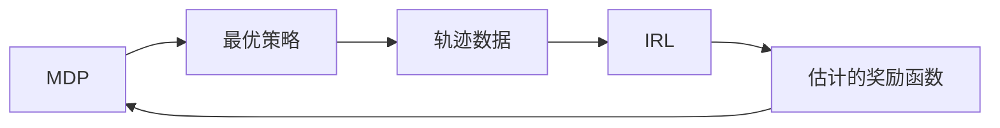

# 马尔可夫决策过程中的inverse reinforcement learning

关键词：马尔可夫决策过程、inverse reinforcement learning、最优策略、奖励函数、动态规划、Q-learning

## 1. 背景介绍

### 1.1 问题的由来

在人工智能和机器学习领域,强化学习(Reinforcement Learning, RL)是一个重要的研究方向。它旨在让智能体(agent)通过与环境的交互来学习最优策略,以获得最大的累积奖励。然而,在许多实际应用中,我们往往很难准确定义奖励函数。Inverse reinforcement learning(IRL)正是为解决这一问题而提出的一种方法。

### 1.2 研究现状

近年来,IRL受到了学术界和工业界的广泛关注。Andrew Ng等人在2000年首次提出了IRL的概念[1],之后涌现出了一系列相关的算法和应用。比较著名的有Abbeel和Ng提出的feature matching IRL[2]、Ziebart等人的maximum entropy IRL[3]等。IRL已经在机器人控制、自然语言处理、计算机视觉等领域得到应用。

### 1.3 研究意义 

IRL为解决奖励函数难以定义的问题提供了一种新的思路。通过学习专家的示范轨迹,IRL可以自动推断隐含的奖励函数,避免了手工设计的困难。这对于让智能体学习复杂策略、适应不同环境具有重要意义。此外,IRL得到的奖励函数具有可解释性,有助于我们理解agent的行为逻辑。

### 1.4 本文结构

本文将重点介绍IRL在马尔可夫决策过程(Markov Decision Process, MDP)中的应用。第2节介绍MDP和IRL的一些核心概念。第3节详细讲解IRL的主要算法原理和步骤。第4节给出IRL相关的数学模型和公式推导。第5节通过代码实例演示IRL的具体实现。第6节讨论IRL的实际应用场景。第7节推荐一些IRL的学习资源和工具。第8节总结全文并展望IRL的发展趋势与挑战。

## 2. 核心概念与联系

在讨论IRL之前,我们先来回顾一下马尔可夫决策过程(MDP)的定义:

- 状态空间 $\mathcal{S}$: 所有可能的状态集合
- 动作空间 $\mathcal{A}$: 每个状态下agent可以采取的动作集合 
- 状态转移概率 $\mathcal{P}_{sa}^{s'}$: 在状态s下采取动作a后转移到状态s'的概率
- 奖励函数 $\mathcal{R}(s)$: agent在状态s下获得的即时奖励
- 折扣因子 $\gamma \in [0,1]$: 未来奖励的折扣系数,用于平衡即时奖励和长期奖励

MDP的目标是寻找一个最优策略 $\pi^*$,使得期望累积奖励最大化:

$$\pi^* = \arg\max_{\pi} \mathbb{E} \left[\sum_{t=0}^{\infty} \gamma^t \mathcal{R}(s_t) | \pi \right]$$

传统的强化学习一般假设奖励函数是已知的,通过值迭代、策略梯度等方法来优化策略。而在inverse RL中,我们只能观测到agent的行为轨迹 $\mathcal{D} = \{\zeta_1,\zeta_2,...\}$,其中每条轨迹 $\zeta_i$ 是一系列状态-动作对 $\{(s_0^i,a_0^i),(s_1^i,a_1^i),...\}$。IRL的目标是从这些轨迹数据中估计隐含的奖励函数 $\hat{\mathcal{R}}$,使得:

$$\mathcal{D} = \arg\max_{\mathcal{D}} P(\mathcal{D}|\hat{\mathcal{R}}) = \arg\max_{\mathcal{D}} \prod_{i} P(\zeta_i|\hat{\mathcal{R}})$$

估计出的 $\hat{\mathcal{R}}$ 可以用于解释agent的行为,或者指导新的策略学习。

MDP和IRL的关系如下图所示:

## 3. 核心算法原理 & 具体操作步骤

### 3.1 算法原理概述

IRL算法的主要思想是,通过调整奖励函数,使得基于该奖励学到的最优策略能够产生与专家示范相似的行为轨迹。具体来说,可以将IRL看作一个嵌套的优化问题:

$$\hat{\mathcal{R}} = \arg\min_{\mathcal{R}} \left\| \mathbb{E}_{s \sim d_{\pi^*}} [\phi(s)] - \mathbb{E}_{s \sim d_{\pi_E}} [\phi(s)] \right\|$$

其中 $\phi(s)$ 是状态的特征表示, $d_{\pi^*}$ 和 $d_{\pi_E}$ 分别是最优策略和专家策略的状态分布。内层优化问题是在给定奖励函数下求解最优策略:

$$\pi^*(\mathcal{R}) = \arg\max_{\pi} \mathbb{E} \left[\sum_{t=0}^{\infty} \gamma^t \mathcal{R}(s_t) | \pi \right]$$

求解这个双层优化通常需要迭代优化的过程。一些常见的IRL算法包括:

- Feature matching: 通过特征期望匹配来估计奖励函数的线性组合系数[2]
- Maximum entropy IRL: 在最大熵原理下推断能够解释专家行为的奖励函数[3]  
- Bayesian IRL: 把奖励函数看作隐变量,用贝叶斯推断来估计后验分布[4]
- Guided cost learning: 结合IRL和policy search,交替优化奖励和策略[5]

### 3.2 算法步骤详解

下面我们以maximum entropy IRL为例,详细说明其算法步骤。

输入:专家轨迹数据 $\mathcal{D} = \{\zeta_1,\zeta_2,...\}$,特征函数 $\phi(s)$,学习率 $\alpha$,迭代次数 $N$

1. 随机初始化奖励函数的参数 $\theta_0$
2. For i=0 to N-1:
   1. 在当前奖励函数 $\mathcal{R}_{\theta_i}$ 下,用值迭代或策略梯度等方法求解最优策略 $\pi_i$
   2. 估计 $\pi_i$ 的状态分布 $d_{\pi_i}(s)$,即在 $\pi_i$ 下状态 $s$ 出现的概率
   3. 计算梯度 $g_i = \mathbb{E}_{s \sim d_{\pi_E}} [\phi(s)] - \mathbb{E}_{s \sim d_{\pi_i}} [\phi(s)]$
   4. 更新奖励函数参数 $\theta_{i+1} = \theta_i + \alpha \cdot g_i$
3. Return 估计的奖励函数 $\mathcal{R}_{\theta_N}$

其核心是交替优化奖励函数和策略,使得学到的策略能够产生与专家示范相近的特征期望。

### 3.3 算法优缺点

Maximum entropy IRL的优点包括:

- 直接对奖励函数建模,可解释性强
- 利用了最大熵原理,在满足约束的情况下尽可能避免额外的偏置
- 可以融合领域知识,引入先验分布

但它也存在一些局限:

- 计算expert的状态分布需要大量轨迹数据,在实际中不易获得  
- 难以应对高维、连续状态空间,特征工程是一大挑战
- 需要求解MDP,复杂度高,通常依赖模型

### 3.4 算法应用领域

尽管有局限,maximum entropy IRL及其变种在以下领域有广泛应用:

- 自动驾驶:通过模仿人类司机行为来学习驾驶策略
- 机器人控制:通过人类示教来快速学习操作技能
- 游戏AI:从人类玩家的游戏记录中习得策略
- 人机交互:通过分析用户行为习惯来优化交互方式

## 4. 数学模型和公式 & 详细讲解 & 举例说明

### 4.1 数学模型构建

为了形式化描述maximum entropy IRL,我们定义如下数学符号:

- $\mathcal{S}, \mathcal{A}$: MDP的状态空间和动作空间
- $\mathcal{D} = \{\zeta_1,\zeta_2,...\}, \zeta_i = \{s_0^i,a_0^i,s_1^i,a_1^i,...\}$: 专家的示范轨迹集合
- $\mathcal{T}$: 状态转移概率矩阵, $\mathcal{T}_{ss'}^a = P(s'|s,a)$ 表示在状态s下采取动作a转移到状态s'的概率
- $\phi: \mathcal{S} \rightarrow \mathbb{R}^k$: 将状态映射为k维特征向量的函数
- $\theta \in \mathbb{R}^k$: 奖励函数的参数向量
- $\mathcal{R}_{\theta}(s) = \theta^T\phi(s)$: 线性组合形式的奖励函数 

maximum entropy IRL的优化目标可以表示为:

$$\max_{\theta} \mathcal{L}(\theta) = \max_{\theta} \sum_{i=1}^{|\mathcal{D}|} \log P(\zeta_i|\theta) - \lambda \cdot ||\theta||_1$$

其中 $P(\zeta_i|\theta)$ 是轨迹 $\zeta_i$ 在奖励函数 $\mathcal{R}_{\theta}$ 下的概率,可以分解为状态-动作对的乘积:

$$P(\zeta_i|\theta) = P(s_0^i) \cdot \prod_{t=0}^{|\zeta_i|-1} P(a_t^i|s_t^i,\theta) \cdot P(s_{t+1}^i|s_t^i,a_t^i)$$

$P(a_t^i|s_t^i,\theta)$ 是在状态 $s_t^i$ 下采取动作 $a_t^i$ 的概率,由最优策略 $\pi_{\theta}$ 给出。 $\lambda \cdot ||\theta||_1$ 是L1正则化项,用于控制奖励函数的稀疏性。

### 4.2 公式推导过程

为了求解最优参数 $\theta$,我们采用梯度上升法。目标函数 $\mathcal{L}(\theta)$ 对 $\theta$ 的梯度为:

$$\nabla_{\theta} \mathcal{L}(\theta) = \sum_{i=1}^{|\mathcal{D}|} \sum_{t=0}^{|\zeta_i|-1} \nabla_{\theta} \log P(a_t^i|s_t^i,\theta) - \lambda \cdot \text{sign}(\theta)$$

其中第一项可以进一步展开:

$$\nabla_{\theta} \log P(a_t^i|s_t^i,\theta) = \phi(s_t^i) - \sum_{a \in \mathcal{A}} \pi_{\theta}(a|s_t^i) \cdot \phi(s_t^i) = \phi(s_t^i) - \mathbb{E}_{a \sim \pi_{\theta}(\cdot|s_t^i)} [\phi(s_t^i)]$$

代入梯度表达式,化简可得:

$$\nabla_{\theta} \mathcal{L}(\theta) = \sum_{i=1}^{|\mathcal{D}|} \sum_{t=0}^{|\zeta_i|-1} \left( \phi(s_t^i) - \mathbb{E}_{a \sim \pi_{\theta}(\cdot|s_t^i)} [\phi(s_t^i)] \right) - \lambda \cdot \text{sign}(\theta)$$

$$= \sum_{s \in \mathcal{S}} \left( d_{\pi_E}(s) - d_{\pi_{\theta}}(s) \right) \cdot \phi(s) - \lambda \cdot \text{sign}(\theta)$$

其中 $d_{\pi_E}(s)$ 和 $d_{\pi_{\theta}}(s)$ 分别是专家策略和当前策略的状态分布。这个结果与3.1节的特征期望匹配目标一致。

### 4.3 案例分析与讲解

下面我们以一个简单的网格世界导航任务为例来说明maximum entropy IRL的计算过程。

如上图,智能体需要从S走到G,途中有障碍物和危险区域。状态空间是所有的网