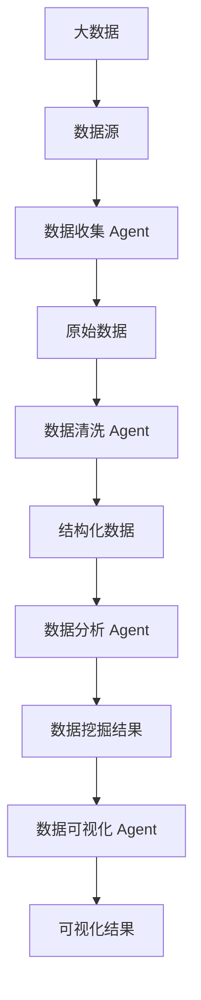

# AI人工智能 Agent：在大数据处理中的应用

关键词：人工智能、智能Agent、大数据、数据处理、机器学习、深度学习、知识图谱、自然语言处理

## 1. 背景介绍
### 1.1 问题的由来
随着信息技术的飞速发展,大数据时代已经来临。海量的数据给各行各业带来了前所未有的机遇,同时也带来了巨大的挑战。如何高效地存储、管理和分析这些海量数据,成为当前亟待解决的问题。传统的数据处理方法已经难以满足大数据时代的需求,迫切需要新的技术手段来应对大数据带来的挑战。人工智能技术的兴起为解决大数据问题提供了新的思路。

### 1.2 研究现状 
目前,人工智能已经在大数据处理领域取得了显著的进展。谷歌、微软、亚马逊等科技巨头都在积极布局人工智能+大数据,开发了一系列智能化的大数据处理工具和平台。学术界也在人工智能驱动的大数据分析方面开展了大量研究,涌现出许多优秀的研究成果。总的来说,利用人工智能技术来处理大数据已成为学术界和工业界的研究热点。

### 1.3 研究意义
人工智能驱动的大数据处理具有重要的理论意义和实践价值:

1. 有助于提高大数据处理的效率和精度。传统的大数据处理方法往往效率低下,且容易产生误差。引入人工智能可以大幅提升数据处理速度,并通过智能化手段减少错误。

2. 可以挖掘数据背后的价值。海量数据中往往蕴藏着巨大的商业价值,但人工很难发掘。机器学习等人工智能技术可以自动从数据中提取有价值的信息和知识。

3. 推动人工智能领域的进一步发展。大数据为人工智能的发展提供了丰富的"养料",反过来人工智能技术也在大数据的驱动下不断进步。二者相辅相成,共同促进。

### 1.4 本文结构
本文将重点探讨人工智能中的 Agent 技术在大数据处理中的应用。全文共分为9个部分：第1部分介绍研究背景；第2部分阐述 Agent 的核心概念；第3部分讲解 Agent 的核心算法原理；第4部分建立 Agent 的数学模型；第5部分给出 Agent 的代码实例；第6部分分析 Agent 在大数据处理中的应用场景；第7部分推荐相关工具和资源；第8部分总结全文并展望未来；第9部分为附录。

## 2. 核心概念与联系
Agent 是人工智能的一个重要分支,它是一种能够感知环境并做出自主行为以达成目标的计算机程序或系统。智能 Agent 具有自主性、社会性、反应性、主动性等特点。在大数据处理领域,Agent 主要用于数据收集、数据清洗、数据分析、数据可视化等环节。

下图展示了 Agent 与大数据处理的关系:



从上图可以看出,Agent 贯穿了大数据处理的整个流程。数据收集 Agent 负责从各种数据源获取原始数据；数据清洗 Agent 对原始数据进行去噪、归一化等处理,生成结构化数据；数据分析 Agent 从结构化数据中挖掘出有价值的信息；数据可视化 Agent 则将挖掘结果以直观的方式呈现给用户。

## 3. 核心算法原理 & 具体操作步骤
### 3.1 算法原理概述
Agent 技术涉及多种人工智能算法,主要包括:

1. 机器学习算法:监督学习、无监督学习、强化学习等。
2. 深度学习算法:卷积神经网络、循环神经网络、生成对抗网络等。
3. 自然语言处理算法:分词、词性标注、命名实体识别、句法分析、文本分类等。
4. 知识图谱算法:知识表示、知识融合、知识推理等。

这些算法为 Agent 赋予了智能,使其能够从数据中学习和进化。

### 3.2 算法步骤详解
以机器学习中的监督学习算法为例,其基本步骤如下:

1. 数据准备:收集和标注训练数据。
2. 特征工程:从原始数据中提取特征。
3. 模型训练:用训练数据训练机器学习模型。
4. 模型评估:用测试数据评估模型性能。
5. 模型优化:分析模型,并对其进行优化。
6. 模型应用:将训练好的模型部署到生产环境。

每个步骤都可以用一个或多个 Agent 来实现。例如,数据准备可以由数据收集 Agent 完成,特征工程可以由数据清洗 Agent 完成,模型训练和评估可以由建模 Agent 完成,等等。

### 3.3 算法优缺点
机器学习算法的优点包括:

1. 通用性强,可以应用于多个领域。
2. 对复杂系统建模能力强。
3. 模型可解释性好。

缺点则包括:

1. 需要大量标注数据,成本较高。
2. 模型训练耗时长。
3. 模型泛化能力有限。

### 3.4 算法应用领域
机器学习算法在大数据处理中应用广泛,主要场景包括:

1. 用户画像:通过收集用户数据,构建用户特征,预测用户行为。
2. 智能推荐:利用用户历史行为数据,为其推荐感兴趣的内容。
3. 智能客服:通过分析客服日志,训练智能客服模型,提供自动应答。
4. 金融风控:从海量交易数据中识别欺诈行为,防范金融风险。
5. 智慧城市:收集和分析城市数据,优化城市管理和服务。

## 4. 数学模型和公式 & 详细讲解 & 举例说明
### 4.1 数学模型构建
以机器学习中的线性回归模型为例。假设我们有 $n$ 个样本 $\{(x_1,y_1),\ldots,(x_n,y_n)\}$,其中 $x_i$ 为第 $i$ 个样本的特征向量,$y_i$ 为其对应的目标值。我们希望找到一个线性模型:

$$
\hat{y} = w^Tx + b
$$

使得预测值 $\hat{y}$ 和真实值 $y$ 的差距最小。这里 $w$ 和 $b$ 分别为模型的权重向量和偏置项。

### 4.2 公式推导过程
为了求解最优的 $w$ 和 $b$,我们需要最小化损失函数。通常使用均方误差作为损失函数:

$$
J(w,b) = \frac{1}{2n}\sum_{i=1}^n(w^Tx_i + b - y_i)^2
$$

对损失函数求导,并令导数为0:

$$
\begin{aligned}
\frac{\partial J}{\partial w} &= \frac{1}{n}\sum_{i=1}^n(w^Tx_i + b - y_i)x_i = 0 \\
\frac{\partial J}{\partial b} &= \frac{1}{n}\sum_{i=1}^n(w^Tx_i + b - y_i) = 0
\end{aligned}
$$

整理可得:

$$
\begin{aligned}
w &= (X^TX)^{-1}X^T(y-\bar{y}) \\
b &= \bar{y} - w^T\bar{x}
\end{aligned}
$$

其中 $X$ 为样本特征矩阵,$y$ 为样本目标值向量,$\bar{x}$ 和 $\bar{y}$ 分别为 $x$ 和 $y$ 的均值。

### 4.3 案例分析与讲解
下面我们用一个简单的例子来说明线性回归的用法。假设我们要根据房屋面积预测房价,已知4个样本数据:

| 面积(平米) | 100 | 80  | 120 | 90  |
|------------|-----|-----|-----|-----|
| 房价(万元) | 100 | 80  | 110 | 95  |

根据公式,我们可以求得:

$$
\begin{aligned}
\bar{x} &= 97.5 \\
\bar{y} &= 96.25 \\
w &= \frac{\sum_{i=1}^4(x_i-\bar{x})(y_i-\bar{y})}{\sum_{i=1}^4(x_i-\bar{x})^2} = 0.86 \\
b &= \bar{y} - w\bar{x} = 12.25
\end{aligned}
$$

因此,预测模型为:

$$
\hat{y} = 0.86x + 12.25
$$

即,房价 = 0.86 × 面积 + 12.25。如果一个房屋的面积是110平米,则预测房价为:

$$
\hat{y} = 0.86 \times 110 + 12.25 = 106.85
$$

### 4.4 常见问题解答
1. 什么是过拟合和欠拟合?

过拟合是指模型在训练集上表现很好,但在测试集上表现较差,通常是因为模型过于复杂,学习到了数据的噪声。欠拟合则是指模型在训练集和测试集上都表现不佳,通常是因为模型过于简单,无法很好地拟合数据。

2. 如何评估回归模型的性能?

常用的评估指标有均方误差(MSE)、均方根误差(RMSE)、平均绝对误差(MAE)、R平方等。其中 R 平方表示模型对数据的拟合程度,取值在0到1之间,越接近1说明拟合效果越好。

3. 线性回归对数据有哪些要求?

线性回归要求数据满足以下假设:

- 线性性:因变量和自变量之间是线性关系。
- 独立性:样本之间相互独立。
- 同方差性:不同自变量值下,因变量的方差相同。
- 正态性:误差项服从正态分布。

如果数据不满足这些假设,可能需要对数据进行转换,或者考虑使用其他模型。

## 5. 项目实践：代码实例和详细解释说明
### 5.1 开发环境搭建
我们使用 Python 语言和 Scikit-learn 库来实现线性回归模型。首先安装所需库:

```
pip install numpy pandas sklearn
```

### 5.2 源代码详细实现
完整的代码如下:

```python
import numpy as np
import pandas as pd
from sklearn.linear_model import LinearRegression
from sklearn.model_selection import train_test_split
from sklearn.metrics import mean_squared_error, r2_score

# 读取数据
data = pd.read_csv('data.csv')

# 划分特征和目标变量 
X = data[['area']]
y = data[['price']]

# 划分训练集和测试集
X_train, X_test, y_train, y_test = train_test_split(X, y, test_size=0.2, random_state=42)

# 创建线性回归模型
model = LinearRegression()

# 在训练集上训练模型
model.fit(X_train, y_train)

# 在测试集上测试模型
y_pred = model.predict(X_test)

# 计算模型性能指标
mse = mean_squared_error(y_test, y_pred)
rmse = np.sqrt(mse)
r2 = r2_score(y_test, y_pred)

print(f'Mean squared error: {mse:.2f}')
print(f'Root mean squared error: {rmse:.2f}')
print(f'R-squared: {r2:.2f}')

# 输出模型参数
print(f'Intercept: {model.intercept_[0]:.2f}')
print(f'Coefficient: {model.coef_[0][0]:.2f}')
```

### 5.3 代码解读与分析
代码主要分为以下几个部分:

1. 数据读取:使用 pandas 库读取 CSV 格式的数据文件。
2. 数据划分:将数据划分为特征 X 和目标变量 y,并进一步划分为训练集和测试集。
3. 模型创建:创建一个线性回归模型对象。
4. 模型训练:在训练集上训