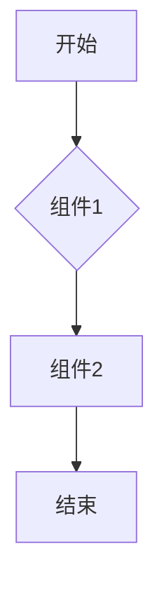

# AI人工智能代理工作流AI Agent WorkFlow：代理工作流的可视化与用户交互设计

作者：禅与计算机程序设计艺术 / Zen and the Art of Computer Programming

## 1. 背景介绍

### 1.1 问题的由来

随着信息技术的飞速发展，自动化和智能化成为企业提升效率、降低成本的关键。在众多自动化工具中，AI人工智能代理（AI Agent）因其强大的数据处理和决策能力，成为了企业数字化转型的重要驱动力。然而，传统的AI Agent工作流设计复杂、难以维护，且缺乏直观的用户交互界面。因此，如何设计一个易于使用、可视化强的AI Agent WorkFlow成为了一个亟待解决的问题。

### 1.2 研究现状

近年来，随着图形界面技术和AI技术的发展，许多可视化工作流编辑器应运而生。这些工具通常包括以下特点：

- **可视化设计**：以图形化的方式展示工作流结构，用户可以通过拖拽节点和连接线来构建工作流。
- **用户交互**：提供丰富的用户交互方式，如拖拽、双击、右键菜单等，方便用户进行操作。
- **可扩展性**：支持多种AI Agent和数据处理组件，满足不同业务需求。

然而，现有的工作流编辑器在以下方面仍有待改进：

- **易用性**：部分工具界面复杂，学习成本高，难以快速上手。
- **灵活性**：对于复杂的业务逻辑，工作流编辑器的节点和连接线可能不足以表达所有需求。
- **可维护性**：随着业务发展，工作流需要进行频繁调整，现有的编辑器难以满足这一需求。

### 1.3 研究意义

设计一个易于使用、可视化强的AI Agent WorkFlow具有重要的研究意义：

- **降低开发成本**：简化工作流设计，减少开发时间和人力成本。
- **提高工作效率**：直观的用户交互界面，降低用户学习成本，提高工作效率。
- **增强可维护性**：方便快速调整和优化工作流，满足业务需求变化。
- **促进AI技术普及**：降低AI技术的使用门槛，促进AI技术在更多领域的应用。

### 1.4 本文结构

本文将围绕AI Agent WorkFlow的可视化与用户交互设计展开，主要内容包括：

- 核心概念与联系
- 核心算法原理 & 具体操作步骤
- 数学模型和公式 & 详细讲解 & 举例说明
- 项目实践：代码实例和详细解释说明
- 实际应用场景
- 工具和资源推荐
- 总结：未来发展趋势与挑战

## 2. 核心概念与联系

### 2.1 AI Agent

AI Agent是一种能够感知环境、自主决策并采取行动的实体。它可以根据环境信息和目标进行推理和决策，从而实现特定的任务。

### 2.2 工作流

工作流是指一系列按顺序执行的步骤，用于完成特定任务。在工作流中，每个步骤可以是一个AI Agent、一个数据处理操作或一个用户交互操作。

### 2.3 可视化

可视化是指将数据、信息和知识以图形化的方式呈现出来。在AI Agent WorkFlow中，可视化可以帮助用户直观地理解和设计工作流。

### 2.4 用户交互

用户交互是指用户与系统之间的交互过程。在AI Agent WorkFlow中，用户交互可以帮助用户快速地创建、编辑和监控工作流。

## 3. 核心算法原理 & 具体操作步骤

### 3.1 算法原理概述

AI Agent WorkFlow的可视化与用户交互设计主要基于以下原理：

- **组件化**：将工作流中的各个步骤抽象为组件，便于用户组合和扩展。
- **节点连接**：使用图形化的连接线表示组件之间的依赖关系。
- **用户交互**：提供丰富的交互方式，如拖拽、双击、右键菜单等，方便用户进行操作。

### 3.2 算法步骤详解

#### 3.2.1 组件化

将工作流中的各个步骤抽象为组件，如：

- AI Agent组件：执行特定的AI任务。
- 数据处理组件：对数据进行转换、清洗和计算等操作。
- 用户交互组件：与用户进行交互，如输入、输出和反馈等。

#### 3.2.2 节点连接

使用图形化的连接线表示组件之间的依赖关系，如：

- 输入连接：将一个组件的输出作为另一个组件的输入。
- 控制连接：控制组件的执行顺序。

#### 3.2.3 用户交互

提供丰富的用户交互方式，如：

- 拖拽组件：从组件库中选择组件，拖拽到工作流编辑区域。
- 双击组件：打开组件配置界面，修改组件参数。
- 右键菜单：提供组件操作选项，如删除、复制、粘贴等。

### 3.3 算法优缺点

#### 3.3.1 优点

- **易用性**：通过图形化界面，降低用户学习成本，提高工作效率。
- **灵活性**：支持多种组件和连接线，满足不同业务需求。
- **可维护性**：方便快速调整和优化工作流，满足业务需求变化。

#### 3.3.2 缺点

- **性能**：相较于纯代码实现，可视化工作流可能存在性能瓶颈。
- **学习成本**：对于不熟悉图形化界面设计的用户，学习成本较高。

### 3.4 算法应用领域

AI Agent WorkFlow的可视化与用户交互设计适用于以下领域：

- 企业数字化转型
- 人工智能应用开发
- 业务流程自动化
- 数据处理与分析

## 4. 数学模型和公式 & 详细讲解 & 举例说明

### 4.1 数学模型构建

在AI Agent WorkFlow中，我们可以使用以下数学模型来描述工作流：

- **状态空间模型**：描述工作流中各个组件的状态和转换关系。
- ** Petri网模型**：描述工作流中各个组件的并发执行和同步机制。
- **Petri网扩展模型**：在Petri网基础上，引入时间、资源等约束条件。

### 4.2 公式推导过程

以下是一个简单的Petri网模型，描述一个包含两个组件的工作流：



该Petri网模型包含以下元素：

- **位置**：表示工作流中的组件状态，如A、B、C、D。
- **变迁**：表示组件状态之间的转换，如A到B、B到C、C到D。
- **库所**：表示组件的输入和输出，如A库所、B库所、C库所、D库所。

### 4.3 案例分析与讲解

以下是一个实际案例，描述一个包含多个AI Agent和数据处理组件的工作流：

- **任务描述**：从电商平台抓取商品信息，进行数据清洗和分类，最后生成商品推荐列表。
- **工作流**：
    - 从电商平台抓取商品信息。
    - 使用正则表达式对数据进行清洗。
    - 使用机器学习方法对数据进行分类。
    - 根据分类结果生成推荐列表。

### 4.4 常见问题解答

**问**：如何优化工作流性能？

**答**：可以通过以下方式优化工作流性能：

- 选择性能较好的AI Agent和数据处理组件。
- 合理设计工作流结构，减少冗余操作。
- 使用并行处理技术，加速任务执行。

## 5. 项目实践：代码实例和详细解释说明

### 5.1 开发环境搭建

1. 安装Java开发环境，如JDK和IDE（如Eclipse、IntelliJ IDEA等）。
2. 安装相关库，如Java Swing库、JavaFX库等。
3. 创建Java项目，引入相关依赖。

### 5.2 源代码详细实现

以下是一个简单的Java Swing应用程序，实现了一个AI Agent WorkFlow的可视化编辑器：

```java
import javax.swing.*;
import java.awt.*;
import java.awt.event.*;

public class WorkflowEditor extends JFrame {
    public WorkflowEditor() {
        setTitle("AI Agent WorkFlow 编辑器");
        setSize(800, 600);
        setDefaultCloseOperation(JFrame.EXIT_ON_CLOSE);
        setLayout(new BorderLayout());

        // 工具栏
        JMenuBar menuBar = new JMenuBar();
        JMenu menuFile = new JMenu("文件");
        JMenuItem menuItemOpen = new JMenuItem("打开");
        JMenuItem menuItemSave = new JMenuItem("保存");
        menuFile.add(menuItemOpen);
        menuFile.add(menuItemSave);
        menuBar.add(menuFile);
        setJMenuBar(menuBar);

        // 编辑区域
        JPanel editorPanel = new JPanel();
        editorPanel.setLayout(new BorderLayout());
        add(editorPanel, BorderLayout.CENTER);

        // 组件库
        JPanel componentPanel = new JPanel();
        componentPanel.setLayout(new GridLayout(0, 3));
        componentPanel.add(new JButton("组件1"));
        componentPanel.add(new JButton("组件2"));
        componentPanel.add(new JButton("组件3"));
        add(componentPanel, BorderLayout.EAST);

        // 添加事件监听器
        menuItemOpen.addActionListener(new ActionListener() {
            @Override
            public void actionPerformed(ActionEvent e) {
                // 处理打开文件操作
            }
        });
        menuItemSave.addActionListener(new ActionListener() {
            @Override
            public void actionPerformed(ActionEvent e) {
                // 处理保存文件操作
            }
        });
    }

    public static void main(String[] args) {
        SwingUtilities.invokeLater(new Runnable() {
            @Override
            public void run() {
                new WorkflowEditor().setVisible(true);
            }
        });
    }
}
```

### 5.3 代码解读与分析

1. 创建一个继承自`JFrame`的`WorkflowEditor`类，用于实现编辑器界面。
2. 添加菜单栏，包括文件操作菜单。
3. 创建编辑区域，使用`JPanel`布局。
4. 创建组件库，使用`JPanel`布局，并添加按钮表示组件。
5. 为菜单项添加事件监听器，处理打开和保存文件操作。

### 5.4 运行结果展示

运行程序后，将出现一个包含菜单栏、编辑区域和组件库的AI Agent WorkFlow编辑器界面。

## 6. 实际应用场景

AI Agent WorkFlow的可视化与用户交互设计在以下实际应用场景中具有重要作用：

### 6.1 企业数字化转型

在企业数字化转型过程中，AI Agent WorkFlow可以帮助企业：

- **自动化业务流程**：将复杂的业务流程转化为易于理解和操作的AI Agent WorkFlow。
- **提高工作效率**：简化操作流程，降低员工培训成本。
- **降低运营成本**：实现业务流程自动化，减少人工操作，降低运营成本。

### 6.2 人工智能应用开发

在人工智能应用开发过程中，AI Agent WorkFlow可以帮助开发者：

- **快速构建应用**：通过拖拽组件、配置参数，快速搭建人工智能应用架构。
- **降低开发成本**：简化开发流程，降低开发成本。
- **提高应用性能**：优化工作流结构，提高应用性能。

### 6.3 业务流程自动化

在业务流程自动化领域，AI Agent WorkFlow可以帮助企业：

- **优化业务流程**：通过分析业务流程，找出瓶颈和改进点，优化业务流程。
- **提高业务效率**：实现业务流程自动化，提高业务效率。
- **降低运营成本**：减少人工操作，降低运营成本。

## 7. 工具和资源推荐

### 7.1 学习资源推荐

- **《人工智能：一种现代的方法》**: 作者：Stuart Russell, Peter Norvig
- **《深度学习》**: 作者：Ian Goodfellow, Yoshua Bengio, Aaron Courville
- **《Java Swing程序设计》**: 作者：Herbert Schildt

### 7.2 开发工具推荐

- **Eclipse**: 一款开源的集成开发环境，支持Java开发。
- **IntelliJ IDEA**: 一款强大的Java IDE，支持多种编程语言。
- **Visual Studio Code**: 一款跨平台、轻量级的代码编辑器，支持多种编程语言。

### 7.3 相关论文推荐

- **《Graphical Models for Machine Learning**》: 作者：David J.C. MacKay
- **《Visual Programming and Component-Based Software Engineering**》: 作者：Korosh Zadeh
- **《Visual Workflow Design Tools for AI Systems**》: 作者：Sara Kiesler, Eric Horvitz

### 7.4 其他资源推荐

- **Hugging Face**: [https://huggingface.co/](https://huggingface.co/)
- **TensorFlow**: [https://www.tensorflow.org/](https://www.tensorflow.org/)
- **PyTorch**: [https://pytorch.org/](https://pytorch.org/)

## 8. 总结：未来发展趋势与挑战

AI Agent WorkFlow的可视化与用户交互设计在人工智能领域具有广阔的应用前景。随着技术的不断发展，未来发展趋势如下：

### 8.1 未来发展趋势

- **智能化工作流编辑器**：结合自然语言处理、机器学习等技术，实现智能化工作流编辑。
- **跨平台工作流编辑器**：支持多种操作系统和编程语言，提高工作流的通用性。
- **云原生工作流编辑器**：利用云计算技术，实现工作流的弹性伸缩和资源优化。

### 8.2 面临的挑战

- **技术挑战**：如何提高工作流编辑器的智能化水平，实现自动化任务分解和求解。
- **用户体验挑战**：如何设计易于使用、可视化强的用户交互界面，降低用户学习成本。
- **安全性挑战**：如何确保工作流的安全性，防止恶意攻击和数据泄露。

### 8.3 研究展望

未来，AI Agent WorkFlow的可视化与用户交互设计将朝着以下方向发展：

- **集成更多的AI技术**：结合自然语言处理、机器学习、计算机视觉等技术，实现更强大的工作流编辑和执行能力。
- **提高工作流的可解释性和可控性**：通过可视化技术，帮助用户理解工作流执行过程，提高可解释性和可控性。
- **促进工作流的标准化和共享**：推动工作流标准化和共享，降低工作流开发成本，提高工作效率。

## 9. 附录：常见问题与解答

### 9.1 什么是AI Agent？

AI Agent是一种能够感知环境、自主决策并采取行动的实体。它可以根据环境信息和目标进行推理和决策，从而实现特定的任务。

### 9.2 什么是工作流？

工作流是指一系列按顺序执行的步骤，用于完成特定任务。在工作流中，每个步骤可以是一个AI Agent、一个数据处理操作或一个用户交互操作。

### 9.3 如何设计一个可视化工作流编辑器？

设计一个可视化工作流编辑器需要考虑以下因素：

- **易用性**：设计简单直观的用户界面，降低用户学习成本。
- **灵活性**：支持多种组件和连接线，满足不同业务需求。
- **可维护性**：方便快速调整和优化工作流，满足业务需求变化。

### 9.4 如何评估工作流编辑器的性能？

评估工作流编辑器的性能可以从以下几个方面进行：

- **易用性**：用户学习成本、操作效率等。
- **性能**：工作流执行速度、资源消耗等。
- **可扩展性**：支持多种组件和连接线，满足不同业务需求。

### 9.5 工作流编辑器在实际应用中面临哪些挑战？

工作流编辑器在实际应用中面临以下挑战：

- **技术挑战**：如何提高工作流编辑器的智能化水平，实现自动化任务分解和求解。
- **用户体验挑战**：如何设计易于使用、可视化强的用户交互界面，降低用户学习成本。
- **安全性挑战**：如何确保工作流的安全性，防止恶意攻击和数据泄露。

### 9.6 工作流编辑器未来的发展趋势是什么？

工作流编辑器未来的发展趋势包括：

- **智能化工作流编辑器**
- **跨平台工作流编辑器**
- **云原生工作流编辑器**

通过不断的研究和创新，AI Agent WorkFlow的可视化与用户交互设计将更好地满足实际需求，为人工智能技术发展提供有力支撑。