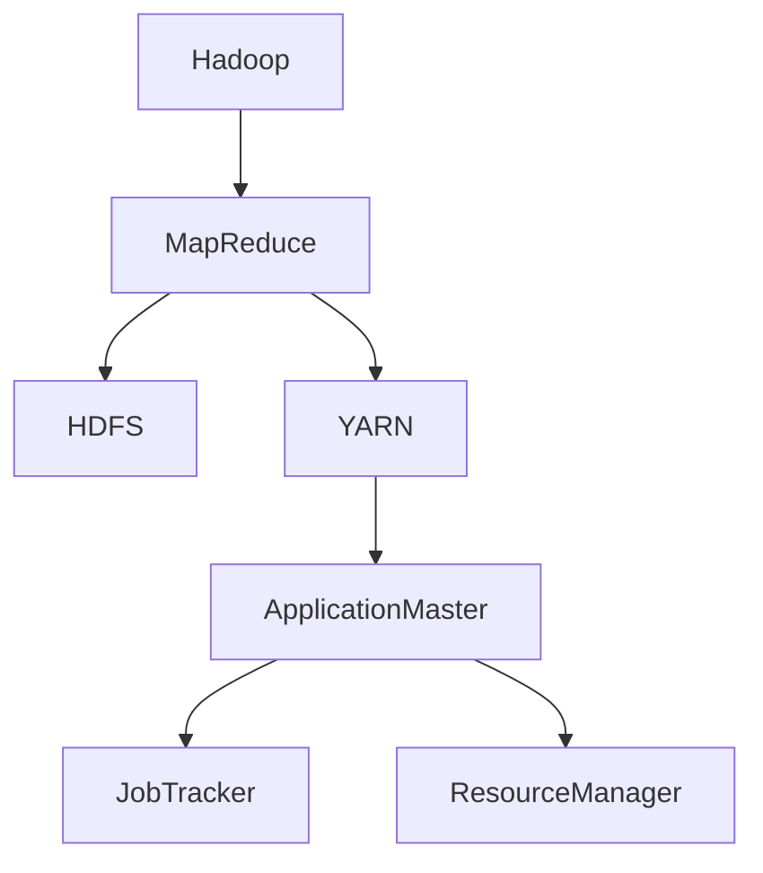

# ApplicationMaster在大数据处理中的应用场景与案例分析

作者：禅与计算机程序设计艺术 / Zen and the Art of Computer Programming

## 1. 背景介绍

### 1.1 问题的由来

随着互联网和物联网技术的快速发展，大数据时代已经到来。大数据具有海量、高速、多样和复杂等特点，对传统的数据处理技术提出了巨大的挑战。如何高效、可靠地处理大规模数据，成为大数据领域亟待解决的问题。

### 1.2 研究现状

为了解决大数据处理问题，研究人员提出了许多技术和方法，如分布式计算、内存计算、数据压缩等。其中，Hadoop生态系统是当前最流行的开源大数据处理框架之一，它采用了分布式存储（HDFS）和分布式计算（MapReduce）等技术，有效地解决了大规模数据处理问题。

### 1.3 研究意义

ApplicationMaster（AM）作为Hadoop生态系统中一个重要的组件，负责协调和管理作业的生命周期。研究ApplicationMaster在大数据处理中的应用场景和案例分析，对于提高大数据处理效率、降低成本和提升系统可扩展性具有重要意义。

### 1.4 本文结构

本文将从以下方面展开论述：

- 核心概念与联系
- 核心算法原理与具体操作步骤
- 数学模型与公式
- 应用场景与案例分析
- 工具和资源推荐
- 总结与展望

## 2. 核心概念与联系

### 2.1 Hadoop生态系统

Hadoop生态系统包括多个组件，如图2.1所示。其中，YARN（Yet Another Resource Negotiator）是Hadoop生态系统中的资源管理器，负责管理集群资源，并将资源分配给不同的应用程序。ApplicationMaster是YARN中的一个重要组件，负责协调和管理作业的生命周期。

### 2.2 YARN架构

YARN采用微服务架构，主要由以下几个核心组件组成：

- ResourceManager：负责集群资源管理，包括资源分配、资源监控和资源调整。
- NodeManager：负责节点资源管理，包括资源监控、任务执行和资源预留。
- ApplicationMaster：负责作业的生命周期管理，包括作业提交、作业调度、任务分配和任务监控。

## 3. 核心算法原理与具体操作步骤

### 3.1 算法原理概述

ApplicationMaster的核心算法原理是利用YARN的资源调度机制，将作业分解为多个任务，并合理分配资源，以确保作业的顺利进行。

### 3.2 算法步骤详解

ApplicationMaster的主要操作步骤如下：

1. 作业提交：用户将作业提交到YARN集群，ResourceManager接收作业请求，并将其分配给一个合适的NodeManager。
2. 作业初始化：ApplicationMaster在NodeManager上启动，初始化作业环境，包括资源申请、环境变量配置等。
3. 任务分配与执行：ApplicationMaster根据作业需求和资源状况，将任务分配给NodeManager上的容器，并监控任务执行状态。
4. 作业监控与状态更新：ApplicationMaster实时监控作业和任务的执行状态，并根据需要调整资源分配策略。
5. 作业完成：作业所有任务执行完成后，ApplicationMaster向ResourceManager汇报作业完成情况，释放资源。

### 3.3 算法优缺点

#### 优点

- **高效性**：ApplicationMaster通过合理分配资源，确保作业高效执行。
- **可扩展性**：YARN架构支持水平扩展，ApplicationMaster可以轻松适应大规模集群。
- **可靠性**：ApplicationMaster具备故障恢复机制，能够保证作业的稳定执行。

#### 缺点

- **资源利用率**：由于资源分配策略的限制，ApplicationMaster可能无法充分利用集群资源。
- **任务调度复杂度**：随着作业规模和复杂度的增加，任务调度变得更加复杂。

### 3.4 算法应用领域

ApplicationMaster可以应用于以下大数据处理领域：

- 分布式计算：如MapReduce、Spark等。
- 数据挖掘：如机器学习、数据挖掘等。
- 数据存储：如分布式文件系统、数据库等。

## 4. 数学模型与公式

ApplicationMaster的数学模型主要包括以下内容：

- **资源分配模型**：根据作业需求和资源状况，优化资源分配策略。
- **任务调度模型**：根据任务执行状态，动态调整任务调度策略。
- **故障恢复模型**：在作业执行过程中，识别和恢复故障。

### 4.1 资源分配模型

资源分配模型主要关注如何将集群资源（如CPU、内存等）合理分配给作业。以下是一个简单的资源分配模型：

$$
\text{资源分配} = \text{需求分配} \times \text{资源可用性}
$$

其中，需求分配表示作业对资源的实际需求，资源可用性表示集群资源满足作业需求的程度。

### 4.2 任务调度模型

任务调度模型主要关注如何将任务分配到NodeManager上的容器。以下是一个简单的任务调度模型：

$$
\text{任务分配} = \text{需求分配} \times \text{调度策略}
$$

其中，需求分配表示任务对资源的实际需求，调度策略包括任务优先级、资源利用率等因素。

### 4.3 故障恢复模型

故障恢复模型主要关注如何识别和恢复作业执行过程中的故障。以下是一个简单的故障恢复模型：

$$
\text{恢复} = \text{故障检测} \times \text{恢复策略}
$$

其中，故障检测表示识别作业执行过程中的故障，恢复策略包括任务重试、作业重启等。

## 5. 应用场景与案例分析

### 5.1 分布式计算

在分布式计算领域，ApplicationMaster可以应用于MapReduce、Spark等框架，优化作业执行效率和资源利用率。

### 5.2 数据挖掘

在数据挖掘领域，ApplicationMaster可以应用于机器学习、数据挖掘等任务，提高作业的执行效率和准确性。

### 5.3 数据存储

在数据存储领域，ApplicationMaster可以应用于分布式文件系统、数据库等，提高数据存储和处理效率。

## 6. 工具和资源推荐

### 6.1 学习资源推荐

- 《Hadoop权威指南》：介绍了Hadoop生态系统及其相关技术，适合初学者和进阶者。
- 《Spark快速入门》：介绍了Spark框架及其应用，适合对Spark感兴趣的读者。

### 6.2 开发工具推荐

- Hadoop：[https://hadoop.apache.org/](https://hadoop.apache.org/)
- Spark：[https://spark.apache.org/](https://spark.apache.org/)

### 6.3 相关论文推荐

- YARN: Yet Another Resource Negotiator，YARN: A Next-Generation MapReduce Framework，作者：Sanjay Ghemawat等。
- ApplicationMaster in YARN，作者：Georgios Theodorou等。

### 6.4 其他资源推荐

- Hadoop社区：[https://community.hortonworks.com/](https://community.hortonworks.com/)
- Spark社区：[https://spark.apache.org/community.html](https://spark.apache.org/community.html)

## 7. 总结与展望

本文从ApplicationMaster的核心概念、算法原理、应用场景等方面进行了详细论述。随着大数据技术的不断发展，ApplicationMaster将在以下方面得到进一步的发展：

- 资源调度策略的优化，提高资源利用率。
- 任务调度算法的改进，降低任务调度复杂度。
- 故障恢复机制的完善，提高作业执行稳定性。
- 与其他大数据技术的融合，拓展应用领域。

未来，ApplicationMaster将在大数据处理领域发挥越来越重要的作用，为构建高效、稳定、可扩展的大数据处理平台提供有力支持。

## 8. 附录：常见问题与解答

### 8.1 什么是ApplicationMaster？

ApplicationMaster是YARN中的一个重要组件，负责协调和管理作业的生命周期，包括作业提交、作业调度、任务分配和任务监控。

### 8.2 YARN与MapReduce的关系是什么？

YARN是Hadoop生态系统中的一个资源调度框架，它为MapReduce、Spark等计算框架提供了统一的资源管理平台。

### 8.3 如何优化资源分配策略？

优化资源分配策略需要综合考虑作业需求、资源状况、调度策略等因素。可以通过以下方法进行优化：

- 采用动态资源分配策略，根据作业执行状态调整资源分配。
- 采用资源预留策略，为关键任务预留足够的资源。
- 采用资源池化策略，提高资源利用率。

### 8.4 如何改进任务调度算法？

改进任务调度算法需要关注以下方面：

- 提高任务调度效率，降低任务调度时间。
- 提高任务调度公平性，确保所有任务得到公平的资源分配。
- 提高任务调度适应性，适应不同作业的特点。

### 8.5 如何完善故障恢复机制？

完善故障恢复机制需要关注以下方面：

- 识别作业执行过程中的故障，及时进行恢复。
- 提高故障恢复速度，减少作业执行中断时间。
- 提高故障恢复成功率，确保作业最终完成。