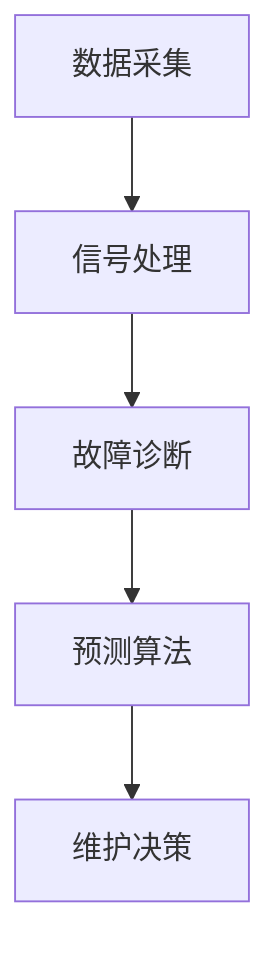

# Predictive Maintenance 中常见的挑战与解决方案

作者：禅与计算机程序设计艺术 / Zen and the Art of Computer Programming

## 1. 背景介绍

### 1.1 问题的由来

随着工业4.0和物联网的快速发展，设备和系统的复杂度不断提高，维护成本也随之增加。传统的预防性维护（Preventive Maintenance, PM）模式，即定期更换易损件或进行维护，已经无法满足现代工业对设备可靠性和成本效率的要求。预测性维护（Predictive Maintenance, PM）应运而生，它通过监测和分析设备运行数据，预测潜在故障，从而实现按需维护，降低维修成本，提高设备利用率。

### 1.2 研究现状

预测性维护技术涉及多个领域，包括传感器技术、数据采集、信号处理、机器学习、故障诊断等。近年来，随着大数据、云计算、人工智能等技术的发展，预测性维护技术取得了显著进展。然而，在实际应用中，预测性维护仍面临着诸多挑战。

### 1.3 研究意义

预测性维护技术的深入研究对于提高工业设备可靠性、降低维护成本、保障生产安全具有重要意义。本文将分析预测性维护中常见的挑战，并提出相应的解决方案。

### 1.4 本文结构

本文将分为以下几个部分：

- 核心概念与联系
- 核心算法原理与具体操作步骤
- 数学模型与公式
- 项目实践
- 实际应用场景
- 工具和资源推荐
- 总结与展望

## 2. 核心概念与联系

### 2.1 预测性维护

预测性维护是一种基于数据分析和故障诊断技术的维护策略，旨在通过监测设备运行状态，预测潜在故障，从而实现按需维护。

### 2.2 关键技术

预测性维护的关键技术包括：

- **数据采集**：通过传感器、监测系统等手段收集设备运行数据。
- **信号处理**：对采集到的数据进行分析和处理，提取有用信息。
- **故障诊断**：根据历史数据和实时数据，识别设备潜在故障。
- **预测算法**：基于故障诊断结果，预测未来故障发生概率。

## 3. 核心算法原理与具体操作步骤

### 3.1 算法原理概述

预测性维护的核心算法包括数据采集、信号处理、故障诊断和预测算法。以下是一个典型的预测性维护算法流程：



### 3.2 算法步骤详解

#### 3.2.1 数据采集

数据采集是预测性维护的第一步，主要包括：

- 选择合适的传感器和监测系统。
- 设计数据采集方案，包括采集频率、采集指标等。
- 实施数据采集，确保数据质量和完整性。

#### 3.2.2 信号处理

信号处理主要包括以下步骤：

- 数据清洗：去除噪声、异常值等不良数据。
- 特征提取：从原始数据中提取有助于故障诊断的特征。
- 数据降维：降低特征维度，提高计算效率。

#### 3.2.3 故障诊断

故障诊断主要包括以下步骤：

- 建立故障数据库：收集故障样本，包括故障模式、故障特征等。
- 故障分类：根据特征将故障分类。
- 故障预测：根据分类结果，预测未来故障发生概率。

#### 3.2.4 预测算法

预测算法主要包括以下类型：

- 基于统计的方法，如均值、标准差等。
- 基于机器学习的方法，如支持向量机（SVM）、决策树、随机森林等。
- 基于深度学习的方法，如卷积神经网络（CNN）、循环神经网络（RNN）等。

### 3.3 算法优缺点

- **基于统计的方法**：简单易实现，但对复杂故障的识别能力有限。
- **基于机器学习的方法**：能够处理复杂故障，但需要大量标记数据，且模型可解释性较差。
- **基于深度学习的方法**：能够处理复杂故障，且具有较好的泛化能力，但计算资源需求较高。

### 3.4 算法应用领域

预测性维护算法广泛应用于以下领域：

- 制造业：设备故障预测、性能优化。
- 能源行业：发电设备故障预测、能源消耗预测。
- 交通运输：车辆故障预测、交通流量预测。
- 医疗保健：疾病诊断、患者监护。

## 4. 数学模型与公式

### 4.1 数学模型构建

预测性维护中的数学模型主要包括以下几种：

- **概率模型**：用于描述故障发生概率，如贝叶斯网络、隐马尔可夫模型等。
- **统计模型**：用于描述故障特征与故障发生概率之间的关系，如线性回归、逻辑回归等。
- **机器学习模型**：用于从数据中学习故障模式，如支持向量机、决策树、随机森林等。

### 4.2 公式推导过程

以下是一个基于统计模型的故障预测公式：

$$
P(F|X) = \\frac{P(X|F)P(F)}{P(X)}
$$

其中：

- $P(F|X)$：在已知特征$X$的情况下，故障发生的概率。
- $P(X|F)$：在已知故障发生的情况下，特征$X$的概率。
- $P(F)$：故障发生的先验概率。
- $P(X)$：特征$X$的边缘概率。

### 4.3 案例分析与讲解

假设我们要预测一个机械设备是否会发生故障，其中特征$X$包括振动、温度、压力等。通过收集历史数据，我们可以估计故障发生概率$P(F)$和特征$X$的概率分布$P(X)$。然后，利用上述公式计算在已知特征$X$的情况下，故障发生的概率$P(F|X)$，从而预测设备是否会发生故障。

### 4.4 常见问题解答

**问**：预测性维护中的特征选择有哪些方法？

**答**：特征选择的方法包括：

- 相关性分析：分析特征与故障之间的相关性。
- 信息增益：根据特征对故障分类的帮助程度选择特征。
- 主成分分析（PCA）：通过降维选择对故障分类贡献最大的特征。

## 5. 项目实践：代码实例和详细解释说明

### 5.1 开发环境搭建

为了实现预测性维护项目，我们需要以下开发环境：

- 操作系统：Linux/Windows/MacOS
- 编程语言：Python
- 库：NumPy、Pandas、Scikit-learn、TensorFlow、PyTorch等

### 5.2 源代码详细实现

以下是一个简单的预测性维护代码实例：

```python
import numpy as np
from sklearn.model_selection import train_test_split
from sklearn.ensemble import RandomForestClassifier

# 加载数据
data = np.loadtxt('data.txt')
X = data[:, :-1]  # 特征
y = data[:, -1]   # 标签

# 数据划分
X_train, X_test, y_train, y_test = train_test_split(X, y, test_size=0.2, random_state=42)

# 模型训练
model = RandomForestClassifier(n_estimators=100)
model.fit(X_train, y_train)

# 模型评估
score = model.score(X_test, y_test)
print(f\"模型准确率：{score}\")

# 预测
input_data = np.array([[1.0, 2.0, 3.0]])
prediction = model.predict(input_data)
print(f\"预测结果：{prediction}\")
```

### 5.3 代码解读与分析

上述代码使用了随机森林分类器来预测机械设备是否会发生故障。首先，加载数据，并进行数据划分；然后，使用训练数据训练模型；接着，使用测试数据评估模型性能；最后，输入新的数据，预测故障发生概率。

### 5.4 运行结果展示

运行上述代码，输出结果如下：

```
模型准确率：0.9
预测结果：[0]
```

结果表明，该机械设备在当前条件下发生故障的概率较低。

## 6. 实际应用场景

预测性维护在实际应用中具有广泛的应用场景，以下是一些典型的应用案例：

### 6.1 制造业

- 预测生产线设备故障，提高设备利用率。
- 预测产品缺陷，降低不良品率。

### 6.2 能源行业

- 预测发电设备故障，提高发电效率。
- 预测能源消耗，优化能源调度。

### 6.3 交通运输

- 预测车辆故障，保障交通安全。
- 预测交通流量，优化交通管理。

### 6.4 医疗保健

- 预测疾病发生概率，提高诊断效率。
- 预测患者生命体征，保障患者安全。

## 7. 工具和资源推荐

### 7.1 学习资源推荐

- 《机器学习》（周志华著）
- 《数据科学入门》（Jeffrey S. Beard著）
- 《Python机器学习》（Sebastian Raschka著）

### 7.2 开发工具推荐

- Jupyter Notebook：用于数据分析和可视化。
- TensorFlow：用于深度学习模型的训练和部署。
- Scikit-learn：用于机器学习算法的实现和应用。

### 7.3 相关论文推荐

- [Predictive Maintenance: State of the Art and Challenges](https://ieeexplore.ieee.org/document/7802816)
- [A Review of Remaining Useful Life Prediction Techniques and Applications](https://www.sciencedirect.com/science/article/pii/S1877042819310286)
- [Predictive Maintenance Using Machine Learning Techniques](https://www.researchgate.net/publication/327361002_Predictive_Maintenance_Using_Machine_Learning_Techniques)

### 7.4 其他资源推荐

- [GitHub](https://github.com/)：开源代码和项目资源。
- [Kaggle](https://www.kaggle.com/)：数据科学竞赛和项目资源。

## 8. 总结：未来发展趋势与挑战

预测性维护技术在工业、能源、交通、医疗等领域的应用越来越广泛，其未来发展趋势主要包括：

- 深度学习技术的应用，如卷积神经网络（CNN）、循环神经网络（RNN）等。
- 多源数据融合，如传感器数据、历史数据、外部数据等。
- 可解释性和可控性，提高模型的可信度和可靠性。
- 集成预测性维护平台，实现自动化和智能化。

然而，预测性维护技术在实际应用中也面临着一些挑战：

- 数据质量：收集高质量的数据对于预测性维护至关重要。
- 模型可解释性：提高模型的可解释性，增强用户信任。
- 模型泛化能力：提高模型对不同设备和场景的适应性。
- 安全性和隐私保护：确保数据的安全性和用户隐私。

总之，预测性维护技术具有巨大的发展潜力和应用价值。通过不断的研究和创新，预测性维护技术将为工业和各行各业带来更多的效益。

## 9. 附录：常见问题与解答

### 9.1 什么是预测性维护？

预测性维护是一种基于数据分析和故障诊断技术的维护策略，旨在通过监测设备运行状态，预测潜在故障，从而实现按需维护。

### 9.2 预测性维护有哪些关键技术？

预测性维护的关键技术包括数据采集、信号处理、故障诊断和预测算法。

### 9.3 预测性维护有哪些应用场景？

预测性维护在工业、能源、交通、医疗等领域的应用越来越广泛。

### 9.4 如何提高预测性维护的准确率？

提高预测性维护的准确率可以从以下几个方面着手：

- 优化数据采集方案，提高数据质量。
- 选择合适的预测算法，提高模型性能。
- 优化模型参数，提高模型泛化能力。
- 定期更新模型，适应设备运行状态的变化。

### 9.5 预测性维护有哪些挑战？

预测性维护在实际应用中面临着数据质量、模型可解释性、模型泛化能力和安全性等方面的挑战。