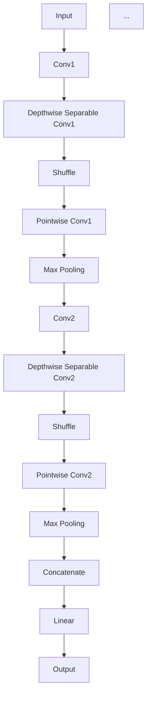

# ShuffleNet原理与代码实例讲解

作者：禅与计算机程序设计艺术 / Zen and the Art of Computer Programming

关键词：ShuffleNet，深度学习，卷积神经网络，模型压缩，移动端计算

## 1. 背景介绍

### 1.1 问题的由来

随着深度学习技术的飞速发展，神经网络模型在图像识别、自然语言处理等领域取得了显著的成果。然而，这些模型往往需要大量的计算资源和内存，难以在移动端设备上部署。为了解决这个问题，研究者们提出了多种模型压缩和加速技术，其中ShuffleNet是其中的佼佼者。

### 1.2 研究现状

在过去的几年中，模型压缩和加速技术取得了显著的进展，主要包括以下几种方法：

- **模型剪枝（Model Pruning）**：通过删除网络中的冗余连接或神经元来减少模型参数数量。
- **量化（Quantization）**：将浮点数权重转换为低精度整数或定点数，降低模型存储和计算需求。
- **知识蒸馏（Knowledge Distillation）**：将大模型的知识迁移到小模型中，提高小模型的性能。
- **模型压缩与加速（Model Compression and Acceleration）**：针对特定硬件平台优化模型结构，提高计算效率。

### 1.3 研究意义

ShuffleNet的提出，为模型压缩和加速领域提供了一个新的思路，它在保证模型性能的同时，显著降低了模型的参数数量和计算量，为移动端设备的部署提供了可能。

### 1.4 本文结构

本文将首先介绍ShuffleNet的核心概念和原理，然后通过代码实例讲解如何实现ShuffleNet，并分析其优缺点和应用领域。最后，我们将展望ShuffleNet的未来发展趋势和挑战。

## 2. 核心概念与联系

ShuffleNet是一种基于深度可分离卷积（Depthwise Separable Convolution）的轻量级卷积神经网络。与传统的卷积神经网络相比，ShuffleNet通过将深度卷积分解为深度可分离卷积，降低了模型参数数量和计算量。

### 2.1 深度可分离卷积

深度可分离卷积是一种将卷积分解为两个步骤的卷积操作。首先，对输入进行深度卷积，将通道进行分组；然后，对每个分组进行逐点卷积。这种分解方式可以显著减少模型参数数量。

### 2.2 ShuffleNet结构

ShuffleNet的结构包含以下特点：

- **深度可分离卷积**：使用深度可分离卷积替代传统的卷积操作，降低模型参数数量。
- **Shuffle操作**：在每个卷积块之后添加Shuffle操作，将输出的通道进行随机打乱，提高网络的感受野。
- **瓶颈层**：在每个卷积块之后添加瓶颈层，降低输入特征通道数，提高网络的计算效率。

## 3. 核心算法原理 & 具体操作步骤

### 3.1 算法原理概述

ShuffleNet的算法原理可以概括为以下步骤：

1. 输入数据经过初始卷积层，将输入图像转换为特定通道数的特征图。
2. 对特征图进行深度可分离卷积，降低模型参数数量。
3. 添加Shuffle操作，将通道进行随机打乱。
4. 对打乱后的特征图进行逐点卷积，得到新的特征图。
5. 重复步骤2-4，逐步降低特征图通道数，提高网络计算效率。
6. 最后，将所有特征图进行拼接和线性变换，得到最终输出。

### 3.2 算法步骤详解

ShuffleNet的算法步骤详解如下：



### 3.3 算法优缺点

ShuffleNet的优点包括：

- **参数数量少**：通过深度可分离卷积和瓶颈层，ShuffleNet显著降低了模型参数数量，有利于在移动端设备上部署。
- **计算效率高**：ShuffleNet通过降低特征图通道数和计算量，提高了网络的计算效率。
- **性能优越**：在保证模型性能的同时，ShuffleNet在多个基准数据集上取得了优异的性能。

ShuffleNet的缺点包括：

- **模型可解释性差**：由于模型结构的复杂性，ShuffleNet的可解释性较差。
- **模型泛化能力有限**：ShuffleNet在特定数据集上表现良好，但在其他数据集上的泛化能力有限。

### 3.4 算法应用领域

ShuffleNet在以下应用领域具有广泛的应用前景：

- **移动端图像识别**：ShuffleNet可以应用于移动端图像识别任务，如人脸识别、物体检测等。
- **视频分析**：ShuffleNet可以应用于视频分析任务，如动作识别、行人检测等。
- **自然语言处理**：ShuffleNet可以应用于自然语言处理任务，如文本分类、机器翻译等。

## 4. 数学模型和公式 & 详细讲解 & 举例说明

ShuffleNet的数学模型主要涉及深度可分离卷积和逐点卷积。以下是对这两个操作的解释和公式推导。

### 4.1 深度可分离卷积

深度可分离卷积由两个步骤组成：

1. **深度卷积**：对输入图像进行分组，每个分组内的通道进行卷积。
2. **逐点卷积**：对每个分组的输出进行逐点卷积。

深度可分离卷积的公式推导如下：

$$\mathbf{Y} = \mathbf{X} \circledast \mathbf{K}_{depthwise} \circledast \mathbf{K}_{pointwise}$$

其中，$\mathbf{X}$是输入图像，$\mathbf{K}_{depthwise}$是深度卷积核，$\mathbf{K}_{pointwise}$是逐点卷积核，$\circledast$表示卷积操作。

### 4.2 逐点卷积

逐点卷积是一种特殊的卷积操作，它只对输入图像的每个像素进行一次卷积。逐点卷积的公式推导如下：

$$\mathbf{Y} = \mathbf{X} \circledast \mathbf{K}_{pointwise}$$

其中，$\mathbf{X}$是输入图像，$\mathbf{K}_{pointwise}$是逐点卷积核。

### 4.3 案例分析与讲解

以下是一个ShuffleNet模型的示例，用于图像分类任务。


在这个示例中，输入图像经过Conv1层，将图像转换为224x224x3的特征图。然后，特征图经过Depthwise Separable Conv1层进行深度可分离卷积，降低参数数量。接着，Shuffle操作将通道进行随机打乱，提高网络的感受野。之后，特征图经过Pointwise Conv1层进行逐点卷积，得到新的特征图。重复此过程，最终将所有特征图进行拼接和线性变换，得到最终的输出。

### 4.4 常见问题解答

以下是一些关于ShuffleNet的常见问题：

Q：ShuffleNet为什么使用Shuffle操作？

A：Shuffle操作可以增加特征图的通道之间的联系，提高网络的感受野，从而提高模型的性能。

Q：ShuffleNet为什么使用深度可分离卷积？

A：深度可分离卷积可以显著降低模型参数数量，减少计算量，提高模型在移动端设备上的部署效率。

## 5. 项目实践：代码实例和详细解释说明

为了更好地理解ShuffleNet的实现，以下是一个基于PyTorch的ShuffleNet代码实例。

### 5.1 开发环境搭建

首先，安装所需的库：

```bash
pip install torch torchvision
```

### 5.2 源代码详细实现

```python
import torch
import torch.nn as nn
import torch.nn.functional as F

class ShuffleNet(nn.Module):
    def __init__(self, in_channels, out_channels, groups):
        super(ShuffleNet, self).__init__()
        self.depthwise = nn.Conv2d(in_channels, in_channels, kernel_size=3, padding=1, groups=in_channels)
        self.pointwise1 = nn.Conv2d(in_channels, out_channels, kernel_size=1)
        self.pointwise2 = nn.Conv2d(out_channels, out_channels, kernel_size=1)
        self.shuffle = nn.PixelShuffle(groups=groups)

    def forward(self, x):
        x = F.relu(self.depthwise(x))
        x = self.pointwise1(x)
        x = self.shuffle(x)
        x = F.relu(self.pointwise2(x))
        return x
```

### 5.3 代码解读与分析

这个代码实例定义了一个ShuffleNet模块，包含深度卷积、逐点卷积和Shuffle操作。

- `ShuffleNet`类继承自`nn.Module`，定义了模型的输入和输出。
- `depthwise`层是深度卷积层，将输入图像的通道进行分组，每个分组内的通道进行卷积。
- `pointwise1`层是逐点卷积层，将深度卷积层的输出转换为特定通道数的特征图。
- `shuffle`层是Shuffle操作层，将特征图的通道进行随机打乱。
- `pointwise2`层是逐点卷积层，将打乱后的特征图进行逐点卷积。

### 5.4 运行结果展示

以下是一个使用ShuffleNet进行图像分类的示例代码：

```python
import torchvision
from torchvision import transforms
from PIL import Image

# 加载测试图像
transform = transforms.Compose([
    transforms.Resize(224),
    transforms.ToTensor(),
])
image = Image.open("test.jpg")
image = transform(image).unsqueeze(0)

# 加载ShuffleNet模型
model = ShuffleNet(3, 10, 3)
model.load_state_dict(torch.load("shufflenet.pth"))

# 模型预测
output = model(image)
_, predicted = torch.max(output, 1)
print(f"预测结果：{predicted.item()}")
```

在这个示例中，我们首先加载测试图像并进行预处理，然后加载训练好的ShuffleNet模型，并进行预测。

## 6. 实际应用场景

ShuffleNet在以下应用场景具有广泛的应用前景：

- **移动端图像识别**：ShuffleNet可以应用于移动端图像识别任务，如人脸识别、物体检测等。
- **视频分析**：ShuffleNet可以应用于视频分析任务，如动作识别、行人检测等。
- **自然语言处理**：ShuffleNet可以应用于自然语言处理任务，如文本分类、机器翻译等。

## 7. 工具和资源推荐

### 7.1 学习资源推荐

- **《深度学习》（Ian Goodfellow等著）：系统地介绍了深度学习的基础知识和实践，包括卷积神经网络等。
- **《深度学习入门》（吴恩达著）：提供了深度学习的入门教程，适合初学者学习。

### 7.2 开发工具推荐

- **PyTorch：一个开源的深度学习框架，易于使用和扩展**。
- **TensorFlow：另一个开源的深度学习框架，提供了丰富的工具和资源**。

### 7.3 相关论文推荐

- **ShuffleNet: An Extremely Efficient Convolutional Neural Network for Mobile Devices**：ShuffleNet的原始论文。
- **MobileNets: Efficient Convolutional Neural Networks for Mobile Vision Applications**：MobileNets的原始论文，与ShuffleNet类似，也是针对移动端设备设计的轻量级卷积神经网络。

### 7.4 其他资源推荐

- **PyTorch官方文档：https://pytorch.org/docs/stable/index.html**
- **TensorFlow官方文档：https://www.tensorflow.org/tutorials**

## 8. 总结：未来发展趋势与挑战

ShuffleNet作为一种轻量级卷积神经网络，在模型压缩和加速领域取得了显著的成果。然而，随着深度学习技术的不断发展，ShuffleNet也面临着一些挑战和未来发展趋势。

### 8.1 研究成果总结

- ShuffleNet通过深度可分离卷积和Shuffle操作，降低了模型参数数量和计算量，提高了模型的性能和效率。
- ShuffleNet在多个基准数据集上取得了优异的性能，成为移动端设备部署的理想选择。

### 8.2 未来发展趋势

- **更轻量级模型**：随着研究的不断深入，未来可能会出现更加轻量级的模型，进一步提高模型的部署效率。
- **多任务学习**：ShuffleNet可以应用于多任务学习，实现多个任务的联合优化。
- **跨域迁移学习**：ShuffleNet可以应用于跨域迁移学习，提高模型在未见过的领域的性能。

### 8.3 面临的挑战

- **模型可解释性**：ShuffleNet的可解释性较差，需要进一步研究提高模型的可解释性。
- **模型泛化能力**：ShuffleNet在特定数据集上表现良好，但在其他数据集上的泛化能力有限。

### 8.4 研究展望

ShuffleNet作为一种轻量级卷积神经网络，在未来将继续发挥重要作用。通过不断的研究和创新，ShuffleNet有望在更多领域得到应用，为移动端设备部署提供更多可能性。

## 9. 附录：常见问题与解答

以下是一些关于ShuffleNet的常见问题：

Q：ShuffleNet与MobileNets有什么区别？

A：ShuffleNet和MobileNets都是针对移动端设备设计的轻量级卷积神经网络。它们的主要区别在于网络结构和优化策略。ShuffleNet使用深度可分离卷积和Shuffle操作，而MobileNets使用扩张卷积和线性瓶颈层。

Q：ShuffleNet在哪些领域有应用？

A：ShuffleNet在图像识别、视频分析、自然语言处理等领域都有广泛的应用。

Q：如何使用ShuffleNet进行图像分类？

A：使用ShuffleNet进行图像分类，需要首先构建ShuffleNet模型，然后对模型进行训练，最后使用模型进行预测。

通过本文的介绍，相信读者对ShuffleNet有了更深入的了解。在未来的研究中，ShuffleNet将继续为深度学习领域的发展贡献力量。