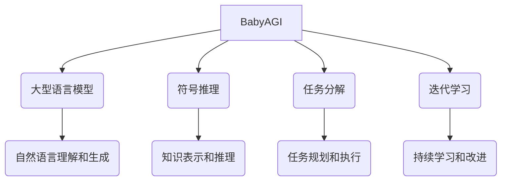

# 【大模型应用开发 动手做AI Agent】BabyAGI简介

## 1. 背景介绍

### 1.1 问题的由来

在当前的人工智能发展浪潮中,大型语言模型(Large Language Models, LLMs)凭借其强大的自然语言理解和生成能力,已经成为各大科技公司和研究机构的研究热点。然而,尽管这些模型在特定任务上表现出色,但它们仍然缺乏通用智能和自主学习能力,无法像人类那样灵活地应对复杂的现实世界问题。

为了克服这一局限性,研究人员提出了构建人工通用智能(Artificial General Intelligence, AGI)系统的愿景,旨在创建能够像人类一样学习、推理和解决问题的智能系统。BabyAGI(Baby Artificial General Intelligence)项目就是朝着这一目标迈出的重要一步,它探索了如何利用大型语言模型作为基础,通过引入符号推理、任务分解和迭代学习等机制,逐步构建通用智能系统。

### 1.2 研究现状

虽然AGI的最终目标仍然遥不可及,但近年来,一些重要的研究工作为实现AGI奠定了基础。例如,DeepMind的AlphaGo系统展示了将深度学习与搜索和规划算法相结合的强大能力。OpenAI的InstructGPT则证明了大型语言模型在理解和执行复杂指令方面的潜力。此外,一些研究人员还探索了将语言模型与外部知识库和推理系统相集成的方法。

BabyAGI项目建立在这些先前工作的基础之上,旨在通过构建一个简化的AGI原型系统,来探索实现通用智能所需的关键组件和架构。该项目由OpenAI的Anthropic公司发起,并吸引了来自世界各地的研究人员和开发者的参与。

### 1.3 研究意义

BabyAGI项目的研究意义主要体现在以下几个方面:

1. **探索AGI的关键组件和架构**:通过构建一个简化的AGI原型系统,研究人员可以深入探索实现通用智能所需的关键组件,如符号推理、任务分解、迭代学习等,以及这些组件如何协同工作的最佳架构。

2. **推动大型语言模型的发展**:BabyAGI利用大型语言模型作为基础,并通过引入新的机制来增强其能力。这一过程不仅可以促进大型语言模型的进一步发展,还可以为其在更广泛的领域中的应用提供借鉴。

3. **培养AGI人才和社区**:BabyAGI项目吸引了来自世界各地的研究人员和开发者参与,有助于培养AGI领域的人才,并建立一个活跃的社区,促进知识和经验的交流。

4. **推进人工智能的伦理和安全研究**:AGI系统的发展将对社会产生深远的影响,因此研究过程中必须重视伦理和安全方面的考虑。BabyAGI项目可以为探索AGI系统的伦理和安全问题提供一个实践平台。

### 1.4 本文结构

本文将全面介绍BabyAGI项目,内容包括:

1. 核心概念与联系
2. 核心算法原理及具体操作步骤
3. 数学模型和公式详细讲解及举例说明
4. 项目实践:代码实例和详细解释说明
5. 实际应用场景
6. 工具和资源推荐
7. 总结:未来发展趋势与挑战
8. 附录:常见问题与解答

通过对这些内容的全面阐述,读者将能够深入理解BabyAGI项目的核心理念、技术细节和实践经验,为探索AGI奠定坚实的基础。

## 2. 核心概念与联系

BabyAGI项目的核心思想是将大型语言模型作为基础,并通过引入符号推理、任务分解和迭代学习等机制,逐步构建通用智能系统。

1. **大型语言模型**:大型语言模型(如GPT-3)通过在海量文本数据上进行预训练,获得了强大的自然语言理解和生成能力。它们可以作为BabyAGI系统的基础,处理自然语言输入和输出。

2. **符号推理**:符号推理是指利用形式化的知识表示和推理规则,对符号化的知识进行操作和推导。在BabyAGI中,符号推理模块可以将自然语言输入转换为形式化的知识表示,并基于推理规则进行推导,从而增强系统的推理能力。

3. **任务分解**:任务分解是指将复杂的任务分解为一系列更简单的子任务,并逐步执行和组合这些子任务以完成原始任务。在BabyAGI中,任务分解模块可以根据当前任务的复杂程度,决定是直接执行还是将其分解为更简单的子任务。

4. **迭代学习**:迭代学习是指系统通过不断尝试、反馈和改进,逐步提高自身的能力。在BabyAGI中,迭代学习模块可以根据任务执行的结果,调整系统的知识库、推理规则或任务分解策略,从而持续改进系统的性能。

这些核心概念相互关联,共同构建了BabyAGI的整体架构。大型语言模型提供了自然语言理解和生成的基础;符号推理模块增强了系统的推理能力;任务分解模块使系统能够处理复杂任务;而迭代学习模块则确保系统能够持续改进和适应新的环境。

## 3. 核心算法原理及具体操作步骤

### 3.1 算法原理概述

BabyAGI的核心算法原理可以概括为以下几个关键步骤:

1. **任务理解**:利用大型语言模型对输入的自然语言任务进行理解和表示。

2. **任务分解**:根据任务的复杂程度,决定是直接执行还是将其分解为更简单的子任务。

3. **子任务执行**:对于每个子任务,利用符号推理模块和外部知识库进行推理和执行。

4. **结果组合**:将各个子任务的执行结果组合,形成对原始任务的解决方案。

5. **迭代学习**:根据任务执行的结果,调整系统的知识库、推理规则或任务分解策略,以持续改进系统的性能。

在这个过程中,符号推理、任务分解和迭代学习等模块紧密协作,共同实现了BabyAGI的核心功能。

### 3.2 算法步骤详解

下面我们将详细解释BabyAGI算法的具体执行步骤:

1. **任务理解**

   - 将输入的自然语言任务传递给大型语言模型进行处理。
   - 语言模型根据上下文和先验知识,对任务进行理解和表示,输出一个结构化的任务表示。

2. **任务分解**

   - 根据任务的复杂程度,决定是直接执行还是将其分解为更简单的子任务。
   - 如果任务足够简单,则直接执行第3步;否则,进行任务分解。
   - 任务分解模块将复杂任务分解为一系列更简单的子任务,并确定执行顺序。

3. **子任务执行**

   - 对于每个子任务,利用符号推理模块和外部知识库进行推理和执行。
   - 符号推理模块将子任务转换为形式化的知识表示,并基于推理规则进行推导。
   - 根据推导结果,执行相应的操作或查询外部知识库获取所需信息。
   - 将子任务的执行结果存储起来,用于后续的结果组合。

4. **结果组合**

   - 将各个子任务的执行结果按照预定的顺序组合,形成对原始任务的解决方案。
   - 可能需要进行一些后处理,如结果格式化、冗余信息去除等。
   - 将最终结果输出为自然语言形式。

5. **迭代学习**

   - 根据任务执行的结果,评估系统的性能表现。
   - 如果结果不理想,则调整系统的知识库、推理规则或任务分解策略。
   - 可以通过人工标注、自动评估或其他机制获取反馈信息。
   - 系统根据反馈信息进行持续学习和改进。

这个过程可以不断重复,使BabyAGI系统逐步提高其任务执行能力。

### 3.3 算法优缺点

BabyAGI算法具有以下优点:

- **利用大型语言模型的强大能力**:大型语言模型在自然语言理解和生成方面表现出色,为BabyAGI提供了坚实的基础。

- **模块化设计,易于扩展**:BabyAGI采用了模块化设计,各个模块分工明确,易于维护和扩展。

- **支持复杂任务处理**:通过任务分解机制,BabyAGI能够处理复杂的任务,而不是局限于简单的问答场景。

- **具备持续学习能力**:迭代学习模块使得BabyAGI能够根据反馈不断改进自身,适应新的环境和任务。

但同时,BabyAGI算法也存在一些缺点和挑战:

- **依赖高质量的知识库**:符号推理模块的性能在很大程度上依赖于知识库的质量和完整性。构建高质量知识库是一项艰巨的任务。

- **任务分解策略的选择**:合理的任务分解策略对于算法的性能至关重要,但确定最优策略并非易事。

- **可解释性和可控性挑战**:作为一种复杂的人工智能系统,BabyAGI的决策过程可能缺乏透明度和可解释性,这可能会带来安全和伦理方面的挑战。

- **计算资源需求高**:大型语言模型和符号推理等模块对计算资源的需求较高,可能需要强大的硬件支持。

### 3.4 算法应用领域

尽管BabyAGI目前仍处于原型阶段,但其核心思想和算法可以为多个领域的应用提供启发:

- **智能助手和对话系统**:BabyAGI的任务分解和符号推理能力可以用于构建更智能、更有针对性的对话助手和问答系统。

- **自动化流程执行**:通过将复杂的业务流程分解为一系列子任务,BabyAGI可以用于自动化执行各种流程,提高效率和一致性。

- **决策支持系统**:BabyAGI的推理和知识综合能力可以为复杂决策提供支持,帮助决策者权衡不同因素并做出明智的选择。

- **教育和培训**:BabyAGI可以作为一种智能教学助手,根据学习者的需求动态调整教学内容和方式,提供个性化的学习体验。

- **科研和发现**:BabyAGI的迭代学习能力可以用于探索新的科学领域,通过不断尝试和改进,发现新的规律和见解。

总的来说,BabyAGI算法为构建通用智能系统提供了一种有前景的方法,其核心思想和技术也可以为多个领域的应用带来启发和创新。

## 4. 数学模型和公式及详细讲解及举例说明

在BabyAGI系统中,数学模型和公式主要应用于符号推理模块,用于对形式化的知识表示进行操作和推导。下面我们将介绍一些常见的数学模型和公式,并详细讲解它们的原理和应用。

### 4.1 数学模型构建

符号推理模块需要将自然语言输入转换为形式化的知识表示,以便进行推理和计算。常见的知识表示形式包括:

- **逻辑表达式**:使用命题逻辑或一阶逻辑等形式化语言来表示事实和规则。
- **语义网络**:使用节点和边来表示概念