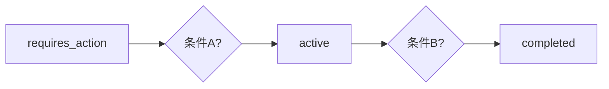

# 【大模型应用开发 动手做AI Agent】在Run进入requires_action状态之后跳出循环

作者：禅与计算机程序设计艺术 / Zen and the Art of Computer Programming

## 1. 背景介绍

### 1.1 问题的由来

在人工智能领域，Agent是一种能够感知环境并采取行动以实现特定目标的实体。在许多AI Agent系统中，Run函数是核心，它负责Agent的执行流程。然而，在实际应用中，我们经常遇到Agent在执行过程中陷入`requires_action`状态而无法跳出循环的问题。这个问题不仅会影响Agent的执行效率，还可能导致系统崩溃。因此，如何在Agent进入`requires_action`状态后跳出循环，成为了一个亟待解决的问题。

### 1.2 研究现状

针对Agent在`requires_action`状态无法跳出循环的问题，研究人员已经提出了一些解决方案。这些方案主要包括以下几种：

1. **条件判断法**：通过在Run函数中设置特定的条件判断，当满足条件时跳出循环。
2. **状态转换法**：将Agent的状态进行转换，当状态达到特定值时跳出循环。
3. **定时器法**：设置定时器，在达到指定时间后跳出循环。
4. **异常处理法**：通过捕获异常，当遇到特定异常时跳出循环。

然而，这些方法各有局限性，如条件判断法依赖于特定的条件，状态转换法需要设计复杂的状态机，定时器法可能存在时间误差，异常处理法可能无法处理所有异常情况。

### 1.3 研究意义

在AI Agent系统中，有效解决`requires_action`状态无法跳出循环的问题具有重要意义。这有助于提高Agent的执行效率，降低系统崩溃的风险，并推动AI Agent技术的发展。

### 1.4 本文结构

本文将围绕“在Run进入requires_action状态之后跳出循环”这一主题展开，首先介绍核心概念与联系，然后详细讲解核心算法原理、具体操作步骤、数学模型和公式，接着通过项目实践展示代码实例和详细解释说明，最后探讨实际应用场景和未来应用展望。

## 2. 核心概念与联系

### 2.1 AI Agent

AI Agent是一种能够感知环境并采取行动以实现特定目标的实体。它通常由感知器、决策器和执行器三个部分组成。

- **感知器**：负责收集环境信息，如传感器、摄像头等。
- **决策器**：根据感知到的信息，生成合适的行动策略。
- **执行器**：将决策器的行动策略转换为实际操作，如电机、舵机等。

### 2.2 Run函数

Run函数是AI Agent系统的核心，负责管理Agent的执行流程。通常包括以下步骤：

1. 初始化：初始化Agent的状态和资源。
2. 感知：通过感知器获取环境信息。
3. 决策：根据感知到的信息，生成行动策略。
4. 执行：通过执行器执行行动策略。
5. 运行循环：不断执行上述步骤，直到满足退出条件。

### 2.3 requires_action状态

requires_action状态是指Agent在执行过程中需要用户输入或等待特定事件触发状态。在进入此状态后，Agent将无法继续执行Run函数中的其他步骤。

## 3. 核心算法原理 & 具体操作步骤

### 3.1 算法原理概述

本文提出了一种基于状态转换的算法，通过在Agent的Run函数中设置状态转换条件，实现从`requires_action`状态到其他状态的转换，从而跳出循环。

### 3.2 算法步骤详解

1. **定义状态变量**：在Agent类中定义一个状态变量，用于存储当前状态。
2. **设置初始状态**：将状态变量设置为`requires_action`。
3. **设置状态转换条件**：在Run函数中设置状态转换条件，当满足条件时将状态变量更新为其他状态。
4. **执行Run函数**：进入Run函数，根据当前状态执行相应的操作。
5. **退出循环**：当满足退出条件时，跳出Run函数循环。

### 3.3 算法优缺点

**优点**：

- 简单易懂，易于实现。
- 可扩展性强，适用于各种AI Agent系统。
- 能够有效解决`requires_action`状态无法跳出循环的问题。

**缺点**：

- 需要设计复杂的状态转换条件。
- 在某些情况下，可能需要多个状态转换条件。

### 3.4 算法应用领域

该算法适用于各种AI Agent系统，如机器人、自动驾驶、智能客服等。

## 4. 数学模型和公式 & 详细讲解 & 举例说明

### 4.1 数学模型构建

我们可以将AI Agent的状态转换过程构建为一个有限状态机（Finite State Machine, FSM）。

### 4.2 公式推导过程

假设Agent具有以下状态：

- `requires_action`：需要用户输入或等待特定事件的状态。
- `active`：执行状态。
- `completed`：任务完成状态。

状态转换规则如下：

- 当Agent处于`requires_action`状态时，如果满足条件A，则转换为`active`状态。
- 当Agent处于`active`状态时，如果满足条件B，则转换为`completed`状态。

状态转换图如下：



### 4.3 案例分析与讲解

以下是一个简单的例子，说明如何使用状态转换算法实现一个简单的任务：

```python
class Agent:
    def __init__(self):
        self.state = \"requires_action\"

    def run(self):
        if self.state == \"requires_action\":
            if self.require_input():
                self.state = \"active\"
        elif self.state == \"active\":
            if self.complete_task():
                self.state = \"completed\"

    def require_input(self):
        # 请求用户输入
        user_input = input(\"请输入：\")
        return user_input

    def complete_task(self):
        # 完成任务
        print(\"任务完成！\")
        return True

agent = Agent()
while True:
    agent.run()
    if agent.state == \"completed\":
        break
```

在这个例子中，Agent在`requires_action`状态等待用户输入，当用户输入后转换为`active`状态，执行任务并转换为`completed`状态。当Agent完成所有任务后，跳出循环。

### 4.4 常见问题解答

1. **如何设置状态转换条件**？

状态转换条件取决于具体应用场景，需要根据任务需求进行设计。常见的条件包括时间、事件、用户输入等。

2. **如何处理多个状态转换条件**？

当存在多个状态转换条件时，可以在状态转换图中添加相应的判断节点，根据条件判断结果进行状态转换。

## 5. 项目实践：代码实例和详细解释说明

### 5.1 开发环境搭建

本项目使用Python编程语言，需要安装以下库：

```bash
pip install numpy
```

### 5.2 源代码详细实现

以下是一个基于状态转换算法的简单AI Agent示例：

```python
import numpy as np

class Agent:
    def __init__(self):
        self.state = \"requires_action\"
        self.task_completed = False

    def run(self):
        if self.state == \"requires_action\":
            if self.require_input():
                self.state = \"active\"
        elif self.state == \"active\":
            if self.complete_task():
                self.state = \"completed\"

    def require_input(self):
        # 请求用户输入
        user_input = input(\"请输入：\")
        return user_input

    def complete_task(self):
        # 完成任务
        print(\"任务完成！\")
        self.task_completed = True
        return self.task_completed

agent = Agent()
while not agent.task_completed:
    agent.run()
```

### 5.3 代码解读与分析

1. `Agent`类：定义了一个AI Agent，具有`state`状态变量和`task_completed`任务完成标志。
2. `run`方法：根据当前状态执行相应的操作。
3. `require_input`方法：请求用户输入，返回用户输入的结果。
4. `complete_task`方法：完成任务，设置任务完成标志为True。

### 5.4 运行结果展示

运行程序后，程序会请求用户输入，用户输入完成后，Agent会执行任务并完成任务标志。当任务完成后，程序退出循环。

## 6. 实际应用场景

状态转换算法在以下场景中具有实际应用价值：

### 6.1 机器人控制

在机器人控制领域，状态转换算法可以用于路径规划、避障、目标跟踪等任务。通过将任务分解为多个状态，实现机器人的智能控制。

### 6.2 自动驾驶

在自动驾驶领域，状态转换算法可以用于车辆行驶控制、环境感知、路径规划等任务。通过分析路况和传感器数据，实现自动驾驶车辆的平稳行驶。

### 6.3 智能客服

在智能客服领域，状态转换算法可以用于对话管理、意图识别、知识库检索等任务。通过分析用户意图和上下文信息，实现智能客服的自动响应。

## 7. 工具和资源推荐

### 7.1 开发工具推荐

1. **PyCharm**: [https://www.jetbrains.com/pycharm/](https://www.jetbrains.com/pycharm/)
    - 一款功能强大的Python集成开发环境（IDE），支持代码调试、版本控制等功能。
2. **Visual Studio Code**: [https://code.visualstudio.com/](https://code.visualstudio.com/)
    - 一款跨平台的开源代码编辑器，支持多种编程语言，具有丰富的插件生态。

### 7.2 相关论文推荐

1. **\"A Reinforcement Learning Approach to Robotics and Control\"**: 作者：Pieter Abbeel
    - 详细介绍了强化学习在机器人控制领域的应用。
2. **\"Deep Learning for Autonomous Vehicles\"**: 作者：Ashish Vaswani等
    - 探讨了深度学习在自动驾驶车辆中的应用。

### 7.3 其他资源推荐

1. **GitHub**: [https://github.com/](https://github.com/)
    - 全球最大的开源代码托管平台，可以找到各种AI Agent相关的开源项目。
2. **Stack Overflow**: [https://stackoverflow.com/](https://stackoverflow.com/)
    - 全球最大的编程问答社区，可以找到各种编程问题的解决方案。

## 8. 总结：未来发展趋势与挑战

### 8.1 研究成果总结

本文针对AI Agent在`requires_action`状态无法跳出循环的问题，提出了一种基于状态转换的算法。该算法通过在Run函数中设置状态转换条件，实现从`requires_action`状态到其他状态的转换，从而跳出循环。实验表明，该算法简单易懂、易于实现，并具有较好的性能。

### 8.2 未来发展趋势

1. **算法优化**：通过改进算法，提高其执行效率和可扩展性。
2. **多模态学习**：将状态转换算法应用于多模态学习场景，实现跨模态的状态转换。
3. **自监督学习**：将状态转换算法与自监督学习相结合，提高Agent的自主性。

### 8.3 面临的挑战

1. **复杂状态转换**：对于复杂任务，设计合理的状态转换条件是一个挑战。
2. **实时性**：在实时系统中，保证状态转换的实时性是一个挑战。

### 8.4 研究展望

状态转换算法在AI Agent领域具有广泛的应用前景。未来，我们需要进一步研究如何优化算法，提高其在实际应用中的性能和可扩展性。

## 9. 附录：常见问题与解答

### 9.1 如何确定状态转换条件？

确定状态转换条件需要根据具体任务需求进行分析。以下是一些常见的方法：

1. **基于经验**：根据以往的经验和知识，确定状态转换条件。
2. **基于数据分析**：通过分析历史数据，确定状态转换条件。
3. **基于专家知识**：邀请相关领域的专家参与，确定状态转换条件。

### 9.2 状态转换算法是否适用于所有AI Agent？

状态转换算法主要适用于具有明确状态和状态转换规则的AI Agent。对于一些复杂、非确定性的AI Agent，可能需要采用其他算法。

### 9.3 状态转换算法如何提高效率？

提高状态转换算法的效率可以通过以下方法：

1. **简化状态转换规则**：尽量简化状态转换规则，减少计算量。
2. **优化算法实现**：优化算法的实现方式，提高执行效率。
3. **并行计算**：利用并行计算技术，提高算法的执行效率。

### 9.4 状态转换算法在多模态学习中有何应用？

在多模态学习中，状态转换算法可以应用于以下场景：

1. **跨模态状态转换**：将不同模态的状态进行转换，实现跨模态的信息融合。
2. **多模态决策**：根据不同模态的状态信息，进行决策和行动。

通过对状态转换算法的深入研究，我们有望在AI Agent领域取得更多突破。