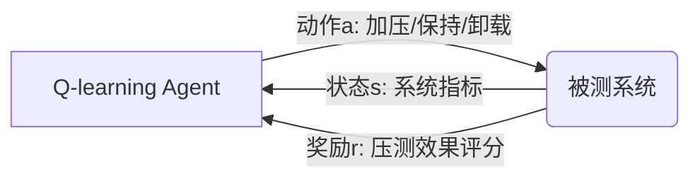

# 一切皆是映射：AI Q-learning在压力测试中的应用

关键词：Q-learning, 压力测试, 人工智能, 强化学习, Markov决策过程

## 1. 背景介绍

### 1.1 问题的由来

在当今高度复杂和互联的IT系统中,压力测试是一个至关重要但又极具挑战的任务。传统的压力测试方法往往依赖人工设计测试用例,不仅耗时耗力,而且难以全面覆盖系统的各种极端情况。如何利用人工智能技术,特别是强化学习算法来自动化、智能化压力测试过程,成为了业界亟待解决的问题。

### 1.2 研究现状

近年来,国内外学者开始尝试将强化学习应用于软件测试领域。微软研究院提出了MoTiF框架[1],利用DQN算法自动生成GUI测试用例。谷歌DeepMind团队则提出了DQN在Atari游戏测试中的应用[2]。国内阿里巴巴也提出利用深度强化学习进行UI自动化测试的方法[3]。但目前将强化学习用于压力测试的研究还比较少。

### 1.3 研究意义 

压力测试旨在模拟系统在极端负载情况下的行为表现,以发现潜在的性能瓶颈和稳定性问题。传统压测高度依赖人工经验,测试覆盖不全面。利用Q-learning算法可以让压测过程变得更加自动化和智能化,节省人力成本的同时提高测试效率和质量。本文的研究对提升压测水平,保障IT系统稳定性具有重要意义。

### 1.4 本文结构

本文后续章节安排如下:第2节介绍Q-learning的核心概念;第3节重点阐述Q-learning算法原理;第4节从数学角度推导Q-learning的模型和公式;第5节给出Q-learning在压测中的代码实例;第6节分析Q-learning在压测实际应用场景;第7节总结全文并展望未来;第8节列举常见问题解答。

## 2. 核心概念与联系

Q-learning是一种无模型(model-free)的强化学习算法,属于时间差分(Temporal Difference)学习的一种。它通过学习动作值函数(Action-Value Function)Q(s,a)来选择最优动作策略。其核心思想可以概括为:
- Agent通过与环境的交互,在每个状态s下采取动作a,观察到环境反馈的即时奖励r和下一个状态s'
- 根据TD误差更新Q值估计: $Q(s,a) \leftarrow Q(s,a)+\alpha[r+\gamma \max _{a^{\prime}} Q\left(s^{\prime}, a^{\prime}\right)-Q(s, a)]$
- 重复上述过程,最终学习到最优的Q函数,进而得到最优策略: $\pi^{*}(s)=\arg \max _{a} Q^{*}(s, a)$

压力测试的目标是构造出各种极端的测试场景,观察系统的响应,评估其稳定性。将压测抽象为一个序贯决策过程:
- 将系统视为一个黑盒环境,压测工具作为智能Agent与之交互
- 系统的各种运行指标(如CPU、内存、响应时间)作为状态表示
- 压测工具可以执行的各种操作(加压、保持、卸载等)对应为动作空间
- 压测效果的度量指标(如故障数、请求错误率)作为奖励信号反馈

显然,压力测试非常符合强化学习的问题定义,采用Q-learning算法来学习压测策略,可以不断试错、积累经验,最终学到最佳的测试动作序列,实现压测自动化。Q-learning和压测的关系如下图所示:

## 3. 核心算法原理 & 具体操作步骤

### 3.1 算法原理概述

Q-learning算法的核心是学习动作值函数Q(s,a),估计在状态s下采取动作a可以获得的长期累积奖励。Q函数的贝尔曼最优方程为:

$$
Q^{*}(s, a)=\mathbb{E}\left[R_{t+1}+\gamma \max _{a^{\prime}} Q^{*}\left(S_{t+1}, a^{\prime}\right) | S_{t}=s, A_{t}=a\right]
$$

即Q(s,a)等于在s下执行a的即时奖励,加上后续状态的最大Q值(折扣累积未来奖励)的期望。Q-learning采用值迭代的思路,通过不断利用TD误差更新Q函数逼近其最优值:

$$
Q(s, a) \leftarrow Q(s, a)+\alpha\left[r+\gamma \max _{a^{\prime}} Q\left(s^{\prime}, a^{\prime}\right)-Q(s, a)\right]
$$

其中α为学习率,r为即时奖励,γ为折扣因子。

### 3.2 算法步骤详解

Q-learning的具体算法流程如下:

1. 初始化Q(s,a),对所有s∈S,a∈A,令Q(s,a)=0
2. 重复循环,直到Q收敛:
   1) 初始化状态s
   2) 重复循环,直到s为终止态:
      a. 在s下采取动作a,得到奖励r和下一状态s'
      b. 根据Q-learning更新公式更新Q(s,a)
      c. s←s'
3. 返回学到的Q函数

在具体实现时,Q函数一般用值表(Q-table)或神经网络(Q-network)来表示。前者适用于状态和动作空间较小的离散问题,后者可以处理连续空间。

### 3.3 算法优缺点

Q-learning的主要优点有:
- 无需预先知道环境模型,通过与环境交互学习策略
- 简单通用,对状态表示无特殊要求,适用于离散或连续问题
- 能学到最优策略,有理论收敛性保证

但Q-learning也存在一些局限:
- 难以处理高维状态动作空间,易陷入维度灾难
- 探索效率较低,学习速度慢,样本利用率不高
- 对奖励函数设计敏感,奖励稀疏问题明显

### 3.4 算法应用领域

Q-learning在众多领域得到了广泛应用,例如:
- 自动控制:机器人运动规划、工业过程优化控制等
- 游戏AI:棋类游戏、Atari视频游戏等
- 网络优化:路由选择、流量调度、缓存策略等
- 推荐系统:电商推荐、广告投放、新闻推荐等
- 金融投资:股票交易、投资组合优化等

近年来,Q-learning在软件工程领域也受到关注,如自动化测试、漏洞挖掘、故障诊断等。本文聚焦其在压力测试中的应用。

## 4. 数学模型和公式 & 详细讲解 & 举例说明

### 4.1 数学模型构建

我们将压力测试问题形式化为一个六元组的马尔可夫决策过程(S,A,P,R,γ,H):
- S:状态空间,表示系统所有可能的性能指标组合,如(CPU利用率,内存占用,响应时间,...)
- A:动作空间,表示压测可执行的操作,如(加压节点数,加压频率,持续时间,...)
- P:转移概率函数,$P(s'|s,a)$表示在状态s下执行动作a后转移到状态s'的概率
- R:奖励函数,$R(s,a)$表示在状态s下执行动作a获得的即时奖励值
- γ:折扣因子,γ∈[0,1],表示对未来奖励的衰减程度
- H:问题的时域范围,可以是有限步或无限步

压测的优化目标可以定义为最大化长期累积奖励:

$$
\max J(\pi)=\mathbb{E}\left[\sum_{t=0}^{H} \gamma^{t} R\left(s_{t}, \pi\left(s_{t}\right)\right)\right]
$$

其中π表示压测策略,$\pi(s)$表示在状态s下要采取的动作。求解最优策略π*即为Q-learning要解决的核心问题。

### 4.2 公式推导过程

Q-learning的核心是学习最优动作值函数Q*(s,a),它满足贝尔曼最优方程:

$$
Q^{*}(s, a)=\mathbb{E}_{s^{\prime} \sim P}\left[R(s, a)+\gamma \max _{a^{\prime}} Q^{*}\left(s^{\prime}, a^{\prime}\right)\right]
$$

将期望展开可得:

$$
\begin{aligned}
Q^{*}(s, a) & =\sum_{s^{\prime}} P\left(s^{\prime} | s, a\right)\left[R(s, a)+\gamma \max _{a^{\prime}} Q^{*}\left(s^{\prime}, a^{\prime}\right)\right] \\
& =R(s, a)+\gamma \sum_{s^{\prime}} P\left(s^{\prime} | s, a\right) \max _{a^{\prime}} Q^{*}\left(s^{\prime}, a^{\prime}\right)
\end{aligned}
$$

Q-learning算法基于随机逼近的思想,通过蒙特卡洛采样来近似估计期望,得到样本更新公式:

$$
\begin{aligned}
Q(s, a) & \leftarrow Q(s, a)+\alpha\left[r+\gamma \max _{a^{\prime}} Q\left(s^{\prime}, a^{\prime}\right)-Q(s, a)\right] \\
& \leftarrow(1-\alpha) Q(s, a)+\alpha\left[r+\gamma \max _{a^{\prime}} Q\left(s^{\prime}, a^{\prime}\right)\right]
\end{aligned}
$$

可以证明,当采样次数趋于无穷时,Q(s,a)以概率1收敛到最优值Q*(s,a)。收敛后的最优压测策略为:

$$
\pi^{*}(s)=\arg \max _{a} Q^{*}(s, a)
$$

即在每个状态下选择Q值最大的动作作为最优策略。

### 4.3 案例分析与讲解

下面我们以一个简单的压力测试场景为例来说明Q-learning的建模和求解过程。

假设一个 Web 服务系统的状态由当前的(并发用户数,平均响应时间)来表示,动作空间为{增加并发,减少并发,不变}。系统的状态转移概率未知,但可以通过在线交互采样观察。奖励函数定义为:

$$
R(s, a)=\left\{\begin{array}{ll}
-1 & \text { 系统崩溃 } \\
0.5 & \text { 响应时间>1s } \\
1 & \text { 其他情况 }
\end{array}\right.
$$

即系统崩溃给予最大惩罚,响应变慢给予适度惩罚,响应正常给予正奖励。折扣因子取γ=0.9,考虑未来10步内的累积奖励。

我们初始化一个Q表格,状态空间离散为10×10,动作空间大小为3,Q值初始化为0。然后开始与系统交互,每次随机选择一个状态和动作,观察奖励和下一状态,并根据Q-learning更新公式更新Q表:

$$
Q(s, a) \leftarrow Q(s, a)+\alpha\left[r+\gamma \max _{a^{\prime}} Q\left(s^{\prime}, a^{\prime}\right)-Q(s, a)\right]
$$

例如在状态(50,0.6)下选择"增加并发"这个动作,观察到奖励r=0.5,下一状态为(70,1.2),则Q表更新为:

$$
\begin{aligned}
Q(50,0.6,\text{增加}) & \leftarrow Q(50,0.6,\text{增加})+\alpha[0.5+\gamma \max Q(70,1.2,:)-Q(50,0.6,\text{增加})] \\
& =0+0.1[0.5+0.9 \times 0-0]=0.05
\end{aligned}
$$

不断重复上述交互学习过程,随着采样数据的增多,Q(s,a)会逐渐收敛到最优值。收敛后在每个状态下选择Q值最大的动作,即可得到最优压测策略π*。

### 4.4 常见问题解答

**Q: Q-learning能保证找到全局最优策略吗?**

A: Q-learning算法可以在适当的条件下(探索充分、步长合适、非线性拟合等)收敛