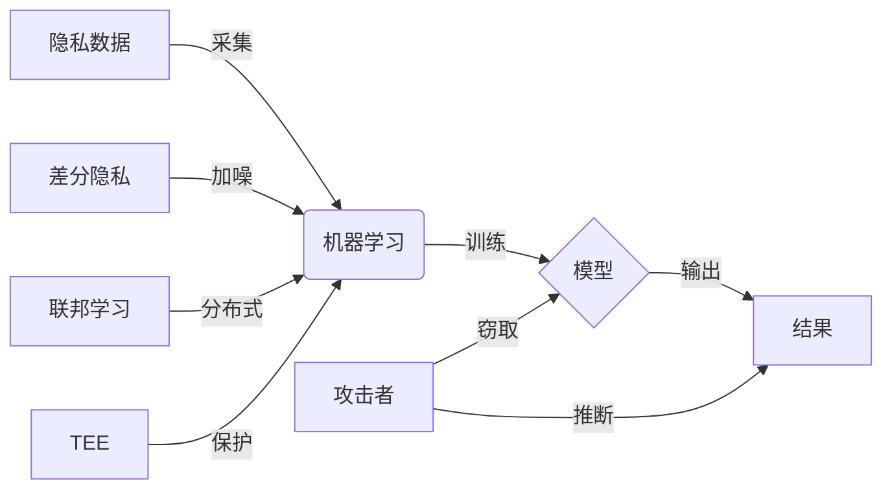

# 卷积神经网络的数据隐私保护

关键词：卷积神经网络, 数据隐私, 差分隐私, 联邦学习, 同态加密, 安全多方计算

## 1. 背景介绍

### 1.1 问题的由来

随着人工智能技术的快速发展,卷积神经网络(Convolutional Neural Network, CNN)在计算机视觉、语音识别、自然语言处理等领域取得了巨大成功。然而,CNN模型的训练需要大量的数据支持,这些数据往往包含了用户的隐私信息,如何在保护用户隐私的同时又能充分利用数据的价值,成为了一个亟待解决的问题。

### 1.2 研究现状

目前,针对CNN模型的隐私保护主要有以下几种方法:

1. 差分隐私(Differential Privacy):通过在梯度或者模型参数中加入随机噪声,使得攻击者无法从模型中推断出单个用户的隐私信息。代表工作有DP-SGD[1]等。

2. 联邦学习(Federated Learning):将模型训练任务分发到多个参与方,每个参与方在本地用自己的数据训练模型,然后将模型参数而非原始数据上传到服务器进行聚合。代表工作有FedAvg[2]等。

3. 同态加密(Homomorphic Encryption):利用同态性质对敏感数据进行加密,使得可以直接对密文进行计算。但是计算效率较低,目前主要用于推理阶段。

4. 安全多方计算(Secure Multi-Party Computation):通过密码学协议实现多方在不泄露各自隐私数据的前提下进行联合计算。代表工作有SecureML[3]等。

### 1.3 研究意义

CNN模型的隐私保护对于推动人工智能技术在医疗、金融等隐私敏感领域的应用具有重要意义。同时,隐私保护与模型性能之间的权衡也是一个有趣的研究问题。本文将重点介绍差分隐私和联邦学习在CNN模型中的应用。

### 1.4 本文结构

本文的结构安排如下:第2节介绍CNN模型隐私保护涉及的一些核心概念;第3节详细阐述差分隐私和联邦学习的基本原理和算法流程;第4节从理论层面对二者的数学基础进行分析;第5节给出基于Pytorch的代码实现示例;第6节讨论潜在的应用场景;第7节总结全文并对未来的发展趋势和挑战进行展望。

## 2. 核心概念与联系

在讨论CNN模型的隐私保护之前,我们首先需要明确以下几个核心概念:

- 隐私数据:包含个人隐私信息(如姓名、地址等)或者敏感信息(如医疗记录、财务状况等)的数据。

- 隐私泄露:攻击者利用机器学习模型本身或者模型产生的结果推断出某个特定个体的隐私数据。

- 隐私保护:采取一定的技术手段,防止隐私数据在机器学习的过程中泄露给未经授权方。

- 差分隐私:一种通过引入随机噪声来保护数据集中个体隐私的数学框架。直观地说,一个算法满足差分隐私,如果其输出结果不会因为数据集中某一条记录的改变而发生太大变化。

- 联邦学习:一种分布式机器学习范式,允许多个参与方在不共享本地数据的情况下协同训练全局模型。

- 可信执行环境(Trusted Execution Environment,TEE):为应用程序提供隔离执行环境,保护其完整性和机密性。

下图展示了这些概念之间的关系:

## 3. 核心算法原理 & 具体操作步骤

### 3.1 差分隐私原理概述

差分隐私的核心思想是,在保证模型性能的同时,使得模型的输出对单个样本的变化不敏感。形式化地,对于两个相邻数据集 $D$ 和 $D'$ (即只相差一条记录),一个随机算法 $\mathcal{M}$ 满足 $\varepsilon$-差分隐私,当且仅当对于算法的任意输出 $S$,有:

$$
\mathrm{Pr}[\mathcal{M}(D) \in S] \leq e^{\varepsilon} \cdot \mathrm{Pr}[\mathcal{M}(D') \in S]
$$

其中 $\varepsilon$ 称为隐私预算,用来衡量隐私保护的强度。$\varepsilon$ 越小,隐私保护程度越高,但同时也意味着需要加入更多噪声,可能影响模型的性能。

### 3.2 差分隐私 SGD 算法步骤

针对CNN模型,一种常用的差分隐私优化算法是DP-SGD[1],其主要步骤如下:

1. 将训练数据集划分为若干个 batch,每个 batch 大小为 $L$。

2. 对每个 batch 进行一次梯度下降:
   
   a. 计算 batch 中每个样本的梯度 $\mathbf{g}_i$。
   
   b. 对每个梯度进行修剪(clip):$\bar{\mathbf{g}}_i=\mathbf{g}_i/ \max \left(1, \frac{\left\|\mathbf{g}_i\right\|_2}{C}\right)$,其中 $C$ 为修剪范围。
   
   c. 对修剪后的梯度求和,并加入高斯噪声:$\tilde{\mathbf{g}}=\frac{1}{L}\left(\sum_{i=1}^L \bar{\mathbf{g}}_i + \mathcal{N}\left(0, \sigma^2 C^2 \mathbf{I}\right)\right)$,其中 $\sigma$ 为噪声系数。
   
   d. 利用噪声梯度 $\tilde{\mathbf{g}}$ 更新模型参数。

3. 训练完所有 batch 后,输出最终模型。

DP-SGD 的隐私性可以通过差分隐私的组合性质进行分析,对于迭代次数为 $T$,采样概率为 $q=L/N$ 的 DP-SGD,其满足 $(\varepsilon,\delta)$-差分隐私,其中:

$$
\varepsilon=\min \left(\sqrt{2 T \log (1 / \delta)} / \sigma, T / \sigma^2\right)
$$

### 3.3 联邦学习原理概述

联邦学习旨在不同参与方之间建立一个协作机制,使得各方能在不共享原始数据的前提下,训练出一个全局模型。以横向联邦学习为例,其通常采用如下的训练流程:

1. 服务器端初始化一个全局模型,并将模型参数分发给各个客户端。

2. 每个客户端利用本地数据对模型进行训练,得到更新后的本地模型参数。

3. 客户端将本地模型参数上传到服务器端。

4. 服务器端对收集到的本地模型参数进行聚合(如求平均),得到新的全局模型参数。

5. 重复步骤2-4,直到模型收敛或达到预设的迭代次数。

### 3.4 FedAvg 算法步骤

FedAvg[2] 是一种经典的联邦平均算法,其详细步骤如下:

1. 服务器端将当前全局模型参数 $\mathbf{w}_t$ 广播给所有客户端。

2. 每个客户端 $k$ 在本地数据 $\mathcal{D}_k$ 上对模型进行训练,得到更新后的本地模型参数 $\mathbf{w}_{t+1}^k$。

3. 每个客户端将本地模型参数上传到服务器端。

4. 服务器端对收集到的本地模型参数进行加权平均,得到新的全局模型参数:

$$
\mathbf{w}_{t+1} = \sum_{k=1}^K \frac{n_k}{n} \mathbf{w}_{t+1}^k
$$

其中 $n_k=|\mathcal{D}_k|$ 为客户端 $k$ 的本地数据量,$n=\sum_{k=1}^K n_k$ 为总数据量。

5. 重复步骤1-4,直至收敛。

FedAvg 通过在客户端本地进行多轮训练,减少了通信开销。但是当不同客户端的数据分布差异较大时,可能影响全局模型的性能。因此,后续工作提出了许多改进方案,如FedProx[4]、FedNova[5]等。

## 4. 数学模型和公式 & 详细讲解 & 举例说明

### 4.1 差分隐私的数学定义

给定两个数据集 $D$ 和 $D'$,若它们之间只相差一条记录,则称 $D$ 和 $D'$ 是相邻的。一个随机算法 $\mathcal{M}$ 满足 $\varepsilon$-差分隐私,如果对于所有相邻的数据集 $D,D'$ 以及算法的所有可能输出 $S$,有:

$$
\mathrm{Pr}[\mathcal{M}(D) \in S] \leq e^{\varepsilon} \cdot \mathrm{Pr}[\mathcal{M}(D') \in S]
$$

其中 $\varepsilon$ 是隐私预算,表示隐私泄露的上界。直观地,差分隐私保证了算法的输出分布对单个样本的变化不敏感。

### 4.2 高斯机制

为了使算法满足差分隐私,一种常用的技术是高斯机制。对于一个函数 $f: \mathcal{D} \rightarrow \mathbb{R}^d$,其 $\ell_2$ 敏感度定义为:

$$
\Delta_2 f=\max _{D, D^{\prime}}\left\|f(D)-f\left(D^{\prime}\right)\right\|_2
$$

即相邻数据集之间函数值差异的最大 $\ell_2$ 范数。高斯机制的输出为:

$$
\mathcal{M}(D)=f(D)+\mathcal{N}\left(0, \sigma^2 \Delta_2^2 f \cdot \mathbf{I}_d\right)
$$

其中 $\mathcal{N}$ 表示高斯分布,$\mathbf{I}_d$ 为 $d$ 维单位矩阵。可以证明,当 $\varepsilon \in(0,1)$ 且 $\sigma \geq \sqrt{2 \ln (1.25 / \delta)} / \varepsilon$ 时,高斯机制满足 $(\varepsilon, \delta)$-差分隐私。

### 4.3 差分隐私 SGD 的隐私分析

对于 DP-SGD,每次梯度下降可以看作是对梯度函数应用高斯机制。设每个样本的梯度范数均被修剪至 $C$,则单次迭代的隐私预算为:

$$
\varepsilon_0=\min \left(\sqrt{2 \log (1 / \delta)} / \sigma, 1 / \sigma^2\right)
$$

根据差分隐私的组合性质,对于采样概率为 $q$,迭代次数为 $T$ 的 DP-SGD,其总隐私预算为:

$$
\varepsilon=\min \left(\sqrt{2 T \log (1 / \delta)} / \sigma, T / \sigma^2\right)
$$

### 4.4 联邦学习的收敛性分析

考虑一个凸优化问题:

$$
\min _{\mathbf{w}} f(\mathbf{w})=\frac{1}{n} \sum_{i=1}^n f_i(\mathbf{w})
$$

其中 $f_i$ 为客户端 $i$ 的本地目标函数。假设 $f_i$ 均为 $L$-光滑且 $\mu$-强凸,则对于学习率为 $\eta$ 的 FedAvg,迭代 $T$ 轮后的全局模型参数 $\mathbf{w}_T$ 满足:

$$
\mathbb{E}\left[f\left(\mathbf{w}_T\right)-f\left(\mathbf{w}^*\right)\right] \leq \frac{L}{2 \mu n \eta T} \sum_{i=1}^n\left\|\mathbf{w}_0-\mathbf{w}^*\right\|^2+\frac{\eta L}{2 n} \sum_{