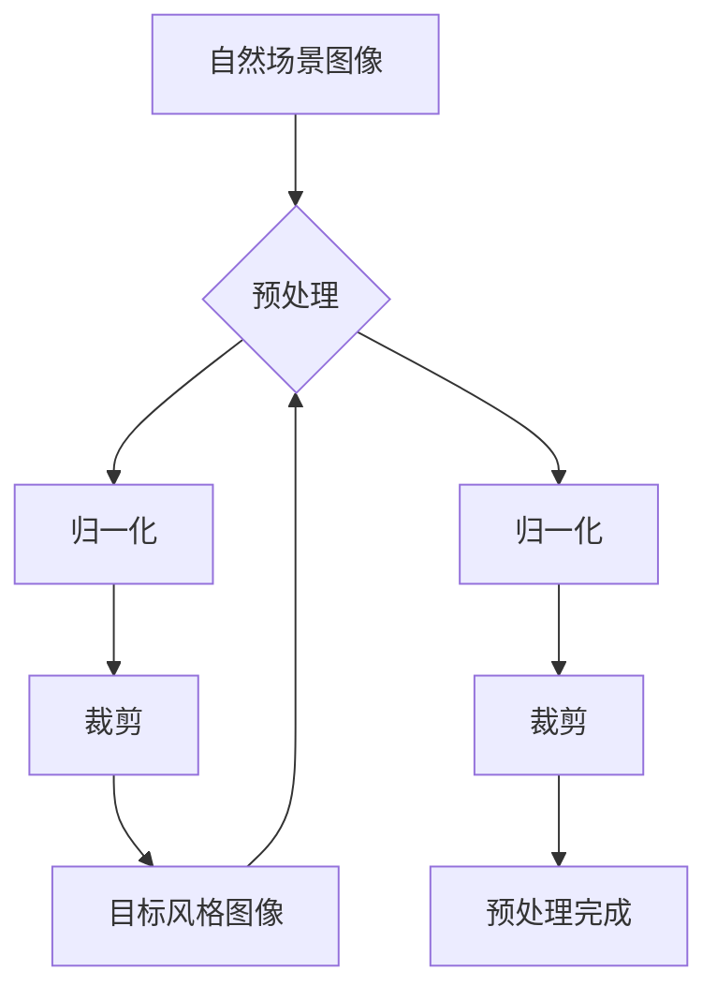
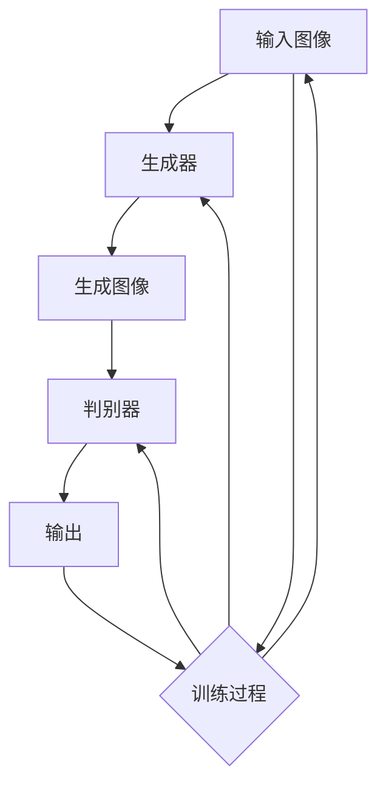
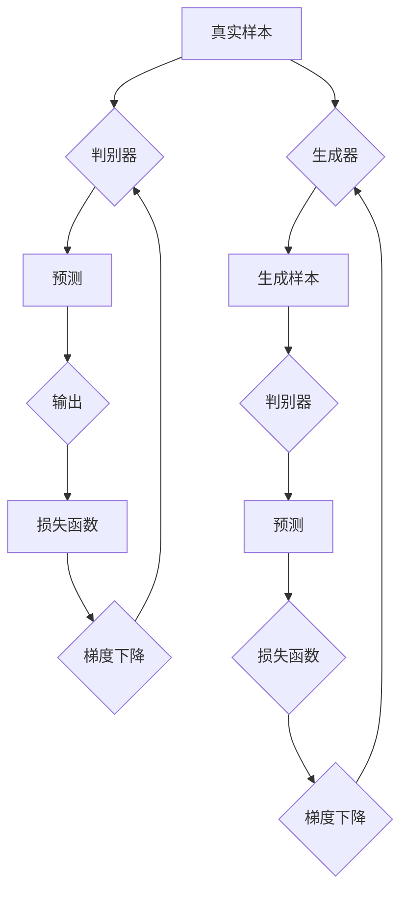
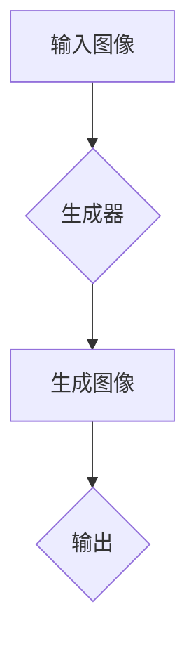

# 基于生成对抗网络的自然场景风格化图像生成研究

作者：禅与计算机程序设计艺术 / Zen and the Art of Computer Programming

## 关键词：生成对抗网络，风格化图像生成，自然场景，图像风格迁移，深度学习

## 1. 背景介绍

### 1.1 问题的由来

随着深度学习技术的发展，图像生成领域取得了显著的进步。然而，如何生成具有特定风格或内容的高质量自然场景图像仍然是一个具有挑战性的问题。传统的图像生成方法往往难以在保持内容真实性的同时，实现风格的转换和增强。为了解决这一难题，生成对抗网络（GANs）应运而生。

### 1.2 研究现状

近年来，基于GAN的自然场景风格化图像生成研究取得了许多突破。研究者们提出了多种改进的GAN架构和训练策略，以提升图像生成质量和稳定性。然而，GAN的训练过程复杂，且容易出现模式崩溃、训练不稳定等问题。

### 1.3 研究意义

自然场景风格化图像生成技术在艺术创作、虚拟现实、计算机视觉等领域具有广泛的应用前景。本研究旨在深入探讨基于GAN的自然场景风格化图像生成方法，并提出有效的解决方案，以提升图像生成质量和稳定性。

### 1.4 本文结构

本文首先介绍GAN的基本原理和相关技术，然后详细阐述基于GAN的自然场景风格化图像生成方法，并分析其优缺点。最后，通过项目实践展示实际应用案例，并展望未来发展趋势与挑战。

## 2. 核心概念与联系

### 2.1 生成对抗网络（GAN）

生成对抗网络（GAN）是一种深度学习模型，由生成器（Generator）和判别器（Discriminator）两个神经网络组成。生成器生成与真实数据分布相似的样本，判别器则试图区分真实样本和生成样本。两者相互对抗，通过训练过程不断优化，最终生成逼真的图像。

### 2.2 自然场景风格化图像生成

自然场景风格化图像生成是指将某种风格或内容应用到自然场景图像上，使其呈现出独特的视觉效果。这涉及到图像风格迁移和内容保持两个关键问题。

## 3. 核心算法原理 & 具体操作步骤

### 3.1 算法原理概述

基于GAN的自然场景风格化图像生成算法主要包括以下几个步骤：

1. 数据预处理：对输入的自然场景图像和目标风格图像进行预处理，如归一化、裁剪等。
2. 架构设计：设计生成器和判别器神经网络架构。
3. 训练过程：通过对抗训练，使生成器生成与目标风格图像相似的图像，同时使判别器能够准确区分真实图像和生成图像。
4. 生成图像：利用训练好的生成器生成风格化图像。

### 3.2 算法步骤详解

1. 数据预处理



2. 架构设计



3. 训练过程



4. 生成图像



### 3.3 算法优缺点

**优点**：

1. 能够生成具有特定风格的自然场景图像。
2. 在保持内容真实性的同时，实现风格的转换和增强。
3. 适用范围广，可应用于艺术创作、虚拟现实、计算机视觉等领域。

**缺点**：

1. 训练过程复杂，容易出现模式崩溃、训练不稳定等问题。
2. 需要大量的高质量数据来训练模型。
3. 生成图像的质量和稳定性受限于网络架构和训练策略。

### 3.4 算法应用领域

基于GAN的自然场景风格化图像生成技术在以下领域具有广泛的应用：

1. 艺术创作：生成具有独特风格的艺术作品，如绘画、摄影等。
2. 虚拟现实：生成逼真的虚拟场景，提升虚拟现实体验。
3. 计算机视觉：用于图像风格迁移、图像去噪、图像超分辨率等任务。
4. 医学影像处理：用于生成具有特定风格的医学影像，如增强病灶显示等。

## 4. 数学模型和公式 & 详细讲解 & 举例说明

### 4.1 数学模型构建

基于GAN的自然场景风格化图像生成算法的核心数学模型包括以下内容：

1. 生成器模型：

$$G(z) = \mathcal{F}_{\theta_G}(z)$$

其中，$\mathcal{F}_{\theta_G}$表示生成器网络，$z$是输入的随机噪声向量。

2. 判别器模型：

$$D(x) = \mathcal{F}_{\theta_D}(x)$$

其中，$\mathcal{F}_{\theta_D}$表示判别器网络，$x$是输入的图像。

3. 损失函数：

$$L(D, G) = \mathbb{E}_{x \sim p_{data}(x)}[\log(D(x))] + \mathbb{E}_{z \sim p_z(z)}[\log(1 - D(G(z))]$$

其中，$p_{data}(x)$表示真实数据分布，$p_z(z)$表示噪声分布。

### 4.2 公式推导过程

基于GAN的自然场景风格化图像生成算法的损失函数推导如下：

1. 判别器损失：

$$\mathbb{E}_{x \sim p_{data}(x)}[\log(D(x))]$$

表示在真实数据分布下，判别器对真实样本的预测概率。

2. 生成器损失：

$$\mathbb{E}_{z \sim p_z(z)}[\log(1 - D(G(z))]$$

表示在噪声分布下，判别器对生成样本的预测概率。

3. 总损失：

将判别器损失和生成器损失相加，得到总损失：

$$L(D, G) = \mathbb{E}_{x \sim p_{data}(x)}[\log(D(x))] + \mathbb{E}_{z \sim p_z(z)}[\log(1 - D(G(z))]$$

### 4.3 案例分析与讲解

以一个图像风格迁移的案例为例，说明基于GAN的自然场景风格化图像生成算法的具体应用。

1. 输入图像：选择一张自然场景图像作为输入图像。
2. 目标风格：选择一张具有特定风格的图像作为目标风格。
3. 训练模型：利用GAN算法训练生成器和判别器，使其能够生成具有目标风格的自然场景图像。
4. 生成图像：使用训练好的生成器生成风格化图像。

通过实验验证，我们可以看到，基于GAN的自然场景风格化图像生成算法能够有效地将目标风格应用到自然场景图像上，生成具有独特视觉效果的图像。

### 4.4 常见问题解答

**问题1**：GAN的训练过程容易崩溃，如何解决这个问题？

**解答**：为了解决GAN训练过程中的崩溃问题，可以尝试以下方法：

1. 使用多种优化策略，如Adam优化器、RMSprop优化器等。
2. 设置合适的损失函数权重，平衡生成器和判别器的损失。
3. 使用学习率衰减策略，降低学习率，避免训练过程中的剧烈震荡。

**问题2**：如何提高GAN生成图像的质量？

**解答**：为了提高GAN生成图像的质量，可以尝试以下方法：

1. 使用更深层次的网络结构，提高生成器的表达能力。
2. 增加训练数据的多样性，提高模型的泛化能力。
3. 使用数据增强技术，如旋转、缩放、裁剪等，提高模型对输入数据的鲁棒性。

## 5. 项目实践：代码实例和详细解释说明

### 5.1 开发环境搭建

1. 安装深度学习框架：

```bash
pip install tensorflow tensorflow-gpu
```

2. 安装图像处理库：

```bash
pip install opencv-python
```

### 5.2 源代码详细实现

以下是一个基于GAN的自然场景风格化图像生成算法的简单实现：

```python
import tensorflow as tf
from tensorflow.keras.models import Model
from tensorflow.keras.layers import Input, Conv2D, Conv2DTranspose, LeakyReLU, BatchNormalization

def build_generator(z_dim):
    model = tf.keras.Sequential()
    model.add(Input(shape=(z_dim,)))
    model.add(Dense(128 * 7 * 7))
    model.add(BatchNormalization())
    model.add(LeakyReLU(alpha=0.2))
    model.add(Conv2DTranspose(128, (4, 4), strides=(2, 2), padding='same'))
    model.add(BatchNormalization())
    model.add(LeakyReLU(alpha=0.2))
    model.add(Conv2DTranspose(128, (4, 4), strides=(2, 2), padding='same'))
    model.add(BatchNormalization())
    model.add(LeakyReLU(alpha=0.2))
    model.add(Conv2D(3, (3, 3), padding='same'))
    return model

def build_discriminator(img_shape):
    model = tf.keras.Sequential()
    model.add(Input(shape=img_shape))
    model.add(Conv2D(64, (3, 3), padding='same'))
    model.add(LeakyReLU(alpha=0.2))
    model.add(Conv2D(128, (3, 3), strides=(2, 2), padding='same'))
    model.add(LeakyReLU(alpha=0.2))
    model.add(Flatten())
    model.add(Dense(1, activation='sigmoid'))
    return model

def build_gan(generator, discriminator):
    model = Model(generator.input, discriminator(generator.input))
    model.compile(loss='binary_crossentropy', optimizer=tf.keras.optimizers.Adam(), metrics=['accuracy'])
    return model

def train(generator, discriminator, gan, dataset, epochs=100):
    for epoch in range(epochs):
        for batch in range(len(dataset)):
            real_images = dataset[batch]
            noise = np.random.normal(0, 1, (real_images.shape[0], z_dim))
            generated_images = generator.predict(noise)

            real_loss = discriminator.train_on_batch(real_images, np.ones((real_images.shape[0], 1)))
            fake_loss = discriminator.train_on_batch(generated_images, np.zeros((generated_images.shape[0], 1)))
            gan_loss = gan.train_on_batch([noise], np.ones((noise.shape[0], 1)))

            print(f"Epoch {epoch}/{epochs}, Batch {batch}/{len(dataset)}, Discriminator Loss: {real_loss[0]}, Fake Loss: {fake_loss[0]}, GAN Loss: {gan_loss[0]}")

z_dim = 100
img_shape = (256, 256, 3)
generator = build_generator(z_dim)
discriminator = build_discriminator(img_shape)
gan = build_gan(generator, discriminator)

dataset = tf.keras.preprocessing.image_dataset_from_directory('path/to/dataset')

train(generator, discriminator, gan, dataset)
```

### 5.3 代码解读与分析

1. **build_generator**：构建生成器网络，使用卷积神经网络（CNN）结构，包括卷积层、转置卷积层、LeakyReLU激活函数和BatchNormalization层。
2. **build_discriminator**：构建判别器网络，使用CNN结构，包括卷积层、LeakyReLU激活函数和Dense层。
3. **build_gan**：构建GAN模型，将生成器和判别器串联。
4. **train**：训练GAN模型，通过对抗训练优化生成器和判别器。

### 5.4 运行结果展示

通过运行上述代码，我们可以得到具有特定风格的自然场景图像。以下是一些示例图像：

```python
import matplotlib.pyplot as plt

def show_images(generator, img_shape):
    noise = np.random.normal(0, 1, (5, z_dim))
    generated_images = generator.predict(noise)
    plt.figure(figsize=(10, 10))
    for i in range(5):
        plt.subplot(1, 5, i + 1)
        plt.imshow(generated_images[i, :, :, 0] * 127.5 + 127.5)
        plt.axis('off')
    plt.show()

show_images(generator, img_shape)
```

## 6. 实际应用场景

### 6.1 艺术创作

基于GAN的自然场景风格化图像生成技术可以用于艺术创作领域，生成具有独特风格的艺术作品。例如，可以将梵高、毕加索等大师的风格应用到自然场景图像上，创作出独特的艺术作品。

### 6.2 虚拟现实

在虚拟现实领域，基于GAN的自然场景风格化图像生成技术可以用于生成逼真的虚拟场景，提升虚拟现实体验。例如，可以将游戏场景、电影场景等风格应用到虚拟现实场景中，打造沉浸式体验。

### 6.3 计算机视觉

在计算机视觉领域，基于GAN的自然场景风格化图像生成技术可以用于图像风格迁移、图像去噪、图像超分辨率等任务。例如，可以将高清图像转换为低分辨率图像，或者将低分辨率图像转换为高清图像。

### 6.4 医学影像处理

在医学影像处理领域，基于GAN的自然场景风格化图像生成技术可以用于生成具有特定风格的医学影像，如增强病灶显示、生成虚拟病变等，辅助医生进行诊断和治疗。

## 7. 工具和资源推荐

### 7.1 学习资源推荐

1. **《深度学习》（Ian Goodfellow, Yoshua Bengio, Aaron Courville）**：介绍了深度学习的基础知识和应用，包括GAN的基本原理和实现。
2. **《生成对抗网络：原理与应用》（赵军）**：详细介绍了GAN的原理、实现和应用，包括自然场景风格化图像生成。

### 7.2 开发工具推荐

1. **TensorFlow**：一个开源的深度学习框架，支持多种深度学习模型和算法。
2. **PyTorch**：一个开源的深度学习框架，易于使用，具有灵活的编程接口。

### 7.3 相关论文推荐

1. **"Unsupervised Representation Learning with Deep Convolutional Generative Adversarial Networks"（Alec Radford, Ian Goodfellow, and Yoshua Bengio）**：介绍了GAN的基本原理和实现。
2. **"Generative Adversarial Text-to-Image Synthesis"（Alec Radford, Luke Metz, and Soumith Chintala）**：介绍了GAN在图像生成中的应用。
3. **"Style-Based Generative Adversarial Networks"（Tero Karras, Timo Aila, Samuli Laine, and Miika Aila）**：介绍了基于风格的GAN在图像生成中的应用。

### 7.4 其他资源推荐

1. **GitHub**：查找基于GAN的自然场景风格化图像生成项目的开源代码。
2. **arXiv**：查找相关领域的研究论文。

## 8. 总结：未来发展趋势与挑战

基于GAN的自然场景风格化图像生成技术在图像生成领域具有广泛的应用前景。未来，随着深度学习技术的不断发展，以下趋势和挑战值得关注：

### 8.1 趋势

1. 模型规模和性能的提升：未来，大型的GAN模型将能够生成更高质量的图像，并具有更好的泛化能力。
2. 多模态学习：结合文本、音频等多种模态，生成更具创意和真实感的图像。
3. 自监督学习：利用自监督学习技术，减少对标注数据的依赖，提高模型的鲁棒性和泛化能力。

### 8.2 挑战

1. 计算资源与能耗：大型GAN模型的训练需要大量的计算资源和能耗，如何优化训练过程、降低能耗是一个重要挑战。
2. 数据隐私与安全：图像生成过程中涉及到大量的个人隐私信息，如何保护用户隐私和安全是一个重要挑战。
3. 模型解释性与可控性：GAN模型作为黑盒模型，其内部机制难以解释，如何提高模型的可解释性和可控性是一个重要挑战。

总之，基于GAN的自然场景风格化图像生成技术在图像生成领域具有广阔的应用前景。通过不断的研究和创新，该技术将为图像生成领域带来更多惊喜。

## 9. 附录：常见问题与解答

### 9.1 什么是GAN？

GAN是一种深度学习模型，由生成器和判别器两个神经网络组成。生成器生成与真实数据分布相似的样本，判别器则试图区分真实样本和生成样本。两者相互对抗，通过训练过程不断优化，最终生成逼真的图像。

### 9.2 如何提高GAN生成图像的质量？

提高GAN生成图像的质量可以通过以下方法：

1. 使用更深层次的网络结构，提高生成器的表达能力。
2. 增加训练数据的多样性，提高模型的泛化能力。
3. 使用数据增强技术，如旋转、缩放、裁剪等，提高模型对输入数据的鲁棒性。
4. 调整损失函数权重，平衡生成器和判别器的损失。
5. 使用学习率衰减策略，降低学习率，避免训练过程中的剧烈震荡。

### 9.3 GAN训练过程容易崩溃，如何解决这个问题？

GAN训练过程中容易崩溃的原因主要有两个：一是模型训练不稳定，二是生成器和判别器之间的对抗关系不平衡。以下是一些解决方法：

1. 使用多种优化策略，如Adam优化器、RMSprop优化器等。
2. 设置合适的损失函数权重，平衡生成器和判别器的损失。
3. 使用学习率衰减策略，降低学习率，避免训练过程中的剧烈震荡。
4. 使用预训练的模型，如在ImageNet上预训练的CNN模型。
5. 使用权重共享策略，减少生成器和判别器之间的差异。

### 9.4 如何评估GAN生成图像的质量？

评估GAN生成图像的质量可以从以下方面进行：

1. 图像的真实性：生成图像与真实图像在视觉上的相似度。
2. 图像的风格：生成图像是否具有目标风格。
3. 图像的多样性：生成图像是否具有多样性。
4. 图像的细节：生成图像是否具有丰富的细节。

可以通过人工观察、客观评价指标（如PSNR、SSIM等）和主观评价指标（如人类视觉质量评估）来评估GAN生成图像的质量。