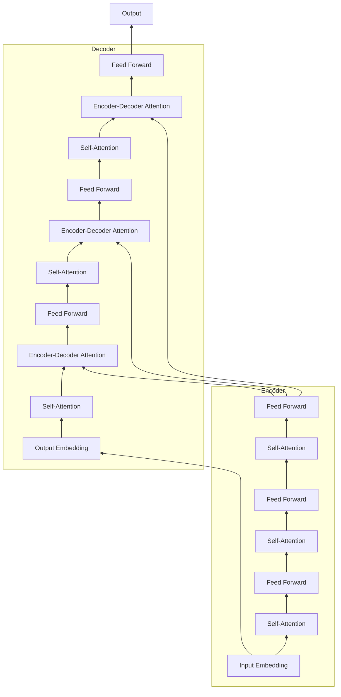

# 测试Transformer模型

作者：禅与计算机程序设计艺术 / Zen and the Art of Computer Programming 

关键词：Transformer, 自然语言处理, 注意力机制, 编码器-解码器, 迁移学习

## 1. 背景介绍

### 1.1 问题的由来
自然语言处理(NLP)是人工智能领域的一个重要分支,旨在让计算机能够理解、生成和处理人类语言。传统的NLP模型如循环神经网络(RNN)和长短期记忆网络(LSTM)虽然取得了一定成果,但在处理长序列和捕捉长距离依赖关系方面仍然存在局限性。

### 1.2 研究现状
2017年,Google提出了Transformer模型[1],该模型完全基于注意力机制,抛弃了传统的RNN和CNN结构,在机器翻译任务上取得了显著的性能提升。此后,Transformer被广泛应用于NLP的各个任务,并衍生出BERT[2]、GPT[3]等预训练语言模型,推动了NLP技术的飞速发展。

### 1.3 研究意义
深入理解和掌握Transformer模型的原理和实现,对于从事NLP研究和应用的学者和工程师来说至关重要。通过对Transformer的测试和分析,我们可以更好地理解其内部工作机制,为进一步改进模型性能和扩展其应用场景提供有益的参考。

### 1.4 本文结构
本文将首先介绍Transformer模型的核心概念和原理,然后详细讲解其数学模型和公式推导过程。接着,我们将通过代码实例来演示如何实现和测试Transformer。最后,探讨Transformer在实际应用中的场景,并对其未来的发展趋势和挑战进行展望。

## 2. 核心概念与联系

Transformer模型的核心是自注意力机制(Self-Attention)和位置编码(Positional Encoding)。

自注意力允许模型的每个位置都能够attend到序列中的任意其他位置,直接建模任意两个位置之间的依赖关系,克服了RNN难以捕捉长距离依赖的问题。自注意力计算过程可以高度并行化,显著提高了训练和推理速度。

位置编码是为了引入序列中单词的位置信息。由于Transformer不包含任何循环和卷积,所以需要额外的位置编码来提供单词的位置信息。Transformer采用了基于三角函数的位置编码方式。

Transformer的整体架构是编码器-解码器(Encoder-Decoder)结构。编码器由若干个相同的层堆叠而成,每一层包含两个子层:多头自注意力(Multi-head Self-attention)和前馈全连接网络(Feed Forward Network)。解码器也是由若干个相同的层堆叠而成,每一层包含三个子层:多头自注意力、编码-解码注意力(Encoder-Decoder Attention)和前馈全连接网络。

下图是Transformer模型的总体架构示意图:

## 3. 核心算法原理 & 具体操作步骤

### 3.1 算法原理概述
Transformer的核心是自注意力机制,通过计算Query、Key、Value三个向量来实现。对于一个长度为$n$的输入序列,自注意力的计算过程如下:

1. 将输入序列的每个单词映射为三个向量:Query向量$Q$、Key向量$K$、Value向量$V$。
2. 对于每个位置$i$,计算其Query向量$Q_i$与所有位置的Key向量$K_j$的点积,得到注意力分数$score_{ij}$。
3. 对注意力分数进行softmax归一化,得到注意力权重$\alpha_{ij}$。
4. 将每个位置的Value向量$V_j$与对应的注意力权重$\alpha_{ij}$相乘,并求和,得到位置$i$的输出向量$Z_i$。

自注意力的计算可以并行进行,时间复杂度为$O(n^2d)$,其中$d$为向量维度。

### 3.2 算法步骤详解

1. **输入表示**:将输入序列中的每个单词映射为一个$d_{model}$维的词嵌入向量,再加上位置编码向量,得到最终的输入表示。

2. **计算自注意力**:
   
   a. 通过三个线性变换将输入$X$映射为$Q$、$K$、$V$三个矩阵:
   
   $Q = XW^Q, K = XW^K, V = XW^V$
   
   其中$W^Q, W^K, W^V \in \mathbb{R}^{d_{model} \times d_k}$为可学习的参数矩阵。
   
   b. 计算注意力分数:
   
   $score = \frac{QK^T}{\sqrt{d_k}}$
   
   其中$score \in \mathbb{R}^{n \times n}$,表示每个位置与其他所有位置的相关性。
   
   c. 对分数进行softmax归一化,得到注意力权重:
   
   $\alpha = softmax(score)$
   
   d. 计算加权求和,得到输出表示:
   
   $Z = \alpha V$

3. **前馈全连接网络**:对自注意力的输出进行两层线性变换,中间加上ReLU激活:

   $FFN(Z) = max(0, ZW_1 + b_1)W_2 + b_2$
   
   其中$W_1 \in \mathbb{R}^{d_{model} \times d_{ff}}, b_1 \in \mathbb{R}^{d_{ff}}, W_2 \in \mathbb{R}^{d_{ff} \times d_{model}}, b_2 \in \mathbb{R}^{d_{model}}$为可学习参数。

4. **残差连接和层归一化**:在每个子层之后,都加入残差连接和层归一化操作,有助于梯度传播和模型收敛:

   $\tilde{Z} = LayerNorm(Z + X)$

编码器的每一层重复以上步骤,最后一层的输出作为编码器的输出。解码器的结构与编码器类似,但在自注意力子层和编码-解码注意力子层之间加入了masked multi-head attention,以避免在生成每个单词时attend到后面的位置。

### 3.3 算法优缺点

Transformer的主要优点包括:

1. 并行计算能力强,训练速度快。
2. 能够捕捉长距离依赖关系。
3. 模型结构简单,易于实现和扩展。
4. 不受序列长度限制,适用于长文本。

缺点包括:

1. 计算复杂度随序列长度平方增长,在很长的序列上训练开销大。
2. 缺乏位置信息,需要引入位置编码。
3. 解释性不强,注意力权重的可解释性有限。

### 3.4 算法应用领域
Transformer已成为NLP领域的主流模型,在以下任务中取得了显著成果:

1. 机器翻译:Transformer首次在机器翻译任务上超越了基于RNN的模型,后来的许多工作都基于Transformer进行改进。
2. 语言建模:GPT系列模型在语言建模任务上取得了突破性进展,生成的文本流畅度和连贯性大大提高。
3. 阅读理解:BERT在多个阅读理解数据集上刷新了当时的最佳成绩,掀起了预训练语言模型的热潮。
4. 文本分类:Transformer编码器可以用于各种文本分类任务,如情感分析、新闻分类等。
5. 信息抽取:Transformer在命名实体识别、关系抽取等信息抽取任务上也展现出强大的性能。

除了NLP,Transformer还被成功应用于计算机视觉、语音识别、强化学习等领域,展现出广阔的应用前景。

## 4. 数学模型和公式 & 详细讲解 & 举例说明

### 4.1 数学模型构建
Transformer的数学模型可以用以下公式来描述:

**输入表示**:
$X = Embedding(input) + PositionalEncoding(input)$

其中$Embedding$将输入单词映射为词嵌入向量,$PositionalEncoding$生成位置编码向量。

**自注意力计算**:
$Q = XW^Q, K = XW^K, V = XW^V$ 

$score = \frac{QK^T}{\sqrt{d_k}}$

$\alpha = softmax(score)$

$Z = \alpha V$

其中$W^Q, W^K, W^V$为可学习的参数矩阵。

**多头注意力**:
$MultiHead(X) = Concat(head_1, ..., head_h)W^O$

$head_i = Attention(XW_i^Q, XW_i^K, XW_i^V)$

其中$W_i^Q \in \mathbb{R}^{d_{model} \times d_k}, W_i^K \in \mathbb{R}^{d_{model} \times d_k}, W_i^V \in \mathbb{R}^{d_{model} \times d_v}, W^O \in \mathbb{R}^{hd_v \times d_{model}}$为可学习参数矩阵。

**前馈全连接网络**:
$FFN(Z) = max(0, ZW_1 + b_1)W_2 + b_2$

其中$W_1 \in \mathbb{R}^{d_{model} \times d_{ff}}, b_1 \in \mathbb{R}^{d_{ff}}, W_2 \in \mathbb{R}^{d_{ff} \times d_{model}}, b_2 \in \mathbb{R}^{d_{model}}$为可学习参数。

**残差连接和层归一化**:
$\tilde{Z} = LayerNorm(Z + X)$

### 4.2 公式推导过程
以下我们详细推导自注意力的计算过程。

给定输入序列$X \in \mathbb{R}^{n \times d_{model}}$,通过线性变换得到$Q,K,V$三个矩阵:

$Q = XW^Q, K = XW^K, V = XW^V$

其中$W^Q, W^K, W^V \in \mathbb{R}^{d_{model} \times d_k}$为可学习参数矩阵。

然后计算$Q$与$K$的乘积并除以$\sqrt{d_k}$,得到注意力分数矩阵$score$:

$score = \frac{QK^T}{\sqrt{d_k}}$

$score_{ij}$表示位置$i$与位置$j$之间的相关性。除以$\sqrt{d_k}$是为了缩放点积结果,避免softmax函数的梯度变得过小。

接着对$score$进行softmax归一化,得到注意力权重矩阵$\alpha$:

$\alpha = softmax(score)$

$\alpha_{ij}$表示位置$i$分配给位置$j$的注意力权重。

最后,将$\alpha$与$V$相乘,得到输出表示$Z$:

$Z = \alpha V$

$Z_i$是位置$i$的输出向量,是所有位置的值向量$V_j$的加权求和,权重为$\alpha_{ij}$。

综上,自注意力的完整计算过程可以表示为:

$Attention(Q,K,V) = softmax(\frac{QK^T}{\sqrt{d_k}})V$

多头注意力是将$Q,K,V$通过不同的线性变换投影到$h$个子空间,在每个子空间独立地进行自注意力计算,再将结果拼接起来:

$MultiHead(X) = Concat(head_1, ..., head_h)W^O$

$head_i = Attention(XW_i^Q, XW_i^K, XW_i^V)$

其中$W_i^Q \in \mathbb{R}^{d_{model} \times d_k}, W_i^K \in \mathbb{R}^{d_{model} \times d_k}, W_i^V \in \mathbb{R}^{d_{model} \times d_