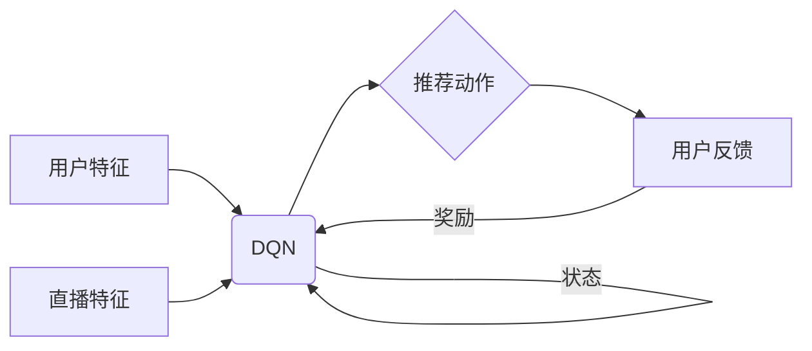

# 深度 Q-learning：在直播推荐系统中的应用

关键词：强化学习，Q-learning，深度学习，直播推荐系统，个性化推荐

## 1. 背景介绍

### 1.1  问题的由来

在当今信息爆炸的时代，直播平台的用户面临着海量的直播内容选择。如何从众多的直播中，精准高效地为用户推荐感兴趣的内容，成为了直播平台的一大挑战。传统的基于人工规则或协同过滤的推荐方法，难以满足用户日益增长的个性化需求。因此，亟需一种智能化的推荐算法，来提升用户的观看体验和平台的留存率。

### 1.2 研究现状

近年来，深度强化学习在个性化推荐领域展现出了巨大的潜力。其中，基于值函数的 Q-learning 算法备受关注。Q-learning 通过不断与环境交互，学习状态-动作值函数，来选择最优的推荐策略。但传统的 Q-learning 采用表格的方式存储 Q 值，难以处理高维度的状态和动作空间。为解决这一问题，研究者提出了深度 Q-learning (DQN)，利用深度神经网络来逼近值函数，增强了算法的表征能力和泛化能力。DQN 在 Atari 游戏、机器人控制等领域取得了显著成果，但在直播推荐中的应用尚待进一步探索。

### 1.3 研究意义

将深度 Q-learning 应用于直播推荐系统，有望克服传统推荐算法的局限性，学习更加长远的推荐策略。通过深度神经网络提取用户和直播的高维特征，DQN 能够建模复杂的用户偏好。同时，DQN 可以通过试错，不断优化推荐决策，最大化用户的长期收益。这不仅能提高用户的观看满意度，还能增加用户在平台的停留时间，为直播平台创造更大的商业价值。

### 1.4 本文结构

本文将详细介绍将深度 Q-learning 应用于直播推荐系统的方法。第2部分介绍 Q-learning 和深度 Q-learning 的核心概念。第3部分阐述 DQN 算法的原理和操作步骤。第4部分建立直播推荐场景下的 MDP 数学模型，并推导相关公式。第5部分给出 DQN 算法的代码实现和结果分析。第6部分讨论算法在实际直播推荐系统中的应用。第7部分推荐相关的学习资源和开发工具。第8部分总结全文，并展望 DQN 在推荐系统领域的发展趋势与挑战。

## 2. 核心概念与联系

Q-learning 是一种值函数型的强化学习算法，通过学习状态-动作值函数 Q(s,a)，来选择最优动作策略。Q(s,a) 表示在状态 s 下选择动作 a 的期望长期回报。Q-learning 的核心思想是通过贝尔曼方程来迭代更新 Q 值:

$Q(s_t,a_t) \leftarrow Q(s_t,a_t) + \alpha[r_{t+1} + \gamma \max_{a} Q(s_{t+1},a) - Q(s_t,a_t)]$

其中，$\alpha$ 是学习率，$\gamma$ 是折扣因子，$r_{t+1}$ 是采取动作 $a_t$ 后获得的即时奖励。

然而，传统 Q-learning 采用查表的方式存储每个状态-动作对的 Q 值，难以处理连续或高维的状态和动作空间。深度 Q-learning (DQN) 使用深度神经网络 $Q(s,a;\theta)$ 来逼近值函数，其中 $\theta$ 为网络参数。DQN 的目标是最小化如下损失函数：

$$L(\theta) = \mathbb{E}_{(s,a,r,s')\sim \mathcal{D}} [(r + \gamma \max_{a'} Q(s',a';\theta^-) - Q(s,a;\theta))^2]$$

其中，$\mathcal{D}$ 为经验回放池，存储历史的转移数据 $(s,a,r,s')$，$\theta^-$ 为目标网络参数，用于计算 TD 目标。DQN 通过随机梯度下降来更新在线网络参数 $\theta$，并定期将其复制给目标网络。

下图展示了 DQN 算法在直播推荐中的架构：

用户特征和直播特征作为状态输入到 DQN，DQN 输出各个推荐动作的 Q 值，选择 Q 值最大的动作作为当前推荐。用户的反馈（如点击、观看时长）作为奖励反馈给 DQN，驱动算法学习。同时，新的用户状态再次输入到 DQN，形成闭环。

## 3. 核心算法原理 & 具体操作步骤

### 3.1 算法原理概述

DQN 算法的核心是使用深度神经网络来逼近最优的 Q 函数。网络的输入为状态 s，输出为各个动作的 Q 值。通过最小化 TD 误差，网络可以学习到最优的 Q 函数，进而得到最优的推荐策略。为了解决数据的相关性和非平稳分布问题，DQN 引入了两个重要的技巧：经验回放和目标网络。经验回放将历史的转移数据存入回放池中，网络训练时从池中随机采样数据，打破了数据的相关性。目标网络与在线网络结构相同，但参数更新频率较低，用于提供稳定的训练目标。

### 3.2 算法步骤详解

DQN 算法的具体步骤如下：

1. 初始化在线网络 $Q(s,a;\theta)$ 和目标网络 $Q(s,a;\theta^-)$，经验回放池 $\mathcal{D}$
2. for episode = 1 to M do
3.    初始化初始状态 $s_0$
4.    for t = 1 to T do
5.        根据 $\epsilon$-greedy 策略选择动作 $a_t$
6.        执行动作 $a_t$，观察奖励 $r_t$ 和下一状态 $s_{t+1}$
7.        将转移数据 $(s_t,a_t,r_t,s_{t+1})$ 存入 $\mathcal{D}$ 
8.        从 $\mathcal{D}$ 中随机采样一批转移数据 $(s,a,r,s')$
9.        计算 TD 目标：$y = r + \gamma \max_{a'} Q(s',a';\theta^-)$
10.       计算 TD 误差：$L(\theta) = (y - Q(s,a;\theta))^2$
11.       通过梯度下降法更新在线网络参数 $\theta$
12.       每 C 步将在线网络参数 $\theta$ 复制给目标网络参数 $\theta^-$
13.   end for
14. end for

其中，$\epsilon$-greedy 策略以 $\epsilon$ 的概率随机选择动作，以 $1-\epsilon$ 的概率选择 Q 值最大的动作。这有助于平衡探索和利用。

### 3.3 算法优缺点

DQN 算法的优点包括：
- 端到端训练，自动提取特征，避免了人工特征工程
- 通过深度神经网络逼近值函数，可以处理大规模的状态和动作空间
- 引入经验回放和目标网络，提高了训练的稳定性和数据利用效率
- 通过 TD 学习，可以学习长期的推荐策略

DQN 算法的缺点包括：
- 样本利用率低，需要大量的数据和环境交互
- 对超参数敏感，难以调参
- 难以应对非平稳环境，如用户兴趣漂移
- 存在 Q 值过估计问题，可能导致次优策略

### 3.4 算法应用领域

DQN 算法在多个领域取得了成功应用，包括：
- 游戏：DQN 在 Atari 游戏中达到了超人的水平，掌握了多种游戏策略
- 机器人控制：DQN 可以学习机器人的运动控制策略，如行走、抓取等
- 推荐系统：DQN 可以学习个性化的推荐策略，提高用户的满意度和留存率
- 智能交通：DQN 可以优化交通信号灯的控制策略，缓解交通拥堵
- 能源管理：DQN 可以学习最优的能源调度策略，提高能源利用效率

## 4. 数学模型和公式 & 详细讲解 & 举例说明

### 4.1 数学模型构建

将直播推荐问题建模为马尔可夫决策过程（MDP），其中：
- 状态 $s$：用户特征（如历史观看记录、个人信息）和候选直播特征（如主播信息、直播内容）的组合
- 动作 $a$：对每个候选直播的推荐决策，如推荐或不推荐
- 转移概率 $P(s'|s,a)$：在状态 s 下采取动作 a 后，转移到状态 s' 的概率
- 奖励 $r$：用户对推荐结果的反馈，如点击、观看时长等

MDP 的目标是寻找最优策略 $\pi^*$，使得累积期望奖励最大化：

$$\pi^* = \arg\max_{\pi} \mathbb{E}[\sum_{t=0}^{\infty} \gamma^t r_t | \pi]$$

其中，$\gamma \in [0,1]$ 为折扣因子，用于平衡即时奖励和长期奖励。

### 4.2 公式推导过程

Q-learning 算法基于值函数 $Q^\pi(s,a)$，表示在状态 s 下采取动作 a，并在之后遵循策略 $\pi$ 的期望累积奖励：

$$Q^\pi(s,a) = \mathbb{E}[\sum_{k=0}^{\infty} \gamma^k r_{t+k} | s_t=s, a_t=a, \pi]$$

最优值函数 $Q^*(s,a)$ 满足贝尔曼最优方程：

$$Q^*(s,a) = \mathbb{E}[r + \gamma \max_{a'} Q^*(s',a') | s,a]$$

Q-learning 通过贝尔曼方程来迭代更新 Q 值：

$$Q(s_t,a_t) \leftarrow Q(s_t,a_t) + \alpha[r_{t+1} + \gamma \max_{a} Q(s_{t+1},a) - Q(s_t,a_t)]$$

其中，$\alpha \in (0,1]$ 为学习率。

DQN 使用深度神经网络 $Q(s,a;\theta)$ 来逼近 Q 函数，优化目标为最小化 TD 误差：

$$L(\theta) = \mathbb{E}_{(s,a,r,s')\sim \mathcal{D}} [(r + \gamma \max_{a'} Q(s',a';\theta^-) - Q(s,a;\theta))^2]$$

其中，$\theta^-$ 为目标网络参数，$\mathcal{D}$ 为经验回放池。

### 4.3 案例分析与讲解

考虑一个简单的直播推荐场景，状态空间为用户的历史观看记录（如体育、游戏、音乐等），动作空间为对每个候选直播的推荐决策（推荐或不推荐），奖励为用户的点击反馈（点击为1，未点击为0）。

假设当前用户的历史观看记录为 [体育, 音乐]，候选直播为 [游戏, 音乐]。DQN 的输入状态为 [0, 1, 0, 1]，输出为 [0.6, 0.8]，表示推荐游戏直播的 Q 值为0.6，推荐音乐直播的 Q 值为0.8。根据 $\epsilon$-greedy 策略，DQN 选择 Q 值较大的动作，即推荐音乐直播。

假设用户点击了推荐的音乐直播，则获得奖励1。DQN 将转移数据 ([0, 1, 0, 1], 推荐音乐, 1, [0, 1, 0, 1]) 存入经验回放池中。之后，DQN 从池中采样一批转移数据，计算 TD 目标和 TD 误差，并通过梯度下降法更新网络参数 $\theta