好的，我会按照您的要求，以"自然语言处理(Natural Language Processing)原理与代码实战案例讲解"为主题，撰写一篇专业的技术博客文章。文章将遵循逻辑清晰、结构紧凑、语言专业易懂的原则，字数会超过8000字。我会尽最大努力给出核心概念原理和架构的Mermaid流程图,并细化到三级目录结构。文章内容将完整覆盖您列出的必要章节,包括背景介绍、核心概念、算法原理、数学模型、项目实践、应用场景、资源推荐、总结和附录等部分。数学公式会使用LaTex格式,遵循您的格式要求。请让我先梳理一下框架,然后开始撰写文章正文。

# 自然语言处理(Natural Language Processing)原理与代码实战案例讲解

## 1. 背景介绍

### 1.1 问题的由来

自然语言处理(NLP)是人工智能领域的一个重要分支,旨在使计算机能够理解和生成人类自然语言。随着大数据和人工智能技术的快速发展,NLP在文本挖掘、信息检索、机器翻译、问答系统等领域发挥着越来越重要的作用。

### 1.2 研究现状  

传统的NLP系统主要基于规则和统计模型,需要大量的人工特征工程和领域知识。近年来,随着深度学习技术的兴起,NLP取得了令人瞩目的进展。诸如Word Embedding、递归神经网络、序列到序列模型(Seq2Seq)、注意力机制(Attention Mechanism)、Transformer等方法极大地提高了NLP的性能。

### 1.3 研究意义

自然语言处理技术能够帮助计算机理解和生成人类语言,在信息获取、智能交互、决策辅助等领域具有广阔的应用前景。掌握NLP原理和实践经验,对于构建智能系统、提高工作效率至关重要。

### 1.4 本文结构

本文将全面介绍自然语言处理的核心概念、算法原理、数学模型、项目实战、应用场景、工具资源等内容,旨在为读者提供系统的NLP理论基础和实践指导。

## 2. 核心概念与联系

```mermaid
graph TD
    A[核心概念] --> B(文本表示)
    A --> C(语言模型)
    A --> D(序列标注)
    A --> E(文本分类)
    A --> F(文本生成)
    A --> G(信息抽取)
    A --> H(机器翻译)
    A --> I(对话系统)

    B --> B1[One-Hot编码]
    B --> B2[Word Embedding]
    B --> B3[子词嵌入]
    B --> B4[上下文嵌入]

    C --> C1[N-gram]
    C --> C2[神经语言模型]

    D --> D1[命名实体识别]
    D --> D2[关系抽取]
    D --> D3[事件抽取]
    D --> D4[词性标注]
    D --> D5[句法分析]

    E --> E1[文本分类器]
    E --> E2[主题模型]
    E --> E3[情感分析]

    F --> F1[文本生成模型]
    F --> F2[文本摘要]
    F --> F3[自动问答]

    G --> G1[命名实体识别]
    G --> G2[关系抽取]
    G --> G3[事件抽取]
    G --> G4[开放信息抽取]

    H --> H1[统计机器翻译]
    H --> H2[基于规则]
    H --> H3[神经机器翻译]

    I --> I1[检索式对话]
    I --> I2[生成式对话]
    I --> I3[任务导向对话]
```

自然语言处理的核心概念涉及多个层面,包括文本表示(One-Hot编码、Word Embedding、子词嵌入、上下文嵌入)、语言模型(N-gram、神经语言模型)、序列标注(命名实体识别、关系抽取、事件抽取、词性标注、句法分析)、文本分类(文本分类器、主题模型、情感分析)、文本生成(文本生成模型、文本摘要、自动问答)、信息抽取(命名实体识别、关系抽取、事件抽取、开放信息抽取)、机器翻译(统计机器翻译、基于规则、神经机器翻译)、对话系统(检索式对话、生成式对话、任务导向对话)等。这些概念相互关联、层层递进,构成了NLP的理论框架和技术体系。

## 3. 核心算法原理 & 具体操作步骤  

### 3.1 算法原理概述

#### Word Embedding

Word Embedding是将单词映射到连续的向量空间的技术,常用算法有Word2Vec(CBOW、Skip-Gram)、GloVe、FastText等。通过神经网络模型训练得到单词向量表示,能够有效地捕捉单词的语义和句法信息。

#### 注意力机制(Attention Mechanism)

注意力机制赋予模型对输入序列中不同部分分配不同权重的能力,使其能够专注于对预测目标更加重要的部分。常见注意力机制包括加性注意力(Additive Attention)、缩放点积注意力(Scaled Dot-Product Attention)等。

#### Transformer

Transformer是一种全注意力的序列到序列模型,不依赖于RNN或CNN,完全基于注意力机制。其中的Multi-Head Attention和Position-wise Feed-Forward Network等模块赋予了模型强大的建模能力。Transformer在机器翻译、文本生成等任务上表现卓越。

#### BERT

BERT(Bidirectional Encoder Representations from Transformers)基于Transformer编码器,通过预训练的方式学习双向语境表示,在多个NLP任务上取得了state-of-the-art的表现。其预训练方法包括掩码语言模型(Masked Language Model)和下一句预测(Next Sentence Prediction)。

#### GPT

GPT(Generative Pre-trained Transformer)是一种生成式预训练模型,基于Transformer解码器结构,在大规模文本语料上预训练得到通用的语言表示。GPT-2/3通过自回归(Auto-Regressive)方式生成高质量的文本,在文本生成、摘要、问答等任务上表现出色。

### 3.2 算法步骤详解

以BERT为例,详细介绍预训练和微调的算法步骤:

1. **数据预处理**
   - 文本分词(Word Piece)
   - 构建掩码语言模型和下一句预测的输入示例

2. **模型输入表示**
   - Token Embedding: 将词元映射为向量表示
   - Segment Embedding: 区分句子A和句子B
   - Position Embedding: 编码词元在序列中的位置信息

3. **BERT 模型结构**
   - 多层Transformer Encoder
   - Multi-Head Attention
   - 残差连接(Residual Connection)
   - 层归一化(Layer Normalization)

4. **预训练目标**
   - 掩码语言模型(Masked LM): 基于上下文预测掩码词
   - 下一句预测(Next Sentence Prediction): 判断两个句子是否相邻

5. **预训练**
   - 损失函数: 掩码语言模型损失 + 下一句预测损失
   - 优化算法: Adam等
   - 预训练语料: 维基百科、书籍等大规模语料

6. **微调(Fine-tuning)**
   - 增加特定任务输出层(如分类、问答等)
   - 在标注数据上微调BERT参数
   - 根据任务设置损失函数和优化算法

7. **模型评估与应用**

### 3.3 算法优缺点

优点:

- 端到端训练,减少了人工特征工程
- 预训练模型可迁移到多个下游任务
- 注意力机制捕捉长距离依赖关系
- Transformer并行性强,训练速度快

缺点: 

- 训练数据需求量大
- 模型参数多,推理成本高
- 缺乏显式语义理解能力
- 存在偏见和不确定性问题

### 3.4 算法应用领域

- 文本分类: 新闻分类、垃圾邮件过滤等
- 序列标注: 命名实体识别、关系抽取等
- 机器翻译: 神经机器翻译系统
- 文本生成: 文章/广告创作、自动摘要等
- 对话系统: 智能客服、问答机器人等
- 信息抽取: 知识图谱构建、事件抽取等
- 情感分析: 舆情监控、用户评论分析等

## 4. 数学模型和公式 & 详细讲解 & 举例说明

### 4.1 数学模型构建

#### Word2Vec 

Word2Vec将单词映射到低维稠密向量,通过最大化目标函数捕捉单词之间的语义和句法关系。

**Skip-Gram模型**

给定中心词$w_t$,最大化上下文词$w_{t+j}$的条件概率:

$$\max_{\theta} \frac{1}{T}\sum_{t=1}^{T}\sum_{-c \leq j \leq c, j \neq 0} \log P(w_{t+j}|w_t;\theta)$$

其中$c$为上下文窗口大小,$\theta$为模型参数。条件概率通过Softmax函数定义:

$$P(w_O|w_I) = \frac{\exp(v_{w_O}^{\top}v_{w_I})}{\sum_{w=1}^{V}\exp(v_w^{\top}v_{w_I})}$$

$v_w$和$v_{w_I}$分别为词$w$和$w_I$的向量表示,$V$为词表大小。

**CBOW模型**

给定上下文词$w_{t-c},...,w_{t+c}$,最大化中心词$w_t$的条件概率:

$$\max_{\theta}\frac{1}{T}\sum_{t=1}^{T}\log P(w_t|w_{t-c},...,w_{t+c};\theta)$$

其中条件概率的计算方式与Skip-Gram类似。

#### 注意力机制(Attention)

注意力机制为不同位置的输入赋予不同的权重,从而聚焦于对当前任务更加重要的部分。以加性注意力为例:

$$\begin{aligned}
e_{ij} &= \mathbf{v}_a^\top \tanh(\mathbf{W}_a\mathbf{s}_i + \mathbf{U}_a\mathbf{h}_j) \\
\alpha_{ij} &= \frac{\exp(e_{ij})}{\sum_k \exp(e_{ik})} \\
\mathbf{c}_i &= \sum_j \alpha_{ij} \mathbf{h}_j
\end{aligned}$$

其中$\mathbf{s}_i$为查询向量,$\mathbf{h}_j$为键值对中的值向量,$\mathbf{W}_a$、$\mathbf{U}_a$、$\mathbf{v}_a$为可训练参数。$\alpha_{ij}$表示查询$\mathbf{s}_i$对值$\mathbf{h}_j$的注意力权重,$\mathbf{c}_i$为加权求和的上下文向量。

#### Transformer

Transformer的核心是Multi-Head Attention和Position-wise Feed-Forward Network。

**Multi-Head Attention**

$$\begin{aligned}
\text{MultiHead}(Q,K,V) &= \text{Concat}(\text{head}_1, ..., \text{head}_h)\mathbf{W}^O\\
\text{where\ head}_i &= \text{Attention}(QW_i^Q,KW_i^K,VW_i^V)
\end{aligned}$$

其中$Q$、$K$、$V$分别为查询、键和值,$W_i^Q$、$W_i^K$、$W_i^V$、$W^O$为可训练参数。

**Position-wise Feed-Forward Network**

$$\text{FFN}(x)=\max(0,xW_1+b_1)W_2+b_2$$

其中$W_1$、$W_2$、$b_1$、$b_2$为可训练参数,FFN由两个线性变换和一个ReLU激活函数组成。

### 4.2 公式推导过程

以Word2Vec的Skip-Gram模型为例,推导目标函数和梯度:

1. 目标函数:
$$J_\theta = \frac{1}{T}\sum_{t=1}^{T}\sum_{-c \leq j \leq c, j \neq 0} \log P(w_{t+j}|w_t;\theta)$$

2. 条件概率:
$$P(w_O|w_I) = \frac{\exp(v_{w_O}^{\top}v_{w_I})}{\sum_{w=1}^{V}\exp(v_w^{\top}v_{w_I})}$$

3. 对数似然:
$$\log P(w_O|w_I) = v_{w_O}^{\top}v_{w_I} - \log\left(\