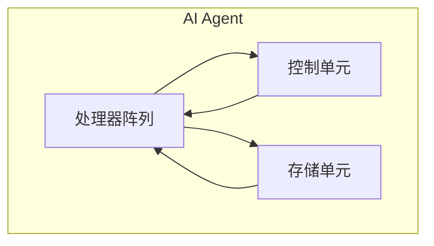
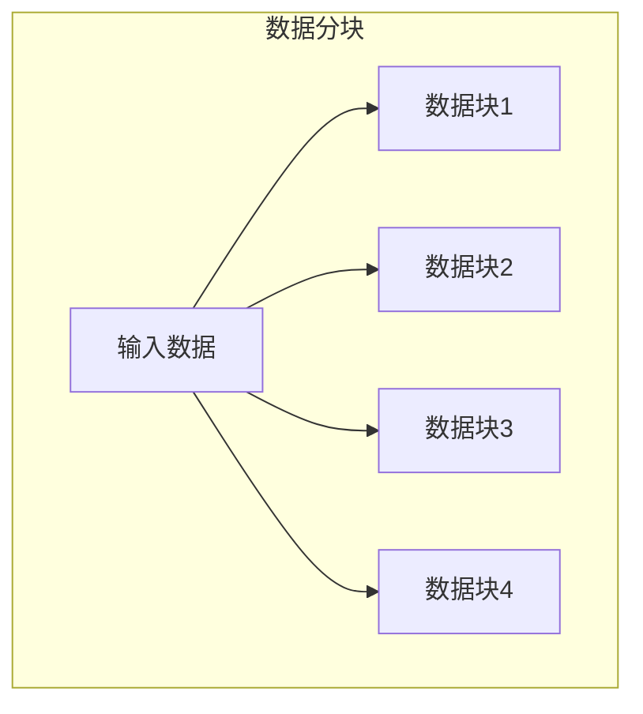
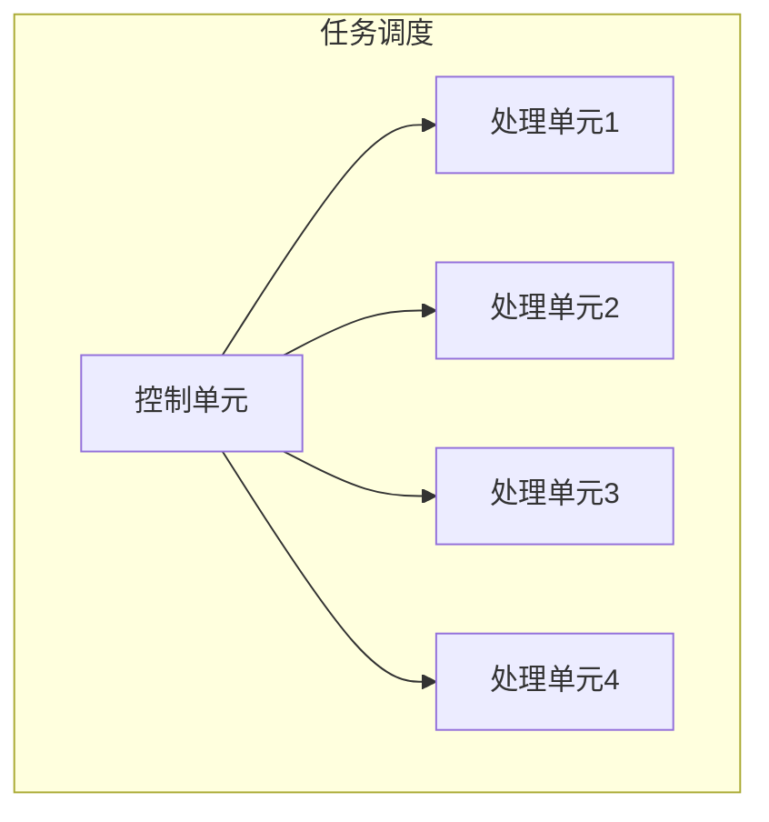
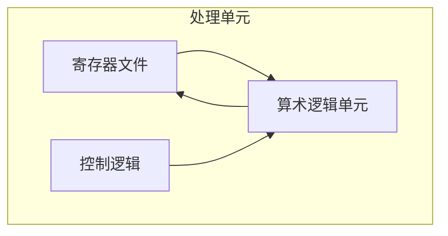
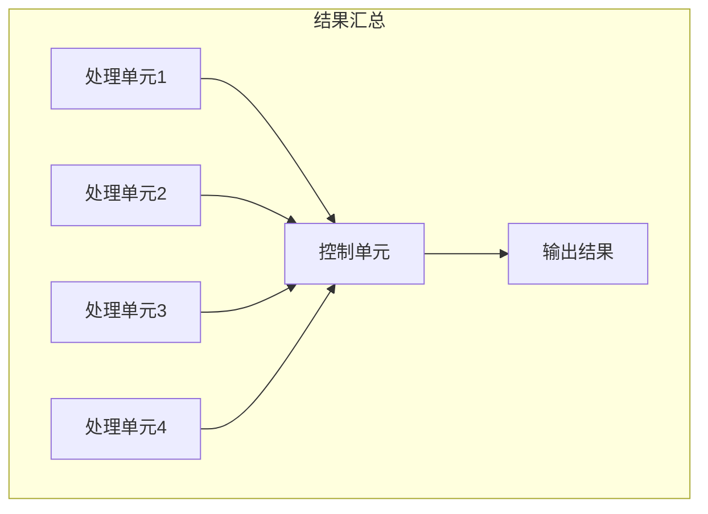
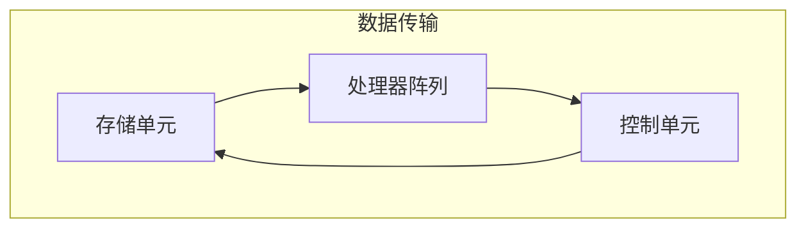

以下是根据您提供的标题和要求撰写的技术博客文章正文:

# AI Agent: AI的下一个风口 从软件到硬件的进化

## 1. 背景介绍

### 1.1 问题的由来

人工智能(AI)技术在过去几十年中取得了长足的进步,尤其是在计算机视觉、自然语言处理和决策系统等领域。然而,传统的AI系统大多建立在软件层面,主要依赖算力强劲的GPU和CPU进行训练和推理。随着AI技术的不断发展,人们开始意识到,单纯依赖通用计算硬件已经无法满足AI算法对计算能力和能源效率的需求。

### 1.2 研究现状 

为了解决这一难题,研究人员开始探索将AI算法直接映射到专用硬件的可能性,即AI Agent。AI Agent是一种专门为AI算法量身定制的硬件加速器,旨在提高AI系统的计算效率、能源利用率和实时响应能力。相比于通用计算硬件,AI Agent可以针对特定的AI算法进行优化,从而大幅提升性能。

目前,已有多家科技公司和研究机构在AI Agent领域开展了大量研究,并取得了一些重要进展。例如,谷歌的TPU(Tensor Processing Unit)、英伟达的Tensor Core、英特尔的神经棒等,都是针对AI工作负载进行了硬件级优化。

### 1.3 研究意义

AI Agent的出现有望推动AI技术的发展进入一个新阶段。通过专用硬件加速,AI系统将获得前所未有的计算能力,从而能够解决更加复杂的问题,并在更多领域发挥作用。同时,AI Agent还有望显著降低AI系统的能耗,这对于推动AI技术在移动设备和边缘计算等场景的应用至关重要。

此外,AI Agent还将促进AI算法和硬件之间的协同设计,从而有望催生全新的AI架构和算法,进一步推动AI技术的创新与发展。

### 1.4 本文结构

本文将全面介绍AI Agent的核心概念、算法原理、数学模型、实际应用以及未来发展趋势。文章首先阐述AI Agent的核心思想和与传统AI系统的区别,然后深入探讨其核心算法原理和数学模型,并通过具体案例进行详细说明。接下来,文章将介绍AI Agent在实际项目中的应用,包括开发环境搭建、代码实现和运行结果展示。最后,文章将总结AI Agent的发展趋势和面临的挑战,并对未来的研究方向进行展望。

## 2. 核心概念与联系

AI Agent的核心思想是将AI算法直接映射到专用硬件电路上,而不是像传统方式那样在通用CPU或GPU上运行软件。这种硬件加速方式能够充分利用AI算法的并行性和局部性,从而大幅提高计算效率和能源利用率。

AI Agent通常由三个主要部分组成:

1. **处理器阵列(Processor Array)**: 由大量简单的处理单元(Processing Element,PE)组成的矩阵阵列,用于执行AI算法中的并行计算操作,如矩阵乘法、卷积运算等。

2. **控制单元(Control Unit)**: 负责调度和协调处理器阵列的工作,管理数据流和指令流,确保计算的正确性和高效性。

3. **存储单元(Memory Unit)**: 包括片上存储器(如SRAM)和片外存储器(如DRAM),用于存储AI模型的权重参数、输入数据和中间计算结果。

AI Agent与传统的通用CPU和GPU在设计理念和架构上存在根本差异。CPU和GPU主要针对通用计算进行优化,采用复杂的控制逻辑和深层次的内存层次结构,而AI Agent则专注于AI算法的特定计算模式,通过大规模的并行处理单元和精简的控制逻辑,实现高度的能源效率和实时响应能力。

下图展示了一个典型的AI Agent架构:

AI Agent的出现不仅推动了硬件加速技术的发展,也促进了AI算法和硬件之间的协同设计。研究人员需要同时考虑算法的计算特性和硬件的架构约束,从而设计出高效的AI Agent架构和AI友好型算法。这种软硬件协同设计有望催生全新的AI系统架构和算法范式,进一步推动AI技术的创新与发展。

## 3. 核心算法原理 & 具体操作步骤

### 3.1 算法原理概述

AI Agent的核心算法原理是将AI模型中的计算密集型操作(如矩阵乘法、卷积运算等)映射到处理器阵列上,利用大规模的并行处理单元同时执行这些操作,从而提高计算效率。

具体来说,AI Agent算法主要包括以下几个关键步骤:

1. **数据分块(Data Tiling)**: 将输入数据(如图像、语音等)和模型权重参数划分为多个小块,以适应处理器阵列的并行计算能力。

2. **任务调度(Task Scheduling)**: 控制单元根据数据块的大小和处理器阵列的资源情况,合理地将计算任务分配给不同的处理单元。

3. **并行计算(Parallel Computing)**: 处理器阵列中的多个处理单元并行执行分配的计算任务,如矩阵乘法、卷积运算等。

4. **结果汇总(Result Aggregation)**: 将处理单元计算出的中间结果汇总成最终的输出结果。

5. **数据传输(Data Transfer)**: 在上述步骤中,需要高效地在处理器阵列、控制单元和存储单元之间传输数据,以确保计算的正确性和高效性。

### 3.2 算法步骤详解

下面我们将详细解释AI Agent算法的具体步骤:

#### 3.2.1 数据分块(Data Tiling)

由于AI模型中的输入数据(如图像、语音等)和权重参数通常都是高维的张量(Tensor),而处理器阵列中的处理单元数量有限,因此需要将这些高维张量划分为多个小块,以适应并行计算的需求。

数据分块的具体方式取决于AI模型的类型和处理器阵列的架构。例如,对于卷积神经网络(CNN)模型,我们可以将输入图像和卷积核权重分别划分为多个小块,然后在处理器阵列上并行执行卷积运算。

下图展示了一个简单的二维数据分块示例:

#### 3.2.2 任务调度(Task Scheduling)

在完成数据分块后,控制单元需要合理地将计算任务分配给处理器阵列中的不同处理单元。任务调度策略对于充分利用处理器阵列的并行计算能力至关重要。

常见的任务调度策略包括:

- **静态调度(Static Scheduling)**: 在运行时之前,根据AI模型的结构和处理器阵列的拓扑,预先确定每个计算任务的执行顺序和分配情况。

- **动态调度(Dynamic Scheduling)**: 在运行时动态地根据处理单元的空闲情况和数据依赖关系,分配计算任务。

- **混合调度(Hybrid Scheduling)**: 结合静态调度和动态调度的优点,在一定程度上预先确定任务执行顺序,同时保留一定的动态调度空间。

下图展示了一个简单的任务调度示例,其中控制单元将四个计算任务分配给了四个处理单元:

#### 3.2.3 并行计算(Parallel Computing)

在完成数据分块和任务调度后,处理器阵列中的多个处理单元就可以并行执行分配的计算任务了。处理单元通常是一种精简的硬件单元,专门针对AI算法中的特定计算模式(如矩阵乘法、卷积运算等)进行了优化。

处理单元的具体架构取决于AI算法的计算特性和硬件资源约束。一般来说,处理单元包括以下几个主要部分:

- **寄存器文件(Register File)**: 用于存储输入数据和中间计算结果。

- **算术逻辑单元(ALU)**: 执行实际的计算操作,如加法、乘法、非线性激活函数等。

- **控制逻辑(Control Logic)**: 管理数据流和指令流,确保计算的正确性和高效性。

下图展示了一个简单的处理单元架构:

在处理器阵列中,多个处理单元可以同时执行不同的计算任务,从而实现高度的并行计算能力。处理单元之间可以通过互连网络(Interconnection Network)进行数据交换和同步,以支持更加复杂的AI算法。

#### 3.2.4 结果汇总(Result Aggregation)

在所有处理单元完成分配的计算任务后,控制单元需要将这些中间结果进行汇总,得到AI模型的最终输出结果。

结果汇总的具体方式取决于AI模型的类型和处理器阵列的架构。例如,对于卷积神经网络模型,控制单元需要将处理单元计算出的局部卷积结果进行拼接,得到整个特征图。

下图展示了一个简单的结果汇总示例:

#### 3.2.5 数据传输(Data Transfer)

在上述算法步骤中,需要高效地在处理器阵列、控制单元和存储单元之间传输数据,以确保计算的正确性和高效性。数据传输通常通过片上互连网络(On-Chip Interconnection Network)和存储器层次结构(Memory Hierarchy)来实现。

片上互连网络负责在处理器阵列内部传输数据,常见的拓扑结构包括网状(Mesh)、环形(Ring)、树状(Tree)等。存储器层次结构则负责在片上存储器(如SRAM)和片外存储器(如DRAM)之间传输数据,通常采用多级缓存(Multi-Level Cache)的方式来提高数据访问效率。

下图展示了一个简单的数据传输示例:

### 3.3 算法优缺点

AI Agent算法具有以下优点:

- **高计算效率**: 通过大规模的并行处理单元,AI Agent能够高效地执行AI算法中的计算密集型操作,大幅提高计算吞吐量。

- **高能源效率**: 相比通用CPU和GPU,AI Agent的处理单元更加精简,能够以更低的能耗完成相同的计算任务。

- **实时响应能力**: AI Agent的低延迟特性使其能够快速响应输入数据,满足实时AI应用的需求。

- **可扩展性**: 通过增加处理单元的数量,AI Agent的计算能力可以线性扩展,满足未来AI算法对计算资源的需求。

然而,AI Agent算法也存在一些缺点和挑战:

- **专用性**: AI Agent通常是为特定的AI算法量身定制的,缺乏通用性,难以适应不同类型的AI工作负载。

- **编程复杂性**:由于AI Agent的硬件架构与传统