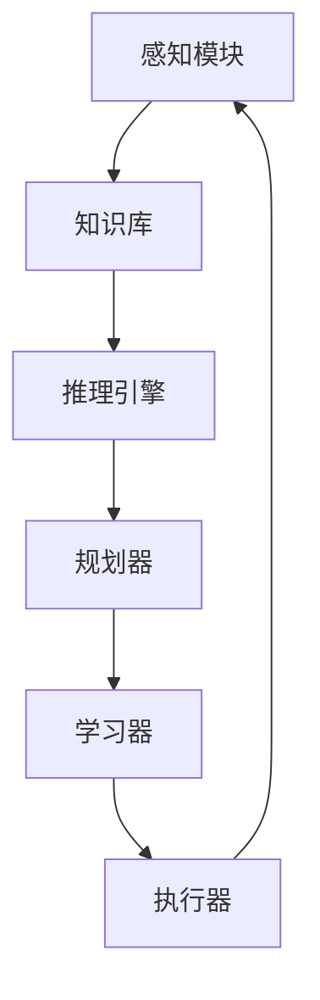

# AI Agent: AI的下一个风口 技术的发展趋势

作者：禅与计算机程序设计艺术 / Zen and the Art of Computer Programming

## 1. 背景介绍

### 1.1 问题的由来

人工智能(Artificial Intelligence, AI)技术的快速发展,正在深刻改变着我们的生活和工作方式。AI在各行各业得到广泛应用,如智能客服、无人驾驶、智能制造等。然而,当前的AI系统大多是专用的,针对特定任务进行优化,缺乏通用性和自主学习能力。为了进一步拓展AI的应用边界,我们亟需探索更加智能、灵活、自主的AI新形态。AI Agent作为AI领域的前沿方向,有望成为AI技术发展的下一个风口。

### 1.2 研究现状

近年来,AI Agent相关研究逐渐成为学术界和工业界关注的热点。DeepMind、OpenAI等知名AI实验室都在AI Agent方面进行了深入研究和应用探索。一些标志性的研究成果包括:

- DeepMind的AlphaGo系列,实现了在围棋、国际象棋等复杂博弈中战胜人类高手。
- OpenAI的GPT系列语言模型和DALL-E图像生成模型,展现了大模型在认知推理和创意生成等方面的惊人能力。
- 微软的Tay聊天机器人,可以与人进行自然流畅的对话交互。

这些研究工作极大地拓展了人们对AI Agent能力边界的认知。但总体而言,当前AI Agent的研究还处于起步阶段,在算法、模型、评估等方面仍面临诸多挑战。

### 1.3 研究意义

AI Agent代表了AI技术的发展方向,对学术研究和产业应用都具有重要意义:

- 学术价值:AI Agent融合了机器学习、知识表示、推理决策等多个AI子领域的前沿技术,是验证和发展AI基础理论的重要平台。
- 应用前景:AI Agent可以作为人类的智能助手,在教育、医疗、金融、制造等领域提供个性化、智能化的服务,提升生产效率,创造巨大商业价值。
- 技术引领:AI Agent代表了通用人工智能的发展方向,对其他AI技术领域(如计算机视觉、自然语言处理)也将产生引领和带动作用。

### 1.4 本文结构

本文将重点探讨AI Agent的关键技术、应用场景和未来趋势。全文结构如下:

- 第2部分介绍AI Agent的核心概念和内涵。 
- 第3部分阐述AI Agent的关键算法原理。
- 第4部分建立AI Agent的数学模型,并给出公式推导和案例分析。
- 第5部分通过代码实例,演示如何实现一个AI Agent系统。
- 第6部分讨论AI Agent在实际场景中的应用现状和未来愿景。
- 第7部分推荐AI Agent领域的学习资源、开发工具等。
- 第8部分总结全文,展望AI Agent技术的发展趋势和挑战。

## 2. 核心概念与联系

AI Agent是一种智能实体,能够感知环境,进行推理决策,并采取行动去完成特定目标。它集成了感知、认知、规划、学习等多种AI能力,可以自主地与环境进行交互。

从系统架构看,一个AI Agent通常包含以下关键组件:

- 感知模块:负责获取和理解外部环境信息,如图像、文本、语音等。
- 知识库:存储Agent需要用到的各种结构化、非结构化知识。
- 推理引擎:基于已有知识,对新观察到的情况进行逻辑推理。
- 规划器:根据当前状态和目标,自动生成行动计划。
- 学习器:利用经验数据,优化内部模型和策略。
- 执行器:根据规划结果,控制Agent采取具体行动。

下图给出了一个典型的AI Agent系统架构:



AI Agent与传统的专用AI系统相比,具有以下特点:

- 通用性:不局限于特定任务,可以灵活处理多种问题。
- 自主性:具备主动感知、思考、行动的能力,不需要人工干预。
- 适应性:能够根据环境变化调整策略,具备持续学习能力。
- 交互性:可以与人或其他Agent进行自然交互。

总之,AI Agent代表了一种更加接近人类智能的AI系统形态。实现通用、自主、智能的AI Agent,是通向通用人工智能(AGI)的重要里程碑。

## 3. 核心算法原理 & 具体操作步骤

### 3.1 算法原理概述

实现AI Agent需要用到多种机器学习算法,主要包括:

- 强化学习:通过试错与环境交互,不断优化行为策略。
- 深度学习:利用深度神经网络,从数据中学习特征表示。
- 迁移学习:将一个任务学到的知识迁移到新任务中。
- 元学习:学习如何更高效地学习新任务。

这些算法相互配合,共同支撑AI Agent的感知、认知、决策、学习等核心能力。

### 3.2 算法步骤详解

以强化学习为例,其基本步骤如下:

1. 智能体(Agent)观察当前环境状态$s_t$。
2. 根据状态$s_t$,选择一个动作$a_t$。
3. 执行动作$a_t$,得到奖励$r_t$,环境进入新状态$s_{t+1}$。
4. 将$(s_t,a_t,r_t,s_{t+1})$作为一个经验样本,存入经验回放池。
5. 从经验池中随机抽取一批样本,计算TD误差,更新价值网络参数。
6. 重复步骤1-5,直到收敛。

其中,TD误差的计算公式为:

$$ \delta_t = r_t + \gamma \max_{a'}Q(s_{t+1},a') - Q(s_t,a_t) $$

其中$Q(s,a)$是行为价值函数,表示在状态$s$下选择动作$a$的长期累积奖励期望。$\gamma$是折扣因子。

通过优化价值函数,Agent可以学习到最优策略,在每个状态下选择长期奖励最大的动作。

### 3.3 算法优缺点

强化学习的优点包括:

- 端到端学习:直接从原始状态学习最优策略,不需要人工设计特征。
- 适用范围广:只要能定义状态、动作、奖励,就能用强化学习求解。
- 不需要样本标签:通过与环境交互收集数据,不需要人工标注。

但强化学习也存在一些局限:

- 样本效率低:需要大量的探索和试错,学习效率不高。 
- 难以设计奖励:有些任务很难定义合适的即时奖励函数。
- 不稳定:容易受探索策略、超参数选择等影响,学习过程不稳定。

### 3.4 算法应用领域

强化学习在很多领域得到应用,例如:

- 游戏AI:AlphaGo用强化学习掌握围棋、星际争霸等复杂游戏。
- 机器人控制:用强化学习训练机器人手臂抓取、行走等动作技能。
- 推荐系统:京东用强化学习优化商品推荐策略,提升用户点击率。
- 网络优化:阿里用强化学习动态调节CDN缓存策略,降低网络时延。

除强化学习外,深度学习、迁移学习、元学习等算法也被广泛用于构建AI Agent系统。

## 4. 数学模型和公式 & 详细讲解 & 举例说明

### 4.1 数学模型构建

我们可以用马尔可夫决策过程(MDP)来建模AI Agent与环境的交互过程。一个MDP由以下元素组成:

- 状态空间$\mathcal{S}$:所有可能的环境状态集合。
- 动作空间$\mathcal{A}$:Agent在每个状态下可以执行的动作集合。
- 转移概率$\mathcal{P}$:$\mathcal{P}(s'|s,a)$表示在状态$s$下执行动作$a$后进入状态$s'$的概率。
- 奖励函数$\mathcal{R}$:$\mathcal{R}(s,a)$表示在状态$s$下执行动作$a$获得的即时奖励。
- 折扣因子$\gamma$:$\gamma \in [0,1]$,表示未来奖励的衰减程度。

MDP的目标是寻找一个最优策略$\pi^*$,使得长期累积奖励最大化:

$$ \pi^* = \arg\max_{\pi} \mathbb{E}\left[\sum_{t=0}^{\infty} \gamma^t r_t | \pi \right] $$

其中$r_t$是在时刻$t$获得的奖励,$\gamma^t$表示对未来奖励的衰减。

### 4.2 公式推导过程

为了求解最优策略,我们引入价值函数的概念。定义状态价值函数$V^{\pi}(s)$为从状态$s$开始,遵循策略$\pi$可获得的长期累积奖励期望:

$$ V^{\pi}(s) = \mathbb{E}\left[\sum_{t=0}^{\infty} \gamma^t r_t | s_0=s, \pi \right] $$

类似地,定义行为价值函数$Q^{\pi}(s,a)$为在状态$s$下选择动作$a$,遵循策略$\pi$可获得的长期累积奖励期望:

$$ Q^{\pi}(s,a) = \mathbb{E}\left[\sum_{t=0}^{\infty} \gamma^t r_t | s_0=s, a_0=a, \pi \right] $$

根据Bellman期望方程,价值函数满足如下递推关系:

$$ V^{\pi}(s) = \sum_{a} \pi(a|s) \sum_{s',r} \mathcal{P}(s',r|s,a) \left[ r + \gamma V^{\pi}(s') \right] $$

$$ Q^{\pi}(s,a) = \sum_{s',r} \mathcal{P}(s',r|s,a) \left[ r + \gamma \sum_{a'} \pi(a'|s') Q^{\pi}(s',a') \right] $$

最优价值函数$V^*(s)$和$Q^*(s,a)$满足Bellman最优方程:

$$ V^*(s) = \max_{a} \sum_{s',r} \mathcal{P}(s',r|s,a) \left[ r + \gamma V^*(s') \right] $$

$$ Q^*(s,a) = \sum_{s',r} \mathcal{P}(s',r|s,a) \left[ r + \gamma \max_{a'} Q^*(s',a') \right] $$

最优策略$\pi^*$可以通过最优价值函数导出:

$$ \pi^*(s) = \arg\max_{a} Q^*(s,a) $$

即在每个状态下选择Q值最大的动作。

### 4.3 案例分析与讲解

考虑一个简单的迷宫导航问题。如下图所示,智能体需要从S走到G,每走一步获得-1的奖励。

```
+-+-+-+
|S| | |
+-+-+ +
| | |G|
+-+-+-+
```

我们可以将其建模为MDP:

- 状态空间:$\mathcal{S}=\{(0,0),(0,1),(0,2),(1,0),(1,2)\}$
- 动作空间:$\mathcal{A}=\{up,down,left,right\}$
- 奖励函数:$\mathcal{R}(s,a)=-1$
- 折扣因子:$\gamma=1$

应用价值迭代算法,我们可以得到最优价值函数:

$$
\begin{array}{|c|c|c|}
\hline
-6 & -5 & -4\\
\hline 
-5 & \times & -3\\
\hline
\end{array}
$$

其中$\times$表示墙壁。最优策略为:

$$
\begin{array}{|c|c|c|}
\hline
\rightarrow & \rightarrow & \downarrow\\
\hline
\uparrow & \times & \leftarrow\\
\hline
\end{array}
$$

即在每个状态下选择使Q值最大的动作。

### 4.4 常见问题解答

Q: 强化学习和监督学习有什么区别?

A: 监督学习需